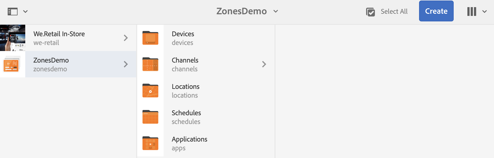
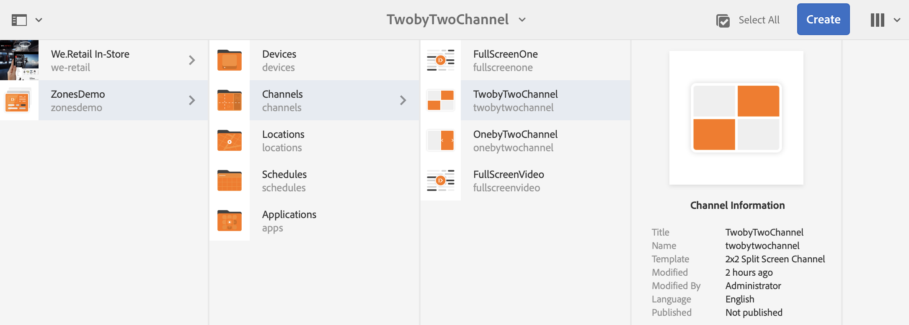
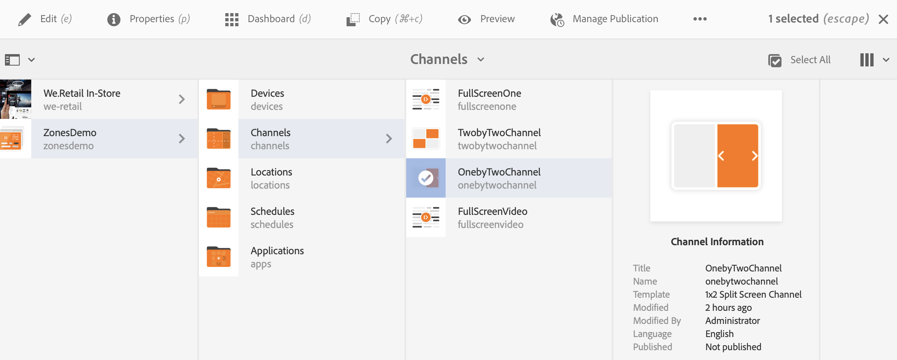
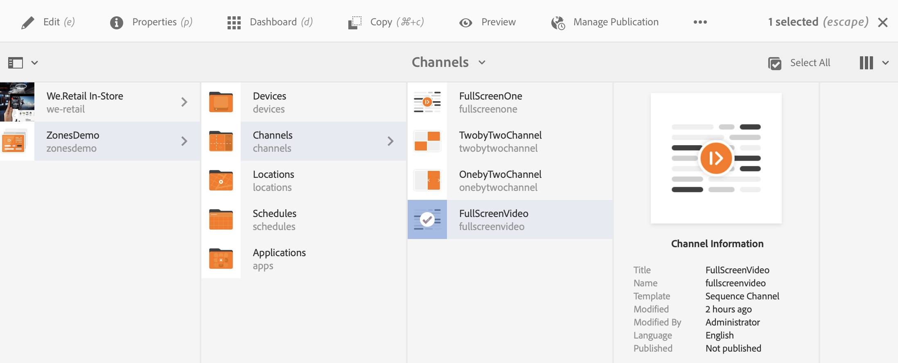
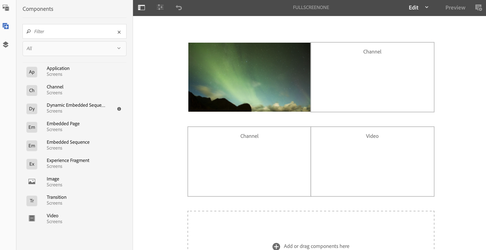

# シングルゾーンからマルチゾーンへの引き継ぎ {#single-zoneto-multizone}

## 使用例の説明 {#use-case-description}

ここでは、単一のゾーンレイアウトチャネルと切り替わるマルチゾーンレイアウトチャネルの設定方法を強調する使用例について説明します。 各チャネルは、画像/ビデオアセットを順に持つ。

### 前提条件 {#preconditions}

この使用例を開始する前に、以下をおこなう方法を理解しておく必要があります。

* **[チャネルの作成と管理](/help/screens/managing-channels.md)**
* **[ロケーションの作成と管理](/help/screens/managing-locations.md)**
* **[スケジュールの作成と管理](/help/screens/managing-schedules.md)**
* **[デバイスの登録](/help/screens/device-registration.md)**

### 主要なアクター {#primary-actors}

コンテンツ作成者

## プロジェクトのセットアップ {#setting-up-the-project}

次の手順に従って、プロジェクトをセットアップします。

1. Create an AEM Screens Project named as **ZonesDemo**, as shown below.

   >[!NOTE]
   >
   >To learn more about creating and managing projects in AEM Screens, refer to [Creating a Project](/help/screens/creating-a-screens-project.md).

   

1. **1つの画像でのシーケンスチャネルの作成**

   1. **チャネル**&#x200B;フォルダーを選択し、アクションバーの「**作成**」をクリックしてチャネル作成用ウィザードを開きます。
   1. Select **Sequence Channel** from the wizard and create the channel titled as **FullScreenOne**.

      
   1. チャネルを選択し、アクショ **ンバーの** 「編集」をクリックしてエディターを開き、以下に示すように画像をそのチャネルにドラッグ&amp;ドロップします。
      

1. **4つの画像を使用した2 X 2チャネルの作成**

   1. **チャネル**&#x200B;フォルダーを選択し、アクションバーの「**作成**」をクリックしてチャネル作成用ウィザードを開きます。

   1. Select **2X2 Split Screen Channel** template from the wizard and create the channel titled as **TwobyTwoChannel**.

      
   1. チャンネルを選択し、アクシ **ョンバーで** 「編集」をクリックしてエディターを開き、次に示すように4つの画像（4つの異なるゾーン）をそのチャンネルにドラッグ&amp;ドロップします。
      

1. **2つの画像を使用した1 X 2分割画面チャネルの作成**

   1. **チャネル**&#x200B;フォルダーを選択し、アクションバーの「**作成**」をクリックしてチャネル作成用ウィザードを開きます。

   1. Select **1X2 Split Screen Channel** template from the wizard and create the channel titled as **OnebyTwoChannel**.

      
   1. チャンネルを選択し、アクシ **ョンバーで** 「編集」をクリックしてエディターを開き、次に示すように、2つの画像（2つの異なるゾーン）をそのチャンネルにドラッグ&amp;ドロップします。
      

1. **1つのフルスクリーンビデオでのチャネルの作成**

   1. **チャネル**&#x200B;フォルダーを選択し、アクションバーの「**作成**」をクリックしてチャネル作成用ウィザードを開きます。

   1. Select **Sequence Channel** template from the wizard and create the channel titled as **FullScreensVideo**.

      
   1. チャンネルを選択し、アクショ **ンバーで** 「編集」をクリックしてエディターを開き、ビデオコンポーネントをそのチャンネルにドラッグ&amp;ドロップし、次に示すように目的のビデオを追加します。
      

## テイクオーバーチャネルをシングルゾーンからマルチゾーンに移行するための設定 {#takeover-channel-setup}

1. **マルチゾーンテイクオーバー用のシングルゾーンチャネルの編集**

   1. 手順1で作成した&#x200B;**チャネル(FullScreenOne)** を選択します。
   1. アクションバーの「**編集**」をクリックして、エディターを開きます。2つのチャンネルコンポーネントと1つのビデオコンポーネントをエディターにドラッグ&amp;ドロップします。
   

1. **FullScreenOneチャネルに追加されたコンポーネントの入力**

   1. FullScreenOneのエディターから最初のチャネルコンポーネントを **選択し** 、「 **設定** 」をクリックして前の手順で作成したチャネルを指定します。 「チャネルパス」でチャネルのパスを両方のチ **ャネルコンポーネントに追加し** 、次に示すようにビデオをビデオコンポーネントにドラッグ&amp;ドロップします。
   

1. **移行中のチャネルの時間の設定**

   >[!NOTE]
   >
   >初期設定では、アセットは8秒ごとにトランジションしますが、特定の時間の経過後にアセットをトランジションさせる場合は、次の手順に従います。

   1. FullScreenOneのエディターから2番目のチャネルコンポーネントを選択し **、** 「設定 **** 」をクリックして、このチャネルの時間を設定します。 同様に、次に示すように、チャネル2の時間を設定します。
この例では、時間が3秒に設定されています。
   

## 結果のプレビュー {#previewing-result}

エディターで「 **Preview** 」をクリックして、アセットが単一のゾーンからマルチゾーンにどのように移行するかを確認できます。

