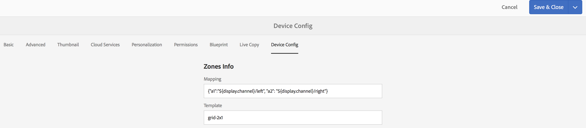
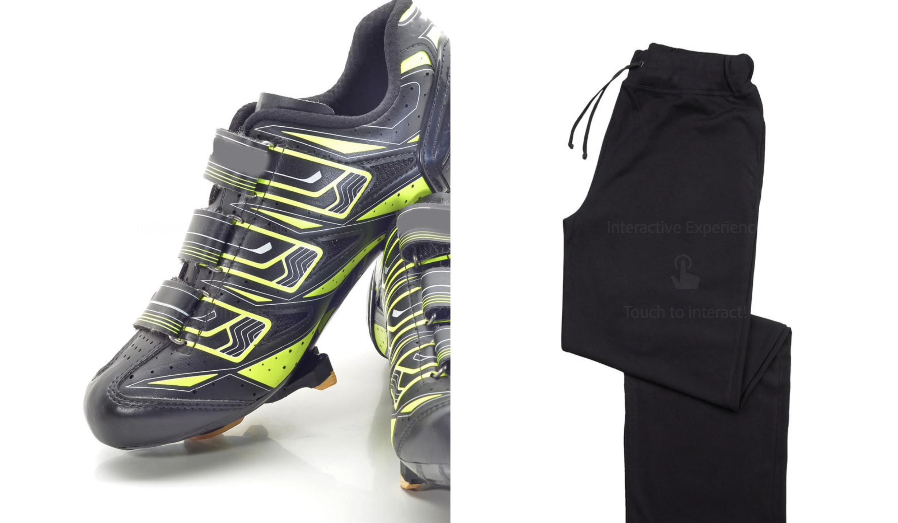

# ディスプレイレイアウトエディター{#display-layout-editor}

***ゾーンマッピング***&#x200B;を使用すると、様々なゾーンを作成し、ビデオ、画像およびテキストなどの様々なアセットを使用して、コンテキストに沿った方法で単一のスクリーンに組み合わせることができます。画像、ビデオおよびテキストを取り込み、すべてを組み合わせて、直感的でインタラクティブなデジタルエクスペリエンスを作成できます。プロジェクト要件に応じて、1 つのディスプレイに複数のゾーンが必要になることがあります。

例えば、単一のディスプレイの 2 つの個別のゾーンで実行する、関連するソーシャルメディアフィードを含む製品シーケンスなどです。

## 概要 {#overview}

チャネル用のディスプレイを作成する際、様々なテンプレートオプションを選択して、チャネルにコンテンツを表示したり管理したりできます。

ディスプレイ用のゾーンを作成する際に、次のテンプレートを使用できます。

* 2 x 1
* 2 x 2
* 3 x 1
* 4 x 1
* 5 x 1

これらのテンプレートのいずれかを使用すると、様々なコンテンツを単一のスクリーンで利用できる、直感的でインタラクティブなデジタルサイネージエクスペリエンスを作成できます。

>[!NOTE]
>
>To learn in-depth about creating channels and displays, see [Managing Channels](managing-channels.md) and [Managing Displays](managing-displays.md) respectively in Authoring Screens.

## 使用例の説明 {#use-case-description}

この使用例により、コンテンツを利用するチャネルを含む AEM Screens プロジェクトを作成して、画面の複数のゾーンに表示できます。

>[!NOTE]
>
>ゾーンはコンテンツを拡大縮小しないので、コンテンツをチャネルに挿入する前に拡大縮小しておく必要があります。

### プロジェクト作成のステップ {#steps-for-creating-a-project}

AEM Screens プロジェクト用のゾーンマッピングを実現する方法を示す AEM Screens プロジェクトを作成するには、次の手順に従います。

1. ***新しい Screens プロジェクトの作成***

   1. Adobe Experience Manager リンク（左上）を選択し、「Screens」を選択します。Alternatively, you can go directly to: [http://localhost:4502/screens.html/content/screens](http://localhost:4502/screens.html/content/screens).
   1. 「**作成**」をクリックして、新しい Screens プロジェクトを作成します。
   1. **Screens プロジェクトの作成**&#x200B;ウィザードで「**Screens**」を選択し、「**次へ**」をクリックします。
   1. Enter the title as **Demo Mapping Project** and click **Create**.
   

1. ***新しいチャネルフォルダーの作成***

   1. [** Zone Mapping Project**]に移動します。
   1. アクションバーの「**作成**」をクリックします。ウィザードが開きます。
   1. Choose the **Channels Folder **and click **Next**.
   1. Enter the Title as **Dual Zone **and click **Create**.
   

1. ***新しいチャネルの作成***

   1. Navigate to the **Zone Mapping Project** you created and select the Channels folder (**Dual Zone**).
   1. アクションバーの「**作成**」をクリックします。ウィザードが開きます。
   1. 「シーケンスチャネル」を選択し、「**次へ**」をクリックします。
   1. Enter the **Title** as **Left** and click **Create**.
   同様に、他のシーケンスチャネルを **Right** として&#x200B;**Zone Mapping Project** に作成します。

   

1. ***チャネルへのコンテンツの追加***

   1. Navigate to the **Zone Mapping Project** you created and select the **Channel** you created.
   1. アクションバーの「**編集**」をクリックします。
   1. The editor for the **Left** opens. アクションバーの左側にあるサイドパネルを切り替えるアイコンをクリックし、アセットとコンポーネントを開きます。
   1. チャネルに追加するコンポーネントをドラッグ＆ドロップします。
   同様に、**Right** チャネルにもコンテンツを追加します。

   

   >[!NOTE]
   >
   >プロジェクト要件に応じて、様々なアセット（画像、ビデオ）でチャネルのコンテンツを設定できます。

1. ***新しい場所の作成***

   1. Navigate to the** Zone Mapping Project** and select the **Locations** folder.
   1. アクションバーのプラスアイコンの横にある「**作成**」をクリックします。ウィザードが開きます。
   1. ウィザードから「**ロケーション**」を選択し、「**次へ**」をクリックします。
   1. Enter the **Title** for your location (enter the title as **San Jose**) and click **Create**.
   

1. ***サンノゼ用の新しいディスプレイの作成***

   1. Navigate to the location where you want to create your display (**Demo Mapping Project** --> **Locations** --> **San Jose**) and select **San Jose**.
   1. アクションバーの「**作成**」をクリックします。**作成**&#x200B;ウィザードから「**ディスプレイ**」を選択し、「**次へ**」をクリックします。
   1. Enter **Title** for your display location (enter the title as **Dual Zone**).
   1. 「**ディスプレイ**」タブで、レイアウトの詳細を選択します。「解像度」で「**フル HD**」を選択します。
   1. Choose the **Number of Devices Horizontally** as **2**. Choose the **Number of Devices Vertically** as **1**.
   1. 「**作成**」をクリックします。
   

1. ***チャネルの割り当て***

   1. Navigate to the display from **Zone Mapping Project** --> **Locations** --> **San Jose** --> **Dual Zone Display**.
   1. Select **Dual Zone Display **and tap/click **Assign Channel** from the action bar, Or,
   1. 「**ダッシュボード**」をクリックし、**割り当てられたチャネルとスケジュール**&#x200B;パネルの右上にある「**+ チャネルを割り当て**」を選択します（下図を参照）。**チャネル割り当て**ダイアログボックスが開きます。
   1. Enter the **Channel Role** as **Zone**.
   1. 「チャネルを参照...」で「パス別」を選択します。Select the channel folder path (**Zone Mapping Project **--> **Channels** --> **Dual Zone** ) in the Channel.
   1. このチャネルの「**優先度**」として「**1**」を選択します。「**サポートされているイベント**」として「**最初の読み込み**」および「**待機中画面**」を選択します。
   1. 「**保存**」をクリックします。
   

1. ***デバイスの登録および割り当て***

   1. 別のブラウザーウィンドウを起動します。Web ブラウザーを使用して Screens Player にアクセスするか、AEM Screens アプリケーションを起動します。デバイスを開くと、デバイスの状態が未登録であることがわかります。
   1. From the AEM dashboard, navigate to **Zone Mapping Project** --> **Devices**.
   1. アクションバーの「デバイスマネージャー」をクリックします。
   1. 「**デバイスの登録**」をクリックすると、保留中のデバイスが表示されます。
   1. 登録するデバイスを選択して、「**デバイスを登録**」をクリックします。
   1. Web ブラウザーまたは AEM Screens Player からコードを確認して、コードを検証する必要があります。「**検証**」をクリックして、**デバイスの登録**&#x200B;画面に移動します。
   1. Enter **Title** as **Zone Device** and click **Register** and the device will be registered.
   1. 「**ディスプレイを割り当て**」をクリックして、次の手順のディスプレイへのデバイスの割り当てに移ります。
   1. Click **Assign Device** fand select the display path for your channel () as */content/screens/Test_Project/Locations/TestLocation/TestDisplay*. 「**割り当て**」をクリックします。
   1. 「**完了**」をクリックしてプロセスを完了すると、デバイスが割り当てられます。
   

1. ***マルチゾーンディスプレイの作成***

   1. Navigate and select the display from **Zone Mapping Project** --> **Locations** --> **San Jose **--> **Dual Zone **display and click **Dashboard** from the action bar.
   1. **デバイス**&#x200B;パネルから Player の&#x200B;**デバイス設定**&#x200B;の左側のアイコンを選択して、**プロパティ**&#x200B;をクリックします。
   1. 「**デバイス設定**」タブに移動して、「**マッピング**」および「**テンプレート**」フィールドに入力します。Enter *{&quot;a1&quot;:&quot;${display.channel}/left&quot;, &quot;a2&quot;: &quot;${display.channel}/right&quot;}* in the **Mapping** field and template as *grid-2x1*.
   1. Click **Save &amp; Close** and reload the player.
   >[!NOTE]
   >
   >***デバイス設定のマッピングおよびテンプレートについて***
   >
   >* ゾーンに対応する識別子 &quot;a1&quot; および &quot;a2&quot; はテンプレートに定義されています（&quot;screens-zone-a1&quot; および &quot;screens-zone-a2&quot;）。
   >* 「${display.channel}/left」はゾーンに埋め込むためのチャネルを指し、「display.channel」は、ディスプレイの現在のチャネルパスを指しています。これにより、チャネルの子「left」および「right」が効果的に埋め込まれます。

   

#### AEM Screens Player でのコンテンツの表示 {#viewing-content-in-aem-screens-player}

AEM Screens Player を読み込むか Web ブラウザーを使用します。

両方のチャネル（Left および Right）のコンテンツが Screens Player に表示されます。コンテンツは、2 x 1 ディスプレイゾーンとして表示されます。

### 推論 {#inference}

ゾーンマッピングでは、AEM Screens でチャネルを作成する際に、使用可能ないずれかのテンプレートを使用します。そのゾーンマッピングにより、クライアント側のフラット化をおこなうことができます。スクリーンに様々なゾーンを作成でき、さらにビデオ、画像および他の使用可能なアセットを含むゾーンを設定できます。
