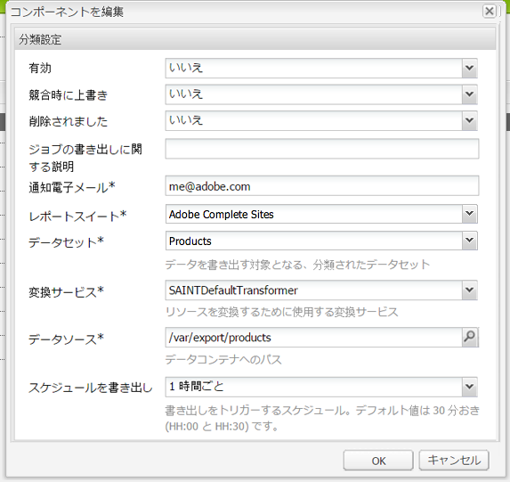

# Adobe分類{#adobe-classifications}

Adobe分類を使用して、分類データを [Adobe Analytics](/help/sites-administering/adobeanalytics.md) スケジュールに沿って SAINT Exporter は、**com.adobe.cq.scheduled.exporter.Exporter** の実装です。

これを設定するには：

1. **ツール／クラウドサービス**&#x200B;で「**Adobe Analytics**」セクションに移動します。
1. 新しい設定を追加します。「**Adobe Analytics 分類**」設定テンプレートが「**Adobe Analytics フレームワーク**」設定の下に表示されます。「**タイトル**」と「**名前**」を必要に応じて指定します。

   

1. 「**作成**」をクリックして、設定を指定します。

   

   プロパティには、次が含まれています。

   | **フィールド** | **説明** |
   |---|---|
   | 有効 | 「**はい**」を選択すると、Adobe Classifications の設定が有効になります。 |
   | 競合時に上書き | 「**はい**」を選択すると、データの競合が上書きされます。デフォルトでは、これは「**いいえ**」に設定されています。 |
   | 削除処理 | 「**はい**」に設定すると、書き出された後に処理したノードが削除されます。デフォルトは、「**False**」です。 |
   | ジョブの書き出しに関する説明 | Adobe Classifications ジョブの説明を入力します。 |
   | 通知電子メール | 分類の通知用の電子メールアドレスをAdobeします。 |
   | レポートスイート | 読み込みジョブを実行するレポートスイートを入力します。 |
   | データセット | 読み込みジョブを実行するデータセット関連 ID を入力します。 |
   | 変換サービス | ドロップダウンメニューから、変換サービスの実装を選択します。 |
   | データソース | データコンテナのパスに移動します。 |
   | スケジュールを書き出し | 書き出すスケジュールを選択します。デフォルトは 30 分ごとです。 |

1. 「**OK**」をクリックして設定を保存します。

## ページサイズの変更 {#modifying-page-size}

レコードは、ページで処理されます。デフォルトでは、Adobe分類はページサイズが 1,000 のページを作成します。

ページのサイズは、Adobe分類の定義ごと25000、最大で設定でき、Felix コンソールから変更できます。 エクスポート時に、Adobe分類はソースノードをロックして、同時に変更できないようにします。 ノードは、書き出し後、エラー時またはセッション終了時にロックを解除されます。

ページサイズを変更するには：

1. OSGI コンソール ( ) に移動します。 **https://&lt;host>:&lt;port>/system/console/configMgr** を選択し、 **AdobeAEM分類エクスポータ**.

   

1. 「**書き出しページサイズ**」を必要に応じて更新し、**保存**&#x200B;をクリックします。

## SAINTDefaultTransformer {#saintdefaulttransformer}

>[!NOTE]
>
>Adobe Classifications は、以前は SAINT Exporter と呼ばれていました。

SAINT Exporter は、変換サービスを使用して、書き出しデータを特別な形式に変換できます。Adobe分類の場合、サブインターフェイス `SAINTTransformer<String[]>` 変換サービスの実装インターフェイスが提供されました。 このインターフェイスは、データタイプを次の値に制限するために使用します。 `String[]` これは、SAINTAPI で使用され、選択用にこのようなサービスを見つけるためのマーカーインターフェイスを持つために使用されます。

デフォルトの実装 SAINTDefaultTransformer では、エクスポータソースの子リソースは、プロパティ名をキーとし、プロパティ値を値として持つレコードとして扱われます。 **キー**&#x200B;列は、最初の列に自動的に追加され、その値がノード名になります。名前空間プロパティ（：を含む）は無視されます。

*ノード構造：*

* id-classification `nt:unstructured`

   * 1 `nt:unstructured`

      * Product = My Product Name (String)
      * Price = 120.90 (String)
      * Size = M (String)
      * Color = black (String)
      * Color^Code = 101 (String)

**SAINT ヘッダーおよびレコード：**

| **キー** | **製品** | **価格** | **サイズ** | **カラー** | **Color^Code** |
|---|---|---|---|---|---|
| 1 | My Product Name | 120.90 | M | 黒 | 101 |

プロパティには、次が含まれています。

<table> 
 <tbody> 
  <tr> 
   <td><strong>プロパティのパス</strong></td> 
   <td><strong>説明</strong></td> 
  </tr> 
  <tr> 
   <td>transformer</td> 
   <td>SAINTTransformer 実装のクラス名</td> 
  </tr> 
  <tr> 
   <td>email</td> 
   <td>通知用の電子メールアドレス。</td> 
  </tr> 
  <tr> 
   <td>reportsuites</td> 
   <td>読み込みジョブを実行するレポートスイート ID。 </td> 
  </tr> 
  <tr> 
   <td>dataset</td> 
   <td>読み込みジョブを実行するデータセット関連 ID。 </td> 
  </tr> 
  <tr> 
   <td>description</td> 
   <td>ジョブの説明。   </td> 
  </tr> 
  <tr> 
   <td>overwrite</td> 
   <td>データの競合を上書きするためのフラグ。デフォルトは <strong>false</strong> です。</td> 
  </tr> 
  <tr> 
   <td>checkdivisions</td> 
   <td>レポートスイートの互換性をチェックするためのフラグ。デフォルトは <strong>true</strong> です。</td> 
  </tr> 
  <tr> 
   <td>deleteprocessed</td> 
   <td>処理したノードを書き出し後に削除するためのフラグ。デフォルトは <strong>false</strong> です。</td> 
  </tr> 
 </tbody> 
</table>

## Adobe Classifications による書き出しの自動化 {#automating-adobe-classifications-export}

独自のワークフローを作成することで、新しい読み込みのたびにそのワークフローが開始され、構造の正しい適切なデータが **/var/export/** に作成されて Adobe Classifications に書き出すことができるようになります。
