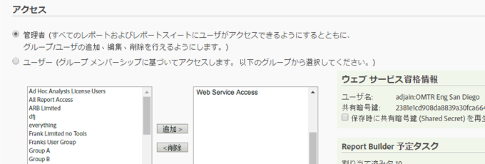
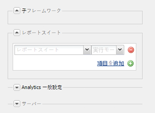
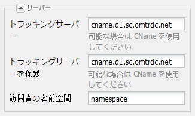

# Adobe Analytics への接続とフレームワークの作成{#connecting-to-adobe-analytics-and-creating-frameworks}

Adobe Analytics で AEM ページからの web データを追跡するには、Adobe Analytics Cloud サービス設定と Adobe Analytics フレームワークを作成します。

* **Adobe Analytics 設定：** Adobe Analytics アカウントに関する情報。Adobe Analytics 設定を使用して、AEM を Adobe Analytics に接続できます。使用するアカウントごとに Adobe Analytics 設定を作成します。
* **Adobe Analytics フレームワーク：** Adobe Analytics レポートスイートプロパティと CQ 変数の間にある一連のマッピングです。フレームワークを使用して、web サイトデータを Adobe Analytics レポートにどのように入力するかを設定します。フレームワークは Adobe Analytics 設定と関連付けられます。設定ごとに複数のフレームワークを作成できます。

Web ページをフレームワークに関連付けると、そのページとそのページの子孫の追跡がフレームワークによって実行されます。 ページビューは、Adobe Analytics から取得され、Sites コンソールに表示されます。

## 前提条件 {#prerequisites}

### Adobe Analyticsアカウント {#adobe-analytics-account}

Adobe Analytics で AEM データを追跡するには、有効な Adobe Marketing Cloud Adobe Analytics アカウントが必要です。

Adobe Analytics アカウントの要件は以下のとおりです。

* **管理者**&#x200B;権限がある
* **Web サービスアクセス**&#x200B;ユーザーグループに割り当てられている

>[!CAUTION]
>
>提供 **管理者** (Adobe Analytics内の ) 権限では、ユーザーがAEMからAdobe Analyticsに接続できるようには十分ではありません。 また、アカウントには **Web サービスへのアクセス** 権限。

先に進む前に、資格情報で次のいずれかの方法を使用してAdobe Analyticsにログインできることを確認してください。

* [Adobe Experience Cloud へのログイン](https://login.experiencecloud.adobe.com/exc-content/login.html)

* [Adobe Analytics へのログイン](https://sc.omniture.com/login/)

### Adobe Analytics データセンターを使用するように AEM を設定 {#configuring-aem-to-use-your-adobe-analytics-data-centers}

Adobe Analytics [データセンター](https://developer.omniture.com/en_US/content_page/concepts-terminology/c-how-is-data-stored)は、Adobe Analytics レポートスイートに関連付けられたデータを収集、処理および格納します。Adobe Analytics レポートスイートをホストしているデータセンターを使用するように、AEM を設定する必要があります。次の表に、使用可能なデータセンターとその URL を示します。

| データセンター | URL |
|---|---|
| サンノゼ | https://api.omniture.com/admin/1.4/rest/ |
| ダラス | https://api2.omniture.com/admin/1.4/rest/ |
| ロンドン | https://api3.omniture.com/admin/1.4/rest/ |
| シンガポール | https://api4.omniture.com/admin/1.4/rest/ |
| オレゴン | https://api5.omniture.com/admin/1.4/rest/ |

AEMは、デフォルトでサンノゼ (https://api.omniture.com/admin/1.4/rest/) データセンターを使用します。

以下を使用： [OSGi バンドルを設定する Web コンソール](/help/sites-deploying/configuring-osgi.md#osgi-configuration-with-the-web-console) **AdobeAEM Analytics HTTP Client**. **データセンター URL** を追加してください。このデータセンターでは、AEM ページがデータを収集するレポートスイートをホスティングします。

1. Web コンソールを Web ブラウザーで開きます。([http://localhost:4502/system/console/configMgr](http://localhost:4502/system/console/configMgr))
1. コンソールにアクセスするための資格情報を入力します。

   >[!NOTE]
   >
   >このコンソールへのアクセス権があるかどうかを確認するには、サイト管理者にお問い合わせください。

1. 次の名前の設定項目を選択します。 **AdobeAEM Analytics HTTP Client**.
1. データセンターの URL を追加するには、「**データセンター URL**」リストの横にある + ボタンを押して、ボックスに URL を入力します。

1. URL をリストから削除するには、URL の横の — ボタンをクリックします。
1. 「保存」をクリックします。

## Adobe Analyticsへの接続の設定 {#configuring-the-connection-to-adobe-analytics}

>[!CAUTION]
>
>Adobe Analytics API のセキュリティが変更され、AEM に含まれているバージョンの Activity Map は使用できなくなりました。
>
>[Adobe Analytics が提供する ActivityMap プラグイン](https://experienceleague.adobe.com/docs/analytics/analyze/activity-map/getting-started/get-started-users/activitymap-install.html?lang=ja)を使用する必要があります。

## Activity Map の設定 {#configuring-for-the-activity-map}

>[!CAUTION]
>
>Adobe Analytics API のセキュリティが変更され、AEM に含まれているバージョンの Activity Map は使用できなくなりました。
>
>[Adobe Analytics が提供する ActivityMap プラグイン](https://experienceleague.adobe.com/docs/analytics/analyze/activity-map/getting-started/get-started-users/activitymap-install.html?lang=ja)を使用する必要があります。

## Adobe Analytics フレームワークの作成 {#creating-a-adobe-analytics-framework}

使用するレポートスイート ID（RSID）について、レポートスイートにデータを入力するサーバーインスタンス（作成、公開、または両方）を制御できます。

* **すべて**:オーサーインスタンスとパブリッシュインスタンスの両方からの情報が、レポートスイートに入力されます。
* **作成者**:オーサーインスタンスからの情報のみがレポートスイートに入力されます。
* **公開**:パブリッシュインスタンスからの情報のみがレポートスイートに入力されます。

>[!NOTE]
>
>サーバーインスタンスのタイプを選択しても、Adobe Analyticsへの呼び出しは制限されず、RSID を含む呼び出しを制御するだけです。
>
>例えば、 *diweretail* 選択したサーバーインスタンスがレポートスイートと作成者です。 このフレームワークでページを公開すると、引き続き Adobe Analytics に対して呼び出しが行われますが、その呼び出しに RSID は含まれません。オーサーインスタンスからの呼び出しにのみ RSID が含まれます。

1. **ナビゲーション**&#x200B;を使用して、「**ツール**」／「**クラウドサービス**」から「**従来のクラウドサービス**」を選択します。
2. スクロールして **Adobe Analytics** をクリックし、 **[+]** 次の **利用可能な設定**.
3. 次をクリック： **[+]** Adobe Analytics設定の横にあるリンクをクリックします。

4. 内 **フレームワークを作成** ダイアログ：

   * 「**タイトル**」を指定します。
   * オプションで、 **名前**（リポジトリにフレームワークの詳細を保存するノード用）
   * 「**Adobe Analytics フレームワーク**」を選択します。

   「**作成**」をクリックします。

   フレームワークが編集用に開きます。

5. サイドポッド（メインパネルの右側）の「**レポートスイート**」セクションで、「**項目を追加**」をクリックします。次に、ドロップダウンを使用して、フレームワークでやり取りするレポートスイート ID（例えば、`geometrixxauth`）を選択します。

   >[!NOTE]
   >
   >レポートスイート ID を選択すると、左側のコンテンツファインダーに Adobe Analytics 変数（SiteCatalyst 変数）が設定されます。

6. 次に、「**実行モード**」ドロップダウン（レポートスイート ID の横）を使用して、レポートスイートに情報を送信するサーバーインスタンスを選択します。

   

7. サイトのパブリッシュインスタンスでフレームワークを使用できるようにするには、サイドキックの「**ページ**」タブで「**フレームワークをアクティベート**」をクリックします。

### Adobe Analytics のサーバー設定 {#configuring-server-settings-for-adobe-analytics}

フレームワークの仕組みを利用すると、各 Adobe Analytics フレームワーク内でサーバーの設定を変更できます。

>[!CAUTION]
>
>データの送信先と送信方法を判断するための設定なので、*これらの設定には手を加えない*&#x200B;でください。代わりに Adobe Analytics 担当者に設定してもらってください。

まず、パネルを開きます。 の横の下向き矢印を押します。 **サーバー**:

* **トラッキングサーバー**

   * Adobe Analytics の呼び出しを送信するための URL が格納されています。

      * cname — デフォルトはAdobe Analyticsアカウントの「会社名」です。
      * d1 - 情報を送信する先のデータセンターに対応しています（d1、d2 または d3）。
      * sc.omtrdc.net - ドメイン名

* **トラッキングサーバーを保護**

   * トラッキングサーバーと同じセグメントがある
   * これは、セキュリティで保護されているページ (https://) からデータを送信するために使用されます

* **訪問者の名前空間**

   * 名前空間は、トラッキング URL の最初の部分を決定します。
   * 例えば、名前空間を **CNAME** に変更すると、Adobe Analytics に対して行われる呼び出しは、デフォルトの代わりに **CNAME.d1.omtrdc.net** のようになります。

## Adobe Analytics フレームワークへのページの関連付け {#associating-a-page-with-a-adobe-analytics-framework}

ページを Adobe Analytics フレームワークに関連付けると、ページの読み込み時にページが Adobe Analytics にデータを送信します。ページに設定される変数は、フレームワーク内のAdobe Analytics変数からマッピングされ、取得されます。 例えば、ページビュー数はAdobe Analyticsから取得されます。

ページの子孫は、フレームワークとの関連付けを継承します。 例えば、サイトのルートページをフレームワークに関連付けると、サイトのすべてのページがフレームワークに関連付けられます。

1. **Sites** コンソールから、トラッキングを設定したいページを選択します。
1. コンソールから直接、またはページエディターから&#x200B;**[ページのプロパティ](/help/sites-authoring/editing-page-properties.md)**&#x200B;を開きます。
1. を開きます。 **Cloud Services** タブをクリックします。

1. **設定を追加**&#x200B;ドロップダウンを使用して、利用可能なオプションから **Adobe Analytics** を選択します。継承がある場合は、セレクターを使用可能にする前に無効にする必要があります。

1. のドロップダウンセレクター **Adobe Analytics** が追加されます。 これを使用して、必要なフレームワーク設定を選択します。

1. 選択 **保存して閉じる**.
1. **[公開](/help/sites-authoring/publishing-pages.md)** ページと、接続されている設定/ファイルをアクティベートするページ。
1. 最後の手順は、パブリッシュインスタンスのページにアクセスし、 **検索** コンポーネント。
1. [Adobe Experience Cloud デバッガー](https://experienceleague.adobe.com/docs/debugger/using/experience-cloud-debugger.html?lang=ja)などの適切なツールを使用して、Adobe Analytics への呼び出しを確認できます。
1. 提供された例を使用すると、呼び出しには、eVar7 に入力された値（例：ナス）が含まれ、イベントリストには event3 が含まれている必要があります。

### ページ表示 {#page-views}

ページを Adobe Analytics フレームワークに関連付けていると、ページビュー数を Sites コンソールのリスト表示で確認できます。

詳しくは、 [ページ分析データの表示](/help/sites-authoring/pa-using.md) 詳しくは、を参照してください。

### インポート間隔の設定 {#configuring-the-import-interval}

適切な **AdobeAEM Managed Polling Configuration** サービス：

* **ポーリング間隔**:

   サービスがAdobe Analyticsからページビューデータを取得する間隔（秒）。

   デフォルトの間隔は 43,200,000 ms（12 時間）です。

* **Enable（有効）**:

   サービスを有効または無効にします。 デフォルトでは、このサービスは有効になっています。

この OSGi サービスは、[Web コンソール](/help/sites-deploying/configuring-osgi.md#osgi-configuration-with-the-web-console)または[リポジトリ内の osgiConfig ノード](/help/sites-deploying/configuring-osgi.md#osgi-configuration-in-the-repository)（サービス PID は `com.day.cq.polling.importer.impl.ManagedPollConfigImpl`）を使用して設定できます。

## Adobe Analytics設定やフレームワークの編集 {#editing-adobe-analytics-configurations-and-or-frameworks}

Adobe Analytics設定またはフレームワークを作成する場合と同様に、 （レガシー）に移動します。 **Cloud Services** 画面 「**設定を表示**」を選択して、更新する特定の設定へのリンクをクリックします。

Adobe Analytics 設定の編集時に、**コンポーネントを編集**&#x200B;ダイアログを開くには、設定ページ自体が表示されているときにも「**編集**」ボタンを押す必要があります。

## Adobe Analyticsフレームワークの削除 {#deleting-adobe-analytics-frameworks}

Adobe Analyticsフレームワークを削除するには、まず [編集用に開く](#editing-adobe-analytics-configurations-and-or-frameworks).

次に、サイドキックの「**ページ**」タブから、「**フレームワークを削除**」を選択します。
