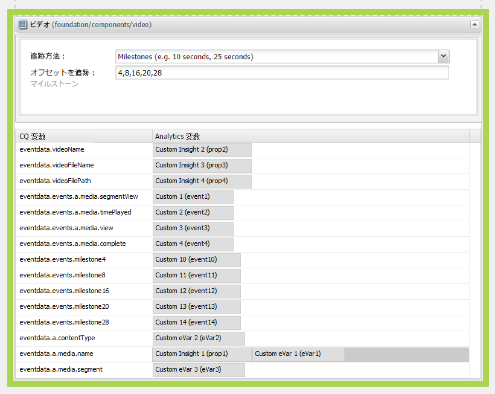
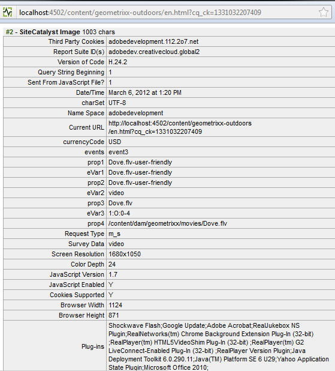

# Adobe Analytics のビデオトラッキングの設定{#configuring-video-tracking-for-adobe-analytics}

ビデオイベントの追跡には、いくつかの方式を使用できます。そのうち 2 つは古いバージョンの Adobe Analytics 用のレガシーオプションで、レガシーマイルストーンとレガシー秒と呼ばれます。

>[!NOTE]
>
>次に進む前に、AEM に&#x200B;**再生可能なビデオ**&#x200B;がアップロードされていることを確認してください。
>
>ページ上でビデオを再生できるようにするには、AEM でビデオファイルをトランスコードする方法について、**[こちらのチュートリアル](/help/sites-authoring/default-components-foundation.md#video)**&#x200B;を参照してください。

各方式を使用してビデオトラッキングのフレームワークを設定するには、以下の手順を実行します。

>[!NOTE]
>
>新規実装の場合は、ビデオトラッキングにレガシーオプションを&#x200B;**使用しない**&#x200B;ことを推奨します。代わりに&#x200B;**マイルストーン**&#x200B;方式を使用してください。

## 共通の手順 {#common-steps}

1. サイドキックから&#x200B;**ビデオコンポーネント**&#x200B;をドラッグし、再生可能なビデオをそのコンポーネントの&#x200B;**アセットとして**&#x200B;追加することによって、Web ページを設定します。

1. [Adobe Analytics設定とフレームワークの作成](/help/sites-administering/adobeanalytics.md).

   * 後続のセクションの例では、 **my-sc-configuration** ( 設定および **videofw** フレームワークの

1. フレームワークページで、RSID を選択し、使用方法を「すべて」に設定します。 （[http://localhost:4502/cf#/etc/cloudservices/sitecatalyst/videoconf/videofw.html](http://localhost:4502/cf#/etc/cloudservices/sitecatalyst/videoconf/videofw.html)）。
1. サイドキックの「一般」コンポーネントカテゴリから、ビデオコンポーネントをフレームワークにドラッグします。
1. トラッキング方式を選択します。

   * [マイルストーン](/help/sites-administering/adobeanalytics.md)
   * [非レガシーマイルストーン](/help/sites-administering/adobeanalytics.md)
   * [レガシーマイルストーン](/help/sites-administering/adobeanalytics.md)
   * [レガシー秒](/help/sites-administering/adobeanalytics.md)

1. トラッキング方式を選択すると、それに従って CQ 変数のリストが変更されます。コンポーネントをさらに設定し、CQ 変数をAdobe Analyticsプロパティにマッピングする方法については、以降の節を参照してください。

## マイルストーン {#milestones}

マイルストーン方式では、ビデオに関する大部分の情報を追跡します。高度なカスタマイズが可能で、設定が容易です。

マイルストーン方式を使用するには、時間ベースの追跡オフセットを指定して、マイルストーンを定義します。ビデオの再生がマイルストーンを渡すと、ページはAdobe Analyticsを呼び出してイベントを追跡します。 定義したマイルストーンごとに、Adobe Analyticsプロパティにマッピングできる CQ 変数がコンポーネントによって作成されます。 これらの CQ 変数の名前には、次の形式を使用します。

```shell
eventdata.events.milestoneXX
```

XX というサフィックスは、マイルストーンを定義する追跡オフセットです。例えば、4、8、16、20、28 秒のトラックオフセットを指定すると、次の CQ 変数が生成されます。

* `eventdata.events.milestone4`
* `eventdata.events.milestone8`
* `eventdata.events.milestone16`
* `eventdata.events.milestone20`
* `eventdata.events.milestone28`

次の表に、マイルストーン方式用に提供されているデフォルトの CQ 変数を示します。

<table> 
 <tbody> 
  <tr> 
   <th>CQ 変数</th> 
   <th>Adobe Analyticsプロパティ</th> 
  </tr> 
  <tr> 
   <td>eventdata.videoName </td> 
   <td>これにマッピングされる変数には、 <strong>使いやすい</strong> 名前 (<strong>タイトル</strong>) を含む画像が DAM に設定されている場合、これが設定されていない場合、ビデオの <strong>ファイル名</strong> が代わりに送信されます。 ビデオの再生開始時に一度だけ送信されます。</td> 
  </tr> 
  <tr> 
   <td>eventdata.videoFileName </td> 
   <td>このプロパティにマッピングされる変数には、ファイルの名前が格納されます。eventdata.events.a.media.view と一緒にのみ送信されます。 </td> 
  </tr> 
  <tr> 
   <td>eventdata.videoFilePath </td> 
   <td>このプロパティにマッピングされる変数には、ファイルのサーバー上のパスが格納されます。eventdata.events.a.media.view と一緒にのみ送信されます。 </td> 
  </tr> 
  <tr> 
   <td>eventdata.events.a.media.segmentView </td> 
   <td>セグメントマイルストーンを通過するたびに送信されます。 </td> 
  </tr> 
  <tr> 
   <td>eventdata.events.a.media.timePlayed</td> 
   <td>マイルストーンがトリガーされるたびに送信され、特定のセグメントの視聴に費やしたユーザーの秒数も、このイベントと共に送信されます。例： eventX=21<br /> </td> 
  </tr> 
  <tr> 
   <td>eventdata.events.a.media.view </td> 
   <td>ビデオビューの初期化時に送信されます。</td> 
  </tr> 
  <tr> 
   <td>eventdata.events.a.media.complete </td> 
   <td>ビデオの再生が終了したときに送信されます<br /> </td> 
  </tr> 
  <tr> 
   <td>eventdata.events.milestoneX </td> 
   <td>特定のマイルストーンを過ぎると送信され、X は、マイルストーンがトリガーされる秒を表します。<br /> </td> 
  </tr> 
  <tr> 
   <td>eventdata.a.contentType </td> 
   <td>マイルストーンごとに送信されます。はAdobe Analytics呼び出しで pev3 として表示され、通常は「video」として送信されます。<br /> </td> 
  </tr> 
  <tr> 
   <td>eventdata.a.media.name </td> 
   <td>eventdata.videoName とまったく同じです。 </td> 
  </tr> 
  <tr> 
   <td>eventdata.a.media.segment </td> 
   <td>表示されたセグメントに関する情報が含まれます（例： 2）:O:4-8 </td> 
  </tr> 
 </tbody> 
</table>

>[!NOTE]
>
>DAM で編集するビデオを開き、 **タイトル** メタデータフィールドを目的の名前に変更します。

1. 「オフセットを追跡」ボックスで、トラッキング方式としてマイルストーンを選択してから、秒単位の追跡オフセットのコンマ区切りリストを入力します。例えば、次の値はビデオの開始から 4、8、16、20 および 28 秒後にマイルストーンを定義します。

   ```xml
   4,8,16,20,24
   ```

   オフセット値は、0 より大きい整数でなければなりません。デフォルト値は `10,25,50,75` です。

1. CQ 変数をAdobe Analyticsプロパティにマッピングするには、コンポーネント上の CQ 変数の横にある ContentFinder からAdobe Analyticsプロパティをドラッグします。

   マッピングの最適化について詳しくは、 [Adobe Analyticsでのビデオの測定](https://docs.adobe.com/content/help/en/media-analytics/using/sdk-implement/setup/setup-overview.html) ガイド。

1. [フレームワークを追加](/help/sites-administering/adobeanalytics.md) をページに追加します。
1. で設定をテストするには、以下を実行します。 **プレビューモード**、ビデオを再生してAdobe Analyticsのトリガー呼び出しを取得します。

以下に示すAdobe Analyticsの追跡データの例は、4、8、16、20、24 の追跡オフセットを使用したマイルストーンの追跡と、CQ 変数に対する次のマッピングに適用されます。

<table> 
 <tbody> 
  <tr> 
   <th>CQ 変数</th> 
   <th>Adobe Analyticsプロパティ</th> 
  </tr> 
  <tr> 
   <td>eventdata.videoName </td> 
   <td>prop2</td> 
  </tr> 
  <tr> 
   <td>eventdata.videoFileName </td> 
   <td>prop3 </td> 
  </tr> 
  <tr> 
   <td>eventdata.videoFilePath </td> 
   <td>prop4</td> 
  </tr> 
  <tr> 
   <td>eventdata.events.a.media.segmentView </td> 
   <td>event1</td> 
  </tr> 
  <tr> 
   <td>eventdata.events.a.media.timePlayed</td> 
   <td>event2<br /> </td> 
  </tr> 
  <tr> 
   <td>eventdata.events.a.media.view </td> 
   <td>event3</td> 
  </tr> 
  <tr> 
   <td>eventdata.events.a.media.complete </td> 
   <td>event4<br /> </td> 
  </tr> 
  <tr> 
   <td>eventdata.events.milestone4</td> 
   <td>event10</td> 
  </tr> 
  <tr> 
   <td>eventdata.events.milestone8</td> 
   <td>event11</td> 
  </tr> 
  <tr> 
   <td>eventdata.events.milestone16</td> 
   <td>event12</td> 
  </tr> 
  <tr> 
   <td>eventdata.events.milestone20</td> 
   <td>event13</td> 
  </tr> 
  <tr> 
   <td>eventdata.events.milestone24</td> 
   <td>event14</td> 
  </tr> 
  <tr> 
   <td>eventdata.a.contentType </td> 
   <td>eVar3</td> 
  </tr> 
  <tr> 
   <td>eventdata.a.media.name </td> 
   <td>eVar1, prop1 </td> 
  </tr> 
  <tr> 
   <td>eventdata.a.media.segment </td> 
   <td>eVar2</td> 
  </tr> 
 </tbody> 
</table>

この例では、ビデオコンポーネントはフレームワークページに次のように表示されます。



>[!NOTE]
>
>Adobe Analyticsへの呼び出しを確認するには、DigitalPulse Debugger や Fiddler などの適切なツールを使用します。

上記の例を使用したAdobe Analyticsへの呼び出しは、DigitalPulse Debugger では次のように表示されます。



*これは&#x200B;**最初の呼び出し**次の値を含むAdobe Analyticsに対して作成されます。*

* *eventdata.a.media.name に対する prop1 と eVar1*
* *prop2～4。contentType（ビデオ）と segment(1) を含むeVar2 およびeVar3。:O:1-4)*
* *eventdata.events.a.media.view にマッピングされた event3*


*これは Adobe Analytics への&#x200B;**3 回目の呼び出**しです。*

* *prop1 と eVar1 には が格納されている`a.media.name;`*
* *セグメントが表示されたことによって event1 が送信された*
* *再生時間 = 4 で event2 が送信された*
* *eventdata.events.milestone8 に到達したことによって event11 送信された*
* *（eventdata.events.a.media.view がトリガーされなかったので）prop2～4 は送信されない*

## 非レガシーマイルストーン {#non-legacy-milestones}

非レガシーマイルストーン方式は、マイルストーン方式によく似ていますが、マイルストーンを計測の長さの割合に基づいて定義する点が異なります。次の点は共通です。

* ビデオの再生がマイルストーンを渡すと、ページはAdobe Analyticsを呼び出してイベントを追跡します。
* この [CQ 変数の静的セット](#milestones) Adobe Analyticsプロパティでのマッピング用に定義される
* 定義したマイルストーンごとに、Adobe Analyticsプロパティにマッピングできる CQ 変数がコンポーネントによって作成されます。

これらの CQ 変数の名前には、次の形式を使用します。

XX というサフィックスは、マイルストーンを定義する計測の長さの割合です。例えば、10、25、50 および 75 という割合を指定すると、以下の CQ 変数が生成されます。

* `eventdata.events.milestone10`
* `eventdata.events.milestone25`
* `eventdata.events.milestone50`
* `eventdata.events.milestone75`

```shell
eventdata.events.milestoneXX
```

1. 「オフセットを追跡」ボックスで、トラッキング方式として非レガシーマイルストーンを選択してから、計測の長さの割合のコンマ区切りリストを入力します。例えば、次のデフォルト値は計測の長さの 10、25、50 および 75% でマイルストーンを定義します。

   ```xml
   10,25,50,75
   ```

   オフセット値は、0 より大きい整数でなければなりません。

1. CQ 変数をAdobe Analyticsプロパティにマッピングするには、コンポーネント上の CQ 変数の横にある ContentFinder からAdobe Analyticsプロパティをドラッグします。

   マッピングの最適化について詳しくは、 [Adobe Analyticsでのビデオの測定](https://docs.adobe.com/content/help/en/media-analytics/using/sdk-implement/setup/setup-overview.html) ガイド。

1. [フレームワークを追加](/help/sites-administering/adobeanalytics.md) をページに追加します。
1. で設定をテストするには、以下を実行します。 **プレビューモード**、ビデオを再生してAdobe Analyticsのトリガー呼び出しを取得します。

## レガシーマイルストーン {#legacy-milestones}

この方式は、マイルストーン方式によく似ていますが、「追跡オフセット」**&#x200B;フィールドに指定するマイルストーンが、ビデオ内の設定ポイントではなく割合であるという点が異なります。

>[!NOTE]
>
>「追跡オフセット」フィールドには、1～100 の整数を含むコンマ区切りリストのみを指定できます。

1. 追跡オフセットを設定します。

   * 例：10,50,75,100

   また、Adobe Analyticsに送信される情報は、カスタマイズが困難です。マッピングに使用できる変数は次の 3 つだけです。

<table> 
 <tbody> 
  <tr> 
   <td>eventdata.videoName <br /> </td> 
   <td>これにマッピングされる変数には、 <strong>使いやすい</strong> 名前 (<strong>タイトル</strong>) を含む画像が DAM に設定されている場合、タイトルが設定されていない場合、ビデオの <strong>ファイル名</strong> が代わりに送信されます。 ビデオの再生開始時に一度だけ送信されます。<br /> </td> 
  </tr> 
  <tr> 
   <td>eventdata.videoFileName </td> 
   <td>このプロパティにマッピングされる変数には、ファイルの名前が格納されます。ビデオの再生開始時に一度だけ送信されます。</td> 
  </tr> 
  <tr> 
   <td>eventdata.videoFilePath </td> 
   <td>このプロパティにマッピングされる変数には、ファイルのサーバー上のパスが格納されます。ビデオの再生開始時に一度だけ送信されます。</td> 
  </tr> 
 </tbody> 
</table>

>[!NOTE]
>
>DAM で編集するビデオを開き、「**タイトル**」メタデータフィールドを目的の名前に設定することで、ビデオのわかりやすい名前を設定できます。 また、終了したら、変更内容を保存する必要があります。

1. これらの変数を prop1～3 にマッピングします。

   呼び出しの中の&#x200B;**その他の関連情報**&#x200B;は、**pev3** という&#x200B;**ひとつ**&#x200B;の変数に連結されて送信されます。

   **サンプル呼び出し** Adobe Analyticsに DigitalPulse Debugger で表示した場合、以下の例を使用して次のようになります。

   

   *この呼び出しで送信される&#x200B;**pev3**変数には、以下の情報が格納されます。*

   * *名前*  — ビデオファイルの名前 (*film.avi*)
   * *長さ*  — ビデオファイルの長さ（秒）*100*)
   * *プレーヤー名*  — ビデオファイルの再生に使用されるビデオプレーヤー (*HTML5 ビデオ*)
   * *再生秒数合計*  — ビデオが再生された合計秒数 (*25*)
   * *開始タイムスタンプ*  — ビデオの再生がいつ開始されたかを識別するタイムスタンプ (*1331035567*)
   * *セッションを再生*  — 再生セッションの詳細。 このフィールドは、ユーザーによるビデオの操作を示します。例えば、ビデオの再生を開始した場所、ビデオの進行にビデオスライダーを使用したかどうか、ビデオの再生を停止した場所 (*L10E24S58L58 — ビデオが 1 秒で停止しました。セクション L10 の 25 をスキップし、秒にスキップしました。48*)

## レガシー秒 {#legacy-seconds}

「**レガシー秒数**」メソッドを使用する場合、N 秒ごとにAdobe Analytics呼び出しがトリガーされます。N は「追跡オフセット」フィールドで指定されます。

1. 「追跡」オフセットを任意の秒数に設定します。

   * 例：6
   >[!NOTE]
   >
   >「追跡オフセット」フィールドに指定できるのは、0 より大きい整数だけです。

   Adobe Analyticsに送信される情報は、あまりカスタマイズできません。 マッピングに使用できる変数は次の 3 つだけです。

<table> 
 <tbody> 
  <tr> 
   <td>eventdata.videoName <br /> </td> 
   <td>これにマッピングされる変数には、 <strong>使いやすい</strong> 名前 (<strong>タイトル</strong>) を含む画像が DAM に設定されている場合、タイトルが設定されていない場合、ビデオの <strong>ファイル名</strong> が代わりに送信されます。 ビデオの再生開始時に一度だけ送信されます。<br /> </td> 
  </tr> 
  <tr> 
   <td>eventdata.videoFileName </td> 
   <td>このプロパティにマッピングされる変数には、ファイルの名前が格納されます。ビデオの再生開始時に一度だけ送信されます。</td> 
  </tr> 
  <tr> 
   <td>eventdata.videoFilePath </td> 
   <td>このプロパティにマッピングされる変数には、ファイルのサーバー上のパスが格納されます。ビデオの再生開始時に一度だけ送信されます。</td> 
  </tr> 
 </tbody> 
</table>

>[!NOTE]
>
>DAM で編集するビデオを開き、 **タイトル** メタデータフィールドを目的の名前に変更します。 また、終了したら、変更内容を保存する必要があります。

1. これらの変数を prop1、prop2 および prop3 にマッピングします。

   呼び出しの中の&#x200B;**その他の関連情報**&#x200B;は、**pev3** という&#x200B;**ひとつ**&#x200B;の変数に連結されて送信されます。

   上記の例を使用したAdobe Analyticsへの呼び出しは、DigitalPulse Debugger では次のように表示されます。

   

   *この呼び出しは、前述のレガシーマイルストーン呼び出しと同じです。**[こちら](/help/sites-administering/adobeanalytics.md)**の pev3 に関する情報を参照してください。*

**このチュートリアルで使用しているリファレンス：**

[0] [https://docs.adobe.com/content/help/en/media-analytics/using/sdk-implement/setup/setup-overview.html](https://docs.adobe.com/content/help/en/media-analytics/using/sdk-implement/setup/setup-overview.html)
