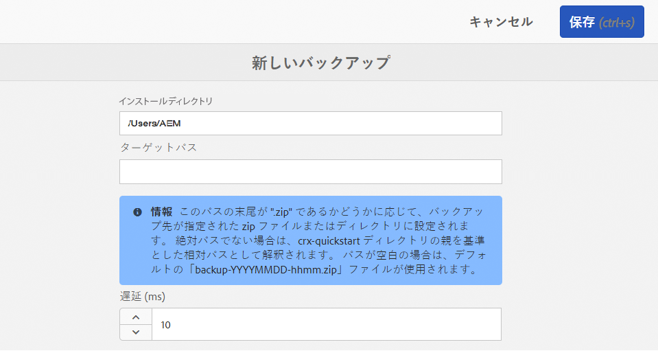

# バックアップと復元{#backup-and-restore}

AEM でリポジトリコンテンツをバックアップおよび復元するには、次の 2 つの方法があります。

* リポジトリの外部バックアップを作成して、安全な場所に保存できます。 リポジトリが壊れた場合は、前の状態に復元できます。
* リポジトリコンテンツの内部バージョンを作成できます。 これらのバージョンは、コンテンツと共にリポジトリに保存されるので、変更または削除したノードやツリーをすばやく復元できます。

## 一般 {#general}

ここで説明するアプローチは、システムのバックアップとリカバリに適用されます。

少量のコンテンツ（失われた）をバックアップまたは回復する必要がある場合、システムの回復は必ずしも必要ありません。

* パッケージを介して別のシステムからデータを取得できる
* または、一時的なシステムにバックアップを復元し、コンテンツパッケージを作成して、そのコンテンツが見つからないシステムに展開します。

詳しくは、後述の[パッケージバックアップ](/help/sites-administering/backup-and-restore.md#package-backup)を参照してください。

## タイミング {#timing}

データストアのガベージコレクションと並行してバックアップを実行しないでください。両方のプロセスの結果に害を及ぼす可能性があります。

## オフラインバックアップ {#offline-backup}

オフラインバックアップをいつでも実行できます。 これにはAEMのダウンタイムが必要ですが、オンラインバックアップと比べて、必要な時間の面で非常に効率的です。

ほとんどの場合、ファイル・システムのスナップショットを使用して、その時点でのストレージの読み取り専用コピーを作成します。 オフラインバックアップを作成するには、次の手順を実行します。

* アプリケーションを停止します。
* スナップショットのバックアップを作成します。
* アプリケーションを起動します。

通常、スナップショット・バックアップにかかる時間は数秒で済むので、ダウンタイム全体は数分未満です。

## オンラインバックアップ {#online-backup}

このバックアップ方法では、リポジトリ全体のバックアップを作成します。これには、AEMなど、リポジトリにデプロイされているアプリケーションも含まれます。 バックアップには、コンテンツ、バージョン履歴、設定、ソフトウェア、ホットフィックス、カスタムアプリケーション、ログファイル、検索インデックスなどが含まれます。 クラスター化を使用していて、（物理的に、またはソフトリンクを使用して）`crx-quickstart` のサブディレクトリが共有フォルダーとして指定されている場合は、共有ディレクトリもバックアップされます。

後でリポジトリ全体（とアプリケーション）を復元できます。

この方法は「ホット」バックアップまたは「オンライン」バックアップとして動作するので、リポジトリ実行中に実行できます。したがって、バックアップ実行中にリポジトリが使用可能です。この方法は、デフォルトの、Tar ストレージベースのリポジトリインスタンスに対応します。

バックアップの作成には次のオプションがあります。

* AEM の統合バックアップツールを使用して、ディレクトリにバックアップします。
* ファイルシステムのスナップショットを使用したディレクトリへのバックアップ

どちらの場合も、バックアップによってリポジトリのイメージ（スナップショット）が作成されます。その後、システムのバックアップエージェントによって、そのイメージが実際に専用のバックアップシステム（テープドライブ）に送信されます。

>[!NOTE]
>
>AEM オンラインバックアップ機能をカスタム blobstore 設定がある AEM インスタンスに使用する場合は、データストアのパスを「`crx-quickstart`」ディレクトリ外に設定し、データストアを別にバックアップすることをお勧めします。

>[!CAUTION]
>
>オンラインバックアップは、ファイルシステムのバックアップのみを行います。 リポジトリのコンテンツやリポジトリのファイルをデータベースに格納する場合は、そのデータベースを個別にバックアップする必要があります。 MongoDB でAEMを使用している場合、 [MongoDB のネイティブバックアップツール](https://docs.mongodb.org/manual/tutorial/backup-with-mongodump/).

### AEM Online Backup {#aem-online-backup}

リポジトリのオンラインバックアップでは、バックアップファイルの作成、ダウンロードおよび削除が可能です。 これは「ホット」または「オンライン」のバックアップ機能なので、リポジトリが読み取り/書き込みモードで通常どおり使用されている間に実行できます。

>[!CAUTION]
>
>AEM オンラインバックアップを、[データストアのガベージコレクション](/help/sites-administering/data-store-garbage-collection.md)または[リビジョンクリーンアップ](/help/sites-deploying/revision-cleanup.md#how-to-run-offline-revision-cleanup)と同時に実行しないでください。これらを同時に実行すると、システムのパフォーマンスが低下します。

バックアップの開始時に、「**ターゲットパス**」か「**遅延**」（またはその両方）を指定できます。

**ターゲットパス** バックアップファイルは通常、quickstart jar ファイル（.jar）を保管するフォルダーの親フォルダーに保存されます。例えば、AEM jar ファイルが /InstallationKits/AEM 以下にある場合、バックアップは /InstallationKits 以下に生成されます。ターゲットの場所を自由に指定することもできます。

この **TargetPath** がディレクトリの場合、リポジトリのイメージはこのディレクトリに作成されます。 同じディレクトリを複数回（または常に）使用してバックアップを保存する場合、

* リポジトリ内の変更されたファイルは、TargetPath で変更されます。
* リポジトリ内の削除されたファイルは、TargetPath で削除されます
* リポジトリ内で作成されたファイルは、TargetPath 内で作成されます。

>[!NOTE]
>
>If **TargetPath** がファイル名の拡張子に設定されている **.zip**&#x200B;を指定した場合、リポジトリは一時ディレクトリにバックアップされ、その後、この一時ディレクトリの内容が圧縮されて ZIP ファイルに保存されます。
>
>この方法は推奨されません。理由は、
>
>* バックアッププロセス中に追加のディスクストレージが必要になります（一時ディレクトリと zip ファイル）。
>* 圧縮プロセスはリポジトリが実行し、パフォーマンスに影響を与える場合があります。
>* バックアッププロセスが遅れます。
>* Java 1.6 までの Java では、4 GB までのサイズの ZIP ファイルのみを作成できます。
>
>ZIP をバックアップ形式として作成する必要がある場合は、ディレクトリにバックアップしてから、圧縮プログラムを使用して ZIP ファイルを作成してください。

**遅延** リポジトリのパフォーマンスが影響を受けないように、遅延時間をミリ秒単位で指定します。デフォルトでは、リポジトリのバックアップはフルスピードで実行されます。他のタスクの速度を低下させないように、オンラインバックアップの作成速度を下げることができます。

遅延時間を非常に大きく取る場合は、オンラインバックアップに 24 時間以上かけないでください。24 時間を超えた場合はバックアップを破棄してください。バックアップに一部のバイナリしか含まれない可能性があります。\
一般的には、1 ミリ秒遅延させると CPU 使用率は 10％になり、10 ミリ秒遅延させると 3％未満になります。合計遅延時間（秒）は、次のように推定できます。リポジトリのサイズ（MB 単位）、遅延（ミリ秒単位）、2 で割る（zip オプションを使用する場合）、または 4 で割る（ディレクトリにバックアップする場合）。 つまり、1 ミリ秒の遅延を指定して 200 MB のリポジトリをディレクトリにバックアップする場合、バックアップ時間は約 50 秒増加します。

>[!NOTE]
>
>処理の内部詳細については、[AEM オンラインバックアップの仕組み](#how-aem-online-backup-works)を参照してください。

バックアップを作成するには：

1. 管理者として AEM にログインします。

1. **ツール／運営／バックアップ**&#x200B;に移動します。
1. 「**作成**」をクリックします。バックアップコンソールが開きます。

   

1. バックアップコンソールで、「**[ターゲットパス](#aem-online-backup)**」と「**[遅延](#aem-online-backup)**」を指定します。

   

   >[!NOTE]
   >
   >バックアップコンソールは、次のアドレスからもアクセスできます。
   >
   >
   >` https://<*hostname*>:<*port-number*>/libs/granite/backup/content/admin.html`

1. 「**保存**」をクリックします。進行状況バーに、バックアップの進行状況が示されます。

   >[!NOTE]
   >
   >以下が可能です。 **キャンセル** 実行中のバックアップをいつでも作成できます。

1. バックアップが完了すると、Zip ファイルがバックアップウィンドウに表示されます。

   

   >[!NOTE]
   >
   >不要になったバックアップファイルは、コンソールを使用して削除できます。 左側のペインでバックアップファイルを選択し、 **削除**.

   >[!NOTE]
   >
   >ディレクトリにバックアップした場合：バックアッププロセスが終了すると、AEMはターゲットディレクトリに書き込まれません。

### AEM Online Backup の自動化 {#automating-aem-online-backup}

可能な場合は、システムに負荷が少ない場合（例えば、午前中）にオンラインバックアップを実行する必要があります。

バックアップは、`wget` または `curl` HTTP クライアントを使用して自動化することができます。次に、curl を使用してバックアップを自動化する方法の例を示します。

#### デフォルトのターゲットディレクトリへのバックアップ {#backing-up-to-the-default-target-directory}

>[!CAUTION]
>
>以下の例では、`curl` コマンドの様々なパラメーターをお使いのインスタンスに合わせて設定する必要があります。例えば、ホスト名（`localhost`）、ポート（`4502`）、管理者パスワード（`xyz`）およびファイル名（`backup.zip`）が該当します。

```shell
curl -u admin:admin -X POST http://localhost:4502/system/console/jmx/com.adobe.granite:type=Repository/op/startBackup/java.lang.String?target=backup.zip
```

バックアップファイルまたはディレクトリは、`crx-quickstart` フォルダーを含むフォルダーの親フォルダー内に作成されます（ブラウザーを使用してバックアップを作成する場合と同様です）。例えば、`/InstallationKits/crx-quickstart/` ディレクトリに AEM をインストールしている場合、バックアップは `/InstallationKits` ディレクトリ内に作成されます。

curl コマンドは直ちに返されるので、このディレクトリを監視して、zip ファイルの準備が整ったかどうかを確認する必要があります。 バックアップの作成中に、（最終 zip ファイルの名前に基づく名前の）一時ディレクトリが表示され、最後に圧縮されます。 次に例を示します。

* 作成される zip ファイルの名前：`backup.zip`
* 一時ディレクトリの名前：`backup.f4d5.temp`

#### デフォルトのターゲットディレクトリ以外へのバックアップ {#backing-up-to-a-non-default-target-directory}

通常、バックアップファイルまたはディレクトリは、`crx-quickstart` フォルダーを含むフォルダーの親フォルダー内に作成されます。

バックアップ（どちらの種類でも）を別の場所に保存する場合は、`curl` コマンドの `target` パラメーターに絶対パス ``を設定できます。

例えば、`/Backups/2012` ディレクトリに `backupJune.zip` を生成するには、次のコマンドを実行します。

```shell
curl -u admin:admin -X POST http://localhost:4502/system/console/jmx/com.adobe.granite:type=Repository/op/startBackup/java.lang.String?target=/Backups/2012/backupJune.zip"
```

>[!CAUTION]
>
>別のアプリケーションサーバー（JBoss など）を使用している場合、ターゲットディレクトリに書き込み可能でないので、オンラインバックアップが期待どおりに動作しない場合があります。 この場合は、サポートにお問い合わせください。

>[!NOTE]
>
>バックアップをトリガーすることもできます [AEMが提供する MBean の使用](/help/sites-administering/jmx-console.md).

### ファイルシステムのスナップショットバックアップ {#filesystem-snapshot-backup}

ここで説明するプロセスは、大規模なリポジトリに特に適しています。

>[!NOTE]
>
>このバックアップ方法を使用する場合は、システムがファイルシステムのスナップショットをサポートする必要があります。 例えば、Linux の場合、ファイルシステムを論理ボリュームに配置する必要があります。

1. AEM がデプロイされているファイルシステムのスナップショットを取得します。

1. ファイルシステムのスナップショットをマウントします。
1. バックアップを実行し、スナップショットをアンマウントします。

### AEM Online Backup の仕組み {#how-aem-online-backup-works}

AEM オンラインバックアップは、バックアップ対象のデータと作成されるバックアップファイルの整合性を確保するための一連の内部アクションにより構成されます。以下に、関心のある開発者向けに、これらの内部アクションについて示します。

オンラインバックアップでは次のアルゴリズムを使用します。

1. zip ファイル作成時の最初の手順は、ターゲットディレクトリを作成または指定することです。

   * zip ファイルにバックアップする場合、一時ディレクトリが作成されます。ディレクトリ名は `backup.` で始まり、`.temp`（例：`backup.f4d3.temp`）で終わります。
   * ディレクトリにバックアップする場合は、ターゲットパスで指定された名前が使用されます。既存のディレクトリを使用できます。使用しない場合は、新しいディレクトリが作成されます。

      バックアップの開始時に、ターゲットディレクトリ内に `backupInProgress.txt` という空のファイルが作成されます。このファイルは、バックアップの完了時に削除されます。

1. すべてのファイルが、ソースディレクトリからターゲットディレクトリ（zip ファイルを作成する場合は一時ディレクトリ）にコピーされます。リポジトリの破損を回避するために、セグメントストアはデータストアより前にコピーされます。バックアップの作成時、インデックスとキャッシュデータは省略されます。結果として、`crx-quickstart/repository/cache` と `crx-quickstart/repository/index` からのデータはバックアップに含まれません。このプロセスで進行状況バーのインジケーターは、zip ファイルの作成時は 0 ～ 70％、zip ファイルを作成しない場合は 0 ～ 100％を示します。

1. バックアップが既存のディレクトリに対して行われる場合、ターゲットディレクトリ内の「古い」ファイルは削除されます。 古いファイルは、ソースディレクトリに存在しないファイルです。

ファイルは、次の 4 つのステージでターゲットディレクトリにコピーされます。

1. 最初のコピーステージ（進行状況インジケーターは zip ファイルを作成する場合は 0%～63%、zip ファイルを作成しない場合は 0%～90%）では、リポジトリが正常に実行されている間に、すべてのファイルがコピーされます。 このプロセスには次の 2 つのフェーズがあります。

   * フェーズ A — データストアを除くすべてが（遅延を伴う）コピーされます。
   * フェーズ B — データストアのみが（遅延を伴って）コピーされます。

1. 2 番目のコピーステージ（zip ファイルの作成時は進行状況インジケーター 63%～65.8%、zip ファイルの作成時は 90%～94%）では、最初のコピーステージの開始後にソースディレクトリで作成または変更されたファイルのみがコピーされます。 リポジトリでのアクティビティに応じて、ファイルがまったくコピーされないことも、（第 1 コピーステージは通常時間がかかるので）多数のファイルがコピーされることもあります。このコピープロセスは第 1 ステージと似ています（遅延付きのフェーズ A とフェーズ B）。
1. 第 3 コピーステージ（進行状況インジケーターの値は zip ファイルの作成時は 65.8～68.6％、zip ファイルを作成しない場合は 94～98％）では、第 2 コピーステージの開始以降にソースディレクトリで作成または変更されたファイルのみがコピーされます。リポジトリでのアクティビティに応じて、ファイルがまったくコピーされないことも、（第 2 コピーステージは通常高速なので）わずかなファイルがコピーされることもあります。このコピープロセスは第 2 ステージと似ています（遅延なしのフェーズ A とフェーズ B）。
1. ファイル・コピー・ステージ 1 ～ 3 は、リポジトリの実行中にすべて同時に実行されます。 3 番目のコピーステージが開始されてからソースディレクトリで作成または変更されたファイルのみがコピーされます。 リポジトリのアクティビティによっては、コピーするファイルがない場合や、非常に少数のファイルが存在する場合があります（通常、2 番目のファイルコピーステージは非常に高速なので）。 進行状況インジケーターは、zip ファイルを作成する場合は 68.6%～70%、zip ファイルを作成しない場合は 98%～100%です。 コピー処理は第 3 段階に似ています。
1. ターゲットに応じて、次の操作をおこないます。

   * zip ファイルを指定した場合は、一時ディレクトリから作成されます。 進行状況インジケーター 70% ～ 100%。 一時ディレクトリが削除されます。
   * ターゲットがディレクトリの場合は、バックアップが完了したことを示すために、`backupInProgress.txt` という空のファイルが削除されます。

## バックアップの復元 {#restoring-the-backup}

次の手順でバックアップを復元できます。

* ファイル・システムのスナップショット・バックアップを実行した場合は、システムのイメージをリストアするだけで済みます。
* バックアップを zip ファイルとして作成した場合は、新しいフォルダーに内容を解凍し、その場所からAEMを起動します。

## パッケージバックアップ {#package-backup}

コンテンツをバックアップおよび復元するには、いずれかのパッケージマネージャーを使用できます。コンテンツパッケージ形式を使用してコンテンツのバックアップおよび復元がおこなわれます。パッケージマネージャーでは、パッケージをより柔軟に定義および管理できます。

これらの個々のコンテンツパッケージ形式の機能とトレードオフについて詳しくは、 [パッケージの操作方法](/help/sites-administering/package-manager.md).

### バックアップの範囲 {#scope-of-backup}

パッケージマネージャーまたはコンテンツジッパーを使用してノードをバックアップすると、CRX では以下の情報が保存されます。

* 選択したツリーの下のリポジトリコンテンツ。
* バックアップするコンテンツに使用されるノードタイプの定義。
* バックアップするコンテンツに使用される名前空間の定義。

バックアップの際に、AEM では次の情報が失われます。

* バージョン履歴
