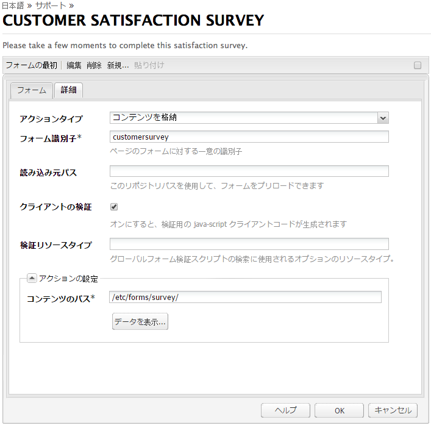
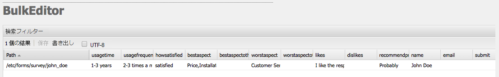
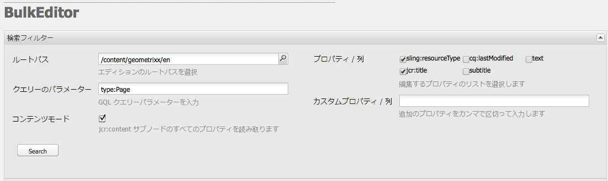
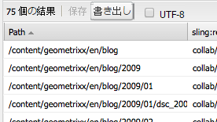

# Bulk Editor{#the-bulk-editor}

Bulk Editor を使用すると、以下のことができるので、視覚的なページコンテンツが不要な場合に非常に効率的な編集が可能になります。

* 複数のページからコンテンツを検索（および表示）。これは GQL（Google Query Language）を使用しておこないます。
* このコンテンツを Bulk Editor で直接編集。
* 変更を（元のページに）保存。
* このコンテンツをタブ区切り（.tsv）スプレッドシートファイルに書き出し。

>[!NOTE]
>
>コンテンツをリポジトリに読み込むこともできますが、デフォルトでは、**ツール**&#x200B;コンソールで使用できる Bulk Editor では無効になっています。

ここでは、**ツール**&#x200B;コンソールで Bulk Editor を操作する方法について説明します。通常、管理者は、Bulk Editor を使用して複数の項目を検索および編集します。これをおこなうには、GQL クエリを使用してテーブルに値を入力してから、作業対象のコンテンツ項目を選択します。作成者は通常、[製品リスト](/help/sites-authoring/default-components.md)コンポーネントを使用してアクセス可能なカスタマイズされた Bulk Editor アプリケーションの一部として Bulk Editor を使用します。

>[!CAUTION]
>
>AEM 6.4 の[クラシック UI の廃止](/help/release-notes/deprecated-removed-features.md) により、Bulk Editor も廃止もされました。したがって、今後、Bulk Editor が強化される予定はありません。

## Bulk Editor の使用例 {#example-use-case-for-the-bulk-editor}

例えば、特定のサーベイに回答したユーザーの名前と電子メールアドレスがすべて必要な場合は、Bulk Editor で提供可能な情報をスプレッドシートに書き出すことができます。

このような使用例の説明が、Geometrixx Web サイトに含まれています。

1. **サポート**&#x200B;ページに移動して、**Customer Service Satisfaction** サーベイに移動します。
1. 「**フォームの最初**」の段落を&#x200B;**編集**&#x200B;します。ダイアログで「**詳細**」タブをクリックし、「**アクションの設定**」を展開して、「**データを表示**」をクリックします。

   

1. Bulk Editor は完全にカスタマイズ可能ですが、この例では、ユーザーはコンテンツの編集はできず、情報をスプレッドシートに書き出すことができるだけです。

   

## Bulk Editor を使用する方法 {#how-to-use-the-bulk-editor}

Bulk Editor では次のことが可能です。

* [クエリーパラメーターに基づいてコンテンツを検索し、指定した結果のプロパティを列に表示し、このコンテンツを編集して変更を保存します。](#searching-and-editing-content)
* [このコンテンツをタブ区切りスプレッドシートに書き出します。](#exporting-content)

* [コンテンツをタブ区切りスプレッドシートから読み込みます。](#importing-content)

### コンテンツの検索と編集 {#searching-and-editing-content}

Bulk Editor を使用して複数の項目を同時に編集するには：

1. **ツール**&#x200B;コンソールで、**Importers** フォルダーをクリックして展開します。
1. 「**Bulk Editor**」をダブルクリックして開きます。
1. 選択要件を入力します。

<table> 
 <tbody> 
  <tr> 
   <td>フィールド</td> 
   <td>プロパティ</td> 
  </tr> 
  <tr> 
   <td>ルートパス</td> 
   <td>Bulk Editor が検索するルートパスを示します。  例： <code>/content/geometrixx/en</code>.Bulk Editor は、すべての子ノードを検索します。</td> 
  </tr> 
  <tr> 
   <td>クエリーのパラメーター</td> 
   <td>GQL パラメーターを使用して、Bulk Editor でリポジトリ内で検索する検索文字列を入力します。例： <code>type:Page</code> は、ルートパス内のすべてのページを探します。 <code>text:professional</code> 「professional」という単語が含まれるすべてのページを検索し、 <code>"jcr:title":English</code> は、タイトルが「英語」であるすべてのページを検索します。 文字列のみを検索できます。</td> 
  </tr> 
  <tr> 
   <td>「コンテンツモード」チェックボックス</td> 
   <td>このチェックボックスをオンにすると、 <code>jcr:content</code> 検索結果のサブノード（存在する場合）。 ページにのみ使用します。プロパティ名の前には <code>"jcr:content/"</code></td> 
  </tr> 
  <tr> 
   <td>プロパティ／列</td> 
   <td>Bulk Editor で返すプロパティのチェックボックスをチェックします。選択したプロパティは、結果ウィンドウの列見出しとなります。デフォルトでは、結果にはノードパスが表示されます。</td> 
  </tr> 
  <tr> 
   <td>カスタムプロパティ／列</td> 
   <td>リストにない他のプロパティを入力します。 <strong>プロパティ/列</strong> フィールドに入力します。これらのカスタムプロパティは、結果ペインに表示されます。複数のプロパティを追加する場合は、コンマでプロパティを区切ります。 <i>注意：</i> まだ存在しないカスタムプロパティを追加すると、AEM WCM に空のセルが表示されます。 空白のセルを変更して保存すると、そのプロパティがノードに追加されます。新しく作成されたプロパティは、ノードタイプの制約とプロパティの名前空間に従う必要があります。</td> 
  </tr> 
 </tbody> 
</table>

次に例を示します。

1. クリック **検索**.結果が Bulk Editor に表示されます。

   上記の例では、検索条件を満たすすべてのページが返され、リクエストされた列と共に表示されます。

   

1. 任意のセル内でダブルクリックして、必要な変更をおこないます。

   

1. 「**保存**」をクリックして変更を保存します（「**保存**」ボタンは、セルを編集後に有効になります）。

   >[!CAUTION]
   >
   >ここでおこなった変更は、リポジトリコンテンツ（「**パス**」で参照されているページなど）に書き込まれます。

#### その他の GQL クエリパラメーター {#additional-gql-query-parameters}

* **パス：** このパスの下のノードのみを検索します。パスのプレフィックスを付けて複数の用語を指定した場合は、最後の用語のみが考慮されます。
* **型：** 指定されたノードタイプのノードのみを返します。これには、プライマリと mixin のタイプが含まれます。複数のノードタイプをコンマで区切って指定できます。GQL は、指定された任意の型のノードを返します。
* **順序：** 指定されたプロパティで結果を並べ替えます。複数のプロパティ名をコンマで区切って指定できます。結果を降順で並べ替えるには、プロパティ名の先頭にマイナス記号を付けます。例：order:-name.プラス記号を使用すると、昇順で結果が返されます。これはデフォルトでもあります。
* **制限：** は、間隔を使用して結果の数を制限します。例：limit:10..20 間隔は 0 を基準とし、start は包括的で、end は排他的であることに注意してください。 また、開く間隔を指定することもできます:limit:10.. または制限：..20 ドットを省略し、値を 1 つだけ指定した場合、GQL は最大でこの数の結果を返します。 例：limit:10 （最初の 10 件の結果を返します）

### コンテンツの書き出し {#exporting-content}

コンテンツを書き出して、Excel のスプレッドシートで変更を加えることが必要になる場合があります。例えば、メーリングリストを書き出して、リストされているすべての電話番号の市外局番を Excel で直接変更したり、行を追加したりする場合などです。

コンテンツを書き出すには：

1. [コンテンツの検索と編集](#searching-and-editing-content)の説明に従ってコンテンツを検索します。
1. 「**書き出し**」をクリックして、変更をタブ区切りの Excel スプレッドシートに書き出します。AEM WCM でファイルのダウンロード場所が確認されます。

   >[!NOTE]
   >
   >デフォルトでは、変更は [Windows-1252](https://en.wikipedia.org/wiki/Windows-1252)（CP-1252 とも呼ばれる）でエンコードされます。「UTF-8」をチェックすると、変更を UTF-8 で書き出すことができます。

   

1. 場所を選択して、ファイルのダウンロードを確認します。
1. ファイルをダウンロードしたら、Microsoft Excel などのスプレッドシートプログラムから開くことができます。スプレッドシートプログラムにファイルが読み込まれ、スプレッドシート形式に変換されます。

   

### コンテンツの読み込み {#importing-content}

デフォルトでは、バルクエディターを開くと、インポート機能は非表示になります。 単にパラメーターを追加する `hib=false` を URL に追加すると、 **インポート** 」ボタンをクリックします。 コンテンツは、任意のタブ区切り ( `.tsv`) ファイルです。 インポートが正しく機能するには、列見出し（セルの最初の行）が、インポート先のテーブルの列見出しと一致している必要があります。

>[!NOTE]
>
>コンテンツを再読み込みする場合は、該当するノードの以前のコンテンツをすべて削除します。重要な情報を上書きしないように注意してください。

コンテンツを読み込むには：

1. Bulk Editor を開きます。
1. 追加 `?hib=false` を URL に追加します（例： ）。

   `http://localhost:4502/etc/importers/bulkeditor.html?hib=false`

1. 「**読み込み**」をクリックします。
1. を選択します。 `.tsv` ファイル。 データがリポジトリにインポートされます。
