# Adobe Campaign Classic との統合{#integrating-with-adobe-campaign-classic}

>[!CAUTION]
>
>AEM 6.4 の拡張サポートは終了し、このドキュメントは更新されなくなりました。 詳細は、 [技術サポート期間](https://helpx.adobe.com/jp/support/programs/eol-matrix.html). サポートされているバージョンを見つける [ここ](https://experienceleague.adobe.com/docs/?lang=ja).

>[!NOTE]
>
>このドキュメントでは、AEMとオンプレミスソリューションであるAdobe Campaign Classicの統合方法について説明します。 Adobe Campaign Standard [Adobe Campaign Standardとの統合](/help/sites-administering/campaignstandard.md) を参照してください。

Adobe Campaignを使用すると、E メール配信コンテンツやフォームをAdobe Experience Managerで直接管理できます。

両方のソリューションを同時に使用するには、まず、相互に接続するように設定する必要があります。 これには、Adobe CampaignとAdobe Experience Managerの両方の設定手順が含まれます。 これらの手順については、このドキュメントで詳しく説明します。

AEMでのAdobe Campaignの操作には、Adobe Campaign経由で E メールを送信する機能が含まれています。詳しくは、 [Adobe Campaignの使用](/help/sites-authoring/campaign.md). また、AEMページ上のフォームを使用してデータを操作することも含まれます。

さらに、AEM を [Adobe Campaign](https://helpx.adobe.com/jp/support/campaign/classic.html) と統合する際に参考となるトピックを次に示します。

* [メールテンプレートのベストプラクティス](/help/sites-administering/best-practices-for-email-templates.md)
* [Adobe Campaign 統合に関するトラブルシューティング](/help/sites-administering/troubleshooting-campaignintegration.md)

Adobe Campaign との統合を拡張する場合は、次のページが参考になります。

* [カスタム拡張の作成](/help/sites-developing/extending-campaign-extensions.md)
* [カスタムフォームマッピングの作成](/help/sites-developing/extending-campaign-form-mapping.md)

## AEMとAdobe Campaignの統合ワークフロー {#aem-and-adobe-campaign-integration-workflow}

ここでは、キャンペーンを作成し、コンテンツを配信する際のAEMとAdobe Campaignの一般的なワークフローについて説明します。

一般的なワークフローは次のとおりです。詳しくは、こちらを参照してください。

1. (Adobe CampaignとAEMの両方で ) キャンペーンの作成を開始します。
1. コンテンツと配信をリンクする前に、AEMでコンテンツをパーソナライズし、Adobe Campaignで配信を作成します。
1. Adobe Campaignでのコンテンツと配信のリンク

### キャンペーンの作成を開始 {#start-building-your-campaign}

キャンペーンの作成は、いつでも開始できます。 コンテンツをリンクする前に、AEMと AC は独立しています。つまり、コンテンツ作成者がAEMのデザインで作業している間に、マーケターはAdobe Campaignでキャンペーンの作成やターゲティングを開始できます。

### コンテンツと配信をリンクする前に {#before-linking-content-and-delivery}

コンテンツをリンクして配信メカニズムを作成する前に、次の手順を実行する必要があります。

**AEM内**

* パーソナライズには、 **テキストとパーソナライゼーション** コンポーネント

**Adobe Campaign の場合：**

* タイプの配信を作成 **aemContent**

### コンテンツのリンクと配信の設定 {#linking-content-and-setting-delivery}

リンクおよび配信用のコンテンツを準備したら、コンテンツをリンクする方法と場所を正確に決定します。

これらの手順はすべて、Adobe Campaignで実行します。

1. 使用するAEMインスタンスを指定します。
1. 「同期」ボタンをクリックして、内容を同期します。
1. コンテンツピッカーを開いて、コンテンツを選択します。

### AEMを初めて使用する場合 {#if-you-are-new-to-aem}

AEMを初めて使用する場合、AEMを理解するのに役立つリンクを次に示します。

* [AEM の開始](/help/sites-deploying/deploy.md)
* [レプリケーションエージェントの概要](/help/sites-deploying/replication.md)
* [ログファイルの検索と使用](/help/sites-deploying/monitoring-and-maintaining.md#working-with-audit-records-and-log-files)
* [AEM プラットフォームの概要](/help/sites-deploying/platform.md)

## Adobe Campaignの設定 {#configuring-adobe-campaign}

Adobe Campaignの設定には、次のものが含まれます。

1. Adobe CampaignにAEM統合パッケージをインストールする。
1. 外部アカウントの設定
1. AEMResourceTypeFilter が正しく設定されていることを確認しています。

さらに、次のような高度な設定をおこなうことができます。

* コンテンツブロックの管理
* パーソナライゼーションフィールドの管理

[高度な設定](#advanced-configurations)を参照してください。

>[!NOTE]
>
>これらの操作を実行するには、Adobe Campaign の&#x200B;**管理**&#x200B;ロールを持っている必要があります。

### 前提条件 {#prerequisites}

事前に次の要素を用意しておいてください。

* [AEM 作成者インスタンス](/help/sites-deploying/deploy.md#getting-started)
* [AEM 発行インスタンス](/help/sites-deploying/deploy.md#author-and-publish-installs)
* [Adobe Campaign Classic インスタンス](https://helpx.adobe.com/jp/support/campaign/classic.html) - クライアントおよびサーバーを含みます
* Internet Explorer 11

>[!NOTE]
>
>Adobe Campaign Classic ビルド 8640 より前のバージョンを実行している場合、詳しくは、[アップグレードに関するドキュメント](https://docs.campaign.adobe.com/doc/AC6.1/en/PRO_Updating_Adobe_Campaign_Upgrading.html)を参照してください。クライアントとデータベースの両方を同じビルドにアップグレードする必要があります。

>[!CAUTION]
>
>[Adobe Campaign の設定](#configuring-adobe-campaign)および [Adobe Experience Manager の設定](#configuring-adobe-experience-manager)の節で詳しく述べた操作は、AEM と Adobe Campaign の間の統合機能が正しく機能するために必要です。

### AEM 統合パッケージのインストール {#installing-the-aem-integration-package}

**AEM 統合**&#x200B;パッケージを Adobe Campaign にインストールする必要があります。次の手順を実行します。

1. AEMとリンクするAdobe Campaignインスタンスに移動します。
1. *ツール*／*詳細*／*パッケージをインポート...*&#x200B;を選択します。

   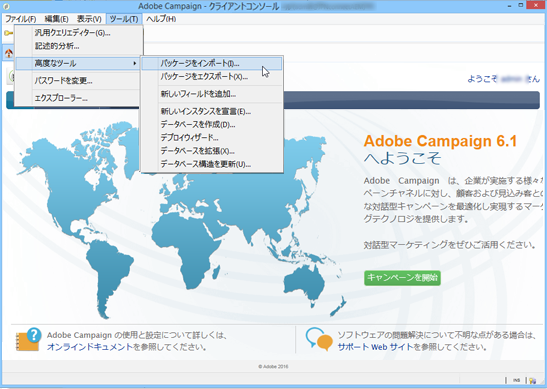

1. 「**標準パッケージをインストール**」をクリックして、「**AEM 統合**」パッケージを選択します。

   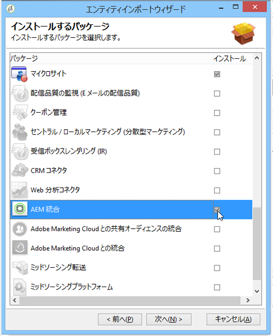

1. 「**次へ**」をクリックし、「**開始**」をクリックします。

   このパッケージには、AEM サーバーを Adobe Campaign に接続するために使用する **aemserver** 演算子が含まれています。

   >[!CAUTION]
   >
   >デフォルトでは、このオペレーターのセキュリティゾーンは設定されていません。 AEM経由でAdobe Campaignに接続するには、1 つ選択する必要があります。
   >
   >ログイン／パスワードで認証して AEM を Adobe Campaign に接続するには、**serverConf.xml** ファイルで、選択したセキュリティゾーンの **allowUserPassword** 属性を **true** に設定する必要があります。
   >
   >セキュリティの問題を回避するために、AEM 専用のセキュリティゾーンを作成することを強くお勧めします。この件について詳しくは、[インストールガイド](https://docs.campaign.adobe.com/doc/AC/en/INS_Additional_configurations_Configuring_Campaign_server.html?lang=ja)を参照してください。

   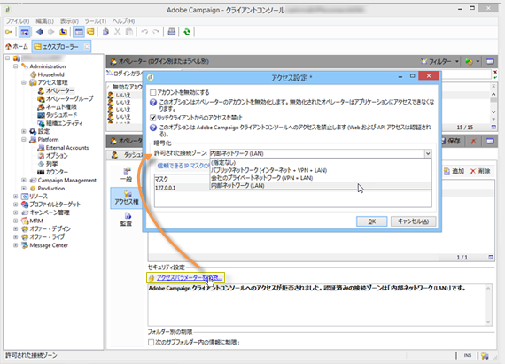

### AEM外部アカウントの設定 {#configuring-an-aem-external-account}

Adobe CampaignをAEMインスタンスに接続できる外部アカウントを設定する必要があります。

>[!NOTE]
>
>* **AEM 統合**&#x200B;パッケージをインストールする際に、外部 AEM アカウントが作成されます。AEMインスタンスへの接続をそのインスタンスから設定するか、新しく作成することができます。
>* AEMで、campaign-remote ユーザーのパスワードを必ず設定してください。 Adobe CampaignとAEMを接続するには、このパスワードを設定する必要があります。 管理者としてログインし、ユーザー管理コンソールで campaign-remote ユーザーを検索して、 **パスワードを設定**.
>


外部AEMアカウントを設定するには：

1. **管理**／**プラットフォーム**／**外部アカウント**&#x200B;ノードに移動します。
1. 新しい外部アカウントを作成して、**AEM** タイプを選択します。
1. AEMオーサリングインスタンスのアクセスパラメーターを入力します。サーバーアドレスと、このインスタンスへの接続に使用する ID とパスワード。 campaign-api ユーザーアカウントのパスワードは、AEMでパスワードを設定した campaign-remote ユーザーと同じです。

   >[!NOTE]
   >
   >サーバーアドレスが **not** 末尾にスラッシュを付けます。 例えば、`https://yourserver:4502/` の代わりに `https://yourserver:4502` を入力します

   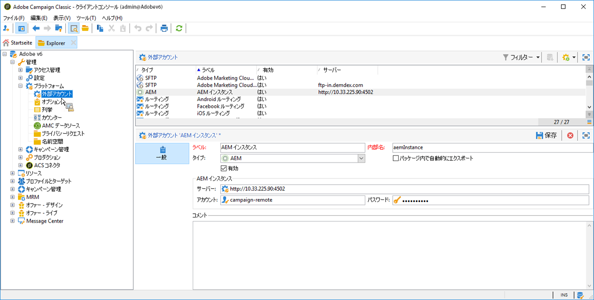 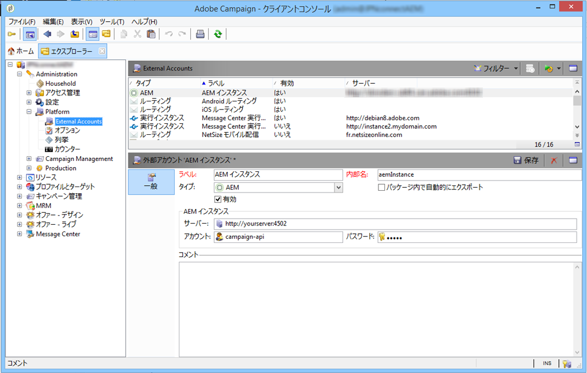

1. 「**有効**」チェックボックスが選択されていることを確認します。

### AEMResourceTypeFilter オプションの検証 {#verifying-the-aemresourcetypefilter-option}

「**AEMResourceTypeFilter**」オプションを使用すると、Adobe Campaign で使用できる AEM リソースのタイプをフィルタリングできます。これにより、Adobe Campaignは、Adobe Campaignでのみ使用するように特別に設計されたAEMコンテンツを取得できます。

このオプションは事前に設定されているはずです。ただし、このオプションを変更すると、統合が機能しなくなる場合があります。

**AEMResourceTypeFilter** オプションが設定されていることを検証するには：

1. **プラットフォーム**／**オプション**&#x200B;に移動します。
1. 「**AEMResourceTypeFilter**」オプションで、パスが正しいことをチェックします。このフィールドには、次の値が含まれている必要があります。

   **mcm/campaign/components/newsletter,mcm/campaign/components/campaign_newsletterpage,mcm/neolane/components/newsletter**

   また、場合によっては、この値は次のようになります。

   **mcm/campaign/components/newsletter**

   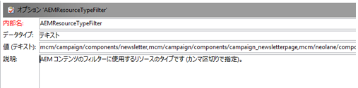

## Adobe Experience Managerの設定 {#configuring-adobe-experience-manager}

AEMを設定するには、次の手順を実行する必要があります。

* インスタンス間のレプリケーションを設定します。
* Cloud Services経由でAEMをAdobe Campaignに接続します。
* Externalizer を設定します。

### AEMインスタンス間のレプリケーションの設定 {#configuring-replication-between-aem-instances}

AEMオーサリングインスタンスから作成されたコンテンツは、最初にパブリッシュインスタンスに送信されます。 ニュースレター内の画像をパブリッシュインスタンスとニュースレターの受信者で利用できるようにするには、公開する必要があります。 そのため、AEMオーサリングインスタンスからAEMパブリッシュインスタンスにレプリケートするようにレプリケーションエージェントを設定する必要があります。

>[!NOTE]
>
>レプリケーション URL を使用せずに公開 URL を使用する場合は、OSGi で次のように&#x200B;**公開 URL** を設定できます（**AEM のロゴ**／「**ツール**」アイコン／**運用**／**Web コンソール**／**OSGi 設定**／**AEM Campaign 統合 - 設定**）。
**公開 URL：** com.day.cq.mcm.campaign.impl.IntegrationConfigImpl#aem.mcm.campaign.publicUrl

また、この手順は、あるオーサーインスタンス設定をパブリッシュインスタンスにレプリケートするためにも必要です。

AEMインスタンス間のレプリケーションを設定するには：

1. オーサーインスタンスで、**AEM のロゴ**／「**ツール**」アイコン／**導入**／**レプリケーション**／**作成者のエージェント**&#x200B;を選択し、「**デフォルトエージェント**」をクリックします。

   

   >[!NOTE]
   パブリッシュおよびオーサーインスタンスが両方とも同じコンピューターにある場合を除いて、Adobe Campaign との統合を設定する際に、localhost（これは、AEM のローカルコピーです）を使用するのを回避します。

1. 「**編集**」をタップまたはクリックして、「**トランスポート**」タブを選択します。
1. **localhost** を IP アドレスまたは AEM パブリッシュインスタンスのアドレスに置き換えることで、URI を設定します。

   

### AEMとAdobe Campaignの接続 {#connecting-aem-to-adobe-campaign}

AEMとAdobe Campaignを一緒に使用する前に、両方のソリューションが通信できるように両方のソリューション間のリンクを確立する必要があります。

1. AEMオーサリングインスタンスに接続します。
1. **AEM のロゴ**／「**ツール**」アイコン&#x200B;**／導入**／**クラウドサービス**&#x200B;を選択して、Adobe Campaign セクションの「**今すぐ設定**」を選択します。

   

1. 「**タイトル**」にタイトルを入力して「**作成**」をクリックするか、Adobe Campaign インスタンスとリンクしたい既存の設定を選択することで、新しい設定を作成します。
1. 設定を編集して、Adobe Campaign インスタンスのパラメーターと一致するようにします。

   * **ユーザー名**：**aemserver**（2 つのソリューション間のリンクを確立するために使用される Adobe Campaign AEM 統合パッケージ演算子）。
   * **パスワード**:Adobe Campaign aemserver オペレーターのパスワード。 このオペレーターのパスワードをAdobe Campaignで直接再指定する必要がある場合があります。
   * **API エンドポイント**:Adobe Campaignインスタンス URL。

1. 「**Adobe Campaign に接続**」を選択し、「**OK**」をクリックします。

   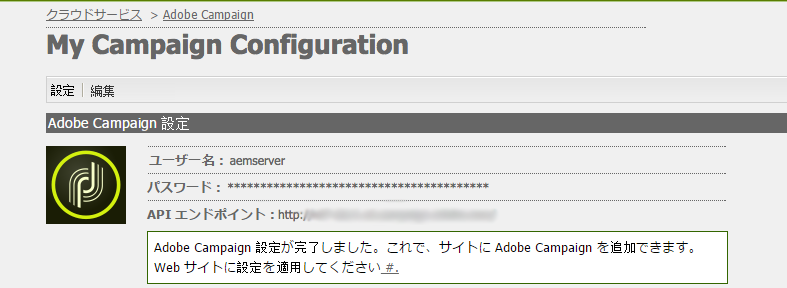

   >[!NOTE]
   [メールを作成して公開](/help/sites-authoring/campaign.md)したら、パブリッシュインスタンスに設定を再公開する必要があります。

   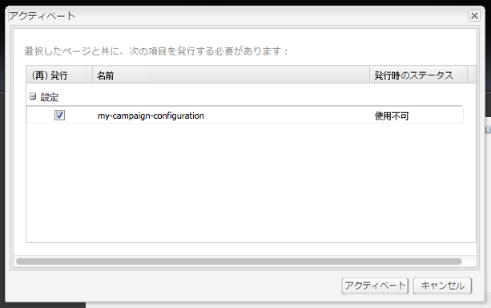

>[!NOTE]
接続に失敗した場合は、次の点を確認してください。
* Adobe Campaignインスタンス (https) へのセキュア接続を使用する際、証明書の問題が発生する場合があります。 Adobe Campaign インスタンスの証明書を AEM インスタンスの JDK の **cacerts** ファイルに追加する必要があります。
* セキュリティゾーンは、Adobe Campaign の [aemserver 演算子](#connecting-aem-to-adobe-campaign)用に設定される必要があります。さらに、**serverConf.xml** ファイルで、セキュリティゾーンの **allowUserPassword** 属性を **true** に設定し、ログイン／パスワードモードを使用して Adobe Campaign への AEM の接続を認証する必要があります。
>
また、 [AEM/Adobe Campaign統合のトラブルシューティング](/help/sites-administering/troubleshooting-campaignintegration.md).

### Externalizer の設定 {#configuring-the-externalizer}

以下が必要です。 [externalizer を設定する](/help/sites-developing/externalizer.md) ( オーサーインスタンス上のAEMで )。 Externalizer は、リソースパスを外部 URL および絶対 URL に変換できる OSGi サービスです。 このサービスは、これらの外部 URL を設定して構築するための一元的な場所を提供します。

一般的な指示については、[Externalizer の設定](/help/sites-developing/externalizer.md)を参照してください。Adobe Campaign 統合について、`https://<host>:<port>/system/console/configMgr/com.day.cq.commons.impl.ExternalizerImpl` の公開サーバーが `localhost:4503` ではなく、Adobe Campaign コンソールが到達可能なサーバーを指すように設定していることを確認してください。

`localhost:4503` または Adobe Campaign が到達できない別のサーバーを指している場合、Adobe Campaign コンソールに画像が表示されません。


## 高度な設定 {#advanced-configurations}

また、次のような高度な設定も実行できます。

* パーソナライゼーションフィールドとパーソナライゼーションブロックを管理します。
* パーソナライゼーションブロックを非アクティブ化します。
* ターゲット拡張機能データを管理します。

### パーソナライゼーションフィールドとパーソナライゼーションブロックの管理 {#managing-personalization-fields-and-blocks}

AEMでパーソナライゼーションを E メールコンテンツに追加できるフィールドとブロックは、Adobe Campaignで管理されます。

デフォルトのリストが提供されますが、変更できます。 パーソナライゼーションフィールドやパーソナライゼーションブロックを追加または非表示にすることもできます。

#### パーソナライゼーションフィールドの追加 {#adding-a-personalization-field}

新しいパーソナライゼーションフィールドを既に利用可能なフィールドに追加するには、次のように Adobe Campaign の **nms:seedMember** スキーマを拡張する必要があります。

>[!CAUTION]
追加する必要があるフィールドは、受信者スキーマ拡張（**nms:受信者**）で既に追加されている必要があります。詳しくは、[設定](https://docs.campaign.adobe.com/doc/AC6.1/en/CFG_Editing_schemas_Editing_schemas.html)ガイドを参照してください。

1. Adobe Campaign のナビゲーションで、**管理**／**設定**／**データスキーマ**&#x200B;ノードに移動します。
1. 「**新規**」を選択します。

   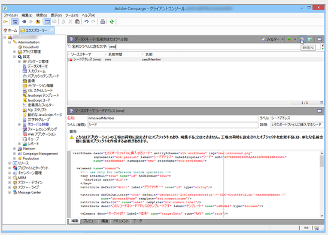

1. ポップアップウィンドウで「**拡張スキーマを使用してテーブルのデータを拡張する**」を選択し、「**次へ**」をクリックします。

   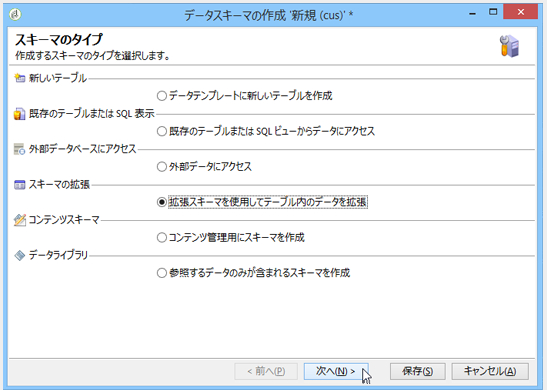

1. 拡張されたスキーマの別のパラメーターを入力します。

   * **スキーマ**：**nms:seedMember** スキーマを選択します。ウィンドウ内のその他のフィールドは、自動的に入力されます。
   * **名前空間**:拡張スキーマの名前空間をパーソナライズします。

1. スキーマの XML コードを編集して、そこに追加したいフィールドを指定します。Adobe Campaign のスキーマ拡張について詳しくは、[設定ガイド](https://docs.campaign.adobe.com/doc/AC6.1/en/CFG_Editing_schemas_Extending_a_schema.html)を参照してください。
1. スキーマを保存してから、コンソールの&#x200B;**ツール**／**詳細**／**データベース構造を更新**&#x200B;メニューで、Adobe Campaign データベース構造を更新します。
1. 変更を保存するために、Adobe Campaign コンソールを切断してから再接続します。AEM で利用可能なパーソナライゼーションフィールドのリストに新しいフィールドが表示されます。

#### 例 {#example}

「**登録番号**」フィールドを追加するには、次の要素が必要です。

* 次を含む **cus:recipient** という名前の **nms:recipient** スキーマ拡張：

```xml
<element desc="Recipient table (profiles)" img="nms:recipient.png" label="Recipients" labelSingular="Recipient" name="recipient">

  <attribute dataPolicy="smartCase" desc="Recipient registration number" 
  label="Registration Number"
  length="50" name="registrationNumber" type="string"/>

</element>
```

次を含む **cus:seedMember** という名前の **nms:seedMember** スキーマ拡張：

```xml
<element desc="Seed to insert in the export files" img="nms:unknownad.png" label="Seed addresses" labelSingular="Seed" name="seedMember">

  <element name="custom_nms_recipient">
    <attribute name="registrationNumber" 
    template="cus:recipient:recipient/@registrationNumber"/>
  </element>

</element>
```

「**登録番号**」フィールドが、利用可能なパーソナライゼーションフィールドに含まれるようになります。

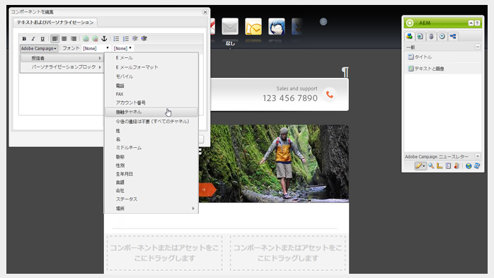

#### パーソナライゼーションフィールドを非表示にする {#hiding-a-personalization-field}

パーソナライゼーションフィールドを既に利用可能なフィールドの中から非表示にするには、[パーソナライゼーションフィールドの追加](#adding-a-personalization-field)の節で説明しているとおり、Adobe Campaign の **nms:seedMember** スキーマを拡張する必要があります。次の手順を適用します。

1. 拡張されたスキーマの **nms:seedMember** スキーマから取得したいフィールドをコピーします（例：**cus:seedMember**）。
1. **advanced=&quot;true&quot;** XML 属性をフィールドに追加します。AEM で利用可能なパーソナライゼーションフィールドのリストに表示されなくなります。

   例えば「**ミドルネーム**」フィールドを非表示にするには、**cud:seedMember** スキーマに次の要素を含める必要があります。

   ```xml
   <element desc="Seed to insert in the export files" img="nms:unknownad.png" label="Seed addresses" labelSingular="Seed" name="seedMember">
   
     <element name="custom_nms_recipient">
       <attribute advanced="true" name="middleName"/>
     </element>
   
   </element>
   ```

### パーソナライゼーションブロックの非アクティブ化 {#deactivating-a-personalization-block}

使用可能なパーソナライゼーションブロックの中からパーソナライゼーションブロックを非アクティブにするには：

1. Adobe Campaign のナビゲーションで、**リソース**／**キャンペーン管理**／**パーソナライゼーションブロック**&#x200B;ノードに移動します。
1. AEM でアクティベートを解除したいパーソナライゼーションブロックを選択します。
1. 「**カスタマイズメニューに表示**」チェックボックスをオフにして、変更を保存します。ブロックが、Adobe Campaign で利用可能なパーソナライゼーションブロックのリストに表示されなくなります。

   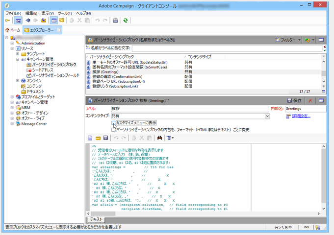

### ターゲット拡張データの管理 {#managing-target-extension-data}

また、パーソナライゼーション用にターゲット式データを挿入することもできます。 Target 拡張機能データ（「Target データ」とも呼ばれます）は、例えば、キャンペーンワークフロー内のクエリでデータをエンリッチメントまたは追加することに由来します。 詳しくは、[クエリの作成](https://docs.campaign.adobe.com/doc/AC/en/PTF_Creating_queries_About_queries_in_Campaign.html)および[データの機能強化](https://docs.campaign.adobe.com/doc/AC/en/WKF_Use_cases_Enriching_data.html)の節を参照してください。

>[!NOTE]
ターゲットにあるデータは、AEM コンテンツが Adobe Campaign 配信と同期されている場合にのみ利用できます。[AEM で作成されたコンテンツと Adobe Campaign の配信の同期](/help/sites-authoring/campaign.md#synchronizing-content-created-in-aem-with-a-delivery-from-adobe-campaign-classic)を参照してください。

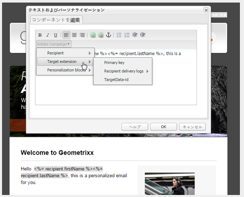
