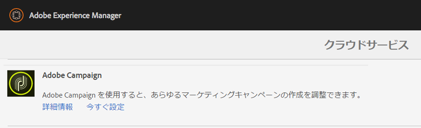

# Adobe Campaign Classic との統合{#integrating-with-adobe-campaign-classic}

>[!NOTE]
>
>このドキュメントでは、AEM をオンプレミスソリューションの Adobe Campaign Classic と統合する方法について説明します。Adobe Campaign Standard を使用している場合の指示については、[Adobe Campaign Standard との統合](/help/sites-administering/campaignstandard.md)を参照してください。

Adobe Campaign を使用すると、電子メール配信コンテンツおよびフォームを Adobe Experience Manager で直接管理できます。

両方のソリューションを同時に使用するには、最初に互いに接続するように設定する必要があります。これには、Adobe Campaign と Adobe Experience Manager の両方での設定手順が含まれます。これらの手順は、このドキュメントで詳しく説明します。

AEM での Adobe Campaign の操作には、Adobe Campaign を使用して電子メールを送信する機能が含まれています。これについては [Adobe Campaign の操作](/help/sites-authoring/campaign.md)で説明します。また、AEM ページのフォームを使用したデータの操作も含まれます。

さらに、AEM を [Adobe Campaign](https://helpx.adobe.com/jp/support/campaign/classic.html) と統合する際に参考となるトピックを次に示します。

* [電子メールテンプレートのベストプラクティス](/help/sites-administering/best-practices-for-email-templates.md)
* [Adobe Campaign 統合に関するトラブルシューティング](/help/sites-administering/troubleshooting-campaignintegration.md)

Adobe Campaign との統合を拡張する場合は、次のページが参考になります。

* [カスタム拡張の作成](/help/sites-developing/extending-campaign-extensions.md)
* [カスタムフォームマッピングの作成](/help/sites-developing/extending-campaign-form-mapping.md)

## AEM と Adobe Campaign の統合ワークフロー {#aem-and-adobe-campaign-integration-workflow}

ここでは、キャンペーンを作成し、コンテンツを配信する際の AEM と Adobe Campaign の間の一般的なワークフローについて説明します。

一般的なワークフローには、次が含まれます。詳細について説明します。

1. （Adobe Campaign と AEM で）キャンペーンの構築を開始します。
1. コンテンツをリンクして配信する前に、AEM でコンテンツをパーソナライズして、Adobe Campaign で配信を作成します。
1. Adobe Campaign で、コンテンツをリンクして配信します。

### キャンペーンの作成の開始 {#start-building-your-campaign}

キャンペーンの作成は、いつでも開始できます。コンテンツをリンクする前は、AEM と AC は独立しています。つまり、マーケティング担当者は、キャンペーンの作成およびターゲティングを Adobe Campaign で開始でき、同時にコンテンツ作成者は、AEM でデザインに取り組むことができます。

### コンテンツのリンクおよび配信の前に {#before-linking-content-and-delivery}

コンテンツをリンクして配信メカニズムを作成する前に、次の手順を実行する必要があります。

**AEM で**

* **テキストおよびパーソナライゼーション**&#x200B;コンポーネントのパーソナライゼーションフィールドを使用してパーソナライズする

**Adobe Campaign で**

* **aemContent** タイプの配信を作成する

### コンテンツのリンクと配信の設定 {#linking-content-and-setting-delivery}

リンクおよび配信用のコンテンツを用意したら、コンテンツのリンク方法とリンク先を決めます。

これらのすべての手順は、Adobe Campaign で完了します。

1. どの AEM インスタンスを使用するかを指定します。
1. 「同期」ボタンをクリックして、コンテンツを同期します。
1. コンテンツピッカーを開いて、コンテンツを選択します。

### AEM を初めて使用する場合 {#if-you-are-new-to-aem}

AEM を初めて使用する場合は、AEM を理解するのに次のリンクが参考になります。

* [AEM の開始](/help/sites-deploying/deploy.md)
* [レプリケーションエージェントの概要](/help/sites-deploying/replication.md)
* [ログファイルの検索と使用](/help/sites-deploying/monitoring-and-maintaining.md#working-with-audit-records-and-log-files)
* [AEM プラットフォームの概要](/help/sites-deploying/platform.md)

## Adobe Campaign の設定 {#configuring-adobe-campaign}

Adobe Campaign の設定には、次が含まれます。

1. AEM 統合パッケージの Adobe Campaign へのインストール。
1. 外部アカウントの設定。
1. AEMResourceTypeFilter が正しく設定されていることの検証。

さらに、ユーザーが設定可能な次のような高度な設定があります。

* コンテンツブロックの管理
* パーソナライゼーションフィールドの管理

[高度な設定](#advanced-configurations)を参照してください。

>[!NOTE]
>
>これらの操作を実行するには、 **管理** Adobe Campaignでの役割

### 前提条件 {#prerequisites}

事前に、次の要素があることを確認してください。

* [AEM 作成者インスタンス](/help/sites-deploying/deploy.md#getting-started)
* [AEM 発行インスタンス](/help/sites-deploying/deploy.md#author-and-publish-installs)
* [Adobe Campaign Classicインスタンス](https://helpx.adobe.com/support/campaign/classic.html)  — クライアントとサーバーを含む
* Internet Explorer 11

>[!NOTE]
>
>Adobe Campaign Classicビルド 8640 より前のバージョンを実行している場合は、 [アップグレードドキュメント](https://docs.campaign.adobe.com/doc/AC6.1/en/PRO_Updating_Adobe_Campaign_Upgrading.html) を参照してください。 クライアントとデータベースの両方を同じビルドにアップグレードする必要があります。

>[!CAUTION]
>
>操作の詳細については、 [Adobe Campaignの設定](#configuring-adobe-campaign) および [Adobe Experience Managerの設定](#configuring-adobe-experience-manager) 「 」セクションは、AEMとAdobe Campaignの間の統合機能が正しく動作するために必要です。

### AEM 統合パッケージのインストール {#installing-the-aem-integration-package}

次をインストールする必要があります： **AEM統合** Adobe Campaignにパッケージ化。 次の手順を実行します。

1. AEM とリンクしたい Adobe Campaign インスタンスに移動します。
1. 選択 *ツール* > *詳細* > *パッケージをインポート…*.

   

1. クリック **標準パッケージのインストール**&#x200B;を選択し、 **AEM統合** パッケージ。

   

1. クリック **次へ**、 **開始**.

   このパッケージには、 **aemserver** AEMサーバーをAdobe Campaignに接続するために使用されるオペレーター。

   >[!CAUTION]
   >
   >デフォルトでは、この演算子には、セキュリティゾーンは設定されていません。AEM を使用して Adobe Campaign に接続するには、これを選択する必要があります。
   >
   >内 **serverConf.xml** ファイル、 **allowUserPassword** 選択したセキュリティゾーンの属性をに設定する必要があります **true** ログイン/パスワードでAEMがAdobe Campaignに接続することを許可する場合
   >
   >セキュリティの問題を回避するために、AEM 専用のセキュリティゾーンを作成することを強くお勧めします。詳しくは、 [インストールガイド](https://docs.campaign.adobe.com/doc/AC/en/INS_Additional_configurations_Configuring_Campaign_server.html).

   

### AEM 外部アカウントの設定 {#configuring-an-aem-external-account}

Adobe Campaign を AEM インスタンスに接続可能な外部アカウントを設定する必要があります。

>[!NOTE]
>
>* をインストールする際 **AEM統合** パッケージの場合は、外部AEMアカウントが作成されます。 そこから AEM インスタンスへの接続を設定するか、新しいものを作成できます。
>* AEM で、campaign-remote ユーザーのパスワードを設定してください。AEM で Adobe Campaign に接続するにはこのパスワードを設定する必要があります。管理者としてログインし、ユーザー管理コンソールで campaign-remote ユーザーを探して「**パスワードを設定**」をクリックします。

>


外部 AEM アカウントを設定するには：

1. 次に移動： **管理** > **Platform** > **外部アカウント** ノード。
1. 新しい外部アカウントを作成し、 **AEM** タイプ。
1. AEM オーサーインスタンスのアクセスパラメーター（サーバーアドレスと、このインスタンスに接続するために使用される ID およびパスワード）を入力します。campaign-api ユーザーアカウントのパスワードは、AEM で campaign-remote user に設定したパスワードと同じです。

   >[!NOTE]
   >
   >サーバーアドレスは、末尾がスラッシュで&#x200B;**終わらない**&#x200B;ようにします。例えば、 `https://yourserver:4502` の代わりに `https://yourserver:4502/`

    

1. 必ず **有効** チェックボックスがオンになっている。

### AEMResourceTypeFilter オプションの検証 {#verifying-the-aemresourcetypefilter-option}

この **AEMResourceTypeFilter** オプションは、Adobe Campaignで使用できるAEMリソースのタイプをフィルタリングするために使用します。 これにより、Adobe Campaign でのみ使用されるように特別に設計された AEM コンテンツを Adobe Campaign で取得できます。

このオプションは、事前設定されている必要があります。ただし、このオプションを変更すると、統合が機能しなくなる可能性があります。

**AEMResourceTypeFilter** オプションが設定されていることを検証するには：

1. **プラットフォーム**／**オプション**&#x200B;に移動します。
1. 内 **AEMResourceTypeFilter** 」オプションを選択し、パスが正しいことを確認します。 このフィールドには、次の値が含まれている必要があります。

   **mcm/campaign/components/newsletter,mcm/campaign/components/campaign_newsletterpage,mcm/neolane/components/newsletter**

   また、場合によっては、この値は次のようになります。

   **mcm/campaign/components/newsletter**

   

## Adobe Experience Manager の設定 {#configuring-adobe-experience-manager}

AEM を設定するには、次の手順を実行する必要があります。

* インスタンス間のレプリケーションを設定します。
* クラウドサービスを使用して、AEM を Adobe Campaign に接続します。
* Externalizer を設定します。

### AEM インスタンス間のレプリケーションの設定 {#configuring-replication-between-aem-instances}

AEM オーサーインスタンスから作成されたコンテンツは、最初にパブリッシュインスタンスに送信されます。ニュースレターの画像をパブリッシュインスタンスで利用でき、ニュースレター受信者が入手できるように、公開する必要があります。レプリケーションエージェントは、その結果として、AEM オーサーインスタンスから AEM パブリッシュインスタンスにレプリケートするように設定される必要があります。

>[!NOTE]
>
>レプリケーション URL を使用せずに、公開 URL を使用する場合は、 **パブリック URL** OSGi の次の設定 (**AEMロゴ** >  **ツール** アイコン/  **運用** > **Web コンソール** > **OSGi 設定** > **AEM Campaign の統合 — 設定**):
**パブリック URL :** com.day.cq.mcm.campaign.impl.IntegrationConfigImpl#aem.mcm.campaign.publicUrl

また、この手順は、あるオーサーインスタンス設定をパブリッシュインスタンスにレプリケートするためにも必要です。

AEM インスタンス間のレプリケーションを設定するには：

1. オーサーインスタンスから、 **AEMロゴ**> **ツール** アイコン/ **導入** > **レプリケーション** > **作成者のエージェント**&#x200B;を選択し、「 **デフォルトエージェント**.

   

   >[!NOTE]
   パブリッシュおよびオーサーインスタンスが両方とも同じコンピューターにある場合を除いて、Adobe Campaign との統合を設定する際に、localhost（これは、AEM のローカルコピーです）を使用するのを回避します。

1. タップまたはクリック **編集** 次に、 **輸送** タブをクリックします。
1. **localhost** を IP アドレスまたは AEM パブリッシュインスタンスのアドレスに置き換えることで、URI を設定します。

   

### AEM から Adobe Campaign への接続 {#connecting-aem-to-adobe-campaign}

AEM と Adobe Campaign を一緒に使用する前に、両方のソリューション間のリンクを確立して、通信できるようにする必要があります。

1. AEM オーサーインスタンスに接続します。
1. 選択 **AEMロゴ** > **ツール** アイコン/ **導入** > **Cloud Services**&#x200B;を、 **今すぐ設定** (「 Adobe Campaign 」セクション内 )

   

1. 新しい設定を作成するには、 **タイトル** をクリックし、 **作成**&#x200B;または、Adobe Campaignインスタンスにリンクする既存の設定を選択します。
1. 設定を編集して、Adobe Campaign インスタンスのパラメーターと一致するようにします。

   * **ユーザー名**: **aemserver**:2 つのソリューション間のリンクを確立するために使用されるAdobe Campaign AEM Integration package 演算子です。
   * **パスワード**：Adobe Campaign aemserver 演算子のパスワード。この演算子のパスワードを Adobe Campaign で直接再指定する必要があることがあります。
   * **API エンドポイント**：Adobe Campaign インスタンス URL。

1. 選択 **Adobe Campaignに接続** をクリックし、 **OK**.

   

   >[!NOTE]
   [電子メールを作成して公開](/help/sites-authoring/campaign.md)したら、パブリッシュインスタンスに設定を再公開する必要があります。

   

>[!NOTE]
接続に失敗する場合は、次を確認してください。
* Adobe Campaign インスタンスへのセキュリティで保護された接続（https）を使用する際、証明書の問題が発生する可能性があります。Adobe Campaignインスタンス証明書を **cacerts** AEMインスタンスの JDK のファイル。
* セキュリティゾーンは、Adobe Campaign の [aemserver 演算子](#connecting-aem-to-adobe-campaign)用に設定される必要があります。さらに、 **serverConf.xml** ファイル、 **allowUserPassword** セキュリティゾーンの属性をに設定する必要があります **true** ログイン/パスワードモードを使用してAdobe CampaignへのAEM接続を許可する場合。
また、[AEM／Adobe Campaign 統合のトラブルシューティング](/help/sites-administering/troubleshooting-campaignintegration.md)も参照してください。

### Externalizer の設定 {#configuring-the-externalizer}

オーサーインスタンスの AEM に [Externalizer を設定](/help/sites-developing/externalizer.md)する必要があります。Externalizer は、リソースパスを外部 URL および絶対 URL に変換できる OSGi サービスです。このサービスは、これらの外部 URL を設定および構築するための一元化された場所を提供します。

一般的な指示については、[Externalizer の設定](/help/sites-developing/externalizer.md)を参照してください。Adobe Campaign統合の場合、次の場所でパブリッシュサーバーを設定していることを確認します。 `https://<host>:<port>/system/console/configMgr/com.day.cq.commons.impl.ExternalizerImpl`指していない `localhost:4503` Adobe Campaignコンソールから到達可能なサーバーに送信する必要があります。

`localhost:4503` または Adobe Campaign が到達できない別のサーバーを指している場合、Adobe Campaign コンソールに画像が表示されません。


## 高度な設定 {#advanced-configurations}

また、次のような高度な設定を実行できます。

* パーソナライゼーションフィールドおよびブロックの管理。
* パーソナライゼーションブロックのアクティベート解除。
* ターゲット拡張データの管理。

### パーソナライゼーションフィールドおよびブロックの管理 {#managing-personalization-fields-and-blocks}

パーソナライゼーションを AEM の電子メールコンテンツに追加可能なフィールドおよびブロックは、Adobe Campaign で管理されます。

デフォルトのリストは提供されますが、変更できます。また、パーソナライゼーションフィールドおよびブロックを追加または非表示にすることができます。

#### パーソナライゼーションフィールドの追加 {#adding-a-personalization-field}

既に利用可能なパーソナライゼーションフィールドに新しいパーソナライゼーションフィールドを追加するには、Adobe Campaignを拡張する必要があります **nms:seedMember** スキーマを次に示します。

>[!CAUTION]
追加する必要があるフィールドは、受信者スキーマ拡張（**nms:受信者**）で既に追加されている必要があります。詳しくは、 [設定](https://docs.campaign.adobe.com/doc/AC6.1/en/CFG_Editing_schemas_Editing_schemas.html) ガイド。

1. 次に移動： **管理** > **設定** > **データスキーマ** ノード (Adobe Campaignナビゲーション内 )
1. 選択 **新規**.

   

1. ポップアップウィンドウで、 **拡張スキーマを使用してテーブル内のデータを拡張する** をクリックし、 **次へ**.

   

1. 拡張されたスキーマの別のパラメーターを入力します。

   * **スキーマ**:を選択します。 **nms:seedMember** スキーマ。 ウィンドウのその他のフィールドは、自動的に入力されます。
   * **名前空間**：拡張されたスキーマの名前空間をパーソナライズします。

1. スキーマの XML コードを編集して、そこに追加したいフィールドを指定します。Adobe Campaignでのスキーマの拡張について詳しくは、 [設定ガイド](https://docs.campaign.adobe.com/doc/AC6.1/en/CFG_Editing_schemas_Extending_a_schema.html).
1. スキーマを保存し、 **ツール** > **詳細** > **データベース構造を更新** メニューを使用します。
1. 変更を保存するために、Adobe Campaign コンソールを切断してから再接続します。AEM で利用可能なパーソナライゼーションフィールドのリストに新しいフィールドが表示されます。

#### 例 {#example}

を追加するには、以下を実行します。 **登録番号** フィールドには、次の要素が必要です。

* この **nms:recipient** 名前の付いたスキーマ拡張 **cus:recipient** 次を含む：

```xml
<element desc="Recipient table (profiles)" img="nms:recipient.png" label="Recipients" labelSingular="Recipient" name="recipient">

  <attribute dataPolicy="smartCase" desc="Recipient registration number" 
  label="Registration Number"
  length="50" name="registrationNumber" type="string"/>

</element>
```

この **nms:seedMember** 名前の付いたスキーマ拡張 **cus:seedMember** 次を含む：

```xml
<element desc="Seed to insert in the export files" img="nms:unknownad.png" label="Seed addresses" labelSingular="Seed" name="seedMember">

  <element name="custom_nms_recipient">
    <attribute name="registrationNumber" 
    template="cus:recipient:recipient/@registrationNumber"/>
  </element>

</element>
```

この **登録番号** フィールドは、使用可能なパーソナライゼーションフィールドの一部になりました。


#### パーソナライゼーションフィールドを非表示にする {#hiding-a-personalization-field}

既に使用可能なパーソナライゼーションフィールドの中からパーソナライゼーションフィールドを非表示にするには、Adobe Campaign **nms:seedMember** スキーマの詳細は、 [パーソナライゼーションフィールドの追加](#adding-a-personalization-field) 」セクションに入力します。 次の手順を適用します。

1. 拡張されたスキーマの **nms:seedMember** スキーマから取得したいフィールドをコピーします（例：**cus:seedMember**）。
1. を **advanced=&quot;true&quot;** フィールドの XML 属性。 AEM で利用可能なパーソナライゼーションフィールドのリストに表示されなくなります。

   例えば、 **ミドルネーム** フィールド、 **cud:seedMember** スキーマには次の要素が含まれている必要があります。

   ```xml
   <element desc="Seed to insert in the export files" img="nms:unknownad.png" label="Seed addresses" labelSingular="Seed" name="seedMember">
   
     <element name="custom_nms_recipient">
       <attribute advanced="true" name="middleName"/>
     </element>
   
   </element>
   ```

### パーソナライゼーションブロックのアクティベート解除 {#deactivating-a-personalization-block}

利用可能なもののパーソナライゼーションブロックのアクティベートを解除するには：

1. 次に移動： **リソース** > **キャンペーン管理** > **パーソナライゼーションブロック** ノード (Adobe Campaignナビゲーション内 )
1. AEM でアクティベートを解除したいパーソナライゼーションブロックを選択します。
1. をクリア **カスタマイズメニューに表示** チェックボックスをオンにして、変更を保存します。 ブロックが、Adobe Campaign で利用可能なパーソナライゼーションブロックのリストに表示されなくなります。

   

### ターゲット拡張データの管理 {#managing-target-extension-data}

パーソナライゼーション用にターゲット拡張データを挿入することもできます。ターゲット拡張データ（「Target データ」とも呼ばれる）は、例えば、キャンペーンワークフローのクエリのデータを機能強化または追加することに由来します。詳しくは、 [クエリの作成](https://docs.campaign.adobe.com/doc/AC/en/PTF_Creating_queries_About_queries_in_Campaign.html) および [データのエンリッチメント](https://docs.campaign.adobe.com/doc/AC/en/WKF_Use_cases_Enriching_data.html) セクション。

>[!NOTE]
ターゲットにあるデータは、AEM コンテンツが Adobe Campaign 配信と同期されている場合にのみ利用できます。詳しくは、 [AEMで作成されたコンテンツとAdobe Campaignからの配信の同期](/help/sites-authoring/campaign.md#synchronizing-content-created-in-aem-with-a-delivery-from-adobe-campaign-classic).


