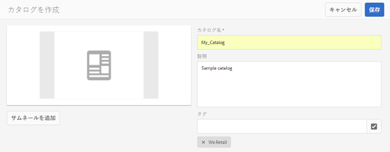
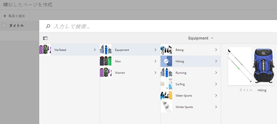
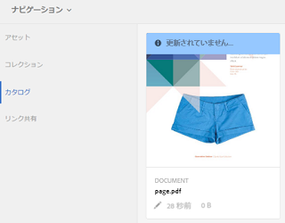
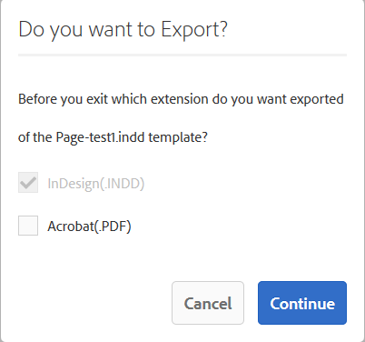
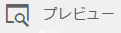

# カタログ作成機能{#catalog-producer}

AEM Assets のカタログ作成機能で、デジタルアセットを使用して製品カタログを生成する方法を学びます。

Adobe Experience Manager（AEM）Assets のカタログ作成機能を使用すると、InDesign アプリケーションから読み込んだ InDesign テンプレートを使用して、ブランドの製品のカタログを作成できます。InDesignテンプレートを読み込むには、まずAEM AssetsをInDesignサーバーと統合します。

## InDesign サーバーとの統合 {#integrating-with-indesign-server}

統合プロセスの一環として、 **DAM アセットの更新** ワークフロー (InDesignとの統合に適しています ) さらに、InDesign サーバーのプロキシワーカーを設定します。詳しくは、 [AEM AssetsとInDesign Serverの統合](/help/assets/indesign.md).

>[!NOTE]
>
>AEM Assets に読み込む前に、InDesign ファイルから InDesign テンプレートを生成できます。詳しくは、[ファイルとテンプレートを使用した作業](https://helpx.adobe.com/jp/indesign/using/files-templates.html)を参照してください。
>
>InDesign テンプレートの要素を XML タグにマッピングできます。マップされたタグは、カタログ作成機能で商品のプロパティをテンプレートのプロパティにマップした際に、プロパティとして表示されます。XML タグ付けについては、「InDesignファイル」を参照してください。 [XML のコンテンツのタグ付け](https://helpx.adobe.com/jp/indesign/using/tagging-content-xml.html).

>[!NOTE]
>
>InDesign ファイル（.indd）のみがテンプレートとして使用されます。拡張子が .indt のファイルはサポートされていません。

## カタログの作成 {#creating-a-catalog}

カタログ作成機能は、商品情報管理（PIM）データを使用して、テンプレートに表示される XML プロパティで製品プロパティをマッピングします。カタログを作成するには、次の手順を実行します。

1. Assets ユーザーインターフェイスで、 **AEMロゴ**&#x200B;をクリックし、に移動します。 **アセット/カタログ**.
1. 内 **カタログ** ページ、タップまたはクリック **作成** ツールバーで、 **カタログ** を選択します。
1. 内 **カタログを作成** ページで、カタログの名前と説明（オプション）を入力し、タグを指定します（存在する場合）。 また、カタログのサムネール画像を追加できます。

   

1. 「**保存**」をタップまたはクリックします。カタログが作成されたことを示す確認ダイアログが表示されます。タップまたはクリック **完了** をクリックしてダイアログを閉じます。
1. 作成したカタログを開くには、 **カタログ** ページ。

   >[!NOTE]
   >
   >カタログを開くには、 **開く** （前の手順で説明した確認ダイアログ）

1. カタログにページを追加するには、をタップまたはクリックします **作成** ツールバーで、 **新しいページ** オプション。
1. ウィザードで、ページに使用する InDesign テンプレートを選択します。次に、をタップまたはクリックします。 **次へ**.
1. ページの名前とオプションの説明を指定します。タグを指定します（ある場合）。
1. 次をタップまたはクリックします。 **作成** をクリックします。 次に、をタップまたはクリックします。 **開く** ダイアログから。 製品のプロパティが左側のウィンドウに表示されます。InDesign テンプレートの定義済みプロパティが右側のウィンドウに表示されます。
1. 左側のウィンドウから製品プロパティを InDesign テンプレートプロパティにドラッグして、それらの間のマッピングを作成します。

   ページがリアルタイムでどのように表示されるかを確認するには、 **プレビュー** 」タブをクリックします。

1. さらにページを作成するには、手順 6～9 を繰り返します。他の製品用に類似したページを作成するには、ページを選択し、 **類似したページを作成** アイコンをクリックします。

   

   >[!NOTE]
   >
   >類似の構造を持つ製品に対してのみ類似したページを作成できます。

   追加アイコンをタップまたはクリックし、製品ピッカーから商品を選択して、ツールバーの「**選択**」をタップまたはクリックします。

   

1. ツールバーで、「 」をクリックまたはタップします。 **作成**. タップまたはクリック **完了** をクリックしてダイアログを閉じます。 類似したページがカタログに含まれます。
1. 既存のInDesignファイルをカタログに追加するには、をタップまたはクリックします **作成** ツールバーで、 **既存のページに追加** オプション。
1. InDesignファイルを選択し、 **追加** をクリックします。 次に、をタップまたはクリックします。 **OK** をクリックしてダイアログを閉じます。

   カタログページで参照する商品のメタデータを変更した場合、変更内容はカタログページに自動的には反映されません。 ラベル付きのバナー **古い** を参照するカタログページ内の商品画像に表示し、参照される商品のメタデータが最新でないことを示します。

   

   製品画像に最新のメタデータの変更が反映されるようにするには、カタログコンソールでページを選択し、「 **ページを更新** アイコンをクリックします。

   

   >[!NOTE]
   >
   >参照元の製品のメタデータを変更するには、製品コンソール (**AEMロゴ** > **コマース** > **製品**) をクリックし、製品を選択します。 次に、 **プロパティを表示** アイコンをクリックし、アセットのプロパティページでメタデータを編集します。

1. カタログ内のページを並べ替えるには、 **作成** ツールバーのアイコンをクリックし、「 」を選択します。 **結合** を選択します。 ウィザードの上部のカルーセルで、ページをドラッグして、ページの順序を並べ替えることができます。また、ページを削除することもできます。

1. 「**次へ**」をタップまたはクリックします。既存のInDesignファイルを表紙として追加するには、をタップまたはクリックします **参照** の横に **表紙を選択** ボックスに、表紙テンプレートのパスを指定します。
1. タップまたはクリック **保存**&#x200B;次に、「 」をタップまたはクリックします。 **完了** をクリックして確認ダイアログを閉じます。
選択時に **完了** オプションを選択すると、.pdf レンディションを表示するかどうかを選択するダイアログボックスが開きます。
   
「 Acrobat(PDF) 」オプションが選択されている場合、  **/jcr:content/renditions** indesign レンディションに加えて。 ダウンロードダイアログの「レンディション」チェックボックスをオンにすると、すべてのレンディションをダウンロードできます。

1. 作成したカタログのプレビューを生成するには、 **カタログ** コンソールで、 **プレビュー** アイコンをクリックします。

   

   プレビューでカタログのページを確認します。「**完了**」をタップまたはクリックしてプレビューを閉じます。
