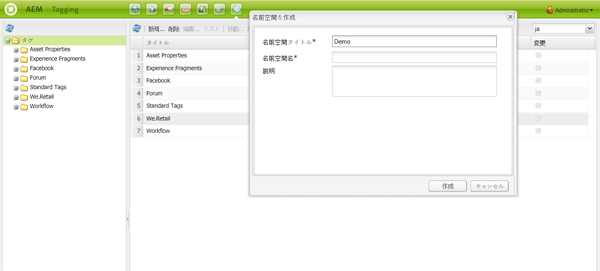
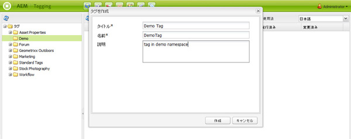
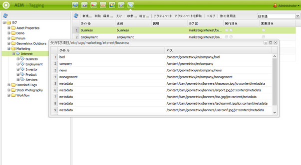
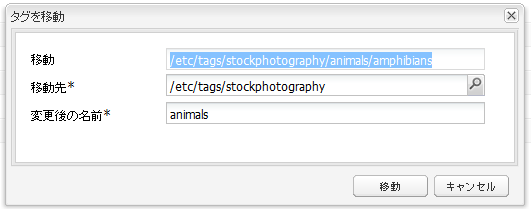
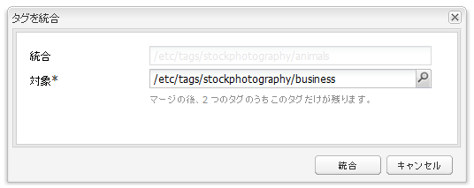
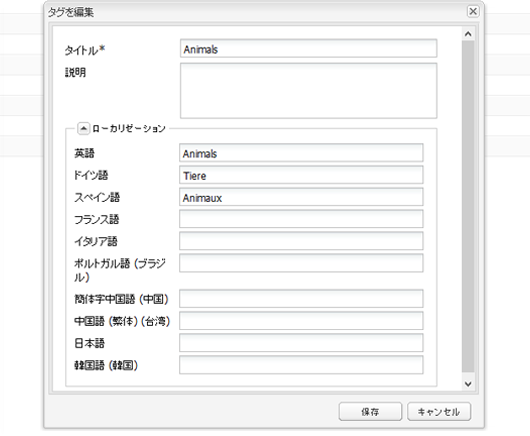
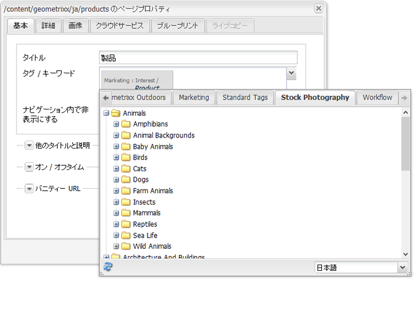

# クラシック UI のタグ付けコンソール{#classic-ui-tagging-console}

>[!CAUTION]
>
>AEM 6.4 の拡張サポートは終了し、このドキュメントは更新されなくなりました。 詳細は、 [技術サポート期間](https://helpx.adobe.com/jp/support/programs/eol-matrix.html). サポートされているバージョンを見つける [ここ](https://experienceleague.adobe.com/docs/?lang=ja).

この節は、クラシック UI のタグ付けコンソール用です。

タッチ操作向け UI のタグ付けコンソールは、 [ここ](/help/sites-administering/tags.md#tagging-console).

クラシック UI のタグ付けコンソールにアクセスするには：

* オーサー環境で
* 管理者権限でサインイン
* コンソールを参照します。

   例： [http://localhost:4502/tagging](http://localhost:4502/tagging)

## タグと名前空間の作成 {#creating-tags-and-namespaces}

1. 開始するレベルに応じて、タグまたは名前空間を **新規**:

   次を選択した場合、 **タグ** 名前空間を作成できます。

   

   名前空間を選択した場合 ( 例： **デモ**) を使用して、その名前空間内にタグを作成できます。

   

1. どちらの場合も、

   * **タイトル**

*（必須）*&#x200B;タグの表示タイトル。どの文字も入力できますが、

      次の特殊文字は使用しないことをお勧めします。

      * `colon (:)` - 名前空間区切り文字
      * `forward slash (/)` - サブタグ区切り文字

      これらの文字は入力しても表示されません。

   * **名前**

      (*必須*) タグのノード名。

   * **説明**

      (*オプション*) タグの説明。

   * 選択 **作成**

## タグの編集 {#editing-tags}

1. 右側のウィンドウで、編集するタグを選択します。
1. クリック **編集**.
1. 次の項目を変更できます。 **タイトル** そして **説明**.
1. クリック **保存** をクリックしてダイアログを閉じます。

## タグの削除 {#deleting-tags}

1. 右側のウィンドウで、削除するタグを選択します。
1. 「**削除**」をクリックします。
1. クリック **はい** をクリックしてダイアログを閉じます。

   タグは今後リストに追加されないはずです。

## タグのアクティブ化と非アクティブ化 {#activating-and-deactivating-tags}

1. 右側のウィンドウで、アクティブ化（公開）または非アクティブ化（非公開）する名前空間またはタグを選択します。
1. クリック **有効化** または **無効化** 必要に応じて。

## リスト — タグが参照されている場所の表示 {#list-showing-where-tags-are-referenced}

**リスト** 新しいウィンドウを開き、ハイライト表示されたタグを使用しているすべてのページのパスを示します。

## タグの移動 {#moving-tags}

タグ管理者や開発者が分類を整理したり、タグ ID の名前を変更したりできるように、タグを新しい場所に移動できます。

1. を開きます。 **タグ付け** コンソール。
1. タグを選択し、 **移動…** 上部のツールバー（またはコンテキストメニュー内）に表示されます。
1. 内 **タグを移動** ダイアログ、定義：

   * **から**：宛先ノード。
   * **名前をに変更**、新しいノード名。

1. クリック **移動**.

この **タグを移動** ダイアログは次のように表示されます。

>[!NOTE]
>
>作成者はタグの移動やタグ ID の名前の変更はおこなわないでください。必要に応じて、[タグのタイトルの変更](#editing-tags)のみをおこなってください。

## タグの結合 {#merging-tags}

タグのマージは、分類に重複がある場合に使用できます。 タグ A がタグ B に統合されると、タグ A がタグ B でタグ付けされたすべてのページにタグ B が付けられ、作成者はタグ A を使用できなくなります。

タグを別のタグに結合するには：

1. を開きます。 **タグ付け** コンソール。
1. タグを選択し、 **結合…** 上部のツールバー（またはコンテキストメニュー内）に表示されます。
1. 内 **タグを結合** ダイアログ、定義：

   * **into**：宛先ノード。

1. クリック **結合**.

**タグを統合**&#x200B;ダイアログは次のようになります。

## タグの使用状況のカウント {#counting-usage-of-tags}

タグの使用回数を確認するには：

1. を開きます。 **タグ付け** コンソール。
1. クリック **使用状況をカウント** 上部のツールバーで、次の操作をおこないます。「カウント」列に結果が表示されます。

## 他の言語でのタグの管理 {#managing-tags-in-different-languages}

タグのオプションの `title` プロパティは複数の言語に翻訳できます。したがって、タグの `titles` はユーザー言語またはページ言語にもとづいて表示できます。

### 複数言語でのタグタイトルの定義 {#defining-tag-titles-in-multiple-languages}

**Animals** というタグの `title` を、英語、ドイツ語、フランス語に翻訳する手順を次に示します。

1. **タグ付け** コンソールに移動します。
1. **タグ**／**フォトグラフィー**&#x200B;で、**Animals** というタグを編集します。
1. 次の言語の翻訳を追加します。

   * **英語**:動物
   * **ドイツ語**:ティエール
   * **フランス語**:アニモー

1. 変更を保存します。

ダイアログは次のようになります。

タグ付けコンソールでは、ユーザーの言語設定が使用されます。したがって Animal タグは、ユーザープロパティで言語をフランス語に設定しているユーザーには「Animaux」と表示されます。

ダイアログに新しい言語を追加する方法については、[デベロッパー向けタグ付け](/help/sites-developing/building.md#adding-a-new-language-to-the-edit-tag-dialog)節の&#x200B;**タグを編集ダイアログへの新しい言語の追加**&#x200B;を参照してください。

### 指定した言語でのページプロパティにおけるタグタイトルの表示 {#displaying-tag-titles-in-page-properties-in-a-specified-language}

デフォルトでは、ページプロパティで設定したタグの `titles` はページ言語に基づいて表示されます。ページプロパティ内のタグダイアログには、タグの `titles` を異なる言語で表示するための言語フィールドがあります。フランス語でタグの `titles` を表示する方法を次に示します。

1. 前の節を参照して、**タグ**／**フォトグラフィー**&#x200B;の **Animals** にフランス語の翻訳を追加します。
1. **Geometrixx** サイトの英語分岐で、**Products** ページのページプロパティを開きます。
1. 「タグ／キーワード」表示領域の右のプルダウンメニューを選択して、**タグ／キーワード**&#x200B;ダイアログを開き、右下隅のプルダウンメニューで「**フランス語**」を選択します。
1. 左右の矢印を使用してスクロールし、「**フォトグラフィー**」タブを選択します。

   **Animals**（**Animaux**）タグを選択したら、ダイアログ以外の場所を選択してダイアログを閉じ、ページプロパティにタグを追加します。

   

デフォルトでは、ページのプロパティダイアログにはページ言語にもとづいたタグの `titles` が表示されます。

ページ言語が有効な場合、タグの言語はページ言語から取得されます。次の場合に [タグウィジェット](/help/sites-developing/building.md#tagging-on-the-client-side) が他のケース（フォームやダイアログなど）で使用される場合、タグの言語はコンテキストに応じて異なります。

>[!NOTE]
>
>標準ページコンポーネント内のタグクラウドおよびメタキーワードでは、ページ言語が有効な場合はそれに基づいてローカライズされたタグの `titles` が使用されます。
