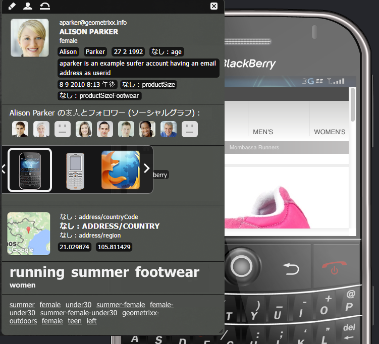
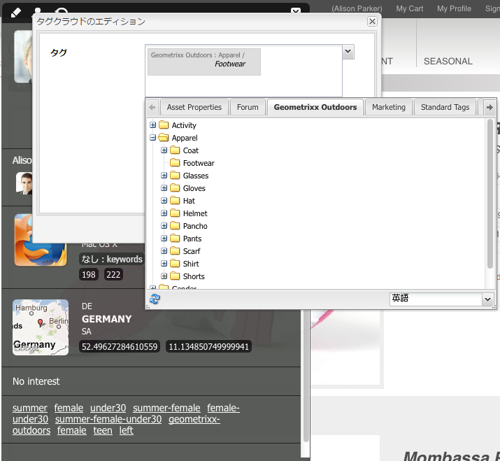
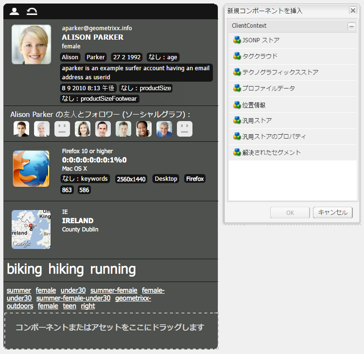
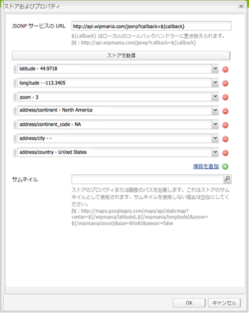

# ClientContext {#client-context}

>[!NOTE]
>
>Client Context は、ContextHub に変更されました。詳しくは、[設定](/help/sites-administering/contexthub-config.md)および[開発者](/help/sites-developing/contexthub.md)に関する関連ドキュメントを参照してください。

Client Context は、現在のページと訪問者に関する特定の情報を提供するメカニズムです。**Ctrl + Alt + c キー**（Windows）または **control + option + c キー**（Mac）で開くことができます。

パブリッシュ環境とオーサー環境の両方で、次の情報が表示されます。

* 訪問者は、インスタンスに応じて、特定の情報が要求または派生されます。
* ページタグおよび現在の訪問者がこれらのタグにアクセスした回数（これは、特定のタグの上にマウスを移動したときに表示されます）。
* ページ情報。
* 技術環境に関する情報（IP アドレス、ブラウザー、画面解像度など）。
* 現在解決されているセグメント。

アイコン（オーサー環境でのみ使用可能）を使用して、ClientContext の詳細を設定できます。

* **編集** 新しいページが開き、[プロファイルのプロパティを編集、追加または削除](#editing-property-details)できます。

* **読み込み** テストを実行する[プロファイルをリストから選択してプロファイルを読み込む](#loading-a-new-user-profile)ことができます。

* **リセット** プロファイルを現在のユーザーの[プロファイルにリセット](#resetting-the-profile-to-the-current-user)できます。

## 使用できる ClientContext のコンポーネント {#available-client-context-components}

ClientContext には、次のプロパティ ([「編集」を使用して選択した内容に応じて](#adding-a-property-component)):

**サーファー情報**&#x200B;には、次のクライアントサイド情報が表示されます。

* **IP アドレス**
* 検索エンジンのリファラルに使用される&#x200B;**キーワード**
* 使用されている&#x200B;**ブラウザー**
* 使用されている **OS**（オペレーティングシステム）
* 画面の&#x200B;**解像度**
* **マウスの X** ポジション
* **マウスの Y** ポジション

**アクティビティストリーム**：様々なプラットフォーム（AEM フォーラム、ブログ、評価など）上のユーザーのソーシャルアクティビティに関する情報を提供します。

**キャンペーン**：作成者がキャンペーンの特定のエクスペリエンスをシミュレートできます。このコンポーネントは通常のキャンペーンの結果とエクスペリエンスの選択をオーバーライドし、各種配列のテストを有効にします。

キャンペーンの結果は通常、キャンペーンの優先度のプロパティに基づいています。エクスペリエンスは通常、分類に基づいて選択されます。

**カート**：商品のエントリ（タイトル、数量、priceFormatted など）、解決済みのプロモーション（タイトル、メッセージなど）などの買い物かご情報を表示します。割引券（コード、説明など）

また、買い物かごセッションストアは、ClientContextCartServlet を使用して（セグメント化の変更に基づいて）解決されたプロモーションの変更についてサーバーに通知します。

**汎用ストア**：ストアのコンテンツを表示する汎用のコンポーネントです。汎用ストアプロパティコンポーネントの下位レベルのバージョンです。

汎用ストアは、データをカスタム方法で表示する JS レンダラーで設定する必要があります。

**汎用ストアのプロパティ**：ストアのコンテンツを表示する汎用のコンポーネントです。汎用ストアコンポーネントの上位バージョンです。

汎用ストアのプロパティコンポーネントには、設定済みのプロパティを（サムネールと共に）リスト表示するデフォルトのレンダラーが含まれています。

**ジオロケーション**：クライアントの緯度と経度を示します。HTML5 Geolocation API を使用して現在の位置についてブラウザーでクエリを実行します。これにより訪問者にポップアップが表示され、位置を共有することに合意するかどうかをブラウザーから確認されます。

Context Cloud に表示される場合、コンポーネントはGoogle API を使用してマップをサムネールとして表示します。 このコンポーネントは、Google API の影響を受けます [使用限度](https://developers.google.com/maps/documentation/staticmaps/intro#Limits).

>[!NOTE]
>
>AEM 6.1 では、位置情報ストアは逆ジオコーディング機能を提供しなくなりました。 したがって、位置情報ストアは現在の場所に関する詳細（市区町村名や国コードなど）を取得しなくなりました。 このストアデータを使用するセグメントは、正しく機能しません。 位置情報ストアには、位置の緯度と経度のみが含まれます。

**JSONP Store**：インストールによって異なるコンテンツが表示されるコンポーネント。

JSONP 標準は JSON を補完し、同一生成元ポリシーを回避します（Web アプリケーションが別のドメインにあるサーバーと通信できないようにします）。これは関数呼び出しの JSON オブジェクトをラップすることで、別のドメインから  として読み込むことができるようにします（同一生成元ポリシーの例外として許可されます）。

JSONP ストアは他のストアと同じですが、別のドメインからの情報を読み込むのに現在のドメインにその情報のプロキシを必要としない点が異なります。[JSONP を介して ClientContext にデータを保存](/help/sites-administering/client-context.md#storing-data-in-client-context-via-jsonp)する例を参照してください。

>[!NOTE]
>
>JSONP ストアは cookie に情報をキャッシュしませんが、ページが読み込まれるたびにそのデータを取得します。

**プロファイルデータ**：ユーザープロファイルに収集された情報を表示します。例えば、性別、年齢、メールアドレスなどです。

**解決済みセグメント**：どのセグメントが現在解決されているかが表示されます（クライアントのコンテキストに表示される他の情報の影響を受ける場合があります）。これは、キャンペーンを設定するときに参考となります。

例えば、マウスが現在ウィンドウの左または右の部分の上にあるかどうかなどです。このセグメントは変更をすぐに確認できるので、主にテストで使用されます。

**ソーシャルグラフ**：ユーザーの友人やフォロワーのソーシャルグラフを表示します。

>[!NOTE]
>
>現在、これはデモユーザーのプロファイルノードに事前に設定されたデータセットを使用するデモ機能です。 例：
>
>`/home/users/geometrixx/aparker@geometrixx.info/profile` => friends プロパティ

**タグクラウド**：現在のページに設定されているタグと、サイト閲覧中に収集されたタグを表示します。タグの上にマウスを移動すると、現在のユーザーがその特定のタグを保持しているページにアクセスした回数が表示されます。

>[!NOTE]
訪問したページに表示される DAM アセットに設定されているタグはカウントされません。

**Technographics ストア**：このコンポーネントは、インストール環境によって異なります。

**ViewedProducts**：買い物客が閲覧した商品を追跡します。最近閲覧した製品または買い物かごにまだ入っていない最近閲覧した製品についてクエリを実行できます。

このセッションストアには、デフォルトのクライアントコンテキストコンポーネントがありません。

詳しくは、[ClientContext の詳細](/help/sites-developing/client-context.md)を参照してください。

>[!NOTE]
ページデータは、ClientContext のデフォルトのコンポーネントではなくなりました。必要に応じて、ClientContext を編集し、**汎用ストアのプロパティ**&#x200B;コンポーネントを追加して、**ストア**&#x200B;を `pagedata` として定義するように設定することにより、ページデータを追加できます。

## ClientContext プロファイルの変更 {#changing-the-client-context-profile}

ClientContext を使用すると、詳細をインタラクティブに変更できます。

* ClientContext で使用されているプロファイルを変更すると、現在のページに対して様々なユーザーに表示される様々なエクスペリエンスを確認できます。
* ユーザープロファイルのほか、プロファイルの詳細を変更して様々な状況下でページエクスペリエンスがどのように異なるかを確認できます。

### 新しいユーザープロファイルの読み込み {#loading-a-new-user-profile}

次のいずれかの方法でプロファイルを変更できます。

* [読み込みアイコンを使用](#loading-a-new-visitor-profile-with-the-load-profile-icon)
* [選択スライダーを使用](#loading-a-new-user-profile-with-the-selection-slider)

終了したら、次の操作を実行できます。 [プロファイルをリセット](#resetting-the-profile-to-the-current-user).

#### プロファイル読み込みアイコンを使用した新しい訪問者プロファイルの読み込み {#loading-a-new-visitor-profile-with-the-load-profile-icon}

1. 次のプロファイルの読み込みアイコンをクリックします。

   

1. ダイアログが開きます。ここで読み込むプロファイルを選択できます。

   

1. 「**OK**」をクリックして読み込みます。

#### 選択スライダーを使用した新しいユーザープロファイルの読み込み {#loading-a-new-user-profile-with-the-selection-slider}

次の選択スライダーを使用してプロファイルを選択することもできます。

1. 現在のユーザーを表すアイコンをダブルクリックします。セレクターが開きます。矢印で移動し、使用可能なプロファイルを確認します。

   

1. 読み込むプロファイルをクリックします。詳細が読み込まれたら、セレクター以外の場所をクリックしてセレクターを閉じます。

#### プロファイルの現在のユーザーへのリセット {#resetting-the-profile-to-the-current-user}

1. 次のリセットアイコンを使用して ClientContext のプロファイルを現在のユーザーのものに戻します。

   

### ブラウザープラットフォームの変更 {#changing-the-browser-platform}

1. ブラウザープラットフォームを表すアイコンをダブルクリックします。 セレクターが開きます。矢印で移動し、使用可能なプラットフォームやブラウザーを確認します。

   

1. 読み込むプラットフォームブラウザーをクリックします。 詳細が読み込まれたら、セレクター以外の場所をクリックしてセレクターを閉じます。

### 位置情報の変更 {#changing-the-geolocation}

1. 位置情報アイコンをダブルクリックします。 展開されたマップが開きます。ここでマーカーを新しい位置にドラッグできます。

   

1. マップの外側をクリックして閉じます。

### タグ選択の変更 {#changing-the-tag-selection}

1. ClientContext の「タグクラウド」セクションをダブルクリックします。 ダイアログが開きます。ここでタグを選択できます。

   

1. 「 OK 」をクリックして、ClientContext にを読み込みます。

## ClientContext の編集 {#editing-the-client-context}

ClientContext の編集を使用して、特定のプロパティの値を設定（またはリセット）したり、新しいプロパティを追加したり、不要になったプロパティを削除したりできます。

### プロパティの詳細の編集 {#editing-property-details}

ClientContext を編集して、特定のプロパティの値を設定（またはリセット）できます。 これにより、特定のシナリオをテストすることができます（特に[セグメント化](/help/sites-administering/campaign-segmentation.md)や[キャンペーン](/help/sites-authoring/personalization.md)で役に立ちます）。

### プロパティコンポーネントの追加 {#adding-a-property-component}

**ClientContext のデザインページ**&#x200B;を開いたら、使用可能なコンポーネントを使用して完全に新しいプロパティを&#x200B;**追加**&#x200B;できます（コンポーネントは、サイドキック、または「**コンポーネントまたはアセットをここにドラッグします**」ボックスをダブルクリックすると開く「**新規コンポーネントを挿入**」ダイアログにリストされます）。

### プロパティコンポーネントの削除 {#removing-a-property-component}

を開いた後、 **ClientContextデザインページ**&#x200B;また、 **削除** プロパティ（不要になった場合） これには、標準で提供されるプロパティが含まれます。 **リセット** が削除された場合にそれらを回復します。

## JSONP を使用した ClientContext へのデータの格納 {#storing-data-in-client-context-via-jsonp}

この例に従って、JSONP ストアのコンテキストストアコンポーネントを使用して、外部データを ClientContext に追加します。 次に、そのデータからの情報に基づいてセグメントを作成します。 この例では、WIPmania.com が提供する JSONP サービスを使用しています。 このサービスは、Web クライアントの IP アドレスに基づいて位置情報を返します。

この例では、Geometrixx Outdoorsサンプル Web サイトを使用して ClientContext にアクセスし、作成したセグメントをテストします。 ページで ClientContext が有効になっている限り、別の Web サイトを使用できます。 ( [ページへの ClientContext の追加](/help/sites-developing/client-context.md#adding-client-context-to-a-page).)

### JSONP ストアコンポーネントの追加 {#add-the-jsonp-store-component}

JSONP ストアコンポーネントを ClientContext に追加し、それを使用して Web クライアントに関する位置情報を取得して保存します。

1. AEM オーサーインスタンスの Geometrixx Outdoors サイトの英語のホームページを開きます([http://localhost:4502/content/geometrixx-outdoors/en.html](http://localhost:4502/content/geometrixx-outdoors/en.html)) をクリックします。
1. ClientContext を開くには、Ctrl + Alt + C キー（Windows）または Control + Option + C キー（Mac）を押します。
1. ClientContext の上部にある編集アイコンをクリックして、ClientContext Designer を開きます。

   

1. JSONP ストアコンポーネントを ClientContext にドラッグします。

   

1. コンポーネントをダブルクリックして編集ダイアログを開きます。
1. 「JSONP サービスの URL」ボックスに次の URL を入力し、「ストアを取得」をクリックします。

   `https://api.wipmania.com/jsonp?callback=${callback}`

   このコンポーネントは JSONP サービスを呼び出し、返されたデータに含まれるすべてのプロパティをリストします。 リストに含まれるプロパティは、ClientContext で使用できるプロパティです。

   

1. 「OK」をクリックします。
1. 「Geometrixx Outdoors」ホームページに戻り、ページを更新します。 ClientContext に、JSONP ストアコンポーネントからの情報が含まれるようになりました。

   

### セグメントの作成 {#create-the-segment}

JSONP ストアコンポーネントを使用して作成したセッションストアのデータを使用します。 このセグメントは、セッションストアの緯度と現在の日付を使用して、クライアントの場所が冬時かどうかを判断します。

1. Web ブラウザーでツールコンソールを開きます ([http://localhost:4502/miscadmin#/etc](http://localhost:4502/miscadmin#/etc)) をクリックします。
1. フォルダーツリーで、ツール/Segmentation フォルダーをクリックし、新規/新しいフォルダーをクリックします。 次のプロパティ値を指定し、「作成」をクリックします。

   * 名前：mysegments
   * タイトル：マイセグメント

1. My Segments フォルダーを選択し、新規/新しいページをクリックします。

   1. 「タイトル」に「Winter」と入力します。
   1. セグメントテンプレートを選択します。
   1. 「作成」をクリックします。

1. Winter セグメントを右クリックし、「開く」をクリックします。
1. 汎用ストアプロパティをデフォルトの AND コンテナにドラッグします。

   

1. コンポーネントをダブルクリックして編集ダイアログを開き、次のプロパティ値を指定して、「OK」をクリックします。

   * ストア：ウィマニア
   * プロパティ名：latitude
   * 演算子：次よりも大きい
   * プロパティ値：30

1. スクリプトコンポーネントを同じ AND コンテナにドラッグし、その編集ダイアログを開きます。 次のスクリプトを追加し、「OK」をクリックします。

   `3 < new Date().getMonth() < 12`
