# 概念 {#concepts}

>[!CAUTION]
>
>AEM 6.4 の拡張サポートは終了し、このドキュメントは更新されなくなりました。 詳細は、 [技術サポート期間](https://helpx.adobe.com/jp/support/programs/eol-matrix.html). サポートされているバージョンを見つける [ここ](https://experienceleague.adobe.com/docs/?lang=ja).

統合フレームワークは、次のためのメカニズムとコンポーネントを提供します。

* e コマースエンジンへの接続
* データのAEMへの取り込み
* そのデータの表示と買い物客の回答の収集
* トランザクションの詳細を返す
* 両方のシステムからのデータを検索する

つまり、

* 買い物客は、待たずに登録や買い物をすることができます。
* 価格の変更は、買い物客に遅滞なく表示されます。
* 必要に応じて製品を追加できます。

>[!NOTE]
>
>e コマースフレームワークは、次の場合に使用できます。
>
>* [Magento](https://www.adobe.io/apis/experiencecloud/commerce-integration-framework/integrations.html#!AdobeDocs/commerce-cif-documentation/master/integrations/02-AEM-Magento.md)
>
>* [SAP Commerce Cloud](/help/sites-administering/sap-commerce-cloud.md)
>
>* [Salesforce Commerce Cloud](https://github.com/adobe/commerce-salesforce)
>

>[!CAUTION]
>
>[e コマース統合フレームワーク](https://www.adobe.com/jp/solutions/web-experience-management/commerce.html)は AEM アドオンです。
>
>ご利用のエンジンに応じて、営業担当者が詳しくご説明します。

>[!CAUTION]
>
>このフレームワークは、独自プロジェクトの基本要件となります。
>
>フレームワークを実際の仕様に適合させるには、ある程度の開発作業が必要です。

>[!CAUTION]
>
>標準のAEMインストールには、汎用AEM(JCR)e コマース実装が含まれます。
>
>これは、現在、デモ目的、または要件に応じたカスタム実装の基本的な基盤としての役割を果たすためのものです。

AEMと e コマースエンジンは、操作を最適化するために、それぞれの専門分野に集中します。 情報は、2 つの間でリアルタイムに転送されます。例：

* AEMが実行できる内容：

   * リクエスト:

      * e コマースエンジンからの製品情報。
   * 以下を指定します。

      * 製品情報、買い物かご、チェックアウトに関するユーザービュー。
      * e コマースエンジンへの買い物かごおよびチェックアウト情報。
      * 検索エンジン最適化 (SEO)。
      * コミュニティ機能
      * 非構造化マーケティングインタラクション。

* e コマースエンジンがすること：

   * 以下を指定します。

      * データベースからの製品情報。
      * 製品バリアント管理。
      * 注文管理。
      * ERP（Enterprise Resource Planning）。
      * 製品情報内を検索します。
   * プロセス:

      * 買い物かご。
      * チェックアウト。
      * 注文の達成。

>[!NOTE]
>
>正確な詳細は、e コマースエンジンとプロジェクトの実装によって異なります。

この統合レイヤーを使用するために、すぐに使える AEM コンポーネントが多数用意されています。現在、次のものが含まれます。

* 製品情報
* 買い物かご
* チェックアウト
* マイアカウント

様々な検索オプションも使用できます。

## アーキテクチャ {#architecture}

統合フレームワークは、API、機能を説明する様々なコンポーネント、接続方法の例を提供するいくつかの拡張を提供します。

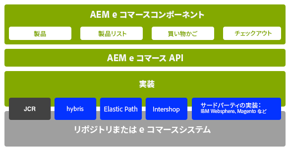

フレームワークを使用して、以下のような機能にアクセスできます。

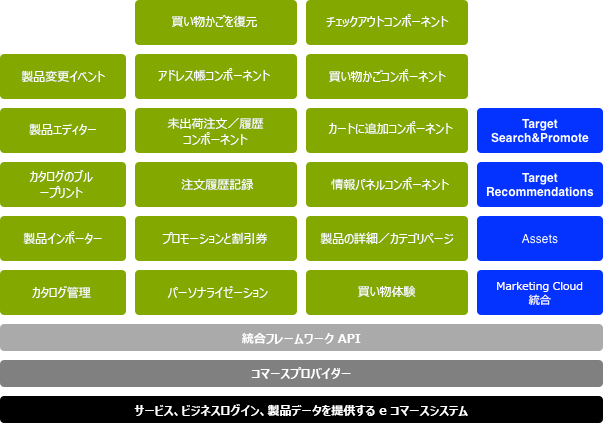

### 実装 {#implementations}

AEM e コマースは e コマースエンジンを使用して実装されます。

* e コマース統合フレームワークは、e コマースエンジンをAEMと簡単に統合できるように設計されています。 専用の e コマースエンジンは、商品データ、買い物かご、チェックアウトおよび注文の達成を制御し、AEMはデータの表示とマーケティングキャンペーンを制御します。

>[!NOTE]
>
>標準のAEMインストールには、汎用AEM(JCR)e コマース実装が含まれます。
>
>これは、現在、デモ目的、または要件に応じたカスタム実装の基本的な基盤としての役割を果たすためのものです。
>
>AEM e コマースは、AEM内で JCR に基づく汎用開発を使用して実装されます。
>
>* API の使用例を示す、スタンドアロンのAEMネイティブ e コマースの例です。 これは、既存のデータの表示およびマーケティングキャンペーンと組み合わせて、製品データ、買い物かご、チェックアウトを制御するために使用できます。 この場合、製品データベースは、AEM(Adobeの [JCR](https://www.adobe.io/experience-manager/reference-materials/spec/jcr/2.0/index.html)) をクリックします。\
   >  標準的な AEM のインストールには、[一般的な e コマースの実装](/help/sites-administering/generic.md)の基本が含まれています。

### コマースプロバイダー {#commerce-providers}

コマースエンジンからAEM e コマースサイトにデータをインポートする場合、コマースプロバイダーを使用してインポーターにデータを提供します。 1 つのコマースプロバイダーが複数のインポーターをサポートできます。

コマースプロバイダーは、次のいずれかに合わせてカスタマイズされたAEMコードです。

* バックエンドコマースエンジンへのインターフェイス
* JCR リポジトリ上にコマースシステムを実装する

AEMでは、現在、2 つのサンプルのコマースプロバイダーを利用できます。

* geometrixx-hybris 用のもの
* geometrixx-generic (JCR) の別の

ただし、通常、プロジェクトは、PIM および製品データスキーマに固有の、カスタマイズされた独自のコマースプロバイダーを開発する必要があります。

>[!NOTE]
>
>geometrixx インポーターは CSV ファイルを使用します。実装の上にあるコメントに、受け入れられるスキーマの説明（カスタムプロパティも許可されています）が含まれています。

[ProductServicesManager](https://helpx.adobe.com/experience-manager/6-4/sites/developing/using/reference-materials/javadoc/com/adobe/cq/commerce/pim/api/ProductServicesManager.html) は、（[OSGi](/help/sites-deploying/configuring.md#osgi-configuration-settings) を通じて）[ProductImporter](https://helpx.adobe.com/experience-manager/6-4/sites/developing/using/reference-materials/javadoc/com/adobe/cq/commerce/pim/api/ProductImporter.html) インターフェイスと [CatalogBlueprintImporter](https://helpx.adobe.com/experience-manager/6-4/sites/developing/using/reference-materials/javadoc/com/adobe/cq/commerce/pim/api/CatalogBlueprintImporter.html) インターフェイスの実装のリストを保守します。これらの実装は、インポーターウィザードの「**インポーター／コマースプロバイダー**」ドロップダウンフィールドに、`commerceProvider` プロパティを名前に使用して一覧表示されます。

ドロップダウンの特定のインポーター／コマースプロバイダーを利用できる場合は、必要な追加データがあれば（インポータータイプに応じて）次のどちらかに定義する必要があります。

* `/apps/commerce/gui/content/catalogs/importblueprintswizard/importers`
* `/apps/commerce/gui/content/products/importproductswizard/importers`

該当する `importers` フォルダーの下のフォルダーは、インポーター名と一致している必要があります。次に例を示します。

* `.../importproductswizard/importers/geometrixx/.content.xml`

読み込み元ファイルの形式は、インポーターによって定義されます。あるいは、インポーターは、コマースエンジンへの接続（例：WebDAV または http）を確立できます。

## ロール {#roles}

統合システムでは、データを維持する次の役割を果たします。

* 次のものを保守する商品情報管理（PIM）ユーザー

   * 製品情報。
   * 分類、分類、承認。
   * デジタルアセット管理とやり取りする
   * 価格 — 多くの場合、これは ERP システムから取得され、コマースシステムで明示的に管理されていません。

* 以下を管理する作成者/マーケティングマネージャー

   * すべてのチャネルのマーケティングコンテンツ。
   * プロモーション
   * 割引券
   * キャンペーン.

* サーファー/買い物客：

   * 製品情報を表示します。
   * 品目を買い物かごに配置します。
   * 注文をチェックアウトします。
   * 注文の達成を期待します。

実際の場所は実装によって異なる場合がありますが、例えば、「汎用」や e コマースエンジンを使用する場合は、次のようになります。

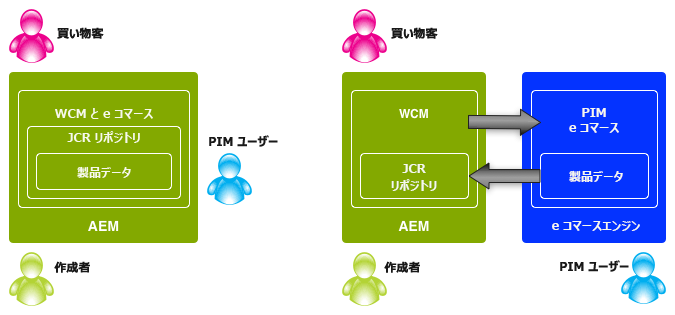

## 製品 {#products}

### 製品データとマーケティングデータ {#product-data-versus-marketing-data}

#### 構造カテゴリとマーケティングカテゴリ {#structural-versus-marketing-categories}

次の 2 つのカテゴリを区別できる場合、意味のある構造（`cq:Page` ノードのツリー）を使用して URL を明確にできるので、従来の AEM コンテンツ管理に非常に近くなります。

* *構造的*カテゴリ

    *製品の概要*&#x200B;を定義するカテゴリツリー。例を以下に示します。

   `/products/mens/shoes/sneakers`

* *マーケティング*&#x200B;カテゴリ

   *製品が所属できる*&#x200B;その他すべてのカテゴリ。例を以下に示します。

   `/special-offers/christmas/shoes`）

### 製品データ {#product-data}

製品を表示および管理するには、製品に関する様々な情報を保持する必要があります。

製品データは、次のことができます。

* AEM（汎用）に直接保持できます。
* e コマースエンジンに保持して、AEM で利用できます。

   データタイプにより、必要に応じて[同期](#catalog-maintenance-data-synchronization)したり、直接アクセスしたりできます。例えば、商品価格などの非常に変動しやすく重要なデータは、ページ要求のたびに e コマースエンジンから取得して、常に最新であることを保証します。

どちらの場合も、製品データがAEMに入力または読み込まれると、 **製品** コンソール。 ここでは、製品のカードおよびリスト表示に、次のような情報が表示されます。

* 画像
* SKU コード
* 最終変更日時

### 製品バリアント {#product-variants}

バリアントに関する適切な製品情報も保持できます。 例えば、衣料品の場合は、販売されている様々なカラーをバリアントとして保持します。

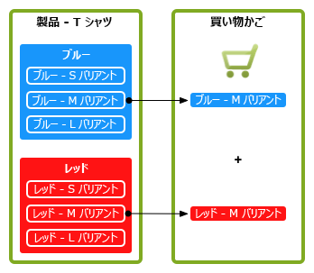

### 製品属性 {#product-attributes}

各製品に関して保持される個々の属性は、使用する e コマースエンジンとAEMの実装によって異なる場合があります。 製品ページの表示や製品情報の編集を行う際に、必要に応じてこれらの情報を使用できます。次の情報が含まれます。

* **画像**

   商品の画像。

* **タイトル**

   商品名。

* **説明**

   テキストによる商品の説明。

* **タグ**

   関連商品のグループ化に使用するタグ。

* **デフォルトのアセットカテゴリ**

   アセットのデフォルトカテゴリです。

* **ERP データ**

   エンタープライズリソースプランニング（ERP）に関する情報。

   * **SKU**

      在庫管理単位（SKU）に関する情報。

   * **カラー**
   * **サイズ**
   * **価格**

      商品の単価。

* **概要**

   商品の特長の概要。

* **機能**

   商品の特長の詳細。

### 製品アセット {#product-assets}

個々の製品に対して、選択したアセットを保持できます。 一般的には、画像とビデオが含まれます。

## カタログ {#catalogs}

カタログは、管理と買い物客への表示の両方を容易にするために、製品データをまとめてグループ化します。 カタログは、多くの場合、言語、地理的地域、ブランド、季節、趣味、スポーツなどの属性に基づいて構造化されます。

### カタログ構造 {#catalog-structure}

#### 複数言語のカタログ {#catalogs-in-multiple-languages}

AEMは、複数の言語での製品コンテンツをサポートします。 データを要求すると、統合フレームワークが現在のツリーからその言語を取得します（`/content/geometrixx-outdoors/en_US` の配下のページの場合は `en_US` など）。

多言語ストアの場合、各言語ツリーのカタログを個別に読み込む ( または、 [MSM](/help/sites-administering/msm.md)) をクリックします。

#### 複数のブランドのカタログ {#catalogs-for-multiple-brands}

言語と同様に、大規模な多国籍企業は、複数のブランドを提供しなければならないことがあります。

#### タグ別のカタログ {#catalogs-by-tags}

また、タグを使用して、製品を 1 つのカタログにグループ化することもできます。 タグは、季節的なオファーなど、より動的なカタログに使用できます。

### カタログの設定（初期読み込み） {#catalog-setup-initial-import}

実装に応じて、基本カタログに必要な製品データを、次の場所からAEMに読み込むことができます。

* CSV ファイル（汎用実装用）
* e コマースエンジン

### カタログのメンテナンス（データの同期） {#catalog-maintenance-data-synchronization}

製品データに対するその他の変更は避けられない。

* 汎用実装の場合、これらは [製品エディター](/help/sites-administering/generic.md#editing-product-information)
* [e コマースエンジンを使用している場合は、変更を同期する必要があります。](#data-synchronization-with-an-ecommerce-engine-ongoing)

#### e コマースエンジンとのデータ同期（継続中） {#data-synchronization-with-an-ecommerce-engine-ongoing}

最初の読み込みの後は、製品データの変更は避けられません。

e コマースエンジンを使用する場合、製品データはそこに保持され、AEMで使用できる必要があります。 このような商品データは、更新されたときに同期が必要です。

同期は、データのタイプによって異なります。

* [変更内容のデータフィードとともに、定期的同期を使用します](/help/sites-developing/sap-commerce-cloud.md#product-synchronization-and-publishing)。

   これに加え、特定の更新を選択して高速更新をおこなうことができます。

* 価格情報などの非常に揮発性の高いデータは、常に最新の状態に保つために、ページリクエストごとにコマースエンジンから取得されます。

### カタログ — パフォーマンスと拡張 {#catalogs-performance-and-scaling}

大量の製品（通常 100,000 を超える）を含む大規模なカタログを e コマースエンジン (PIM) から読み込むと、ノード数が多いため、システムに影響を与える可能性があります。 また、製品に関連アセット（製品画像など）がある場合は、オーサーインスタンスの速度が低下する可能性があります。 これは、このようなアセットの後処理に CPU とメモリが集中することによるものです。

この問題を回避するために、様々な方法を選択できます。

* [バケッティング](#bucketing) - 多数のノードに対応する
* [アセットの後処理を専用インスタンスにオフロードする](#offload-asset-post-processing-to-a-dedicated-instance)
* [商品データのみを読み込む](#only-import-product-data)
* [読み込みのスロットリングとバッチ保存](#import-throttling-and-batch-saves)
* [パフォーマンステスト](#performance-testing)
* [パフォーマンス - その他](#performance-miscellaneous)

#### グループ化 {#bucketing}

JCR ノードに多数の直接子ノード（例：1000 以上）がある場合、パフォーマンスに影響を与えないようにするには、バケット（仮想フォルダー）が必要です。 これらは、インポート時にアルゴリズムに従って生成されます。

これらのバケットは、カタログ構造に導入される疑似フォルダーの形式を取りますが、パブリック URL では見えないように設定できます。

#### アセットの後処理を専用インスタンスにオフロードする {#offload-asset-post-processing-to-a-dedicated-instance}

このシナリオでは、2 つのオーサーインスタンスを設定します。

1. プライマリオーサーインスタンス

   PIM から商品データをインポートします。PIM ではアセットパスの後処理は無効になっています。

1. 専用の DAM オーサーインスタンス

   PIM から商品アセットをインポートして後処理を実行したあと、プライマリオーサーインスタンスで使用できるように商品アセットをレプリケートします。

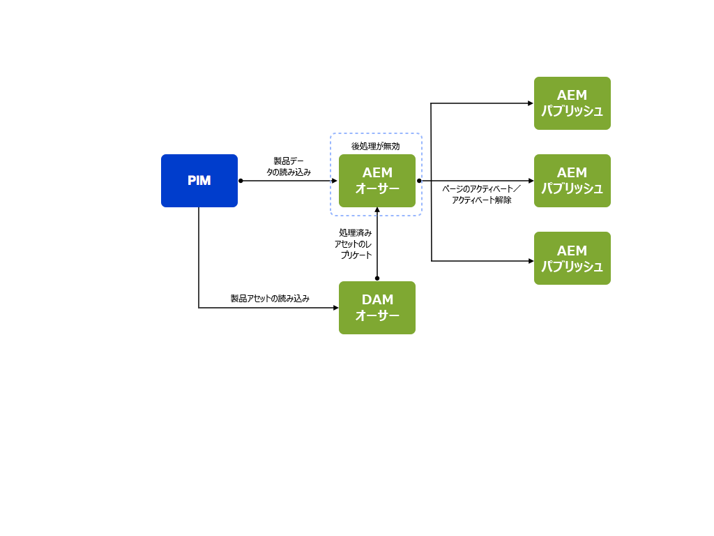

#### 商品データのみを読み込む {#only-import-product-data}

読み込むアセット（画像）が製品に含まれていない場合は、アセットの後処理の影響を受けずに、製品データを読み込むことができます。

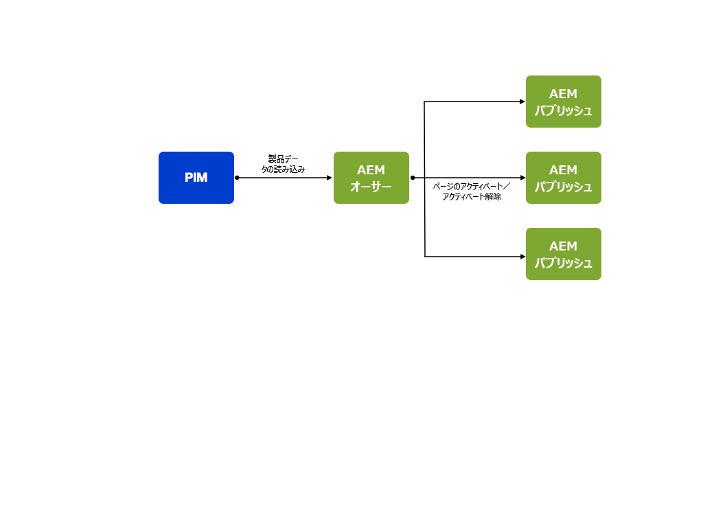

<!--delete
#### Import Throttling and Batch Saves {#import-throttling-and-batch-saves}

[Import throttling](/help/sites-deploying/scaling.md#import-throttling) and [batch saves](/help/sites-deploying/scaling.md#batch-saves) are two general [scaling](/help/sites-deploying/scaling.md) mechanisms that can help when importing large volumes of data.-->

#### パフォーマンステスト {#performance-testing}

AEM e コマースの実装では、パフォーマンステストを考慮する必要があります。

* オーサー環境：

   バックグラウンドアクティビティ（インポートなど）が通常のユーザーアクティビティ（ページ編集など）と同時に発生する可能性があり、フロントエンドのパフォーマンスの優先度のほうが（一般的に）高い場合でも、オンラインオーサーのパフォーマンスが低下してフラストレーションにつながり、稼動開始の決定が妨げられることがあります。

* パブリッシュ環境：

   レプリケーションは、コンテンツが迅速かつ確実に公開されるようにする重要なプロセスです。レプリケーションは、公開するコンテンツをオーサーがどのようにグループ化するかによって影響を受ける場合があります。

* フロントエンド:

   フロントエンドの無効化とキャッシュの無効化が混在すると、予期せぬパフォーマンスの低下につながる可能性があります。テストは、これらを回避するのに役立ちます。

このパフォーマンステストでは、ターゲットに関する知識と分析が必要です。

* コンテンツのボリューム

   * Assets
   * ローカライズされた I18 製品および SKU

* ユーザーアクティビティ：

   * 一括編集
   * 一括公開
   * 強力な検索リクエスト

* バックグラウンドプロセス

   * 読み込み
   * 同期の更新（価格など）

* メンテナンス要件（バックアップ、Tar PM の最適化、データストアのガベージコレクションなど）

#### パフォーマンス - その他 {#performance-miscellaneous}

すべての実装で、次の点に留意してください。

* 製品、在庫管理の単位やカテゴリは多数ある場合があるので、コンテンツのモデル化に使用できる最少数のノードを使用するようにしてください。

   ノードが多くなればなるほど、コンテンツ（parsys など）は柔軟になります。しかし、すべてはトレードオフであり、30,000 個の製品を操作する場合（例：デフォルト）には個々の柔軟性が必要ですか。

* できるだけ重複を避ける（ローカライゼーションを参照）か、重複が発生した場合には、複製によって生じるノード数を考慮します。
* クエリの最適化を準備するために、できる限りコンテンツにタグを付けるようにします。

   次に例を示します。

   `/content/products/france/fr/shoe/reebok/pump/46 SKU`

   コンテンツレベル（国、言語、カテゴリ、ブランド、製品など）ごとに 1 つのタグが必要です。 検索

   `//element(*,my:Sku)[@country=’france’ and @language=’fr’`

   および

   `@category=’shoe’ and @brand=’reebok’ and @product=’pump’]`

   以下を検索するよりも大幅に速くなります

   `/jcr:root/content/france/fr/shoe/reebok/pump/element(*,my:Sku)`

* 技術スタックで、非常に分解されたコンテンツアクセスモデルとサービスを計画します。 これは一般的なベストプラクティスですが、より重要です。最適化フェーズでは、非常に頻繁に読み取られるデータのアプリケーションキャッシュを追加します（バンドルキャッシュを満たしたくない場合）。

   例えば、属性管理は商品の読み込みによって更新されるデータに関係するので、しばしばキャッシュに適した候補となります。
* の使用を検討します。 [プロキシページ](/help/sites-administering/concepts.md#proxy-pages).

### カタログセクションページ {#catalog-section-pages}

カタログセクションには、次のような情報が表示されます。

* カテゴリの紹介（画像やテキスト）。特別オファーを宣伝するバナーやティーザーにも使用できます。
* そのカテゴリの個々の製品へのリンク
* 他のカテゴリへのリンク

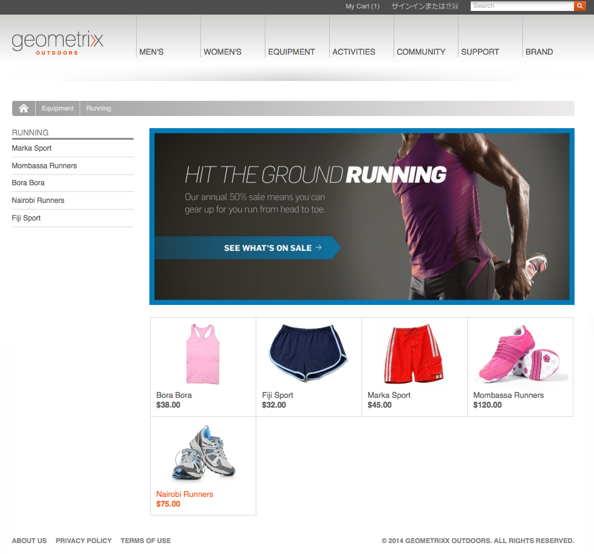

### 製品ページ {#product-pages}

製品ページには、個々の製品に関する包括的な情報が記載されています。 からの動的な更新も反映されます。例えば、e コマースエンジンに登録されている価格の変更などです。

製品ページは、 **製品** コンポーネント例えば、 **コマース製品** テンプレート：

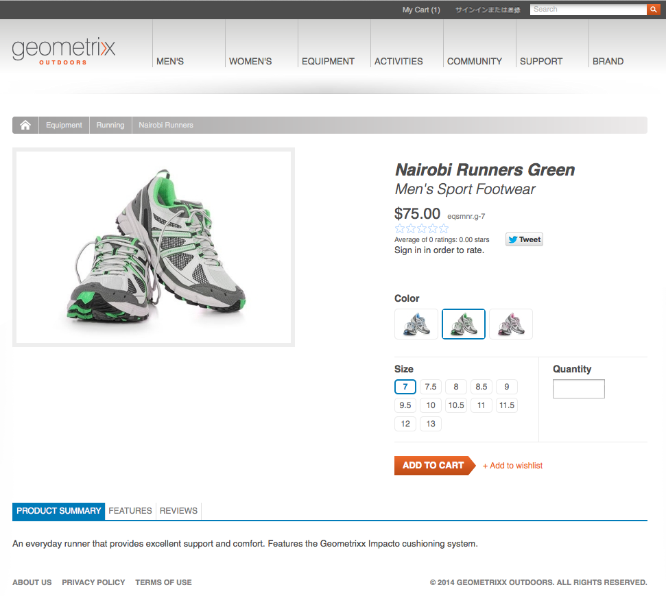

製品コンポーネントには、次のものが表示されます。

* テキストや画像を含む、一般的な商品情報。
* 価格。通常は、ページが表示／更新されるたびに e コマースエンジンから取得されます。
* カラーやサイズなどの製品バリアント情報。

買い物客は、アイテムを買い物かごに追加する際に、この情報を使用して以下を選択できます。

* 色とサイズのバリエーション
* 数量

#### 製品ランディングページ {#product-landing-pages}

主に静的な情報を提供するAEMページです。例えば、基になる製品ページへのリンクを含んだ紹介と概要などです。

### 商品コンポーネント {#product-component}

**製品**&#x200B;コンポーネントは、必要なメタデータ（すなわち `cartPage` と `cartObject` へのパス）を提供する親ページを持つすべてのページに追加できます。これは、デモサイト Geometrixx Outdoors では `UserInfo.jsp` によって提供されています。

この **製品** 個々の要件に応じて、コンポーネントをカスタマイズすることもできます。

### プロキシページ {#proxy-pages}

プロキシページは、リポジトリの構造を簡素化し、大きなカタログのストレージを最適化するために使用します。

カタログを作成すると、AEM内で更新およびカスタマイズできる各製品の個々のコンポーネントが提供されるので、製品ごとに 10 ノードが使用されます。 カタログに数百、数千の製品が含まれている場合、この大量のノードが問題になる可能性があります。 問題を回避するには、プロキシページを使用してカタログを作成します。

プロキシページでは、実際の商品コンテンツをまったく含まない 2 ノード構造（`cq:Page` と `jcr:content`）を使用しています。コンテンツは、要求時に商品データとテンプレートページを参照することで生成されます。

しかし、トレードオフがあります。 AEM内で製品情報をカスタマイズすることはできません。（お客様のサイト用に定義された）標準テンプレートが使用されます。

>[!NOTE]
>
>プロキシページのない大きなカタログを読み込む場合、問題は発生しません。
>
>いつでも方法を変換できます。 カタログのサブセクションを変更することもできます。

## プロモーションと割引券 {#promotions-and-vouchers}

### 割引券 {#vouchers}

割引券とは、買い物客を誘致し、顧客の忠誠度に報いを与える割引を提供する試みとテストの方法です。

* 割引券の供給：

   * 割引券コード（買い物客が買い物かごに入力する）。
   * 割引券ラベル（買い物客が買い物かごに入力した後に表示される）。
   * プロモーションパス（割引券が適用されるアクションを定義）。

* 外部のコマースエンジンで割引券を提供することもできます。

AEM内：

* 割引券は、Web サイトコンソールを使用して作成／編集するページベースのコンポーネントです。
* **割引券**&#x200B;コンポーネントは、次のものを提供します。

   * 割引券管理用のレンダラー。買い物かごに現在入っている割引券があれば表示します。
   * 割引券を管理（追加/削除）するための編集ダイアログ（フォーム）。
   * 買い物かごへの割引券の追加/削除に必要なアクション。

* 割引券には、独自の開始日時や終了日時は設定されておらず、親キャンペーンの開始日時や終了日時を使用します。

>[!NOTE]
>
>AEM では&#x200B;**割引券**&#x200B;という用語を使用します。これは、**クーポン**&#x200B;という用語と同義です。

### プロモーション {#promotions}

プロモーションは、割引券と共に、次のようなシナリオを実現できます。

* 企業は従業員向けのカスタム価格を提供しています。従業員は手作りのユーザーリストです。
* 長期の顧客は、すべての注文に対して割引を受けます。
* 明確に定義された期間に提供される販売価格。
* 顧客は、前の注文が特定の金額を超えた場合に割引券を受け取ります。
* *商品 X* を購入した顧客が&#x200B;*商品 Y*（ペア商品）に対する割引をオファーされる。

プロモーションは、通常、製品情報マネージャーではなく、マーケティングマネージャーによって管理されます。

* プロモーションは、Web サイトコンソールを使用して作成／編集されるページベースのコンポーネントです。``
* プロモーションの提供：

   * 優先度
   * プロモーションハンドラーのパス

* プロモーションをキャンペーンに関連付けて、オン/オフの日時を定義できます。
* プロモーションをエクスペリエンスに関連付けて、セグメントを定義できます。
* エクスペリエンスに接続されていないプロモーションは、単独では実行されませんが、割引券で実行することはできます。
* プロモーションコンポーネントには、次が含まれます。

   * プロモーション管理用のレンダラーとダイアログ
   * プロモーションハンドラー固有の設定パラメーターをレンダリングおよび編集するためのサブコンポーネント

AEMでは、プロモーションも [Campaign Management](/help/sites-authoring/personalization.md):

* a [campaign](/help/sites-authoring/personalization.md) オン/オフ時間を指定します
* キャンペーン内の[エクスペリエンス](/help/sites-authoring/personalization.md)を使用して&#x200B;*、*&#x200B;対応するオーディエンスセグメントに従ってアセット（ティーザーページ、プロモーションなど）をグループ化します。

プロモーションは、エクスペリエンス内または直接キャンペーン内に保持できます。

* プロモーションがエクスペリエンス内に保持されている場合、そのプロモーションをオーディエンスセグメントに自動的に適用できます。

   例えば、geometrixx-outdoors サンプルサイトでは、次のプロモーションが実施されます。

   `/content/campaigns/geometrixx-outdoors/big-spender/ordervalueover100/free-shipping`

   がエクスペリエンス内にあるので、セグメント（`ordervalueover100`）が解決されるたびに自動的に起動されます。

* エクスペリエンス内に存在しない（キャンペーン内にのみ存在する）プロモーションの場合は、自動的にはオーディエンスに適用されません。ただし、買い物客が割引券を買い物かごに入力し、その割引券がプロモーションを参照している場合には、プロモーションが呼び出されます。

   例えば、次のプロモーションでは、

   `/content/campaigns/geometrixx-outdoors/article/10-bucks-off`

   エクスペリエンス外にあるので、自動的には起動されません（つまり、セグメント化に基づいています）。 ただし、このプロモーションを参照する割引券が、記事のキャンペーンに含まれるいくつかのエクスペリエンスにあります。これらの割引券コードを買い物かごに入力すると、プロモーションが呼び出されます。

>[!NOTE]
>
>[hybris プロモーション](https://www.hybris.com/modules/promotion) および [hybris 割引券](https://www.hybris.com/ja/modules/voucher) 買い物かごに影響を与え、価格に関連するものをすべてカバーします。 プロモーション固有のマーケティングコンテンツ（バナーなど）は、hybris プロモーションには含まれません。

## パーソナライズ機能 {#personalization}

### 顧客登録とアカウント {#customer-registration-and-accounts}

買い物客が登録する際は、アカウントの詳細をAEMと e コマースエンジンの間で同期する必要があります。 機密データは個別に保持されますが、プロファイルは共有されます。

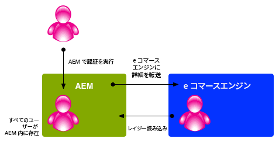

正確なメカニズムは、シナリオによって異なることがあります。

1. ユーザーアカウントがどちらのシステムにも存在する場合：

   1. アクションは不要です。

1. ユーザーアカウントはAEMにのみ存在します：

   1. ユーザーは、同じアカウント ID とランダムパスワードを使用して e コマースエンジンで作成され、AEMに保存されます。
   1. 最初の呼び出し時（例えば、製品ページがリクエストされ、e コマースエンジンが価格で参照される場合）にAEMが e コマースエンジンにログインしようとするので、ランダムなパスワードが必要です。 これはAEMのログイン後に発生するので、パスワードは使用できません。

1. ユーザーアカウントは e コマースエンジンにのみ存在します：

   1. アカウントは、AEMで、同じアカウント ID とパスワードで作成されます。

e コマースエンジンを使用する場合、AEMはアカウント ID とパスワード（オプションでユーザーグループ）のみを保存します。 その他すべての情報は、e コマースエンジンに保存されます。

>[!NOTE]
>
>e コマースエンジンを使用する場合は、AEMインスタンスにログインするユーザー用に作成されたアカウントが、そのエンジンと通信する他のAEMインスタンスに（ワークフローを介して）レプリケートされていることを確認する必要があります。
>
>そうしないと、他のAEMインスタンスもエンジン内の同じユーザーのアカウントを作成しようとします。 このようなアクションは、エンジンから `DuplicateUidException` を受信して失敗します。

### 顧客の新規登録 {#customer-sign-up}

買い物客が買い物かごにアクセスできるようにするには、多くの場合、サインアップが必要です。 サインアップするには、顧客固有のアカウントを作成できるよう、登録（アカウントの作成）が必要です。

>[!NOTE]
>
>匿名の買い物かごとチェックアウトもサポートされます。

### 顧客のサインイン {#customer-sign-in}

サインアップ後、買い物客はアクションを追跡したり、注文を受け渡したりできるように、アカウントを使用してログインできます。

### シングルサインオン {#single-sign-on}

シングルサインオン (SSO) が提供されるので、作成者はAEMと e コマースシステムの両方で、2 回ログインしなくてもわかります。

### myAccount {#myaccount}

e コマースエンジンからのトランザクションデータは、買い物客に関する個人情報と組み合わされます。 AEMでは、このデータの一部をプロファイルデータとして使用します。 AEMでのフォームのアクションにより、情報が e コマースエンジンに書き戻されます。

アカウント情報を簡単に管理できるページがあります。 このページにアクセスするには、geometrixx ページ上部の「**マイアカウント**」をクリックするか、`/content/geometrixx-outdoors/en/user/account.html` に移動します。

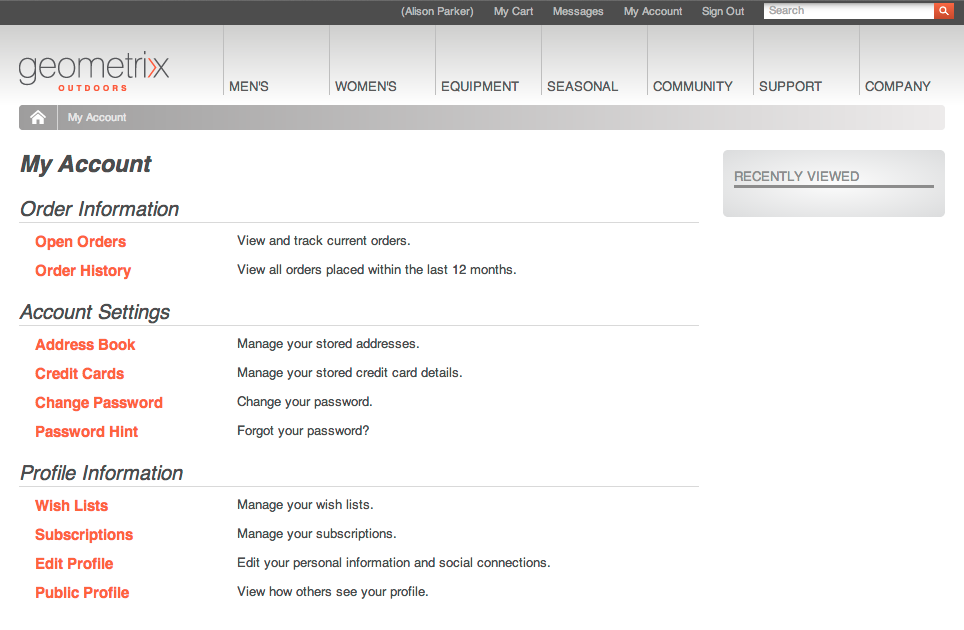

### アドレス帳 {#address-book}

サイトには、選択したアドレスを保存する必要があります。配信、請求、代替アドレスを含みます。 これは、デフォルトのアドレス形式に基づくフォームを使用して実装するか、AEMが提供するアドレス帳コンポーネントを使用して実装できます。

このアドレス帳コンポーネントでは、次の操作を実行できます。

* ブック内のアドレスの編集
* 配送先住所の住所を本から選択する
* 請求先住所の住所を書籍から選択

デフォルトとして希望するアドレスを選択できます。

アドレス帳コンポーネントにアクセスするには、**マイアカウント**&#x200B;ページから「**アドレス帳**」をクリックするか、`/content/geometrixx-outdoors/en/user/account/address-book.html` に移動します。

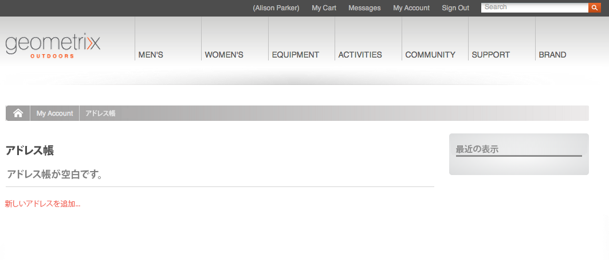

「**新しいアドレスを追加...**」をクリックして、アドレス帳に新しいアドレスを追加できます。フォームが開きます。このフォームに入力して、「 **アドレスを追加**.

>[!NOTE]
>
>アドレス帳に複数のアドレスを入力できます。

アドレス帳は、買い物かごのチェックアウト時に使用されます。

アドレスは、`user_home/profile/addresses` の下に保持されます。
\
例えば、Alison Parker の場合は、/home/users/geometrixx/aparker@geometrixx.info/profile/addresses の下です。

デフォルトとするアドレスを選択できます。この情報は、アドレスと一緒にではなく、買い物客のプロファイルに保持されます。プロファイルのプロパティ `address.default` の値が、選択されたアドレスのパスに設定されます。

### お客様固有の価格 {#customer-specific-pricing}

e コマースエンジンは、コンテキスト（基本的には買い物客情報）を使用して保有している価格を判断し、正しい情報をAEMに返します。

## 買い物かごと注文 {#shopping-cart-and-orders}

買い物をする際に、買い物客は商品ページを参照し、商品を選択して買い物かごに入れます。 チェックアウトに進むと、注文できます。

### 匿名の買い物客 {#anonymous-shoppers}

匿名の顧客は、次のことが可能です。

* 製品を表示
* 買い物かごに製品を追加
* チェックアウトを実行して注文をおこなう

>[!NOTE]
>
>インスタンスの住所情報の設定、または顧客登録に応じて、チェックアウトの前に必要になる場合があります。

### 登録された買い物客 {#registered-shoppers}

登録済みの顧客は、次のことが可能です。

* アカウントにログイン
* 製品を表示
* 買い物かごに製品を追加
* チェックアウトを実行して注文をおこなう
* 以前の注文の表示と追跡

### 買い物かごの内容の概要 {#shopping-cart-content-overview}

買い物かごには次の情報が表示されます。

* 選択した項目の概要
* 選択されたアイテムの商品ページへのリンク
* 次の機能を備えている。

   * 個々の項目の数/数量を更新
   * 個々の項目を削除

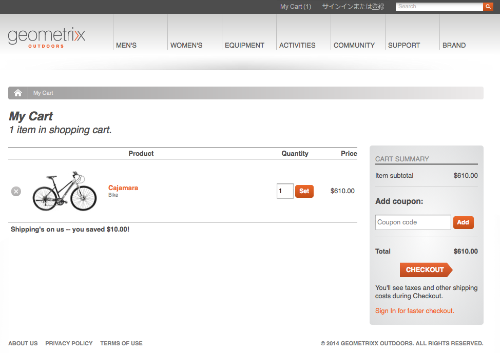

買い物かごは、使用しているエンジンに応じて次のように保存されます。

* AEM の汎用エンジンは、買い物かごを cookie に保存します。
* 特定の e コマースエンジンは、セッションで買い物かごを保存できます。

どちらの場合も、項目はログイン/ログアウト（同じマシン/ブラウザー上でのみ）をまたいで買い物かごに残ります（また、復元することもできます）。 次に例を示します。

* `anonymous` として閲覧し、商品を買い物かごに追加する
* `Allison Parker` としてログインします - 彼女の買い物かごは空です
* 商品を買い物かごに追加する
* ログアウト - 買い物かごには `anonymous` の商品が表示される

* `Allison Parker` として再度ログインします - 彼女の商品が買い物かごに復元されます

>[!NOTE]
>
>anonymous の買い物かごは、同じコンピューター／ブラウザー上でのみ復元できます。

>[!NOTE]
>
>`admin` アカウントを使用して買い物かごの中身の復元をテストすることはお勧めしません。e コマースエンジン（hybris など）の `admin` アカウントと競合する可能性があるからです。

>[!NOTE]
>
>hybris は、定義した時間が経過した後に保留中の買い物かごを削除するように設定できます。

チェックアウト前は、価格の変更が（両方のシステムで）発生時に反映されます。

### 注文情報 {#order-information}

注文に関する実装情報に応じて、注文は e コマースエンジンまたはAEMに保持され、この情報はAEMによってレンダリングされます。

様々な情報が保存されます。次の情報が含まれます。

* **注文 ID**

   注文の参照番号。

* **注文日時**

   発注日。

* **ステータス**

   注文のステータス。例：発送済み

* **通貨**

   注文の通貨。

* **コンテンツ項目**

   並べ替えられた品目のリスト。

* **小計**

   注文された品目の合計金額。

* **税**

   注文に対して支払うすべての税金の金額。

* **送料**

   送料。

* **合計**

   注文の合計金額（注文された品目、税、送料）。

* **請求先住所**

   請求書を送付する住所。

* **支払いトークン**

   支払い方法。

* **支払いステータス**

   支払のステータス。

* **発送先住所**

   商品を発送する住所。

* **発送方法**

   発送の方法。例：陸路、海路または空路。

* **追跡番号**

   配送会社が使用する追跡番号。

* **追跡リンク**

   配送中に注文の追跡に使用するリンク。

>[!NOTE]
>
>注文を作成ウィザードで使用されるフィールドは、タッチ操作向けの基礎モードがその場所に対して定義されているかどうかで決まります。一般的な例では、次の場所にあります。\
>`/etc/scaffolding/geometrixx-outdoors/order/jcr:content/cq:dialog`

注文が AEM 内に保持されている場合、注文コンソールには注文ごとに次の内容が表示されます。

* 買い物かごの中のアイテム数
* 注文の合計金額
* 注文日時
* ステータス

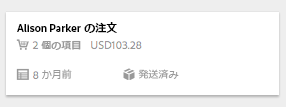

### 注文の追跡 {#order-tracking}

注文後、買い物客は多くの場合次の場所に戻ります。

* 注文のステータスの確認
* 注文から製品を削除
* 注文に商品を追加

注文の配信を受け取った後、買い物客は、一定期間におこなわれた注文の履歴を表示したい場合もあります。

注文の達成と追跡は、通常、e コマースエンジンによって管理されます。 注文履歴コンポーネントを使用して、AEM で情報を表示できます。このコンポーネントには、適用された割引券やプロモーションを含む、関連する詳細がすべて表示されます。次に例を示します。

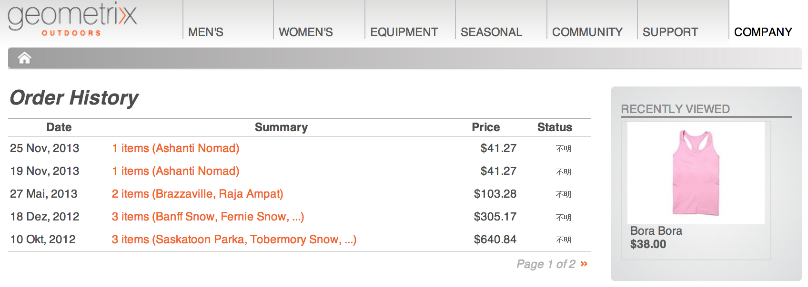

## チェックアウト {#checkout}

チェックアウトは、標準のAEM forms で実装されます。 これにより、マーケティングマネージャーはマーケティングコンテンツでエクスペリエンスをカスタマイズできます。

次に、e コマースは、AEM forms からの入力を使用してチェックアウトプロセスを管理します。

### 支払いセキュリティ {#payment-security}

クレジットカード情報を含む支払いの詳細は、多くの場合、e コマースエンジンによって管理されます。 AEM は、そのようなトランザクション情報をエンジンに転送します（情報はエンジンから支払い処理サービスに転送されます）。

決済カード業界 (PCI) の複雑さを実現できます。

### 注文の確認 {#confirmation-of-order}

注文は画面上で確認され、[注文の追跡](#order-tracking)によって追跡できます。

## 検索 {#search-features}

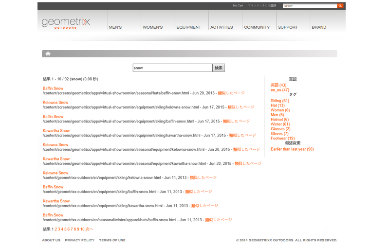

AEM は商品に標準のページを使用しているので、標準の検索コンポーネントを使用して検索ページを作成できます。

より詳細な実装が必要な場合は、次のいずれかを実行できます。

* 必要な機能でデフォルトの検索コンポーネントを拡張します。
* `CommerceService` に検索メソッドを実装し、検索ページで e コマース検索コンポーネントを使用する。

e コマースエンジンを使用している場合は、e コマースエンジンソリューションに e コマース検索 API を完全に実装できるので、標準で提供されている e コマース検索コンポーネントを使用できます。ファセット検索を利用して、JCR やエンジンを検索できます。
