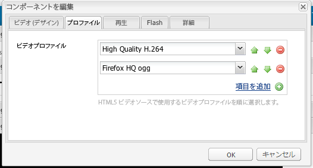

# ビデオコンポーネントの設定 {#configure-the-video-component}

この [ビデオコンポーネント](/help/sites-authoring/default-components-foundation.md#video) では、事前定義済みの標準 (OOTB) ビデオ要素をページに配置できます。

適切なトランスコードをおこなうには、管理者が [FFmpeg のインストールとAEMの設定](#install-ffmpeg) 個別に。 HTML5 要素と共に使用するために[ビデオプロファイルを設定](#configure-video-profiles)することもできます。

>[!CAUTION]
>
>このコンポーネントは、プロジェクトレベルのカスタマイズが必要ない限り、すぐに使用できる状態では機能しなくなりました。

## ビデオプロファイルの設定 {#configure-video-profiles}

HTML5 要素に使用するビデオプロファイルの定義が必要になる場合があります。ここで選択したものは順番に使用されます。アクセスするには、[デザインモード](/help/sites-authoring/default-components-designmode.md)（クラシック UI のみ）を使用して「**[!UICONTROL プロファイル]**」タブを選択します。



また、ビデオコンポーネントのデザインと、 [!UICONTROL 再生], [!UICONTROL Flash]、および [!UICONTROL 詳細].

## FFmpeg のインストールとAEMの設定 {#install-ffmpeg}

ビデオコンポーネントは、からダウンロードできるビデオの適切なトランスコードに、サードパーティのオープンソース製品 FFmpeg を使用します。 [https://ffmpeg.org/](https://ffmpeg.org/). FFmpeg をインストールした後、特定のオーディオコーデックと特定のランタイムオプションを使用するようにAEMを設定する必要があります。

**お使いのプラットフォーム用の FFmpeg をインストールするには、以下を実行します。**:

* **Windows の場合：**

   1. `ffmpeg.zip` というコンパイル済みバイナリをダウンロードします。
   1. フォルダーに解凍します。
   1. システム環境変数の設定 `PATH` から `<*your-ffmpeg-locatio*n>\bin`
   1. AEM を再起動します。

* **Mac OS X：**

   1. Xcode ([https://developer.apple.com/technologies/tools/xcode.html](https://developer.apple.com/technologies/tools/xcode.html))
   1. XQuartz/X11 をインストールします。
   1. MacPorts ([https://www.macports.org/](https://www.macports.org/))
   1. コンソールで、次のコマンドを実行し、指示に従います。

      `sudo port install ffmpeg`

      `FFmpeg` は、 `PATH` AEMはコマンドラインを使用してこれを取得できます。

* **OS X 10.6 用のコンパイル済みバージョンの使用：**

   1. コンパイル済みバージョンをダウンロードします。
   1. 次の場所に抽出します。 `/usr/local` ディレクトリ。
   1. ターミナルから、以下を実行します。

      `sudo ln -s /usr/local/Cellar/ffmpeg/0.6/bin/ffmpeg /usr/bin/ffmpeg`

**AEMを設定するには**:

1. Web ブラウザーで [!UICONTROL CRXDE Lite] を開きます。([http://localhost:4502/crx/de](http://localhost:4502/crx/de))
1. を選択します。 `/libs/settings/dam/video/format_aac/jcr:content` ノードに追加し、ノードのプロパティが次のようになっていることを確認します。

   * audioCodec：

      ```
       aac
      ```

   * customArgs:

      ```
       -flags +loop -me_method umh -g 250 -qcomp 0.6 -qmin 10 -qmax 51 -qdiff 4 -bf 16 -b_strategy 1 -i_qfactor 0.71 -cmp chroma -subq 8 -me_range 16 -coder 1 -sc_threshold 40 -b-pyramid normal -wpredp 2 -mixed-refs 1 -8x8dct 1 -fast-pskip 1 -keyint_min 25 -refs 4 -trellis 1 -direct-pred 3 -partitions i8x8,i4x4,p8x8,b8x8
      ```

1. 設定をカスタマイズするには、 `/apps/settings/` ノードを開き、以下に同じ構造を移動します。 `/conf/global/settings/` ノード。 では編集できません `/libs` ノード。 例えば、パスをオーバーレイするには、次のように指定します。 `/libs/settings/dam/video/fullhd-bp`、で作成します。 `/conf/global/settings/dam/video/fullhd-bp`.

   >[!NOTE]
   >
   >変更が必要なプロパティだけでなく、プロファイルノード全体をオーバーレイ／編集してください。そのようなリソースは SlingResourceMerger 経由で解決されません。

1. いずれかのプロパティを変更した場合は、「**[!UICONTROL すべて保存]**」をクリックします。

>[!NOTE]
>
>OOTB ワークフローモデルは、AEMインスタンスをアップグレードしても保持されません。 Adobeでは、OOTB ワークフローモデルを編集する前にコピーすることをお勧めします。 例えば、 DAM アセットの更新モデルの FFmpeg トランスコーディング手順を編集する前に、 OOTB DAM アセットの更新モデルをコピーして、アップグレード前に存在したビデオプロファイル名を選択します。 次に、 `/apps` OOTB モデルに対するカスタムの変更をAEMで取得できるようにするノードです。
