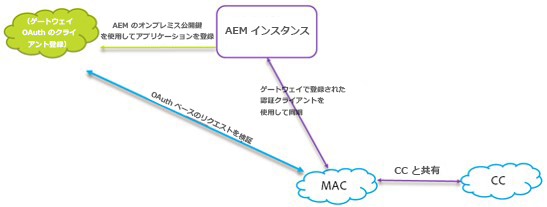
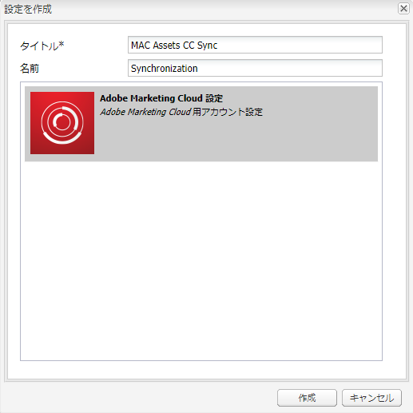
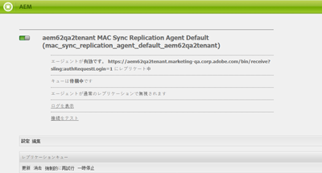

# AEM Assets統合とExperience Cloudの設定 {#configure-aem-assets-integration-with-experience-cloud-and-creative-cloud}

Adobe Experience Cloudをご利用のお客様は、Adobe Experience Manager Assets 内のアセットをAdobe Creative Cloudと（またはその逆と）同期できます。 また、アセットを Experience Cloud に（またはその逆に）同期することもできます。この同期は、 [!DNL Adobe I/O]. 更新された名前： [!DNL Adobe Marketing Cloud] が [!DNL Adobe Experience Cloud].

この統合をセットアップするためのワークフローを以下に示します。

1. での認証の作成 [!DNL Adobe I/O] パブリックゲートウェイを使用して、アプリケーション ID を取得します。
1. アプリケーション ID を使用して、AEM Assetsインスタンス上にプロファイルを作成します。
1. この設定を使用してアセットを同期します。

バックエンドでは、 サーバーがゲートウェイを使用してプロファイルを認証し、AEM Assets と Experience Cloud 間でデータを同期します。

>[!NOTE]
>
>この機能は、AEM Assetsで非推奨（廃止予定）となりました。 で置換を検索 [AEMとCreative Cloud統合のベストプラクティス](/help/assets/aem-cc-integration-best-practices.md). クエリがある場合は、 [連絡先Adobeカスタマーサポート](https://www.adobe.com/account/sign-in.supportportal.html).

<!-- Hiding this for now via cqdoc-16834.

>[!NOTE]
>
>Sharing assets between Adobe Experience Cloud and Adobe Creative Cloud requires administrator privileges on the AEM instance.
-->

## アプリケーションの作成 {#create-an-application}

1. [https://legacy-oauth.cloud.adobe.io](https://legacy-oauth.cloud.adobe.io/) でログインして Adobe Developer ゲートウェイインターフェイスにアクセスします。

   >[!NOTE]
   >
   >アプリケーション ID を作成するには管理者権限が必要です。

1. 左側のウィンドウから、に移動します。 **[!UICONTROL 開発者ツール]** > **[!UICONTROL アプリ]** をクリックして、アプリケーションのリストを表示します。
1. クリック **[!UICONTROL 追加]**  をクリックして、アプリケーションを作成します。
1. 「**[!UICONTROL クライアント資格情報]**」リストから「**[!UICONTROL サービスアカウント（JWT アサーション）]**」を選択します。これは、サーバー認証用のサーバー間通信サービスです。

   

1. アプリケーションの名前とオプションの説明を指定します。
1. 「**[!UICONTROL 組織]**」リストからアセットを同期する組織を選択します。
1. 次の **[!UICONTROL 範囲]** リスト、選択 **[!UICONTROL dam-read]**, **[!UICONTROL dam-sync]**, **[!UICONTROL dam-write]**、および **[!UICONTROL cc-share]**.
1. 「**[!UICONTROL 作成]**」をクリックします。アプリケーションが作成されたことを示すメッセージが表示されます。

   

1. 新規アプリケーションに対して生成された&#x200B;**[!UICONTROL アプリケーション ID]** をコピーします。

   >[!CAUTION]
   >
   >**[!UICONTROL アプリケーション ID]** ではなく&#x200B;**[!UICONTROL アプリケーションの秘密鍵]**&#x200B;を誤ってコピーしないようにしてください。

## 新しい設定をExperience Cloudに追加 {#add-a-new-configuration}

1. AEM Assets のローカルインスタンスの UI で AEM のロゴをクリックし、**[!UICONTROL ツール]**／**[!UICONTROL クラウドサービス]**／**[!UICONTROL 従来のクラウドサービス]**&#x200B;の順に移動します。

1. を **[!UICONTROL Adobe Experience Cloud]** サービス。 設定が存在しない場合は、「 **[!UICONTROL 今すぐ設定]**. 設定が存在する場合は、 **[!UICONTROL 設定を表示]** をクリックし、 `+` 新しい設定を追加します。

   >[!NOTE]
   >
   >組織の管理者権限を持つ Adobe ID アカウントを使用してください。

1. **[!UICONTROL 設定を作成]**&#x200B;ダイアログで、新しい設定のタイトルと名前を指定し、「**[!UICONTROL 作成]**」をクリックします。

   

1. 「**[!UICONTROL テナント URL]**」フィールドに、AEM Assets の URL を指定します。過去に、URL が `https://<tenant_id>.marketing.adobe.com`、をに変更します。 `https://<tenant_id>.experiencecloud.adobe.com`.

   1. **ツール／クラウドサービス／従来のクラウドサービス**&#x200B;に移動します。Adobe Experience Cloudで、 **設定を表示**.
   1. 編集する既存の設定を選択します。 設定を編集し、 `marketing.adobe.com` から `experiencecloud.adobe.com`.
   1. 設定を保存します。MAC-sync レプリケーションエージェントをテストします。

1. 内 **[!UICONTROL クライアント ID]** 「 」フィールドで、プロシージャの最後にコピーしたアプリケーション ID を貼り付けます。 [アプリの作成](#create-an-application).

   

1. 「 **[!UICONTROL 同期]**」で「**[!UICONTROL 有効]**」を選択して同期を有効にし、「**[!UICONTROL OK]**」をクリックします。次を選択した場合、 **無効**&#x200B;を指定した場合、同期は単一の方向で動作します。

1. 設定ページから「**[!UICONTROL 公開鍵を表示]**」をクリックして、インスタンスに対して生成された公開鍵を表示します。または、 **[!UICONTROL OAuth ゲートウェイ用の公開鍵をダウンロード]** をクリックして、公開鍵を含むファイルをダウンロードします。 次に、ファイルを開いて公開鍵を表示します。

## 同期の有効化 {#enable-synchronization}

1. 手順の最後の手順で説明した次のいずれかの方法を使用して、公開鍵を表示します [新しい設定をExperience Cloudに追加](#add-a-new-configuration). 「**[!UICONTROL 公開鍵を表示]**」をクリックします。

1. 公開鍵をコピーし、 **[!UICONTROL 公開鍵]** で作成したアプリケーションの設定インターフェイスのフィールド [アプリの作成](#create-an-application).

   

1. 「**[!UICONTROL 更新]**」をクリックします。アセットをAEM Assetsインスタンスと同期します。

## 同期のテスト {#test-the-synchronization}

1. ローカルのAEM AssetsインスタンスのユーザーインターフェイスでAEMロゴをクリックし、に移動します。 **[!UICONTROL ツール]**> **[!UICONTROL 導入]**> **[!UICONTROL レプリケーション]**：同期用に作成されたレプリケーションプロファイルを検索します。
1. の **[!UICONTROL レプリケーション]** ページ、クリック **[!UICONTROL 作成者のエージェント]**.
1. プロファイルのリストから、組織のデフォルトのレプリケーションプロファイルをクリックし、それを開きます。
1. ダイアログで、「**[!UICONTROL 接続をテスト]**」をクリックします。

   

1. レプリケーションのテストが完了したら、テスト結果の末尾の成功メッセージを確認します。

## ユーザーをExperience Cloudに追加 {#add-users-to-experience-cloud}

1. 管理者の資格情報を使用してExperience Cloudにログインします。
1. レールから、に移動します。 **[!UICONTROL 管理]** 次に、 **[!UICONTROL Enterprise Dashboard を起動]**.
1. レールの「**[!UICONTROL ユーザー]**」をクリックして、**[!UICONTROL ユーザー管理]**&#x200B;ページを開きます。
1. ツールバーで、 **追加** .
1. Creative Cloud とアセットを共有できるようにするユーザーを 1 人以上追加します。

   >[!NOTE]
   >
   >Experience Cloudに追加したユーザーのみがAEM AssetsからCreative Cloudにアセットを共有できます。

## AEM AssetsとExperience Cloud {#exchange-assets-between-aem-and-experience-cloud}

1. AEM Assets にログインします。
1. Assets コンソールで、フォルダーを作成し、いくつかのアセットをアップロードします。例えば、**mc-demo** というフォルダーを作成して、アセットをアップロードします。
1. フォルダーを選択し、 **共有** .
1. メニューから、 **[!UICONTROL Adobe Experience Cloud]** そしてクリック **[!UICONTROL 共有]**. フォルダーがフォルダーと共有されたことを通知するExperience Cloud。

   

   >[!NOTE]
   >
   >タイプの Assets フォルダーの共有 `sling:OrderedFolder`は、Adobe Experience Cloudでの共有のコンテキストではサポートされていません。 フォルダーを共有したい場合は、AEM Assets でフォルダーを作成するときに「**[!UICONTROL 並べ替え]**」オプションを選択しないでください。

1. AEM Assetsユーザーインターフェイスを更新します。 ローカルのAEM Assetsインスタンスの Assets コンソールで作成したフォルダーが、Experience Cloudユーザーインターフェイスにコピーされます。 AEM AssetsのExperience Cloudーにアップロードしたアセットは、AEMサーバーで処理された後、フォルダーのコピーに表示されます。
1. また、フォルダー内のレプリケートされたフォルダーのコピーにExperience Cloudをアップロードできます。 処理された後、アセットは AEM Assets 内の共有フォルダーに表示されます。

<!-- Removing as per PM guidance via https://jira.corp.adobe.com/browse/CQDOC-16834?focusedCommentId=22881523&page=com.atlassian.jira.plugin.system.issuetabpanels:comment-tabpanel#comment-22881523.
## Exchange assets between AEM Assets and Creative Cloud {#exchange-assets-between-aem-assets-and-creative-cloud}

AEM Assets lets you share folders containing assets with Adobe Creative Cloud users.

1. In the Assets console, select the folder to share with Creative Cloud.
1. From the toolbar, click **[!UICONTROL Share]** .
1. From the list, select the **[!UICONTROL Adobe Creative Cloud]** option.

   >[!NOTE]
   >
   >The options are available for users with read permissions on the root. Users must have the required permission to access the replication agent information of Marketing Cloud.

1. In the **[!UICONTROL Creative Cloud Sharing]** page, add the user to share the folder with and choose a role for the user. Click **[!UICONTROL Save]** and click **[!UICONTROL OK]**.

1. Log on to Creative Cloud with the credentials of the user you shared the folder with. The shared folder is available in Creative Cloud.

The AEM Assets-Marketing Cloud synchronization is designed in a way that the user machine instance from where the asset is uploaded retains the right to modify the asset. Only these changes are propagated to the other instance.

For example, if an asset is uploaded from an AEM Assets (on premises) instance, the changes to the asset from this instance are propagated to the Marketing Cloud instance. However, the changes done from the Marketing Cloud instance to the same asset aren’t propagated to the AEM instance and vice versa for asset uploaded from Marketing Cloud.
-->

>[!MORELIKETHIS]
>
>* [アセットとCreative Cloudの統合のベストプラクティス](/help/assets/aem-cc-integration-best-practices.md)
>* [アセットからCreative Cloudへのフォルダー共有のベストプラクティス](/help/assets/aem-cc-folder-sharing-best-practices.md)

