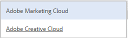

# AEM Assets 統合と Experience Cloud の設定 {#configure-aem-assets-integration-with-experience-cloud-and-creative-cloud}

Adobe Experience Cloud のお客様は、Adobe Experience Manager Assets 内のアセットを Adobe Creative Cloud と同期できます。また、その逆も可能です。また、アセットを Experience Cloud に（またはその逆に）同期することもできます。[!DNL Adobe I/O] 経由でこの同期をセットアップできます。[!DNL Adobe Marketing Cloud] の更新された名前は [!DNL Adobe Experience Cloud] です。

この統合をセットアップするためのワークフローを以下に示します。

1. [!DNL Adobe I/O] で公開ゲートウェイを使用して認証を作成し、アプリケーション ID を取得します。
1. AEM Assets インスタンス上でアプリケーション ID を使用してプロファイルを作成します。
1. この設定を使用してアセットを同期します。

バックエンドでは、 AEM サーバーがゲートウェイを使用してプロファイルを認証し、Assets と Experience Cloud 間でデータを同期します。

>[!NOTE]
>
>この機能は、AEM Assetsで非推奨（廃止予定）となりました。 詳しくは、[AEM と Creative Cloud の統合のベストプラクティス](/help/assets/aem-cc-integration-best-practices.md)を参照してください。質問がある場合は、[Adobe カスタマーサポートまでお問い合わせください](https://www.adobe.com/jp/account/sign-in.supportportal.html)。

<!-- Hiding this for now via cqdoc-16834.

>[!NOTE]
>
>Sharing assets between Adobe Experience Cloud and Adobe Creative Cloud requires administrator privileges on the AEM instance.
-->

## アプリケーションの作成 {#create-an-application}

1. [https://legacy-oauth.cloud.adobe.io](https://legacy-oauth.cloud.adobe.io/) でログインして Adobe Developer ゲートウェイインターフェイスにアクセスします。

   >[!NOTE]
   >
   >アプリケーション ID を作成するには管理者権限が必要です。

1. 左側のウィンドウから、**[!UICONTROL 開発者ツール]**／**[!UICONTROL アプリケーション]**&#x200B;に移動して、アプリケーションのリストを表示します。
1. 「**[!UICONTROL 追加]**」 をクリックして、アプリケーションを作成します。
1. 「**[!UICONTROL クライアント資格情報]**」リストから「**[!UICONTROL サービスアカウント（JWT アサーション）]**」を選択します。これは、サーバー認証用のサーバー間通信サービスです。

   

1. アプリケーションの名前とオプションの説明を指定します。
1. 「**[!UICONTROL 組織]**」リストからアセットを同期する組織を選択します。
1. 「**[!UICONTROL 範囲]**」リストから「**[!UICONTROL dam-read]**」、「**[!UICONTROL dam-sync]**」、「**[!UICONTROL dam-write]**」および「**[!UICONTROL cc-share]**」を選択します。
1. 「**[!UICONTROL 作成]**」をクリックします。アプリケーションが作成されたことを示すメッセージが表示されます。

   

1. 新規アプリケーションに対して生成された&#x200B;**[!UICONTROL アプリケーション ID]** をコピーします。

   >[!CAUTION]
   >
   >**[!UICONTROL アプリケーション ID]** ではなく&#x200B;**[!UICONTROL アプリケーションの秘密鍵]**&#x200B;を誤ってコピーしないようにしてください。

## Experience Cloud への新しい設定の追加 {#add-a-new-configuration}

1. AEM Assets のローカルインスタンスのユーザーインターフェイスで AEM のロゴをクリックし、**[!UICONTROL ツール]**／**[!UICONTROL クラウドサービス]**／**[!UICONTROL 従来のクラウドサービス]**&#x200B;の順に移動します。

1. **[!UICONTROL Adobe Experience Cloud]** サービスを探します。設定が存在しない場合は、「**[!UICONTROL 今すぐ設定]**」をクリックします。設定が存在する場合は、「**[!UICONTROL 設定を表示]**」をクリックし、`+` をクリックして新しい設定を追加します。

   >[!NOTE]
   >
   >組織の管理者権限を持つ Adobe ID アカウントを使用してください。

1. **[!UICONTROL 設定を作成]**&#x200B;ダイアログで、新しい設定のタイトルと名前を指定し、「**[!UICONTROL 作成]**」をクリックします。

   

1. 「**[!UICONTROL テナント URL]**」フィールドに、AEM Assets の URL を指定します。過去に、URL が `https://<tenant_id>.marketing.adobe.com` として定義された場合は、`https://<tenant_id>.experiencecloud.adobe.com` に変更します。

   1. **ツール／クラウドサービス／従来のクラウドサービス**&#x200B;に移動します。Adobe Experience Cloud の下にある「**設定を表示**」をクリックします。
   1. 編集する既存の設定を選択します。設定を編集し、`marketing.adobe.com` を `experiencecloud.adobe.com` で置換します。
   1. 設定を保存します。MAC 同期レプリケーションエージェントをテストします。

1. 「**[!UICONTROL クライアント ID]**」フィールドに、[アプリケーションの作成](#create-an-application)手順の最後でコピーしたアプリケーション ID を貼り付けます。

   

1. 「 **[!UICONTROL 同期]**」で「**[!UICONTROL 有効]**」を選択して同期を有効にし、「**[!UICONTROL OK]**」をクリックします。「**無効**」を選択した場合、同期は単一方向に機能します。

1. 設定ページから「**[!UICONTROL 公開鍵を表示]**」をクリックして、インスタンスに対して生成された公開鍵を表示します。または、「**[!UICONTROL OAuth ゲートウェイ用の公開鍵をダウンロード]**」をクリックして、公開鍵が格納されているファイルをダウンロードします。次に、ファイルを開いて公開鍵を表示します。

## 同期の有効化 {#enable-synchronization}

1. [Experience Cloud への新しい設定の追加](#add-a-new-configuration)の手順の最後で説明した、次のどちらかの方法を使用して、公開鍵を表示します。「**[!UICONTROL 公開鍵を表示]**」をクリックします。

1. 公開鍵をコピーして、[アプリケーションを作成する](#create-an-application)手順で作成したアプリケーションの設定インターフェイスの「**[!UICONTROL 公開鍵]**」フィールドに貼り付けます。

   

1. 「**[!UICONTROL 更新]**」をクリックします。これで、アセットと AEM Assets インスタンスが同期されます。

## 同期のテスト {#test-the-synchronization}

1. AEM Assets のローカルインスタンスの UI で AEM のロゴをクリックし、**[!UICONTROL ツール]**／**[!UICONTROL デプロイメント]**／**[!UICONTROL レプリケーション]**の順に移動して、同期用に作成されたレプリケーションプロファイルを探します。
1. **[!UICONTROL レプリケーション]**&#x200B;ページで、「**[!UICONTROL 作成者のエージェント]**」をクリックします。
1. プロファイルのリストから、組織のデフォルトのレプリケーションプロファイルをクリックし、それを開きます。
1. ダイアログで、「**[!UICONTROL 接続をテスト]**」をクリックします。

   

1. レプリケーションのテストが完了したら、テスト結果の末尾の成功メッセージを確認します。

## Experience Cloud へのユーザーの追加 {#add-users-to-experience-cloud}

1. 管理者の認証情報を使用して Experience Cloud にログインします。
1. パネルの「**[!UICONTROL 管理]**」に移動して「**[!UICONTROL エンタープライズダッシュボードを起動]**」をクリックします。
1. パネルの「**[!UICONTROL ユーザー]**」をクリックして、**[!UICONTROL User Management]** ページを開きます。
1. ツールバーで、「**追加** 」をクリックします。
1. Creative Cloud とアセットを共有できるようにするユーザーを 1 人以上追加します。

   >[!NOTE]
   >
   >Experience Cloudに追加したユーザーのみがAEM AssetsからCreative Cloudにアセットを共有できます。

## AEM Assets と Experience Cloud 間でのアセットの交換 {#exchange-assets-between-aem-and-experience-cloud}

1. AEM Assets にログインします。
1. Assets コンソールで、フォルダーを作成し、いくつかのアセットをアップロードします。例えば、**mc-demo** というフォルダーを作成して、アセットをアップロードします。
1. このフォルダーを選択し、「**共有** 」をクリックします。
1. メニューから「**[!UICONTROL Adobe Experience Cloud]**」を選択し、「**[!UICONTROL 共有]**」をクリックします。フォルダーが Experience Cloud と共有されたことを示すメッセージが表示されます。

   

   >[!NOTE]
   >
   >`sling:OrderedFolder` タイプの Assets フォルダーの共有は、Adobe Experience Cloud での共有ではサポートされません。フォルダーを共有したい場合は、AEM Assets でフォルダーを作成するときに「**[!UICONTROL 並べ替え]**」オプションを選択しないでください。

1. AEM Assets ユーザーインターフェイスを更新します。AEM Assets のローカルインスタンスの Assets コンソールで作成したフォルダーが、Experience Cloud のユーザーインターフェイスにコピーされます。AEM Assets 内のフォルダーにアップロードしたアセットが、AEM サーバーで処理された後、Experience Cloud 内のフォルダーのコピーに表示されます。
1. Experience Cloud にレプリケートされたフォルダーのコピーに、アセットをアップロードすることもできます。処理された後、アセットは AEM Assets 内の共有フォルダーに表示されます。

<!-- Removing as per PM guidance via https://jira.corp.adobe.com/browse/CQDOC-16834?focusedCommentId=22881523&page=com.atlassian.jira.plugin.system.issuetabpanels:comment-tabpanel#comment-22881523.
## Exchange assets between AEM Assets and Creative Cloud {#exchange-assets-between-aem-assets-and-creative-cloud}

AEM Assets lets you share folders containing assets with Adobe Creative Cloud users.

1. In the Assets console, select the folder to share with Creative Cloud.
1. From the toolbar, click **[!UICONTROL Share]** .
1. From the list, select the **[!UICONTROL Adobe Creative Cloud]** option.

   >[!NOTE]
   >
   >The options are available for users with read permissions on the root. Users must have the required permission to access the replication agent information of Marketing Cloud.

1. In the **[!UICONTROL Creative Cloud Sharing]** page, add the user to share the folder with and choose a role for the user. Click **[!UICONTROL Save]** and click **[!UICONTROL OK]**.

1. Log on to Creative Cloud with the credentials of the user you shared the folder with. The shared folder is available in Creative Cloud.

The AEM Assets-Marketing Cloud synchronization is designed in a way that the user machine instance from where the asset is uploaded retains the right to modify the asset. Only these changes are propagated to the other instance.

For example, if an asset is uploaded from an AEM Assets (on premises) instance, the changes to the asset from this instance are propagated to the Marketing Cloud instance. However, the changes done from the Marketing Cloud instance to the same asset aren’t propagated to the AEM instance and vice versa for asset uploaded from Marketing Cloud.
-->

>[!MORELIKETHIS]
>
>* [Assets と Creative Cloud の統合のベストプラクティス](/help/assets/aem-cc-integration-best-practices.md)
>* [アセットからCreative Cloudへのフォルダー共有のベストプラクティス](/help/assets/aem-cc-folder-sharing-best-practices.md)

