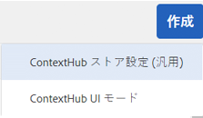

# ContextHub の設定 {#configuring-contexthub}

ContextHub は、コンテキストデータを保存、操作および表示するためのフレームワークです。ContextHub について詳しくは、[開発者ドキュメント](/help/sites-developing/contexthub.md)を参照してください。ContextHub は、タッチ UI の [ClientContext](/help/sites-administering/client-context.md) に置き換わるものです。

[ContextHub](/help/sites-developing/contexthub.md) ツールバーを設定して、プレビューモードで表示する、ContextHub ストアを作成するおよびタッチ操作向け UI を使用して UI モジュールを追加するかどうかを制御します。

## ContextHub の無効化 {#disabling-contexthub}

ContextHub は、AEM のインストールで、デフォルトで有効になります。ContextHub を無効にすると、js/css の読み込みと初期化を回避できます。ContextHub を無効にする方法は 2 つあります。

* ContextHub の設定を編集し、「**ContextHub を無効にする**」チェックボックスをオンにします。

   1. レールで、**ツール／サイト／ContextHub** をクリックまたはタップします。
   1. デフォルトの「**設定コンテナ**」をクリックまたはタップします。
   1. 「**ContextHub 設定**」を選択し、「**選択した要素を編集**」をクリックまたはタップします。
   1. 「**ContextHub を無効にする**」をクリックまたはタップし、「**保存**」をクリックまたはタップします。

または

* CRXDE Lite を使用して、`/libs/settings/cloudsettings` の `disabled` プロパティを **true** に設定します。

>[!NOTE]
>
>[AEM 6.4でのリポジトリの再構築に伴い、](/help/sites-deploying/repository-restructuring.md) ContextHub設定の場所がからに変更され `/etc/cloudsettings` ました。
>
> * `/libs/settings/cloudsettings`
> * `/conf/global/settings/cloudsettings`
> * `/conf/<tenant>/settings/cloudsettings`


## ContextHub UI の表示と非表示 {#showing-and-hiding-the-contexthub-ui}

Adobe Granite ContextHub OSGi サービスを設定して、ページで [ContextHub UI](/help/sites-authoring/ch-previewing.md) を表示または非表示にします。このサービスの PID は、`com.adobe.granite.contexthub.impl.ContextHubImpl.` です。

このサービスを設定するには、[Webコンソール](/help/sites-deploying/configuring-osgi.md#osgi-configuration-with-the-web-console)または[リポジトリ内のJCRノード](/help/sites-deploying/configuring-osgi.md#osgi-configuration-in-the-repository)を使用します。

* **Web コンソール：** UI を表示するには、Show UI プロパティを選択します。UI を非表示にするには、Hide UI プロパティを消去します。
* **JCR ノード：** UI を表示するには、`com.adobe.granite.contexthub.show_ui` ブール値プロパティを `true` に設定します。UI を非表示にするには、プロパティを `false` に設定します。

ContextHub UI を表示に設定すると、AEM オーサーインスタンスのページにのみ表示されます。UI はパブリッシュインスタンスのページには表示されません。

## ContextHub UI モードとモジュールの追加  {#adding-contexthub-ui-modes-and-modules}

ContextHub ツールバーに表示される UI のモードとモジュールをプレビューモードで設定します。

* UI モード：関連モジュールのグループ。
* モジュール：ストアからのコンテキストデータを公開し、作成者がそのコンテキストを操作できるようにするウィジェット。

UI モードはツールバーの左側に一連のアイコンとして表示されます。選択すると、UI モードのモジュールが右側に表示されます。


アイコンは、[Coral UI ライブラリ](https://helpx.adobe.com/jp/experience-manager/6-4/sites/developing/using/reference-materials/coral-ui/coralui3/Coral.Icon.html#availableIcons)からの参照です。

### UI モードの追加  {#adding-a-ui-mode}

UI モードをグループ関連の ContextHub モジュールに追加します。UI モードを作成する際に、ContextHub ツールバーに表示されるタイトルとアイコンを指定します。

1. Experience Manager レールで、ツール／サイト／Context Hub をクリックまたはタップします。
1. デフォルトの設定コンテナをクリックまたはタップします。
1. 「ContextHub 設定」をクリックまたはタップします。
1. 「作成」ボタンをクリックまたはタップして、「ContextHub UI モード」をクリックまたはタップします。

   

1. 次のプロパティの値を指定します。

   * UI モードのタイトル：UI モードを識別するタイトル。
   * モードアイコン：使用する [Coral UI アイコン](https://helpx.adobe.com/experience-manager/6-4/sites/developing/using/reference-materials/coral-ui/coralui3/Coral.Icon.html#availableIcons)のセレクター（例：`coral-Icon--user`）。
   * 有効：オンにすると ContextHub ツールバーに UI モードが表示されます。

1. 「保存」をクリックまたはタップします。

### UI モジュールの追加  {#adding-a-ui-module}

ContextHub UI モジュールを UI モードに追加し、それを ContextHub ツールバーに表示して、ページコンテンツをプレビューできるようにします。UI モジュールを追加するときは、ContextHub に登録されるモジュールタイプのインスタンスを作成します。UI モジュールを追加するには、関連するモジュールタイプの名前が必要です。

AEM には、基本の UI モジュールタイプと、UI モジュールのベースにできる複数のサンプル UI モジュールタイプが用意されています。次の表で、各モジュールタイプについて簡単に説明します。カスタム UI モジュールの開発について詳しくは、[ContextHub UI モジュールの作成](/help/sites-developing/ch-extend.md#creating-contexthub-ui-module-types)を参照してください。

UI モジュールのプロパティには、モジュール固有のプロパティの値を指定できる詳細設定が含まれています。詳細設定は JSON 形式で指定します。表の「モジュールタイプ」列は、各 UI モジュールタイプに必要な JSON コードに関する情報へのリンクを示します。

| モジュールの種類 | 説明 | ストア |
|---|---|---|
| [contexthub.base](/help/sites-developing/ch-samplemodules.md#contexthub-base-ui-module-type) | 汎用の UI モジュールタイプ | UI モジュールのプロパティで設定されます |
| [contexthub.browserinfo](/help/sites-developing/ch-samplemodules.md#contexthub-browserinfo-ui-module-type) | ブラウザーに関する情報が表示されます | surferinfo |
| [contexthub.datetime](/help/sites-developing/ch-samplemodules.md#contexthub-datetime-ui-module-type) | 日付と時間の情報が表示されます | datetime |
| [contexthub.device](/help/sites-developing/ch-samplemodules.md#contexthub-device-ui-module-type) | クライアントデバイスの表示 | emulators |
| [contexthub.location](/help/sites-developing/ch-samplemodules.md#contexthub-location-ui-module-type) | クライアントの緯度と経度、およびマップ上の位置が表示されます。位置は変更できます。 | geolocation |
| [contexthub.screen-orientation](/help/sites-developing/ch-samplemodules.md#contexthub-screen-orientation-ui-module-type) | デバイスの画面の向きが表示されます（横置きまたは縦置き） | エミュレーター |
| [contexthub.tagcloud](/help/sites-developing/ch-samplemodules.md#contexthub-tagcloud-ui-module-type) | ページのタグに関する統計が表示されます | tagcloud |
| [granite.profile](/help/sites-developing/ch-samplemodules.md#granite-profile-ui-module-type) | authorizableID、displayName、familyName など、現在のユーザーのプロファイル情報が表示されます。displayName と familyName の値は変更できます。 | プロファイル |

1. Experience Manager レールで、ツール／サイト／ContextHub をクリックまたはタップします。
1. UI モジュールを追加する設定コンテナをクリックまたはタップします。
1. UI モジュールを追加する ContextHub 設定コンテナをクリックまたはタップします。
1. UI モジュールを追加する UI モードをクリックまたはタップします。
1. 「作成」ボタンをクリックまたはタップして、「ContextHub UI モジュール (汎用)」をクリックまたはタップします。

   

1. 次のプロパティの値を指定します。

   * UI モジュールのタイトル：UI モジュールを識別するタイトル。
   * モジュールタイプ：そのモジュールのタイプ。
   * 有効：オンにすると ContextHub ツールバーに UI モジュールが表示されます。

1. （オプション）デフォルトのストアの設定をオーバーライドするには、UI モジュールを設定する JSON オブジェクトを入力します。
1. 「保存」をクリックまたはタップします。

## ContextHub ストアの作成  {#creating-a-contexthub-store}

ContextHub ストアを作成してユーザーデータを保持し、必要に応じてそのデータにアクセスします。ContextHub ストアは、登録済みのストア候補に基づきます。ストアを作成する際には、ストア候補が登録された storeType の値が必要です（[カスタムストア候補の作成](/help/sites-developing/ch-extend.md#creating-custom-store-candidates)を参照してください）。

### ストアの詳細設定  {#detailed-store-configuration}

ストアを設定すると、詳細設定プロパティによりストア固有のプロパティの値を指定できます。値は、ストアの `config` 関数の `init` パラメーターに基づきます。このため、この値を指定する必要があるかどうかと、指定する値の形式はストアによって変わります。

詳細設定プロパティの値は、JSON 形式の `config` オブジェクトです。

### サンプルのストア候補 {#sample-store-candidates}

AEM には、ストアのベースにできる次のサンプルのストア候補が用意されています。

| ストアの種類 | 説明 |
|---|---|
| [aem.segmentation](/help/sites-developing/ch-samplestores.md#aem-segmentation-sample-store-candidate) | 解決済みおよび未解決の ContextHub セグメントを格納します。ContextHub SegmentManager からセグメントを自動的に取得します |
| [aem.resolvedsegments](/help/sites-developing/ch-samplestores.md#aem-resolvedsegments-sample-store-candidate) | 現在までに解決済みのセグメントを格納します。ContextHub SegmentManagerサービスをリッスンして、ストアを自動的に更新します |
| [contexthub.geolocation](/help/sites-developing/ch-samplestores.md#contexthub-geolocation-sample-store-candidate) | ブラウザーの場所の緯度と経度を格納します。 |
| [contexthub.datetime](/help/sites-developing/ch-samplestores.md#contexthub-datetime-sample-store-candidate) | ブラウザーの場所の現在の日付、時刻、季節を格納します |
| [granite.emulators](/help/sites-developing/ch-samplestores.md#granite-emulators-sample-store-candidate) | 多数のデバイスのプロパティと機能を定義し、現在のクライアントデバイスを検出します |
| [contexthub.generic-jsonp](/help/sites-developing/ch-samplestores.md#contexthub-generic-jsonp-sample-store-candidate) | JSONPサービスからデータを取得して保存します |
| [granite.profile](/help/sites-developing/ch-samplestores.md#granite-profile-sample-store-candidate) | 現在のユーザーのプロファイルデータを格納します |
| [contexthub.surferinfo](/help/sites-developing/ch-samplestores.md#contexthub-surferinfo-sample-store-candidate) | デバイス情報、ブラウザーの種類、画面の向きなど、クライアントに関する情報を格納します |
| [contexthub.tagcloud](/help/sites-developing/ch-samplestores.md#contexthub-tagcloud-sample-data-store) | ページタグとタグ数を格納します |

1. Experience Manager レールで、ツール／サイト／ContextHub をクリックまたはタップします。
1. デフォルトの設定コンテナをクリックまたはタップします。
1. 「Contexthub 設定」をクリックまたはタップします。
1. ストアを追加するには、「作成」アイコンをクリックまたはタップして、「ContextHub ストア設定」をクリックまたはタップします。

   

1. 次の基本設定のプロパティの値を指定して「次へ」をクリックまたはタップします。

   * **設定のタイトル：**&#x200B;ストアを識別するタイトル。
   * **ストアの種類：**&#x200B;ストアのベースとなるストア候補の storeType プロパティの値。
   * **必須：**&#x200B;オン。
   * **有効：**&#x200B;オンにするとストアが有効になります。

1. （オプション）デフォルトのストアの設定をオーバーライドするには、「詳細設定（JSON）」ボックスに JSON オブジェクトを入力します。
1. 「保存」をクリックまたはタップします。

## JSONP サービスの使用例         {#example-using-a-jsonp-service}

この例は、ストアを設定して UI モジュールにデータを表示する方法を示します。この例では、ストアのデータソースとして jsontest.com サイトの MD5 サービスが使用されています。サービスが指定の文字列の MD5 ハッシュコードを JSON 形式で返します。

contexthub.generic-jsonp ストアがサービスコール `https://md5.jsontest.com/?text=%22text%20to%20md5%22` のデータを格納するように設定されます。サービスが UI モジュールに表示される次のデータを返します。

```xml
{
   "md5": "919a56ab62b6d5e1219fe1d95248a2c5",
   "original": "\"text to md5\""
}
```

### contexthub.generic-jsonp ストアの作成  {#creating-a-contexthub-generic-jsonp-store}

contexthub.generic-jsonp のサンプルのストア候補を使用すると、JSON データを返す JSONP サービスや Web サービスからデータを取得できます。このストア候補では、そのストア設定を使用して、使用する JSONP サービスに関する詳細を指定します。

[ Javascript クラスの ](/help/sites-developing/contexthub-api.md#init-name-config)init`ContextHub.Store.JSONPStore` 関数は、このストア候補を初期化する `config` オブジェクトを定義します。`config` オブジェクトには JSONP サービスに関する情報が含まれる `service` オブジェクトが含まれています。ストアを設定するには、詳細設定プロパティの値として `service` オブジェクトを JSON 形式で指定します。

jsontest.com サイトの MD5 サービスからのデータを保存するには、次のプロパティを使用して [ContextHub ストアの作成](/help/sites-administering/contexthub-config.md#creating-a-contexthub-store)の手順に従います。

* **設定のタイトル：** md5
* **ストアの種類：** contexthub.generic-jsonp
* **必須：**&#x200B;オン。
* **有効：**&#x200B;オン
* **詳細設定（JSON）：**

   ```xml
   {
    "service": {
    "jsonp": false,
    "timeout": 1000,
    "ttl": 1800000,
    "secure": false,
    "host": "md5.jsontest.com",
    "port": 80,
    "params":{
    "text":"text to md5"
        }
      }
    }
   ```

### md5 データの UI モジュールの追加 {#adding-a-ui-module-for-the-md-data}

ContextHub ツールバーに UI モジュールを追加して、サンプルの md5 ストアに格納されているデータを表示します。この例では、contexthub.base module が次の UI モジュールの生成に使用されています。


[UI モジュールの追加](/help/sites-administering/contexthub-config.md#adding-a-ui-module)の手順に従って、既存の UI モジュールに、サンプルのペルソナ UI モードなどの UI モジュールを追加します。UI モジュールには、次のプロパティ値を使用します。

* **UI モジュールのタイトル：** MD5
* **モジュールの種類：** contexthub.base
* **詳細設定（JSON）：**

   ```xml
   {
    "icon": "coral-Icon--data",
    "title": "MD5 Converstion",
    "storeMapping": { "md5": "md5" },
    "template": "<p> {{md5.original}}</p>;
                 <p>{{md5.md5}}</p>"
   }
   ```

## ContextHub のデバッグ {#debugging-contexthub}

ContextHub のデバッグモードを有効にして、トラブルシューティングに対応できます。デバッグモードは、ContextHub 設定または CRXDE のいずれかを利用して有効にできます。

### 設定による有効化  {#via-the-configuration}

ContextHub の設定を編集し、「**デバッグ**」オプションをオンにします。

1. レールで、**ツール／サイト／ContextHub** をクリックまたはタップします。
1. デフォルトの「**設定コンテナ**」をクリックまたはタップします。
1. 「**ContextHub 設定**」を選択し、「**選択した要素を編集**」をクリックまたはタップします。
1. 「**デバッグ**」をクリックまたはタップし、「**保存**」をクリックまたはタップします。

### CRXDE による有効化 {#via-crxde}

CRXDE Lite を使用して、`debug` プロパティを **true** に設定します。

* `/conf/global/settings/cloudsettings` または
* `/conf/<tenant>/settings/cloudsettings`

>[!NOTE]
>
>ContextHub設定が従来のパスの下にまだ存在する場合、`debug property`を設定する場所は`/libs/settings/cloudsettings/legacy/contexthub`です。

### サイレントモード {#silent-mode}

サイレントモードでは、すべてのデバッグ情報が無効になります。各 ContextHub 設定に対して個別に設定可能な通常のデバッグオプションとは異なり、サイレントモードは、ContextHub 設定レベルのあらゆるデバッグ設定より優先されるグローバル設定です。

これは、デバッグ情報をまったく必要としないパブリッシュインスタンスに便利なモードです。これはグローバル設定なので、OSGi を介して有効にします。

1. `http://<host>:<port>/system/console/configMgr` で **Adobe Experience Manager Web コンソール設定**&#x200B;を開きます。
1. **Adobe Granite ContextHub** を検索します。
1. 設定「**Adobe Granite ContextHub**」をクリックして、そのプロパティを編集します。
1. 「**サイレントモード**」チェックボックスをオンにし、「**保存**」をクリックします。

## アップグレード後の ContextHub の設定の復元  {#recovering-contexthub-configurations-after-upgrading}

[AEM へのアップグレード](/help/sites-deploying/upgrade.md)が実行されると、ContextHub の設定がバックアップされて安全な場所に格納されます。アップグレード中、デフォルトの ContextHub の設定がインストールされ、既存の設定が置換されます。加えられた変更や追加を保持するにはバックアップが必要です。

ContextHub設定は、次のノードの下の`contexthub`フォルダーに保存されます。

* `/conf/global/settings/cloudsettings`
* `/conf/<tenant>/settings/cloudsettings`

アップグレード後、バックアップは、次の名前のノードの下の`contexthub`フォルダーに保存されます。

`/conf/global/settings/cloudsettings/default-pre-upgrade_yyyymmdd_xxxxxxx` か `/conf/<tenant>/settings/cloudsettings/default-pre-upgrade_yyyymmdd_xxxxxxx` のどちらかにする必要があります。

ノード名の`yyyymmdd`部分は、アップグレードが実行された日付です。

ContextHub設定を復元するには、CRXDE Liteを使用して、ストア、UIモード、UIモジュールを表すノードを`default-pre-upgrade_yyyymmdd_xxxxxx`ノードの下から下にコピーします。

* `/conf/global/settings/cloudsettings` または
* `/conf/<tenant>/settings/cloudsettings`
