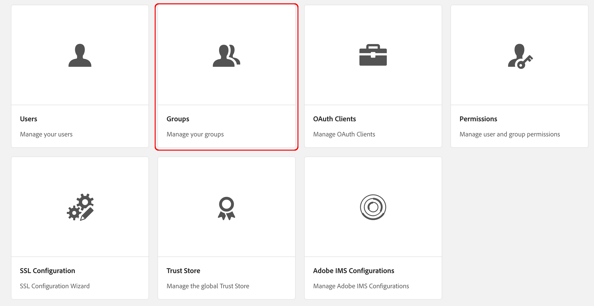
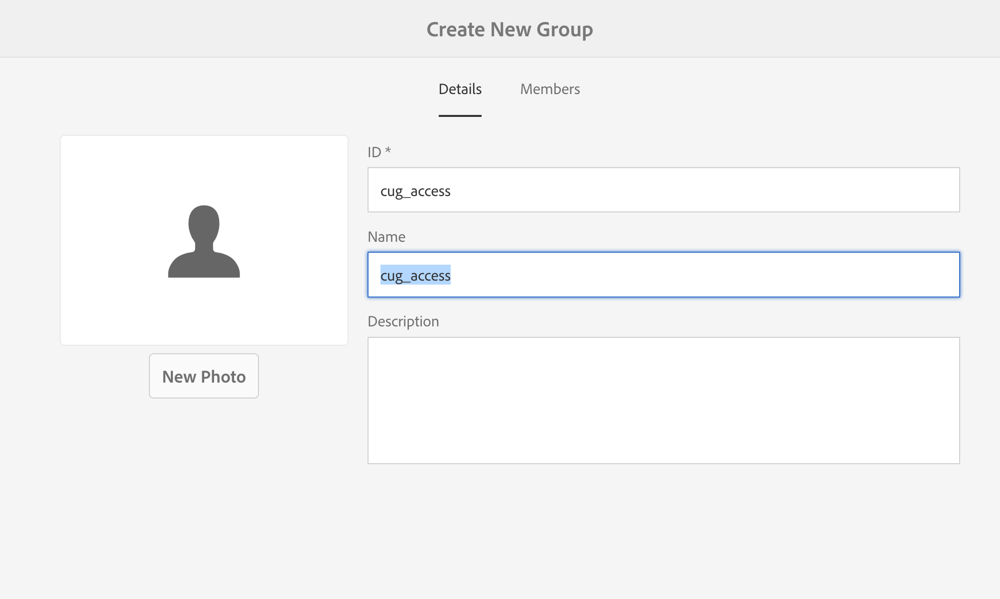

# 閉じられたユーザーグループの作成{#creating-a-closed-user-group}

>[!CAUTION]
>
>AEM 6.4 の拡張サポートは終了し、このドキュメントは更新されなくなりました。 詳細は、 [技術サポート期間](https://helpx.adobe.com/jp/support/programs/eol-matrix.html). サポートされているバージョンを見つける [ここ](https://experienceleague.adobe.com/docs/?lang=ja).

閉じられたユーザーグループ (CUG) は、公開されたインターネットサイト内に存在する特定のページへのアクセスを制限するために使用されます。 このようなページでは、割り当てられたメンバーがログインし、セキュリティ資格情報を提供する必要があります。

Web サイト内でこのような領域を設定するには、次の手順を実行します。

* [クローズドユーザーグループを実際に作成して、メンバーを割り当てます](#creating-the-user-group-to-be-used)。

* [このグループを必要なページに適用](#applying-your-closed-user-group-to-content-pages)し、CUG のメンバーが使用するログインページを選択（または作成）します。CUG をコンテンツページに適用する場合にも指定します。

* [保護された領域内の少なくとも 1 つのページへの何らかの形式のリンクを作成する](#linking-to-the-realm)を含めない場合、表示されません。
* [Dispatcher の設定](#configure-dispatcher-for-cugs) （使用されている場合）

>[!CAUTION]
>
>閉じられたユーザーグループ (CUG) は、常にパフォーマンスを考慮して作成する必要があります。
>
>CUG 内のユーザーとグループの数に制限はありませんが、ページ上の CUG の数が多いと、レンダリングパフォーマンスが低下する場合があります。
>
>パフォーマンステストを行う際は、CUG の影響を常に考慮する必要があります。

## 使用するユーザーグループの作成 {#creating-the-user-group-to-be-used}

閉じられたユーザーグループを作成するには：

1. AEM ホーム画面から&#x200B;**ツール - セキュリティ** に移動します。

   >[!NOTE]
   >
   >詳しくは、 [ユーザーとグループの管理](/help/sites-administering/security.md#managing-users-and-groups) ユーザーとグループの作成と設定に関する詳細は、を参照してください。

1. を選択します。 **グループ** カードを次の画面から表示します。

   

1. 新しいグループを作成するには、右上隅にある「**作成**」ボタンをクリックします。
1. 新しいグループに名前を付けます（例：`cug_access`）。

   

1. 「**メンバー**」タブに移動して、このグループに必要なユーザーを割り当てます。

   

1. CUG に割り当てたユーザーを有効化します。この場合は、`cug_access` のすべてのメンバーです。
1. クローズドユーザーグループをアクティベートして、パブリッシュ環境で使用できるようにします。この場合は、`cug_access` です。

## コンテンツページへの閉じられたユーザーグループの適用 {#applying-your-closed-user-group-to-content-pages}

ページに CUG を適用するには：

1. CUG に割り当てる制限付きセクションのルートページに移動します。
1. ページのサムネールをクリックして選択し、「 **プロパティ** をクリックします。

   

1. 次のウィンドウで、「**詳細**」タブに移動します。
1. 下にスクロールして、「**認証要件**」セクションのチェックボックスをオンにします。

1. 以下の設定パスを追加して、「保存」を押します。
1. 次に「**権限**」タブへ移動し、「**クローズドユーザーグループの編集**」ボタンを押します。

   

   >[注]
   >
   > 「権限」タブの CUG をブループリントからライブコピーにロールアウトすることはできません。ライブコピーを設定する際には、この点を考慮してください。
   >
   > 詳しくは、[このページ](closed-user-groups.md#aem-livecopy)を参照してください。

1. 次のウィンドウで CUG を探して追加します。この場合、という名前のグループを追加します。 **cug_access**. 最後に、 **保存**.
1. 「**有効**」をクリックして、このページ（およびすべての子ページ）が CUG に属することを定義します。
1. グループのメンバーが使用する&#x200B;**ログインページ**&#x200B;を指定します。次に例を示します。

   `/content/geometrixx/en/toolbar/login.html`

   このページは省略可能です。空白のままにすると、標準のログインページが使用されます。

1. を **許可されたグループ**. グループを追加するには+を、削除するには — を使用します。 これらのグループのメンバーのみが、ページにログインしてアクセスできます。
1. 割り当て： **領域** （ページのグループの名前）必要に応じて。 ページのタイトルを使用するには、空白のままにしてください。
1. クリック **OK** をクリックして、仕様を保存します。

パブリッシュ環境におけるプロファイルおよびログイン／ログアウト用のフォームの指定については、[ID 管理](/help/sites-administering/identity-management.md)を参照してください。

## 領域へのリンク {#linking-to-the-realm}

CUG Realm へのリンクのターゲットは匿名ユーザーには表示されないので、リンクチェッカーはこのようなリンクを削除します。

この問題を回避するには、CUG 領域内のページを指す非保護のリダイレクトページを作成することをお勧めします。 これで、ナビゲーションエントリがレンダリングされます。リンクチェックが問題の原因になることはありません。実際にリダイレクトページにアクセスした場合にのみ、ユーザーはログイン資格情報を正常に指定した後に CUG Realm 内にリダイレクトされます。

## CUG 用の Dispatcher の設定 {#configure-dispatcher-for-cugs}

Dispatcher を使用している場合は、次のプロパティを持つ Dispatcher ファームを定義する必要があります。

* [virtualhosts](https://helpx.adobe.com/jp/experience-manager/dispatcher/using/dispatcher-configuration.html#identifying-virtual-hosts-virtualhosts):CUG が適用されるページのパスに一致します。
* \sessionmanagement:以下を参照してください。
* [キャッシュ](https://helpx.adobe.com/jp/experience-manager/dispatcher/using/dispatcher-configuration.html#configuring-the-dispatcher-cache-cache):CUG が適用されるファイル専用のキャッシュディレクトリ。

### CUG 用の Dispatcher セッション管理の設定 {#configuring-dispatcher-session-management-for-cugs}

[dispatcher.any ファイルのセッション管理](https://helpx.adobe.com/jp/experience-manager/dispatcher/using/dispatcher-configuration.html#enabling-secure-sessions-sessionmanagement)を CUG 用に設定します。CUG ページへのアクセスがリクエストされる際に使用される認証ハンドラーで、セッション管理の設定方法を指定します。

```xml
/sessionmanagement
    ...
    /header "Cookie:login-token" 
    ...
```

>[!NOTE]
>
>Dispatcher ファームでセッション管理が有効になっている場合、ファームが処理するすべてのページはキャッシュされません。CUG の外にあるページをキャッシュするには、CUG 以外のページを処理する 2 つ目のファームを dispatcher.any に\
>作成します。

1. `/directory` を定義して [/sessionmanagement](https://helpx.adobe.com/jp/experience-manager/dispatcher/using/dispatcher-configuration.html#enabling-secure-sessions-sessionmanagement) を設定します。次に例を示します。

   ```xml
   /sessionmanagement
     {
     /directory "/usr/local/apache/.sessions"
     ...
     }
   ```

1. [/allowAuthorized](https://helpx.adobe.com/jp/experience-manager/dispatcher/using/dispatcher-configuration.html#caching-when-authentication-is-used) を `0` に設定します。
