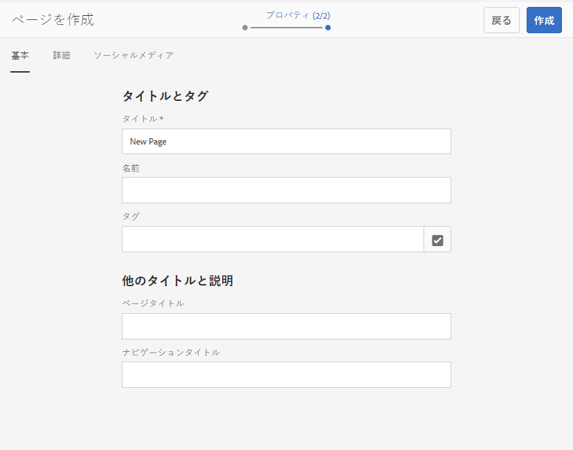
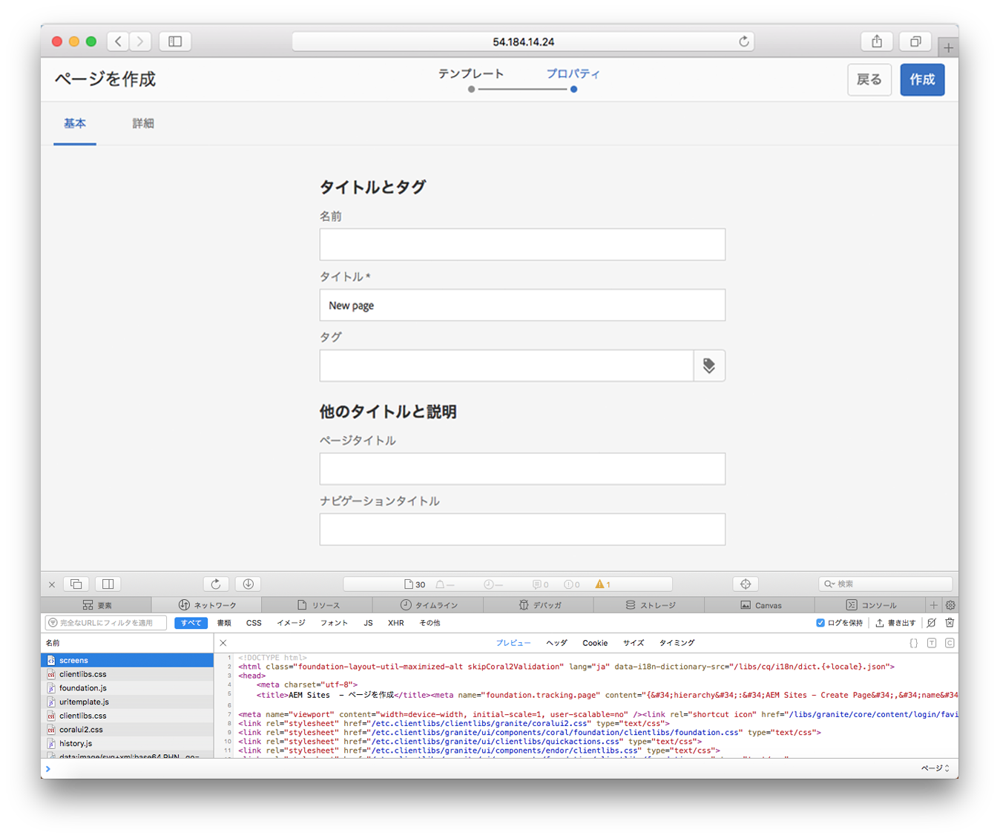
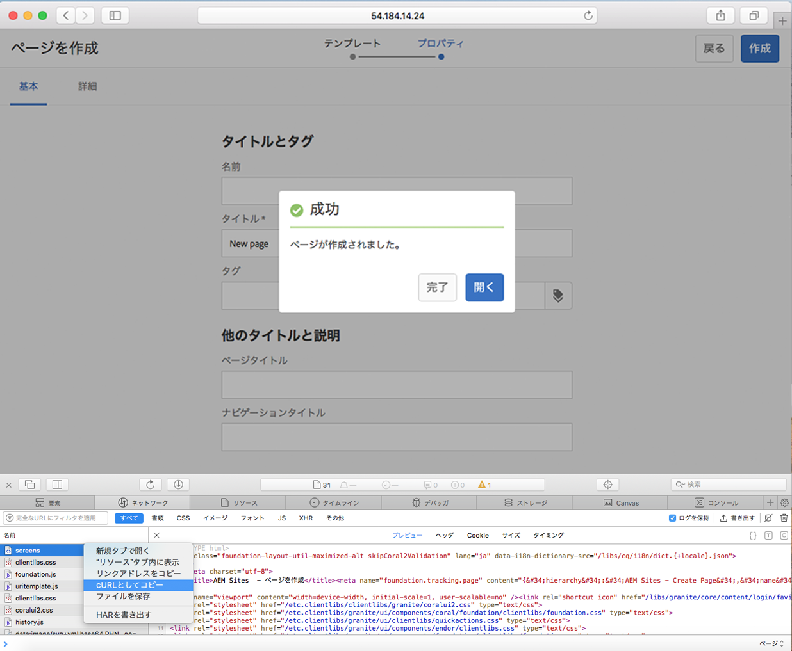

# AEM での cURL の使用{#using-curl-with-aem}

管理者は、多くの場合、システムの一般的なタスクを自動化またはシンプル化する必要があります。例えば、AEM では、ユーザーの管理、パッケージのインストールおよび OSGi バンドルの管理は、一般におこなう必要のあるタスクです。

AEMが構築されるSlingフレームワークのRESTfulの特性により、ほとんどのタスクはURL呼び出しを使用して実行できます。 cURL は、そのような URL 呼び出しの実行に使用でき、AEM 管理者にとって便利なツールです。

## cURL とは  {#what-is-curl}

cURL は、URL 操作を実行するために使用される、オープンソールのコマンドラインツールです。HTTP、HTTPS、FTP、FTPS、SCP、SFTP、SFTP、TFTP、LDAP、DICT、TELNET、FILE、IMAP、POP3、SMTP、RTSPなど、様々なインターネットプロトコルをサポートしています。

cURL は、URL 構文を使用してデータを取得または送信するための、広く使用される安定したツールで、最初にリリースされたのは 1997 年です。cURL という名前の元々の意味は、「see URL」でした。

AEM が構築されている Sling フレームワークの RESTful 特性により、ほとんどのタスクは URL 呼び出しに集約されます。これは、cURL で実行できます。ページのアクティベートおよびワークフローの開始などの[コンテンツ操作タスク](/help/sites-administering/curl.md#common-content-manipulation-aem-curl-commands)やパッケージ管理およびユーザー管理などの[運用タスク](/help/sites-administering/curl.md#common-operational-aem-curl-commands)は、cURL を使用して自動化できます。さらに、AEM のほとんどのタスクについて、[独自の cURL を作成](/help/sites-administering/curl.md#building-a-curl-ready-aem-command)できます。

>[!NOTE]
>
>cURL を使用して実行された AEM コマンドは、AEM の任意のユーザーのように承認される必要があります。cURL を使用して AEM コマンドを実行する場合、すべての ACL およびアクセス権が適用されます。

## cURL のダウンロード  {#downloading-curl}

cURL は、macOS および一部の Linux ディストリビューションに標準で備わっています。実質的にほぼすべてのオペレーティングシステムで使用できます。最新のダウンロードは[https://curl.haxx.se/download.html](https://curl.haxx.se/download.html)で入手できます。

cURL のソースリポジトリは、GitHub にもあります。

## cURL 対応 AEM コマンドの作成 {#building-a-curl-ready-aem-command}

cURL コマンドは、ワークフローのトリガー、OSGi 設定の確認、JMX コマンドのトリガー、レプリケーションエージェントの作成など、AEM のほとんどの操作用に作成できます。

特定の操作に必要な最適なコマンドを見つけるには、ブラウザーの開発者ツールを使用して、AEM コマンドを実行する際に、サーバーに対する POST 呼び出しをキャプチャする必要があります。

次に、例として Chrome ブラウザー内で新しいページを作成してこれをおこなう方法の手順を説明します。

1. AEM 内で呼び出したいアクションを準備します。この場合、**ページを作成**&#x200B;ウィザードの最後まで進んでいますが、まだ&#x200B;**作成**&#x200B;をクリックしていません。

   

1. 開発者ツールを開始して、「**Network**」タブを選択します。コンソールをクリアする前に、「**Preserve log**」オプションをクリックします。

   

1. **ページを作成**&#x200B;ウィザードの「**作成**」をクリックして、実際にワークフローを作成します。
1. 結果として表示される POST アクションを右クリックして、**Copy**／**Copy as cURL** を選択します。

   

1. cURLコマンドをテキストエディターにコピーし、コマンドからすべてのヘッダーを削除します。開始は`-H`（下の画像では青色で示されています）で、`-u <user>:<password>`のように適切な認証パラメーターを追加します。

   

1. コマンドラインで cURL コマンドを実行して、応答を表示します。

   

## 一般的な操作の AEM cURL コマンド {#common-operational-aem-curl-commands}

次に、一般的な管理および操作タスクの AEM cURL コマンドのリストを示します。

>[!NOTE]
>
>次の例では、AEM が `localhost` のポート `4502` で実行され、ユーザー `admin`（パスワード `admin`）を使用していると仮定します。追加のコマンドのプレースホルダーは、山括弧で囲まれています。

### パッケージ管理  {#package-management}

#### リストすべてのインストール済みパッケージ

```shell
curl -u <user>:<password> http://<host>:<port>/crx/packmgr/service.jsp?cmd=ls
```

#### パッケージの作成 {#create-a-package}

```shell
curl -u <user>:<password> -X POST http://localhost:4502/crx/packmgr/service/.json/etc/packages/mycontent.zip?cmd=create -d packageName=<name> -d groupName=<name>
```

#### パッケージのプレビュー {#preview-a-package}

```shell
curl -u <user>:<password> -X POST http://localhost:4502/crx/packmgr/service/.json/etc/packages/mycontent.zip?cmd=preview
```

#### パッケージコンテンツのリスト表示 {#list-package-content}

```shell
curl -u <user>:<password> -X POST http://localhost:4502/crx/packmgr/service/console.html/etc/packages/mycontent.zip?cmd=contents
```

#### パッケージの作成 {#build-a-package}

```shell
curl -X POST http://localhost:4502/crx/packmgr/service/.json/etc/packages/mycontent.zip?cmd=build
```

#### パッケージを再度含める {#rewrap-a-package}

```shell
curl -u <user>:<password> -X POST http://localhost:4502/crx/packmgr/service/.json/etc/packages/mycontent.zip?cmd=rewrap
```

#### パッケージの名前を変更 {#rename-a-package}

```shell
curl -u <user>:<password> -X POST -Fname=<New Name> http://localhost:4502/etc/packages/<Group Name>/<Package Name>.zip/jcr:content/vlt:definition
```

#### パッケージのアップロード {#upload-a-package}

```shell
curl -u <user>:<password> -F cmd=upload -F force=true -F package=@test.zip http://localhost:4502/crx/packmgr/service/.json
```

#### パッケージのインストール {#install-a-package}

```shell
curl -u <user>:<password> -F cmd=install http://localhost:4502/crx/packmgr/service/.json/etc/packages/my_packages/test.zip
```

#### パッケージのアンインストール {#uninstall-a-package}

```shell
curl -u <user>:<password> -F cmd=uninstall http://localhost:4502/crx/packmgr/service/.json/etc/packages/my_packages/test.zip
```

#### パッケージの削除 {#delete-a-package}

```shell
curl -u <user>:<password> -F cmd=delete http://localhost:4502/crx/packmgr/service/.json/etc/packages/my_packages/test.zip
```

#### パッケージのダウンロード {#download-a-package}

```shell
curl -u <user>:<password> http://localhost:4502/etc/packages/my_packages/test.zip
```

### ユーザー管理 {#user-management}

#### 新しいユーザーの作成 {#create-a-new-user}

```shell
curl -u <user>:<password> -FcreateUser= -FauthorizableId=hashim -Frep:password=hashim http://localhost:4502/libs/granite/security/post/authorizables
```

#### 新しいグループの作成 {#create-a-new-group}

```shell
curl -u <user>:<password> -FcreateGroup=group1 -FauthorizableId=testGroup1 http://localhost:4502/libs/granite/security/post/authorizables
```

#### 既存のユーザーへのプロパティの追加 {#add-a-property-to-an-existing-user}

```shell
curl -u <user>:<password> -Fprofile/age=25 http://localhost:4502/home/users/h/hashim.rw.html
```

#### プロファイルを使用したユーザーの作成 {#create-a-user-with-a-profile}

```shell
curl -u <user>:<password> -FcreateUser=testuser -FauthorizableId=hashimkhan -Frep:password=hashimkhan -Fprofile/gender=male http://localhost:4502/libs/granite/security/post/authorizables
```

#### グループのメンバーとしての新しいユーザーの作成 {#create-a-new-user-as-a-member-of-a-group}

```shell
curl -u <user>:<password> -FcreateUser=testuser -FauthorizableId=testuser -Frep:password=abc123 -Fmembership=contributor http://localhost:4502/libs/granite/security/post/authorizables
```

#### グループへのユーザーの追加 {#add-a-user-to-a-group}

```shell
curl -u <user>:<password> -FaddMembers=testuser1 http://localhost:4502/home/groups/t/testGroup.rw.html
```

#### グループからのユーザーの削除 {#remove-a-user-from-a-group}

```shell
curl -u <user>:<password> -FremoveMembers=testuser1 http://localhost:4502/home/groups/t/testGroup.rw.html
```

#### ユーザーのグループのメンバーシップの設定 {#set-a-user-s-group-membership}

```shell
curl -u <user>:<password> -Fmembership=contributor -Fmembership=testgroup http://localhost:4502/home/users/t/testuser.rw.html
```

#### ユーザーの削除 {#delete-a-user}

```shell
curl -u <user>:<password> -FdeleteAuthorizable= http://localhost:4502/home/users/t/testuser
```

#### グループの削除 {#delete-a-group}

```shell
curl -u <user>:<password> -FdeleteAuthorizable= http://localhost:4502/home/groups/t/testGroup
```

### バックアップ {#backup}

詳しくは、[バックアップと復元](/help/sites-administering/backup-and-restore.md#automating-aem-online-backup)を参照してください。

### OSGi {#osgi}

#### バンドルの開始 {#starting-a-bundle}

```shell
curl -u <user>:<password> -Faction=start http://localhost:4502/system/console/bundles/<bundle-name>
```

#### バンドルの停止 {#stopping-a-bundle}

```shell
curl -u <user>:<password> -Faction=stop http://localhost:4502/system/console/bundles/<bundle-name>
```

### Dispatcher {#dispatcher}

#### キャッシュの無効化 {#invalidate-the-cache}

```shell
curl -H "CQ-Action: Activate" -H "CQ-Handle: /content/test-site/" -H "CQ-Path: /content/test-site/" -H "Content-Length: 0" -H "Content-Type: application/octet-stream" http://localhost:4502/dispatcher/invalidate.cache
```

#### キャッシュの削除 {#evict-the-cache}

```shell
curl -H "CQ-Action: Deactivate" -H "CQ-Handle: /content/test-site/" -H "CQ-Path: /content/test-site/" -H "Content-Length: 0" -H "Content-Type: application/octet-stream" http://localhost:4502/dispatcher/invalidate.cache
```

### レプリケーションエージェント {#replication-agent}

#### エージェントのステータスの確認 {#check-the-status-of-an-agent}

```shell
curl -u <user>:<password> "http://localhost:4502/etc/replication/agents.author/publish/jcr:content.queue.json?agent=publish"
http://localhost:4502/etc/replication/agents.author/publish/jcr:content.queue.json?agent=publish
```

#### エージェントの削除 {#delete-an-agent}

```shell
curl -X DELETE http://localhost:4502/etc/replication/agents.author/replication99 -u <user>:<password>
```

#### エージェントの作成 {#create-an-agent}

```shell
curl -u <user>:<password> -F "jcr:primaryType=cq:Page" -F "jcr:content/jcr:title=new-replication" -F "jcr:content/sling:resourceType=/libs/cq/replication/components/agent" -F "jcr:content/template=/libs/cq/replication/templates/agent" -F "jcr:content/transportUri=http://localhost:4503/bin/receive?sling:authRequestLogin=1" -F "jcr:content/transportUser=admin" -F "jcr:content/transportPassword={DES}8aadb625ced91ac483390ebc10640cdf"http://localhost:4502/etc/replication/agents.author/replication99
```

#### エージェントの一時停止 {#pause-an-agent}

```shell
curl -u <user>:<password> -F "cmd=pause" -F "name=publish"  http://localhost:4502/etc/replication/agents.author/publish/jcr:content.queue.json
```

#### エージェントキューのクリア {#clear-an-agent-queue}

```shell
curl -u <user>:<password> -F "cmd=clear" -F "name=publish"  http://localhost:4502/etc/replication/agents.author/publish/jcr:content.queue.json
```

### Communities {#communities}

#### バッジの割り当てと取り消し {#assign-and-revoke-badges}

詳しくは、[コミュニティスコアリングとバッジ](/help/communities/implementing-scoring.md#assign-and-revoke-badges)を参照してください。

詳しくは、[スコアリングとバッジの初期設定](/help/communities/configure-scoring.md#example-setup)を参照してください。

#### MSRP インデックス再作成 {#msrp-reindexing}

詳しくは、[MSRP - MongoDBストレージリソースプロバイダー](/help/communities/msrp.md#running-msrp-reindex-tool-using-curl-command)を参照してください。

### セキュリティ {#security}

#### CRX DE Lite の有効化および無効化 {#enabling-and-disabling-crx-de-lite}

詳しくは、AEM](/help/sites-administering/enabling-crxde-lite.md)でのCRXDE Liteの有効化を参照してください。[

### データストアのガベージコレクション {#data-store-garbage-collection}

詳しくは、[データストアのガベージコレクション](/help/sites-administering/data-store-garbage-collection.md#automating-data-store-garbage-collection)を参照してください。

### Analytics と Target の統合 {#analytics-and-target-integration}

詳細は[Adobe AnalyticsとAdobe Target](/help/sites-administering/opt-in.md#configuring-the-setup-and-provisioning-via-script)を参照。

### シングルサインオン {#single-sign-on}

#### テストヘッダーの送信 {#send-test-header}

詳しくは、[シングルサインオン](/help/sites-deploying/single-sign-on.md)を参照してください。

## 一般的なコンテンツ操作の AEM cURL コマンド {#common-content-manipulation-aem-curl-commands}

次に、コンテンツ操作の AEM cURL コマンドのリストを示します。

>[!NOTE]
>
>次の例では、AEM が `localhost` のポート `4502` で実行され、ユーザー `admin`（パスワード `admin`）を使用していると仮定します。追加のコマンドのプレースホルダーは、山括弧で囲まれています。

### ページ管理 {#page-management}

#### ページのアクティベーション {#page-activation}

```shell
curl -u <user>:<password> -X POST -F path="/content/path/to/page" -F cmd="activate" http://localhost:4502/bin/replicate.json
```

#### ページのアクティベーション解除 {#page-deactivation}

```shell
curl -u <user>:<password> -X POST -F path="/content/path/to/page" -F cmd="deactivate" http://localhost:4502/bin/replicate.json
```

#### ツリーのアクティベーション {#tree-activation}

```shell
curl -u <user>:<password> -F cmd=activate -F ignoredeactivated=true -F onlymodified=true -F path=/content/geometrixx http://localhost:4502/etc/replication/treeactivation.html
```

#### ページをロック {#lock-page}

```shell
curl -u <user>:<password> -X POST -F cmd="lockPage" -F path="/content/path/to/page" -F "_charset_"="utf-8" http://localhost:4502/bin/wcmcommand
```

#### ページのロックを解除 {#unlock-page}

```shell
curl -u <user>:<password> -X POST -F cmd="unlockPage" -F path="/content/path/to/page" -F "_charset_"="utf-8" http://localhost:4502/bin/wcmcommand
```

#### ページをコピー {#copy-page}

```shell
curl -u <user>:<password> -F cmd=copyPage -F destParentPath=/path/to/destination/parent -F srcPath=/path/to/source/location http://localhost:4502/bin/wcmcommand
```

### ワークフロー {#workflows}

詳しくは、[プログラムによるワークフローとの対話](/help/sites-developing/workflows-program-interaction.md)を参照してください。

### Sling コンテンツ {#sling-content}

#### フォルダーの作成 {#create-a-folder}

```shell
curl -u <user>:<password> -F jcr:primaryType=sling:Folder http://localhost:4502/etc/test
```

#### ノードの削除 {#delete-a-node}

```shell
curl -u <user>:<password> -F :operation=delete http://localhost:4502/etc/test/test.properties
```

#### ノードの移動 {#move-a-node}

```shell
curl -u <user>:<password> -F":operation=move" -F":applyTo=/sourceurl"  -F":dest=/target/parenturl/" https://localhost:4502/content
```

#### ノードのコピー {#copy-a-node}

```shell
curl -u <user>:<password> -F":operation=copy" -F":applyTo=/sourceurl"  -F":dest=/target/parenturl/" https://localhost:4502/content
```

#### Sling PostServlet を使用したファイルのアップロード {#upload-files-using-sling-postservlet}

```shell
curl -u <user>:<password> -F"*=@test.properties"  http://localhost:4502/etc/test
```

#### Sling PostServlet の使用およびノード名の指定によるファイルのアップロード {#upload-files-using-sling-postservlet-and-specifying-node-name}

```shell
curl -u <user>:<password> -F"test2.properties=@test.properties"  http://localhost:4502/etc/test
```

#### コンテンツタイプを指定したファイルのアップロード {#upload-files-specifying-a-content-type}

```shell
curl -u <user>:<password> -F "*=@test.properties;type=text/plain" http://localhost:4502/etc/test
```

### アセットの操作 {#asset-manipulation}

詳しくは、[アセットHTTP API](/help/assets/mac-api-assets.md)を参照してください。
