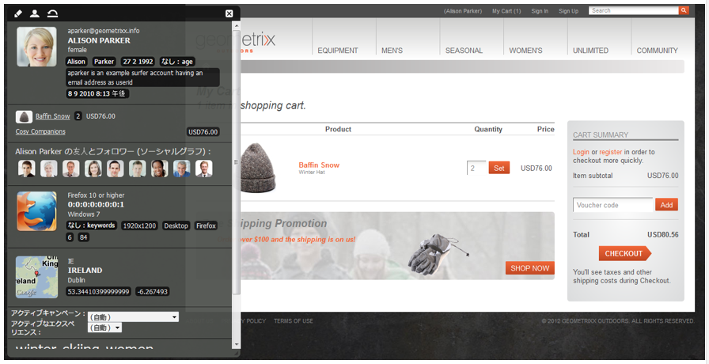

# e コマース {#ecommerce}

>[!CAUTION]
>
>AEM 6.4 の拡張サポートは終了し、このドキュメントは更新されなくなりました。 詳細は、 [技術サポート期間](https://helpx.adobe.com/jp/support/programs/eol-matrix.html). サポートされているバージョンを見つける [ここ](https://experienceleague.adobe.com/docs/?lang=ja).

* [概念 ](/help/sites-administering/concepts.md)
* [管理（汎用）](/help/sites-administering/generic.md)
* [SAP Commerce Cloud ](/help/sites-administering/sap-commerce-cloud.md)
* [Salesforce Commerce Cloud](https://github.com/adobe/commerce-salesforce)
* [Magento](https://www.adobe.io/apis/experiencecloud/commerce-integration-framework/integrations.html#!AdobeDocs/commerce-cif-documentation/master/integrations/02-AEM-Magento.md)

アドビでは、2 つのバージョンの Commerce 統合フレームワークを提供しています。

|  | CIF オンプレミス | CIF クラウド |
|-------------------------|--------------------------------------------------------------------------------------------------------------------------------------------------------------------------------------------------------|------------------------------------------------------------------------------------------------------------------------|
| サポートされている AEM バージョン | AEMオンプレミスまたは AMS 6.x | AEM AMS 6.4 および 6.5 |
| バックエンド | - AEM、Java   - モノリシック統合、ビルド前のマッピング（テンプレート）  - JCR リポジトリ | - Magento  - Java と JavaScript  - JCR リポジトリにはコマースデータは保存されません |
| フロントエンド | AEMサーバーサイドでレンダリングされたページ | 混在ページアプリケーション（ハイブリッドレンダリング） |
| 製品カタログ | - AEMでの製品インポーター、エディター、キャッシュ  - AEM またはプロキシページを含む通常のカタログ | - 製品のインポートなし  - 汎用テンプレート   - コネクタを介したオンデマンドデータ |
| スケーラビリティ | - 数億個までの製品をサポート可能（ユースケースによって異なる）   - Dispatcher でのキャッシュ | - ボリューム制限なし  - Dispatcher または CDN でのキャッシュ |
| 標準化されたデータモデル | 不可 | はい、MagentoGraphQLスキーマ |
| 入手方法 | 可：  - SAP Commerce Cloud（AEM 6.4 と Hybris 5（デフォルト）をサポートし、Hybris 4 との互換性を維持するように更新された拡張機能） - Salesforce Commerce Cloud（AEM 6.4 をサポートする オープンソースコネクタ） | GitHub を通じてオープンソースで使用可能。 Magento Commerce（Magento 2.3.2（デフォルト）をサポート、Magento 2.3.1 と互換性あり） |
| 用途 | 限定的なユースケース：小規模で静的なカタログのインポートが必要なシナリオの場合 | ほとんどの使用例で推奨されるソリューション |

e コマースは、Product Information Management(PIM) と共に、オンラインストアを介した製品の販売に焦点を当てた Web サイトのアクティビティを処理します。

* 製品の作成、ライフタイム、陳腐化
* 価格管理
* トランザクション管理
* カタログ全体の管理
* ライブおよび一元化されたストレージレコード
* Web インターフェイス

AEM e コマースは、Web、モバイル、ソーシャルの各タッチポイントにまたがって、ブランド化されたパーソナライズされたショッピングエクスペリエンスを提供するのに役立ちます。 AEMオーサリング環境を使用すると、ターゲット訪問者のコンテキストとマーチャンダイジング戦略に基づいてページとコンポーネントをカスタマイズできます。例：

* 製品ページ
* 買い物かごのコンポーネント
* コンポーネントをチェックアウト

この実装により、製品情報にリアルタイムでアクセスできます。 これは、次の条件を適用するために使用できます。

* 製品情報の整合性
* 価格
* 在庫管理在庫
* 買い物かごの状態のバリエーション

>[!NOTE]
>
>この統合フレームワークを外部 e コマースプロバイダーと連携して利用するには、まず必要なパッケージをインストールする必要があります。詳しくは、[e コマースのデプロイ](/help/sites-deploying/ecommerce.md)を参照してください。
>
>e コマース機能の拡張について詳しくは、[e コマースの開発](/help/sites-developing/ecommerce.md)を参照してください。

## 主な機能 {#main-features}

AEM e コマースの主な機能は次のとおりです。

* プロジェクトで実現できる機能を示す、以下のような様々な&#x200B;**標準 AEM コンポーネント**&#x200B;があります。

   * 商品の表示
   * 買い物かご
   * チェックアウト
   * 最近表示した製品
   * 割引券
   * その他

   

   >[!NOTE]
   >
   >AEMが提供する統合フレームワークを使用すると、特定の e コマースエンジンに依存しない、コマース機能用の追加のAEMコンポーネントを構築することもできます。

* **検索**  — 次のいずれかを使用します。

   * AEM検索
   * e コマースシステムの検索
   * サードパーティ検索
   * またはこれらの組み合わせ

   

* フルブラウザーウィンドウやモバイルデバイスなど、**複数のチャネルにコンテンツを表示する** AEM 機能を使用します。これにより、訪問者が必要とする形式でコンテンツが提供されます。

   

* **[AEM e コマースフレームワーク](#the-framework)**&#x200B;に基づいて独自の統合実装を開発する機能。

   現在使用可能な 2 つの実装は、両方とも、一般的な API（フレームワーク）に基づいて同じベースで構築されています。 新しい統合の実装には、統合で必要な機能の実装のみが含まれます。 すべての新しい実装はインターフェイスを使用する（したがって実装から独立している）ので、フロントエンドコンポーネントを使用できます。

* 発展の可能性 **買い物客のデータとアクティビティに基づくエクスペリエンス主導のコマース**. これにより、次のような様々なシナリオに対応できます。

   * 1 つの例としては、合計注文金額が特定の金額を超えた場合に送料を下げることができます。
   * また、プロファイルデータ（場所など）を使用する季節ごとのオファーを提供できる場合もあります。 必要に応じて、他の要因に応じて、これらを再びハイライト表示できます。

   次の例では、買い物かごの内容が 75 ドル未満なので、1 つのティーザーが表示されています。

   

   これは、買い物かごの内容が 75 ドルを超えた場合に変更できます。

   

* また、次のようなその他の機能も含まれます。

   * セッション間で保持される買い物かごの内容
   * 詳細な注文履歴
   * 高速カタログ更新

## 枠組み {#the-framework}

この [概念](/help/sites-administering/concepts.md) この節では、フレームワークについて詳しく説明しますが、次の節では、フレームワークの概要を高速で示します。

### 何？ {#what}

* 統合フレームワークは、API、機能を説明する様々なコンポーネント、接続方法の例を提供するいくつかの拡張を提供します。
* フレームワークは、プロジェクトの実装に必要な基本構造を提供します。
* このフレームワークは拡張可能です。
* このフレームワークには、そのまま使用できるデフォルトのサイトはありません。フレームワークを実際の仕様に適合させるには、ある程度の開発作業が必要です。

### 使用する理由 {#why}

* カスタマイズされた e コマースサイトを迅速に実現するために必要な基本メカニズムを提供する。
* TP は、実際の e コマースサイトの開発に必要な柔軟性を提供します。
* ベストプラクティスを説明します。
