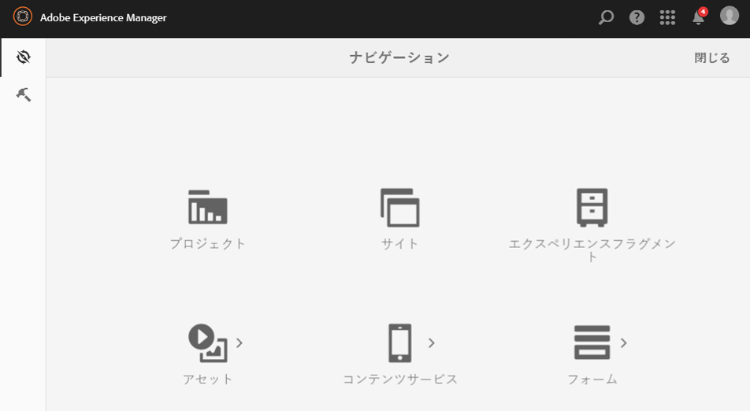
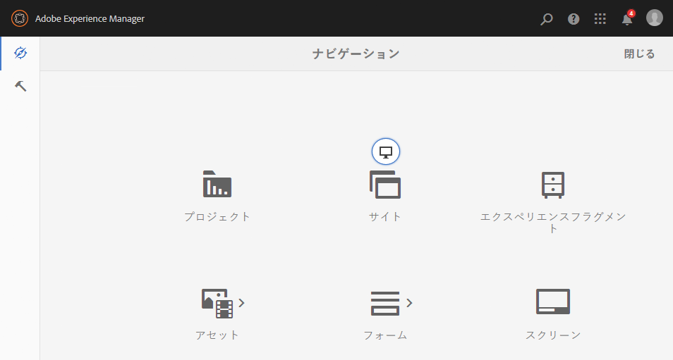

# 管理コンソール{#admin-consoles}

管理コンソールからクラシック UI に切り替える機能は、デフォルトで無効になっています。以前は、コンソールアイコンの上にマウスを移動すると、クラシック UI にアクセスするためのポップアップアイコンが表示されていましたが、このアイコンは表示されなくなりました。

クラシック UI バージョンを持つすべてのコンソールを `/libs/cq/core/content/nav` を個別に再度有効にすることで、 **クラシック UI** オプションを選択すると、コンソールアイコンにマウスを置いたときに、再びポップアップが表示されます。

以下の例では、サイトコンソールのクラシック UI を再有効化しています。

1. CRXDE Liteを使用して、クラシック UI を再度有効にする管理コンソールに対応するノードを探します。 目的のノードは次の場所にあります。

   `/libs/cq/core/content/nav`

   例：

   [ `http://localhost:4502/crx/de/index.jsp#/libs/cq/core/content/nav`](http://localhost:4502/crx/de/index.jsp#/libs/cq/core/content/nav)

1. クラシック UI を再有効化するコンソールのノードを選択します。この例では、サイトコンソールのクラシック UI を再有効化します。

   `/libs/cq/core/content/nav/sites`

1. を使用したオーバーレイの作成 **ノードをオーバーレイ** オプション；例：

   * **パス**: `/apps/cq/core/content/nav/sites`
   * **オーバーレイの場所**: `/apps/`
   * **ノードタイプを一致させる**：アクティブ（チェックボックスをオン）

1. オーバーレイノードに次のブールプロパティを追加します。

   `enableDesktopOnly = {Boolean}true`

1. 「**クラシック UI**」オプションが、管理コンソールに再びポップアップされるようになります。

   

クラシック UI バージョンへのアクセスを再有効化する各コンソールに対して、これらの手順を繰り返します。
