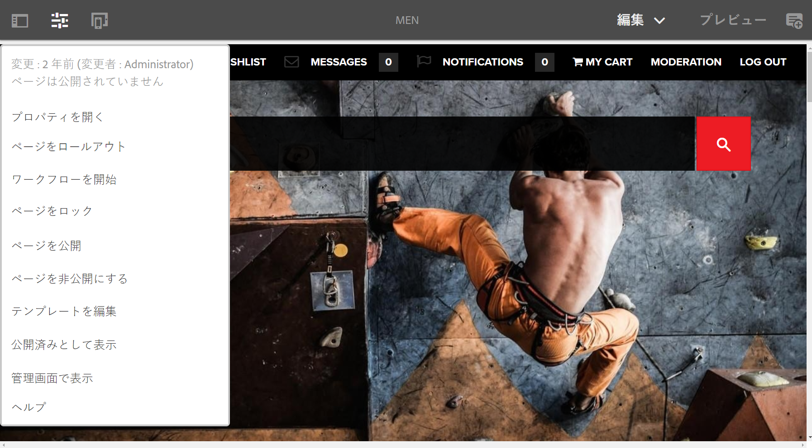
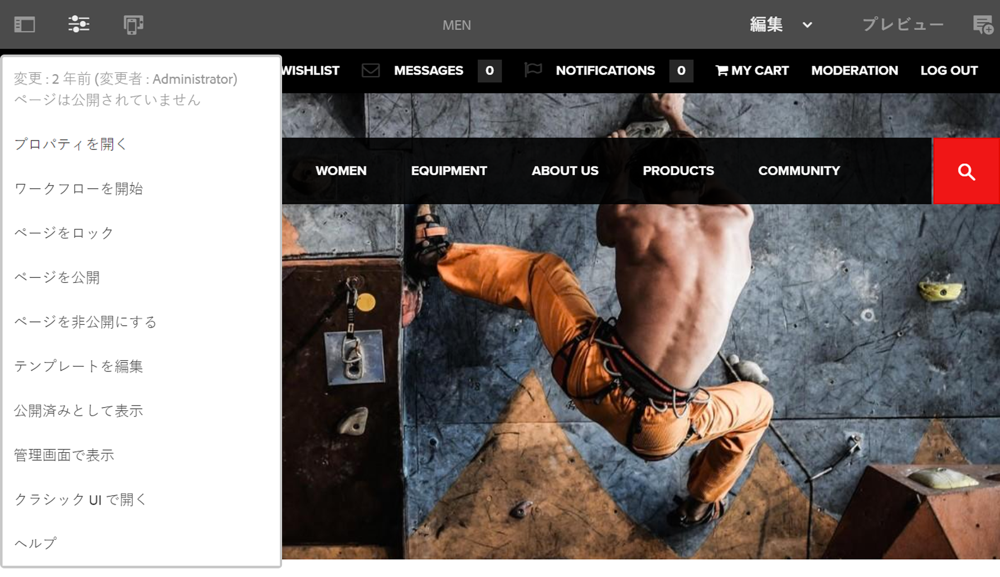

# 編集者{#editor}

エディターからクラシック UI に切り替える機能は、デフォルトで無効になっています。

**ページ情報**&#x200B;メニューのオプション「**クラシック UI で開く**」を再度有効にするには、次の手順に従います。

1. CRXDE Lite を使用して、次のノードを見つけます。

   `/libs/wcm/core/content/editor/jcr:content/content/items/content/header/items/headerbar/items/pageinfopopover/items/list/items/classicui`

   例：

   `http://localhost:4502/crx/de/index.jsp#/libs/wcm/core/content/editor/jcr%3Acontent/content/items/content/header/items/headerbar/items/pageinfopopover/items/list/items/classicui](http://localhost:4502/crx/de/index.jsp#/libs/wcm/core/content/editor/jcr%3Acontent/content/items/content/header/items/headerbar/items/pageinfopopover/items/list/items/classicui`

1. **Overlay Node**&#x200B;オプションを使用してオーバーレイを作成します。例：

   * **パス**: `/apps/wcm/core/content/editor/jcr:content/content/items/content/header/items/headerbar/items/pageinfopopover/items/list/items/classicui`
   * **オーバーレイの場所**: `/apps/`
   * **ノードタイプを一致させる**：アクティブ（チェックボックスをオン）

1. オーバーレイノードに次の複数値テキストプロパティを追加します。

   `sling:hideProperties = ["granite:hidden"]`

1. ページの編集時に、「**クラシック UI で開く**」オプションが&#x200B;**ページ情報**&#x200B;メニューで再度使用可能になります。

   
