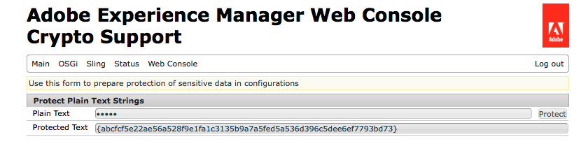

# 設定プロパティの暗号化サポート{#encryption-support-for-configuration-properties}

>[!CAUTION]
>
>AEM 6.4 の拡張サポートは終了し、このドキュメントは更新されなくなりました。 詳細は、 [技術サポート期間](https://helpx.adobe.com/jp/support/programs/eol-matrix.html). サポートされているバージョンを見つける [ここ](https://experienceleague.adobe.com/docs/?lang=ja).

## 概要 {#overview}

この機能を使用すると、すべての OSGi 設定プロパティを、クリアテキストではなく、保護された暗号化形式で保存できます。 Web コンソール UI のフォームは、システム全体の暗号化マスターキーを使用して、クリアテキストから暗号化されたテキストを作成するために使用されます。

サービスで使用される前にプロパティを復号化するために、OSGi 設定プラグインのサポートが追加されました。

>[!NOTE]
>
>暗号化された値を想定するサービスは、IsProtected チェックを使用して、値が既に復号化されている可能性があるので、値を復号化する前に暗号化されているかどうかを確認する必要があります。

## 暗号化サポートの有効化 {#enabling-encryption-support}

以下の手順では、Mail サービスの SMTP パスワードを暗号化する方法を示します。 暗号化する OSGi プロパティに対して、次の手順を実行できます。

1. AEM web コンソール（*https://&lt;serveraddress>:&lt;serverport>/system/console/configMgr*）にアクセスします。
1. 左上隅の **Main／Crypto Support** に移動します。

   

1. **Adobe Experience Manager Web Console Crypto Support** ページが表示されます。

   

1. 内 **プレーンテキスト** 「 」フィールドに、保護する機密データのテキストを入力します。
1. 選択 **Protect**. 「保護」テキストは、暗号化されたテキストとして表示されます。

   

1. 手順 5 の「保護されたテキスト」をコピーし、OSGI フォーム値に貼り付けます。 この例では、暗号化された **SMTP パスワード** が *Day CQ Mail Service*.

   

1. Day CQ Mail Service プロパティを保存します。 SMTP パスワードは暗号化された値として送信されるようになります。

## 復号化のサポート {#decryption-support}

AEMは、設定プロパティを復号化する設定プラグインを提供するようになりました。 このAEM Plugin は、自動的に復号化し、クリアテキストプロパティを取得します。
