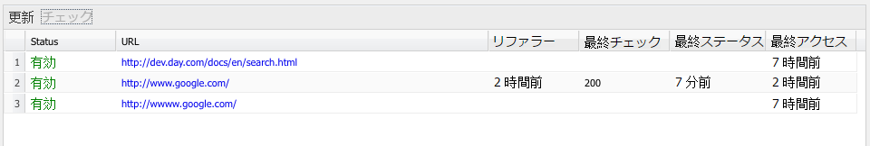

# 外部リンクチェック{#the-external-link-checker}

AEM には、外部リンクチェッカーが用意されています。リンクチェッカー

* すべてのコンテンツページをスキャンします。
* すべての有効なリンクおよび無効なリンクのリストを生成します。
* 個々のコンテンツページで、無効なリンクをその場で壊れているとマークします。

## 外部リンクを検証する方法 {#how-to-validate-external-links}

外部リンクチェックを使用するには：

1. **ツール**&#x200B;コンソールを開きます。
1. 「**外部リンクチェック**」（左右いずれかのウィンドウ）をダブルクリックします。すべての外部リンクのリストが生成されます。
1. 特定のリンクをリスト内で選択し、「**チェック**」をクリックして検証します。

   

   次のような情報

   * リンクのステータス
   * URL
   * リンクが前回検証されてからの経過時間
   * リンクが前回使用可能になってからの経過時間
   * リンクが前回アクセスされてからの経過時間

   が表示されます。

1. 個々のコンテンツページで、無効なリンクは壊れていると表示されます。

   

