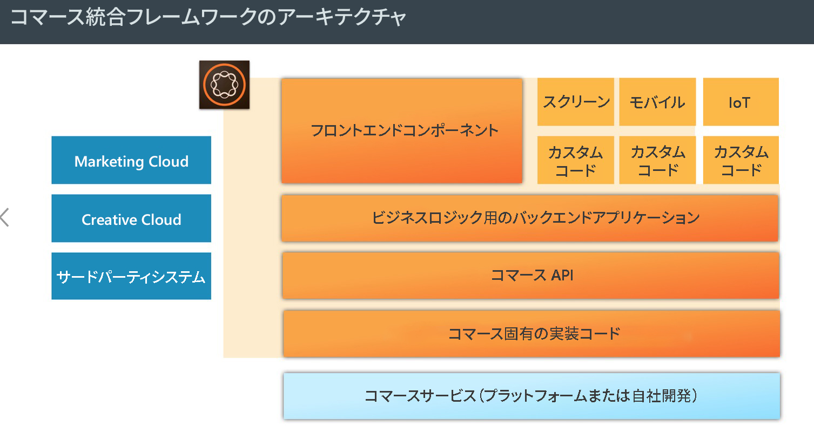
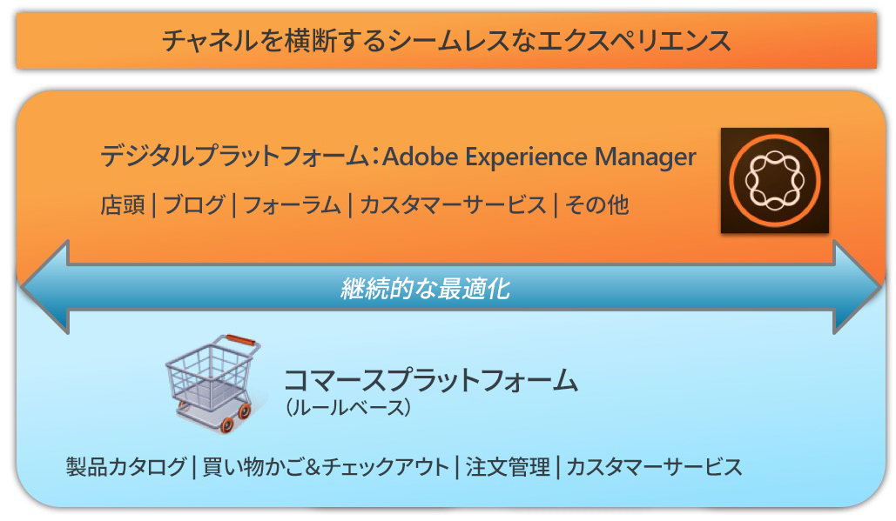

# AEM Commerce - GDPR 対応{#aem-commerce-gdpr-readiness}

>[!CAUTION]
>
>AEM 6.4 の拡張サポートは終了し、このドキュメントは更新されなくなりました。 詳細は、 [技術サポート期間](https://helpx.adobe.com/jp/support/programs/eol-matrix.html). サポートされているバージョンを見つける [ここ](https://experienceleague.adobe.com/docs/?lang=ja).

>[!IMPORTANT]
>
>以下の節では GDPR を例として使用していますが、詳細はすべてのデータ保護およびプライバシー規制（GDPR、CCPA など）に適用できます。

データのプライバシー権に関する EU 一般データ保護規則（GDPR）が 2018 年 5 月に発効します。詳しくは、 [GDPR ページ (Adobeプライバシーセンター )](https://www.adobe.com/jp/privacy/general-data-protection-regulation.html).

>[!NOTE]
>
>詳しくは、 [AEM GDPR 対応](/help/managing/data-protection-and-privacy.md) 詳しくは、を参照してください。

デフォルトのコマース統合では AEM がエクスペリエンスレイヤーとなり、サービスを利用して得られたデータをヘッドレスモードで動作する顧客のコマースプラットフォームに送り返します。

一部のコマースプラットフォームでは、プロファイル情報（`/home/users`）と（コマースプラットフォームにログインするための）コマーストークンが AEM 内に格納されます。これらのユースケースについては、[AEM プラットフォームでの GDPR 要求の処理](/help/sites-administering/handling-gdpr-requests-for-aem-platform.md)をお読みください。

## AEM Commerce での GDPR 要求の処理 {#handling-gdpr-requests-for-aem-commerce}

SalesforcesCommerce Cloud統合の場合、AEM Commerce は GDPR 関連の情報を保存しません。 [Salesforce Cloud](https://documentation.demandware.com/) に要求を転送してください。

hybris および IBM WebSphere 統合の場合、AEM 内に若干のデータが存在します。以下を使用する必要があります。 [AEM Platform GDPR の手順](/help/sites-administering/handling-gdpr-requests-for-aem-platform.md) そして、次の質問を考慮します。

1. **データはどこに保存/使用されますか？** キャッシュ内のユーザープロファイル情報（名前、コマースユーザー識別子、トークン、パスワード、住所などのデータ）が AEM から示されます。
1. **対象となる GDPR データを誰と共有すればよいですか？** AEM Commerce での GDPR 関連データの更新は（前述の関連するプロファイル情報を除く）保存されず、コマースプラットフォームにプロキシされて返されます。
1. **ユーザーデータの削除方法は？** AEMのユーザープロファイルを削除し、コマースプラットフォームでユーザーの削除を呼び出します。

>[!NOTE]
>
>[hybris の wiki](https://wiki.hybris.com/) または [Websphere Commerce のドキュメント](https://www-01.ibm.com/support/docview.wss?uid=swg27036450)を必要に応じて参照してください。
