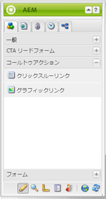
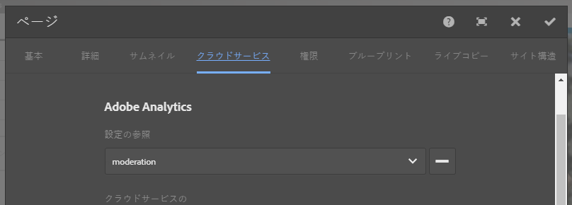

# ランディングページと Adobe Analytics の統合{#integrating-landing-pages-with-adobe-analytics}

AEMは、ランディングページソリューションを [Adobe Analytics](https://www.omniture.com/en/products/analytics/sitecatalyst) 次のコールトゥアクション (CTA) コンポーネントを使用する。

1. クリックスルーコンポーネント
1. グラフィックリンクコンポーネント

これらのコンポーネントは、Adobe Analytics変数（トラフィック、コンバージョン変数）および成功イベントを使用してマッピングでき、Adobe Analyticsに情報を送信するための特定の属性を公開します。

## 前提条件 {#prerequisites}

Adobeでは、 [既存のAEMとAdobe Analyticsの統合](/help/sites-administering/adobeanalytics.md) を参照して、この統合の仕組みを理解してください。

## マッピングに使用できるコンポーネント {#components-available-for-mapping}

AEMで、 **コールトゥアクション** コンポーネント — **ClickThroughLink** および **GraphicalLink**  — サイドキックに表示され、Adobe Analytics変数にマッピングできます。

### Adobe Analytics へのランディングページコンポーネントのマッピング {#mapping-landing-page-components-to-adobe-analytics}

ランディングページコンポーネントを Adobe Analytics にマッピングするには：

1. Adobe Analytics設定を作成し、新しいフレームワークを作成したら、ドロップダウンメニューから適切なレポートスイートを選択します。 この結果、Adobe Analytics の変数が取得され、コンテンツファインダーに表示されます。
1. コールトゥアクション（CTA）コンポーネントを、サイドキックからページ中央のマッピング領域の適切な場所にドラッグ＆ドロップします。

<table> 
 <tbody>
  <tr>
   <td><strong>コンポーネント名</strong></td> 
   <td><strong>公開される属性</strong></td> 
   <td><strong>属性の意味</strong></td> 
  </tr>
  <tr>
   <td><strong>CTA クリックスルーリンク</strong></td> 
   <td><i>eventdata.clickthroughLinkLabel</i>   </td> 
   <td>リンクのラベルまたはリンクのテキスト </td> 
  </tr>
  <tr>
   <td>  </td> 
   <td><i>eventdata.clickthroughLinkTarget</i>   </td> 
   <td>リンクをクリックしたときの移動先 </td> 
  </tr>
  <tr>
   <td>  </td> 
   <td><i>eventdata.events.clickthroughLinkClick</i>   </td> 
   <td>クリックイベント </td> 
  </tr>
  <tr>
   <td><strong>CTA グラフィックリンク</strong></td> 
   <td><i>eventdata.clicktroughImageLabel</i>   </td> 
   <td>CTA 画像のタイトル </td> 
  </tr>
  <tr>
   <td>  </td> 
   <td><i>eventdata.clicktroughImageTarget</i>   </td> 
   <td>リンクを含む画像をクリックしたときの移動先</td> 
  </tr>
  <tr>
   <td>  </td> 
   <td><i>eventdata.clicktroughImageAsset</i>   </td> 
   <td>リポジトリ内の画像アセットへのパス </td> 
  </tr>
  <tr>
   <td>  </td> 
   <td><i>eventdata.events.clicktroughImageClick</i>   </td> 
   <td>クリックイベント</td> 
  </tr>
 </tbody>
</table>

1. コンテンツファインダーで、これらの公開される属性と Adobe Analytics 変数をマッピングします。これで、フレームワークを使用する準備が整いました。
1. これで、新しいランディングページを作成するか、既存の CTA コンポーネントを含む既存のランディングページを開いて、 **Cloud Services** タブ **ページプロパティ** サイドキック（タッチ操作向け UI）で、 **プロパティを開く** をクリックし、 **Cloud Services**) をクリックし、ランディングページで使用するフレームワークを設定します。 ドロップダウンリストからフレームワークを選択します。

   

1. ランディングページを含むフレームワークを設定したら、実装されたコンポーネントが使用できるようになり、CTA でのクリックがすべて Adobe Analytics に記録されます。
