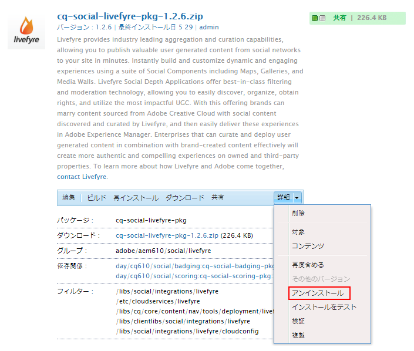
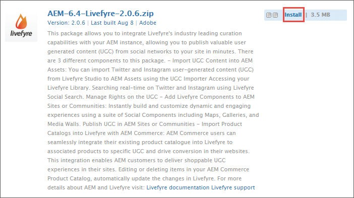
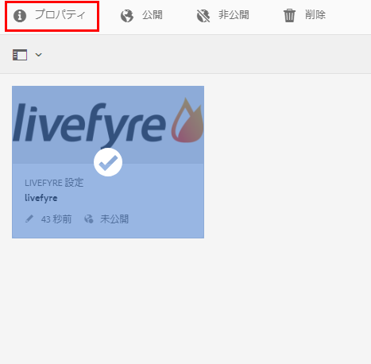

# Livefyre との統合{#integrating-with-livefyre}

Livefyre の業界最高レベルのキュレーション機能を AEM 6.4 と統合する方法を説明します。これにより、ソーシャルネットワークからの有用なユーザー生成コンテンツ（UGC）をサイトに数分で公開できます。

## 概要 {#getting-started}

### AEM 用 Livefyre パッケージのインストール {#install-livefyre-package-for-aem}

AEM 6.4 には、Livefyre 機能パッケージ 1.2.6 がプリインストールされています。このパッケージには Livefyre の AEM Sites との統合のみが含まれているので、更新パッケージをインストールする前に、まずアンインストールする必要があります。最新のパッケージでは、Sites、Assets および Commerce を含む、Livefyre と AEM の完全な統合を利用できます。

>[!NOTE]
>
>AEM-LF パッケージの一部の機能は、ソーシャルコンポーネントフレームワーク（SCF）に依存しています。Livefyre 機能パックをコミュニティ以外のサイトの一部として使用している場合は、Web サイトのオーサー clientlibs に依存関係として *cq.social.scf* を宣言する必要があります。コミュニティ Web サイトの一部として LF 機能パックを使用している場合、この依存関係はすでに宣言されているはずです。

1. From the AEM homepage, click the **Tools** icon on the left rail.
1. Navigate to **Deployment > Packages**.
1. In the Package Manager, scroll until you see the pre-installed Livefyre feature package, then click the package title **cq-social-livefyre-pkg-1.2.6.zip** to expand the options.
1. Click **More > Uninstall**.

   

1. Return to the AEM homepage, click Tools, then navigate to **Deployment > Package Share**.

   ダウンロード可能な機能パックとホットフィックスのリストが表示されます。

1. キーワード検索で &quot;Livefyre&quot; を検索して、お使いの AEM バージョンに対応する Livefyre 機能パックを選択します。

   

1. On the feature pack information page, click **Download**, then read the Package License Agreement and click **Accept**.
1. Return to the Package Manager, locate the newly downloaded package, and click **Install**.

   

   Livefyre-AEM パッケージがインストールされます。統合機能を使い始める前に、Livefyre を使用するように AEM を設定する必要があります。

   For more information on packages, see [How to Work With Packages](https://helpx.adobe.com/experience-manager/6-3/sites/administering/using/package-manager.html).

   For more information and release notes on feature packs, see [Feature Packs](https://helpx.adobe.com/experience-manager/6-3/release-notes/feature-packs-release-notes.html).

### Configure AEM to use Livefyre: Create a Configuration Folder {#configure-aem-to-use-livefyre-create-a-configuration-folder}

1. From the AEM homepage, click the **Tools** icon in the left rail, then navigate to **General > Configuration Browser**.
1. 「**作成**」をクリックして、設定を作成ダイアログを開きます。
1. Name your configuration and check the **Cloud Configurations** checkbox.

   This will create a folder under **Tools > Deployment > Livefyre Configuration** with the name provided.

   

### Livefyre を使用するための AEM の設定：Livefyre 設定 の作成 {#configure-aem-to-use-livefyre-create-a-livefyre-configuration}

組織の Livefyre ライセンス資格情報を使用するように AEM を設定して、Livefyre と AEM の間で通信できるようにします。

1. From the AEM homepage, click the **Tools** icon in the left rail, then navigate to **Deployment > Livefyre Configuration**.
1. 新しい Livefyre 設定を作成する設定フォルダーを選択して、「**作成**」をクリックします。

   

   >[!NOTE]
   >
   >Livefyre設定をフォルダーに追加するには、フォルダーのプロパティでクラウド設定を有効にする必要があります。 設定フォルダーが作成され、設定ブラウザーで管理されます。
   >
   >設定の名前は作成できません。フォルダーのパスによって参照されます。設定はフォルダーごとに 1 つのみです。

1. 新しく作成した Livefyre 設定カードを選択して、「**プロパティ**」をクリックします。

   

1. Enter your organization&#39;s Livefyre credentials, then click **OK**.

   

   To access this information, open Livefyre studio and navigate to **Settings > Integration Settings > Credentials**.

   Livefyre を使用するように AEM インスタンスが設定され、統合機能を使用できます。

### シングルサインオン統合のカスタマイズ {#customize-single-sign-on-integration}

AEM 用 Livefyre パッケージには、AEM Communities プロファイルと Livefyre の SSO サービス間の標準の統合が含まれています。

ユーザーは、AEM サイトにログインすることで、Livefyre ソーシャルコンポーネントにもログインします。ログアウトしたユーザーが、写真のアップロードなど、認証が必要な Livefyre コンポーネント機能を使用しようとすると、Livefyre コンポーネントがユーザー認証を開始します。

デフォルトの認証統合は、すべてのサイトに対して完璧なわけではありません。サイトテンプレートの認証フローに完全に合致させるために、ニーズに合わせてデフォルトの Livefyre Authentication Delegate を上書きすることができます。次の手順を実行します。

1. Using CRXDE Lite, copy */libs/social/integrations/livefyre/components/authorizablecomponent/authclientlib* to */apps/social/integrations/livefyre/components/authorizablecomponent/authclientlib*.
1. Edit and save */apps/social/integrations/livefyre/components/authorizablecomponent/authclientlib/auth.js* to implement a Livefyre Auth Delegate that meets your needs.

   For more information on customizing an Auth Delegate, see [Identity Integration](https://answers.livefyre.com/developers/identity-integration/).

   For more information on AEM Clientlibs, see [Using Client-Side Libraries](https://helpx.adobe.com/experience-manager/6-3/sites/developing/using/clientlibs.html).

## AEM Sites での Livefyre の使用 {#use-livefyre-with-aem-sites}

### Livefyre コンポーネントのページへの追加 {#add-livefyre-components-to-a-page}

Livefyre コンポーネントを Sites 内のページに追加する前に、Livefyre クラウド設定を親ページから継承するか、設定をページに直接追加することで、ページ用の Livefyre を有効にする必要があります。サイトのクラウドサービスの追加方法について、実装を参照します。

ページ用に Livefyre が有効になったら、Livefyre コンポーネントを許可するようにコンテナを設定する必要があります。See [Configuring Components in Design Mode](https://helpx.adobe.com/experience-manager/6-3/sites/authoring/using/default-components-designmode.html) for instructions on how to enable different components.

>[!NOTE]
>
>「シングルサインオン統合のカスタマイズ」で認証が設定されるまで、POST認証が必要なアプリは機能しません。

1. From the **Components** side panel in design mode, select **Livefyre** from the menu to limit the list to available Livefyre components.

   

1. Livefyre コンポーネントを選択して、ページ上の位置にドラッグします。
1. 新しい Livefyre アプリを作成するか、既存のアプリを埋め込むかを選択します。

   既存のアプリを埋め込む場合、アプリを選択するように促されます。新しいアプリを作成する場合、アプリは、コンテンツが表示される前に設定しておく必要があります。アプリは、Livefyre サイト、およびページ用に Livefyre クラウド設定を有効にした際に選択したネットワークに作成されます。

   For more information on inserting components, see [Editing Page Content](https://helpx.adobe.com/experience-manager/6-3/sites/authoring/using/editing-content.html).

### Edit a Livefyre Component for an AEM Page. {#edit-a-livefyre-component-for-an-aem-page}

Livefyre コンポーネントは、Livefyre Studio でのみ設定および編集できます。AEM で次の手順を実行します。

1. 設定する Livefyre コンポーネントをクリックします。
1. Click the **Configure** icon (wrench) to open the configuration dialog.
1. Click **To edit this component, go to Livefyre Studio**.
1. Livefyre Studio でアプリを編集します。

## AEM Assets での Livefyre の使用 {#use-livefyre-with-aem-assets}

### 権限のリクエストと AEM Assets への UGC の読み込み {#request-rights-and-import-ugc-into-aem-assets}

UGC Importer を使用して、Twitter および Instagram ユーザー生成コンテンツ（UGC）を Livefyre Studio から AEM Assets に読み込むことができます。読み込むコンテンツを選択したら、読み込みを完了する前に、コンテンツに対する権限をリクエストする必要があります。

>[!NOTE]
>
>Assets を使用して UGC を読み込む前に、Livefyre Studio でソーシャルアカウントと権限リクエストアカウントを設定する必要があります。See [Setting: Rights Requests](https://marketing.adobe.com/resources/help/en_US/livefyre/c_how_requesting_rights_works.html) for more information.

UGC を AEM Assets に読み込むには：

1. From the AEM homepage, navigate to **Assets > Files**.
1. Click **Create**, then click **Import UGC.**

   

1. 次の方法でコンテンツを見つけます。

   * Livefyre からコンテンツを見つけるには、「UGC ライブラリ」タブをクリックします。フィルターおよび検索を使用して UGC ライブラリからコンテンツを見つけます。
   * Twitter および Instagram からコンテンツを見つけるには、「Twitter」または「Instagram」タブをクリックします。検索またはフィルターを使用してコンテンツを見つけます。

1. 読み込むアセットを選択します。The assets you select are automatically counted and saved under the **Selected** tab.
1. **オプション**:「選択済み」タ **ブをクリックし** 、選択したUGCコンテンツを確認して読み込みます。
1. 「**次へ**」をクリックします。

   

1. 権限リクエストについて、各アセットに対して次のいずれかのオプションを選択します。

   Instagram の場合：

   * **手動での要求を参照し** 、Instagramを使用してコンテンツの所有者にコピーして貼り付けたり、手動で送信したりできるメッセージを取得します。
   * **手動でコンテンツ権限を属性付け** ：個々のアセットの権限を上書きします。
   >[!NOTE]
   >
   >非ビジネスユーザーアカウントからのコンテンツの集計に影響を与える更新により、お客様の代わりにコメントを投稿したり、作成者からの返信を自動的に確認したりすることはできません。 [詳しくはここをクリックしてください](https://developers.facebook.com/blog/post/2018/04/04/facebook-api-platform-product-changes/)。

   

   Twitter の場合

   * **作成者へメッセージ**：コンテンツ所有者に、アセットに対する権限をリクエストするメッセージを送信します。
   * **手動でコンテンツ権限を属性付け** ：個々のアセットの権限を上書きします。

1. 「**読み込み**」をクリックします。

   Twitter の権限リクエストを送信する場合、コンテンツ所有者には、自身のアカウント上に権限リクエストメッセージが表示されます。

   

   >[!NOTE]
   >
   >Twitter には、同じアカウントから来る同じリクエストに対して制限があります。2 つ以上のアセットを読み込む場合、メッセージを個別に変更して、フラグが設定されるのを避けます。

1. Click **Done** in the top-right corner to finish the Rights Request workflow.

    Livefyre Studio で、アセットに対する保留中の権限リクエストのステータスを確認できます。コンテンツが権限リクエストを保留している場合、権限が付与されるまで、AEM Assets でアセットが表示されません。権限リクエストが許可されると、AEM Assets にアセットが自動的に表示されます。

   Instagram の場合は、コンテンツ所有者の応答を追跡し、コンテンツへの権限が与えられている場合は手動で権限を付与する必要があります。

## AEM Commerce での Livefyre の使用 {#use-livefyre-with-aem-commerce}

### AEM Commerce を使用した製品カタログの Livefyre への読み込み {#import-product-catalogs-into-livefyre-with-aem-commerce}

AEM Commerce ユーザーは、既存の製品カタログを Livefyre にシームレスに統合して、Livefyre のビジュアライゼーションアプリのユーザーエンゲージメントを推進できます。

製品カタログを読み込んだら、製品がリアルタイムに Livefyre インスタンスに表示されます。AEM Commerce 製品カタログの項目を編集または削除する場合、変更は Livefrye で自動的に更新されます。

1. AEMインスタンスに最新のLivefyre for AEMパッケージがインストールされていることを確認します。
1. From the AEM homepage, navigate to **AEM Commerce**.
1. 新しいコレクションを作成するか、既存のコレクションを使用します。
1. Hover over the collection and click **Collection Properties** (pencil icon).
1. Check **Sync to Livefyre**.
1. Fill in **Livefyre Page Prefix** to link this collection to a specific page in AEM.

   ページのプレフィックスは、環境のルートパスを定義します（そこから製品ページの検索が開始されます）。Livefyre で、関連付けられた対応する製品を含む最初のページが選択されます。別の製品のための別のページを取得するには、複数のコレクションが必要です。

## Livefyre アプリの AEM サポート一覧 {#aem-support-matrix-for-livefyre-apps}

| Livefyre アプリ | AEM 6.1 | AEM 6.2 | AEM 6.3 | AEM 6.4 |
|---|---|---|---|---|
| カルーセル | X | X | X | X |
| チャット | X | X | X | X |
| コメント | X | X | X | X |
| フィルムストリップ |  | X | X | X |
| LiveBlog | X | X | X | X |
| マップ | X | X | X | X |
| Media Wall | X | X | X | X |
| モザイク | X | X | X | X |
| 投票 |  | X | X | X |
| レビュー |  | X | X | X |
| シングルカード | X | X | X | X |
| Storify 2 |  | X | X | X |
| トレンド分析 |  | X | X | X |
| アップロードボタン |  | X | X | X |

