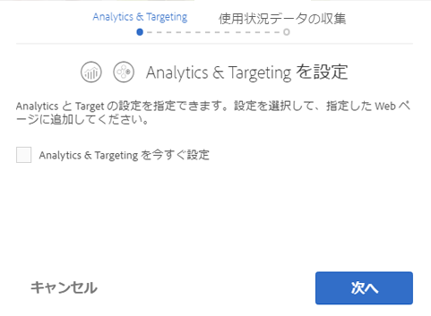

# Adobe Marketing Cloud との統合{#integrating-with-the-adobe-marketing-cloud}

[Adobe Marketing Cloud](https://www.adobe.com/solutions/digital-marketing.html) には、すぐに利用可能なリアルタイムのデータおよび情報を提供してオンラインビジネスを成功に導く、強力な Web 分析および Web サイト最適化製品が含まれています。Adobe Marketing Cloud は、オンラインビジネス最適化のための統合されたオープンプラットフォームを提供します。Adobe Marketing Cloud は、顧客のインサイトを収集してその力を解き放ち、顧客の獲得、コンバージョンおよび維持の取り組みやコンテンツの作成および配信を最適化する統合アプリケーションにより構成されます。

Adobe Experience Managerでは、Adobe Marketing Cloudの次の製品とシームレスに統合できます。

* Adobe Analytics：マーケティング担当者は、オンライン戦略やマーケティング戦略に関して、すぐに利用可能なリアルタイムの情報を入手できます。
* Adobe Target：オンラインコンテンツと顧客との関連性を継続的に高め、より多くのコンバージョンを生み出すための機能をマーケティング担当者に提供します。
* AdobeDynamic Mediaクラシックは、メディア管理を自動化し、Webパブリッシングを合理化し、Webエクスペリエンスを強化して、すべてホスト環境で実現します。
* Adobe Dynamic Tag Management：無制限の数のアドビやサードパーティのタグをすばやく簡単に管理できる直感的なツールをマーケティング担当者に提供します。
* Adobe Search&amp;Promote：サイトの検索結果を管理および最適化できる機能をマーケティング担当者に提供します。
* Adobe Campaign では、電子メール配信コンテンツを Adobe Experience Manager で直接管理できます。

さらに、Adobe Experience Managerを[Creative Cloud](/help/assets/aem-cc-integration-best-practices.md)および[サードパーティのサービス](/help/sites-administering/third-party-services.md)と統合できます。

## Adobe Analytics との統合 {#integrating-with-adobe-analytics}

[Adobe](https://www.omniture.com/en/products/analytics/sitecatalyst) 分析は、複数のマーケティングチャネルにわたるすべてのオンラインイニシアチブの統合データを、デジタルマーケターが1か所で測定、分析、最適化できる、業界をリードするソリューションです。このソリューションを使用すると、マーケティング担当者は、デジタル戦略やマーケティング戦略に関して、すぐに利用可能なリアルタイムの Web 分析情報を入手できます。Adobe Analytics を使用すると、マーケティング担当者は Web サイト内で最も収益性に優れたパスの迅速な特定、価値の高い Web の訪問者を見分けるためのトラフィックの区分、訪問者がサイトを離れた経路の判断、およびオンラインマーケティングキャンペーンにとって重要な成功指標の特定をおこなうことができます。

Adobe Analytics は、サイトのデータを分析するために使用できます。

Adobe Analyticsとの統合により、次のことが可能になります。

* Analyticsユーザー追跡を有効にします。
* 実行モード（オーサー、パブリッシュなど）をそれぞれ異なるレポートスイートにマップする。
* ClientContext の変数をコンバージョン変数またはトラフィックプロパティとして送信する。
* 定義済みの変数マッピングを使用する。
* 完全なサイトセクションの設定を一度におこなう。
* カスタム定義のイベントを追跡する。

AnalyticsとのAdobe Experience Managerの統合について詳しくは、[Adobe Analyticsとの統合](/help/sites-administering/adobeanalytics.md)を参照してください。

また、[オプトインウィザード](/help/sites-administering/opt-in.md)を使用して簡単に統合を実行できます。

## Adobe Target との統合 {#integrating-with-adobe-target}

[Adobe Target はマーケター向けのツールで、オンラインテストを設計および実行し、その場で（行動に基づいた）オーディエンスセグメントを作成し、コンテンツとオンラインエクスペリエンスのターゲット設定を自動化するために使用されます。](https://www.omniture.com/en/products/conversion/test-and-target)

今日のオンラインユーザーは常にニーズを進化させてきており、幅広いサイトやコンテンツのソースから、関連性があり、パーソナライズまでされたコンテンツを選択できることを期待します。オンラインオーディエンスを引き付けるには、オンラインマーケティング担当者が、オーディエンスとの関連性がある魅力的なオファーやコンテンツをすぐに特定できることが不可欠です。この知識によって武装しながら、継続的にサイトを進化させ、様々なオーディエンスに対して適切なコンテンツをターゲティングできる必要があります。

[Adobe](/help/sites-administering/target.md) Targetexplainsとの統合では、サイトをAdobe Targetと統合する方法について説明します。

また、[オプトインウィザード](/help/sites-administering/opt-in.md)を使用して簡単に統合を実行できます。

## Analytics および Target へのオプトイン {#opting-in-to-analytics-and-target}

Adobe Experience Managerは、Adobe AnalyticsやAdobe Targetとの統合に関する簡単なオプトイン手順を提供しています。 管理者としてログインしてプロジェクトコンソールにアクセスすると、オプトインウィザードが表示されます。

Analytics や Target との統合をオプトインすれば、そのページ追跡機能や分析機能、およびパーソナライゼーション機能を利用できるようになります。オプトインするときに、ユーザーアカウント情報を入力して、追跡するページを指定する必要があります。

詳しくは、[Adobe Analytics および Adobe Target との統合のオプトイン](/help/sites-administering/opt-in.md)を参照してください。

## Dynamic MediaClassicとの統合{#integrating-with-scene}

AdobeDynamic Mediaクラシックは、Web、モバイル、電子メール、ソーシャルメディア、インターネットに接続されたディスプレイ、印刷機器に、動的なマーケティングアセットや豊富な視覚的マーチャンダイジングを公開、管理、強化、配信するためのホストソリューションです。

Adobe Experience Managerでは、Adobe Experience ManagerからDynamic Mediaクラシックにデジタルアセットを直接公開したり、Dynamic MediaクラシックからAdobe Experience Managerにデジタルアセットを公開したりできます。

また、Dynamic Mediaクラシックで公開したAdobe Experience Managerアセットを、基本ズームやビデオなどの様々なビューアに表示できます。

Adobe Experience ManagerがDynamic Mediaクラシックと統合する方法について詳しくは、「[Dynamic Mediaクラシックとの統合](/help/sites-administering/scene7.md)」のドキュメントを参照してください。

## Adobe Dynamic Tag Management との統合 {#integrating-with-adobe-dynamic-tag-management}

[Adobe Dynamic Tag Management：無制限の数のアドビやサードパーティのタグをすばやく簡単に管理できる直感的なツールをマーケティング担当者に提供します。](https://www.adobe.com/solutions/digital-marketing/dynamic-tag-management.html)ほぼすべてのオンラインアセットをより細かく、より柔軟に最適化でき、かつ IT リソースへの依存度を減らすことができます。

[AdobeのDynamic Tag ](/help/sites-administering/dtm.md) ManagementをAdobe Experience Managerと統合し、Dynamic Tag Management Webプロパティを使用してAdobe Experience Managerサイトを追跡できるようにします。

## Adobe Audience Manager との統合 {#integrating-with-adobe-audience-manager}

Audience Manager統合は、Adobe Experience Manager6.3で削除されました。

## Search&amp;Promote との統合 {#integrating-with-search-promote}

Adobe Search&amp;Promote を使用すると、マーケティング担当者は、Web サイトおよびモバイルサイト上で、訪問者が関連商品やコンテンツを参照、検索、比較および選択する方法を最適化することができます。ビジネス目標と訪問者意図に基づいて優先事項を容易に促進でき、KPIベースのトリガーや指標を使用してマーチャンダイジングやプロモーションのアクティビティを自動化できます。

Adobe Search&amp;Promote は、信頼性とスケーラビリティに優れたホスト型サイト検索アプリケーションです。数百万のページや商品の規模にまで拡張でき、小売サイトからニュースサイトまで、訪問者数の多いオンラインビジネスに対応できます。Adobe Search&amp;Promote は、マーケティング担当者による、かつてないレベルの管理性と指標ベースの関連性を実現します。

Adobe Experience ManagerとSearch&amp;Promoteの統合について詳しくは、[AdobeSearch&amp;Promoteとの統合](/help/sites-administering/search-and-promote.md)を参照してください。

## Adobe Campaign との統合{#integrating-with-adobe-campaign}

[Adobe Campaign](https://www.adobe.com/solutions/campaign-management.html) では、電子メール配信コンテンツを Adobe Experience Manager で直接管理できます。

Adobe Experience ManagerとAdobe Campaignの統合については、[Adobe Campaignとの統合](/help/sites-administering/campaignstandard.md)を参照してください。

## Livefyre との統合 {#integrating-with-livefyre}

Adobe Experience ManagerとLivefyreについて説明します。

* [Livefyre 使用の手引き](https://answers.livefyre.com/developers/getting-started)

* [LivefyreとAdobe Experience Manager](https://answers.livefyre.com/product/livefyre-for-adobe-experience-manager-aem/livefyre-for-adobe-experience-manager/)

