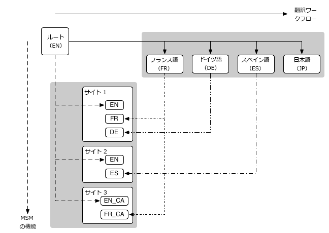

# Web サイト管理{#website-administration}

>[!CAUTION]
>
>AEM 6.4 の拡張サポートは終了し、このドキュメントは更新されなくなりました。 詳細は、 [技術サポート期間](https://helpx.adobe.com/jp/support/programs/eol-matrix.html). サポートされているバージョンを見つける [ここ](https://experienceleague.adobe.com/docs/?lang=ja).

Web サイトおよびページの管理には、次の管理ツールを使用できます。

* マルチサイトマネージャー（MSM）を使用すると、同じサイトコンテンツを複数の場所で使用できるだけでなく、場所によってバリエーションを持たせることができます。

   * [コンテンツの再利用：マルチサイトマネージャとライブコピー](/help/sites-administering/msm.md)

* 翻訳を使用すると、ページコンテンツ、アセット、ユーザー生成コンテンツの翻訳を自動化して、多言語 Web サイトの作成と管理ができます。

   * [多言語サイトのコンテンツの翻訳](/help/sites-administering/translation.md)

* これら 2 つの機能を組み合わせて、両方の Web サイトに対応できます [多国籍で多言語の](#multinational-and-multilingual-sites).

## 多国籍な多言語サイト {#multinational-and-multilingual-sites}

マルチサイトマネージャと翻訳ワークフローを併せて使用することで、多国籍な多言語サイトのコンテンツを効率的に作成できます。特定の国に対して 1 つの言語でマスターサイトを作成し、必要に応じて翻訳を使用して、そのコンテンツを他のサイトの基礎として使用します。

* マスターサイトを別の言語に[翻訳](/help/sites-administering/translation.md)します。

* [マルチサイトマネージャ](/help/sites-administering/msm.md)を次の用途で使用します。

   * マスターサイトのコンテンツと翻訳を再利用して、他の国や文化のサイトを作成します。
   * マルチサイトマネージャーの使用を 1 つの言語内のコンテンツに制限してください（例：国サイトでは英語マスター/英語ブランチ、国サイトではフランス語マスター/フランス語ブランチ）。
   * 必要に応じて、ライブコピーの要素を分離して、ローカリゼーションの詳細を追加します。

次の図に、主な概念がどのように関連するかを示します（関連するすべてのレベルと要素を網羅しているわけではありません）。

>[!NOTE]
>
>このようなシナリオでは、MSM は異なる言語バージョンを管理することはありません。
>
>* [MSM](/help/sites-administering/msm.md) は、言語の境界内で、ブループリント（グローバルマスターなど）からライブコピー（ローカルサイトなど）への翻訳済みコンテンツのデプロイを管理します。
>* この [翻訳](/help/sites-administering/translation.md) AEMの統合機能は、サードパーティの翻訳管理サービスと連携して、言語を管理し、コンテンツをこれらの異なる言語に翻訳します。
>
>より高度な使用例では、MSM を複数の言語マスターで使用することもできます。

>[!NOTE]
>
>すべての使用例で、次のベストプラクティスをお読みください。
>
>* [MSM のベストプラクティス](/help/sites-administering/msm-best-practices.md);特に：
   >
   >   * [サイトの作成](/help/sites-administering/msm-best-practices.md#create-site)
   >   * [MSM と多言語の Web サイト](/help/sites-administering/msm-best-practices.md#msm-and-multilingual-websites)
>
>* [翻訳のベストプラクティス](/help/sites-administering/tc-bp.md)

