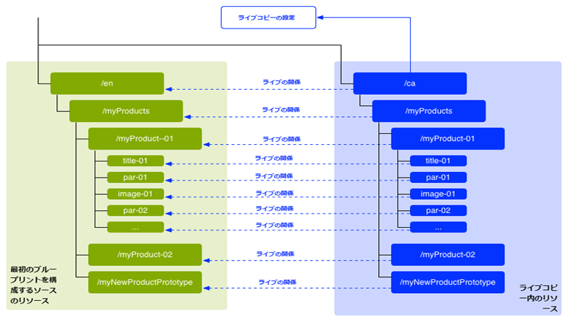

# コンテンツの再利用：マルチサイトマネージャーとライブコピー{#reusing-content-multi-site-manager-and-live-copy}

マルチサイトマネージャー（MSM）を使用すると、同じサイトコンテンツを複数の場所で使用できます。MSM ではライブコピー機能を使用してこれをおこないます。

* MSM では、次の操作を実行できます。

   * コンテンツを 1 回作成し、
   * このコンテンツをコピーして同じまたは別のサイトの他の領域で使用します（[ライブコピー](#live-copies)）。

* その後、MSM は次の目的でソースコンテンツとライブコピーの間の（ライブ）関係を維持します。

   * ソースコンテンツに変更を加えると、ソースとライブコピーが同期されます（変更がライブコピーにも適用されます）。
   * 個々のサブページやコンポーネントのライブ関係を解除することで、ライブコピーを微調整できます。これをおこなうと、ソースに対する変更がライブコピーに適用されなくなります。

これに関連する問題について、このページと後続のページで説明します。

* [ライブコピーの作成と同期](/help/sites-administering/msm-livecopy.md)
* [ライブコピーの概要コンソール](/help/sites-administering/msm-livecopy-overview.md)
* [ライブコピーの同期の設定](/help/sites-administering/msm-sync.md)
* [MSM ロールアウトの競合](/help/sites-administering/msm-rollout-conflicts.md)
* [MSM のベストプラクティス](/help/sites-administering/msm-best-practices.md)

## 考えられるシナリオ {#possible-scenarios}

MSM とライブコピーには数多くのユースケースがあります。次のようなシナリオが考えられます。

* **多国籍 - グローバル企業から現地企業**

   MSM がサポートする一般的な使用事例は、複数の多国籍かつ同一言語のサイトにおけるコンテンツの再利用です。これにより主要なコンテンツは再利用しつつ、国ごとに異なるコンテンツを作成できます。

   例えば、米国の顧客向けには、サンプルの We.Retail 参照サイトの「英語」セクションが作成されます。このサイト内のコンテンツのほとんどは、国や文化の異なる英語圏の顧客に対応した他の We.Retail サイトでも使用できます。主要なコンテンツは全サイトで同じになる一方で、地域ごとに調整を加えることができます。

   米国、英国、カナダ、オーストラリアのサイトでは、次の構造を使用できます。

   ```xml
   /content
       |- we.retail
           |- language-masters
               |- en
       |- we.retail
           |- us
               |- en
       |- we.retail
           |- gb
               |- en
       |- we.retail
           |- ca
               |- en
       |- we.retail
           |- au
               |- en
   ```

   >[!NOTE]
   >
   >MSM はコンテンツを翻訳しません。必要な構造の作成とコンテンツの導入に使用します。
   >
   >
   >このサンプルを拡張する方法について詳しくは、[多言語サイトのコンテンツの翻訳](/help/sites-administering/translation.md)を参照してください。

* **国内 - 本社から地方支社**

   販売網が構築されている企業では、販売特約店によって Web サイトを分けたほうがよい場合があります。この場合、各サイトは本社によって提供される主要なサイトのバリエーションになります。これは、複数の支社を持つ単一の企業や、フランチャイズ本部と国内の複数のフランチャイズ加盟店で構成されるフランチャイズシステムに適してします。

   本社が中核となる情報を提供し、各地方の部門が問い合わせ先の詳細情報、営業時間、イベントなどのローカル情報を追加します。

   ```xml
   /content
       |- head-office-Berlin
       |- branch-Hamburg
       |- branch-Stuttgart
       |- branch-Munich
       |- branch-Frankfurt
   ```

* **複数バージョン**

   MSM を使用して、特定のサブブランチのバージョンを作成することもできます。例えば、ある商品の様々なバージョンの詳細情報を提供するサポート用のサブサイトでは、基本情報は一定に保ち、更新された機能のみを変更する必要があります。

   ```xml
   /content
       |- support
           |- product X
               |- v5.0
               |- v4.0
               |- v3.0
               |- v2.0
               |- v1.0
   ```

   >[!NOTE]
   >
   >そのようなシナリオでは常に、単純にコピーを作成するかライブコピーを使用するかどうかを判断する必要があります。
   >
   >ここでは、以下のバランスを考慮します。
   >
   >  * 複数のバージョンで更新する必要がある中核となるコンテンツの割合
   >
   >および
   >
   >  * 調整する必要がある個々のコピーの割合


## UI からの MSM {#msm-from-the-ui}

MSM は、該当するコンソールの UI から各種オプションを使用して直接アクセスできます。はじめに、主な場所のリストを次に示します。

* **サイトを作成**（**Sites**）

   * MSM は、コンテンツを共有する複数の Web サイトの管理をサポートします。例えば、多くの Web サイトの対象はグローバルであり、すべての国で共通の大多数のコンテンツと、国別に固有のコンテンツのサブセットで構成されています。MSM を使用すると、[ソースサイトをベースとする複数のサイトを自動的に更新するライブコピーを作成](/help/sites-administering/msm-livecopy.md#creating-a-live-copy-of-a-site-from-a-blueprint-configuration)できます。また、共通の基本構造が適用され、複数サイト全体で共通のコンテンツを使用し、共通のルックアンドフィールが保持されるので、サイト間で実際に異なるコンテンツの管理に注力することができます。
   * ソースの指定に事前に定義されたブループリント設定が必要です。
   * （事前に定義された）ソースのライブコピーを作成します。
   * 「**ロールアウト**」ボタンを使用してユーザーを指定します。

* **ライブコピーを作成**（**Sites**）

   * MSM を使用すると、[Web サイトの個々のページまたはサブブランチのアドホック（1 回限りの）ライブコピーを作成](/help/sites-administering/msm-livecopy.md#creating-a-live-copy-of-a-page)できます。例えば、サブブランチを複製して商品の新しいバージョンや更新されたバージョンに関する情報を提供することができます。
   * アドホックライブコピーを作成します（ブループリント設定は不要）。
   * 任意のページまたはブランチのライブコピーを（即座に）作成できます。
   * **同期**&#x200B;が必要です（**ロールアウト**&#x200B;ボタンは提供されません）。

* **プロパティを表示**（**Sites**）

   * 該当する場合、このオプションを使用すると、関連する&#x200B;**ライブコピー**&#x200B;や&#x200B;**ブループリント**&#x200B;の情報を提供することで、[ライブコピーを監視](/help/sites-administering/msm-livecopy.md#monitoring-your-live-copy)するのに役立ちます。

* **参照**（**Sites**）

   * [参照](/help/sites-authoring/basic-handling.md#references)レールには、**ライブコピー**&#x200B;に関する情報が適切なアクションへのアクセスと共に提供されます。

* **ライブコピーの概要**（**Sites**）

   * このコンソールを使用すると、[ブループリントとそのライブコピーを表示して管理](/help/sites-administering/msm-livecopy-overview.md)できます。

* **ブループリント**（**ツール**／**Sites**）

   * このコンソールを使用すると、[ブループリント設定を作成して管理](/help/sites-administering/msm-livecopy.md#creating-a-blueprint-configuration)できます。

>[!NOTE]
>
>MSM の機能の様々な側面は、AEM のその他各種機能で使用されます（ローンチ、カタログなど）。これらのケースでは、ライブコピーはその機能によって管理されます。

### 使用されている用語 {#terms-used}

はじめに、MSM で使用されている主な用語の概要を次の表に示します。後の節やページでこれらについて詳しく説明します。

<table> 
 <tbody> 
  <tr> 
   <td><strong>用語</strong></td> 
   <td><strong>定義</strong></td> 
   <td><strong>詳細</strong></td> 
  </tr> 
  <tr> 
   <td><strong>ソース</strong></td> 
   <td>元のページ。</td> 
   <td>ブループリントやブループリントページと同義。</td> 
  </tr> 
  <tr> 
   <td><strong>ライブコピー</strong></td> 
   <td>ロールアウト設定で定義されているとおりに同期アクションで維持される（ソースの）コピー。 </td> 
   <td> </td> 
  </tr> 
  <tr> 
   <td><strong>ライブコピー設定</strong></td> 
   <td>ライブコピー用の設定の詳細の定義。</td> 
   <td> </td> 
  </tr> 
  <tr> 
   <td><strong>ライブの関係</strong><br /> </td> 
   <td>指定のリソースの継承についての効果の定義。ソースとライブコピーの間の関係です。<br /> </td> 
   <td>ライブコピーを使用してソースに対する変更を同期できます。</td> 
  </tr> 
  <tr> 
   <td><strong>ブループリント</strong></td> 
   <td>ソースと同義。</td> 
   <td>ブループリント設定で定義できます。</td> 
  </tr> 
  <tr> 
   <td><strong>ブループリント設定</strong></td> 
   <td>ソースパスを指定する事前に定義された設定。</td> 
   <td>ブループリント設定でブループリントページが参照されていると、「ロールアウト」コマンドを使用できます。</td> 
  </tr> 
  <tr> 
   <td><strong>同期化</strong></td> 
   <td>（<strong>ロールアウト</strong>と<strong>同期</strong>の両方で）ソースとライブコピーの間のコンテンツの同期を表す汎用的な用語。</td> 
   <td> </td> 
  </tr> 
  <tr> 
   <td><strong>ロールアウト</strong><br /> </td> 
   <td>ソースからライブコピーへの同期。<br /> （ブループリントページの）作成者によって、または（ロールアウト設定で定義された）システムイベントとしてトリガーされます。</td> 
   <td> </td> 
  </tr> 
  <tr> 
   <td><strong>ロールアウト設定</strong></td> 
   <td>同期するプロパティ、および同期を実行する方法とタイミングを決定するルール。</td> 
   <td> </td> 
  </tr> 
  <tr> 
   <td><strong>同期</strong></td> 
   <td>ライブコピーページから作成される、同期の手動リクエスト。</td> 
   <td> </td> 
  </tr> 
  <tr> 
   <td><strong>継承</strong></td> 
   <td>同期が発生すると、ライブコピーページ／コンポーネントは、そのソースページ／コンポーネントからコンテンツを継承します。</td> 
   <td> </td> 
  </tr> 
  <tr> 
   <td><strong>休止</strong></td> 
   <td>ライブコピーとそのブループリントページの間のライブ関係を一時的に削除します。</td> 
   <td> </td> 
  </tr> 
  <tr> 
   <td><strong>分離</strong></td> 
   <td>ライブコピーとそのブループリントページの間のライブ関係を永続的に削除します。</td> 
   <td> </td> 
  </tr> 
  <tr> 
   <td><strong>リセット</strong></td> 
   <td><p>ライブコピーページをリセットすると、次のようになります。</p> 
    <ul> 
     <li>すべての継承のキャンセルを削除し、<br /> </li> 
     <li>ページをソースページと同じ状態に戻します。</li> 
    </ul> <p>リセットは、ページのプロパティ、段落システムおよびコンポーネントに対して行った変更に影響します。</p> </td> 
   <td> </td> 
  </tr> 
  <tr> 
   <td><strong>シャロー</strong></td> 
   <td>単一ページのライブコピー。</td> 
   <td> </td> 
  </tr> 
  <tr> 
   <td><strong>ディープ</strong></td> 
   <td>ページのライブコピーとその子ページ。</td> 
   <td> </td> 
  </tr> 
 </tbody> 
</table>

>[!NOTE]
>
>オブジェクトの名前については、[Java API の概要](/help/sites-developing/extending-msm.md#overview-of-the-java-api)を参照してください。

## ライブコピー {#live-copies}

MSM のライブコピーは、特定のサイトコンテンツのコピーです。このコピーについては、元のソースとのライブ関係が維持されます。

* ライブコピーはそのソースからコンテンツを継承します。
* ソースに対して変更が加えられると、同期によってコンテンツが実際に転送されます。
* ライブコピーは、次のいずれかと見なされます。

   * シャロー：単一のページ
   * ディープ：ページとその子ページ

* 同期ルール（ロールアウト設定と呼ばれる）によって、同期するプロパティおよび同期を行うタイミングが決定されます。

前述の例では、`/content/we-retail/language-masters/en` が英語のグローバルマスターサイトです。このサイトのコンテンツを再利用するために、MSM のライブコピーが作成されます。

* `/content/we-retail/language-masters/en` の下のコンテンツがソースです。

* `/content/we-retail/language-masters/en` の下のコンテンツが、`/content/we-retail/us/en/`、`/content/we-retail/gb/en`、`/content/we-retail/ca/en` および `/content/we-retail/au/en` の各ノードの下にコピーされます。これらがライブコピーです。

* 作成者は、`/content/we-retail/language-masters/en` の下のページを変更します。
* トリガーされると、MSM はこれらの変更をライブコピーに同期します。

### ライブコピー - 構成 {#live-copies-composition}

>[!NOTE]
>
>この節の図と説明は、想定されるライブコピーのスナップショットを表しています。これらは包括的なものではなく、特徴を説明するための概要を示しています。

ライブコピーを最初に作成すると、選択したソースページが 1:1 の対応でライブコピーに反映されます。その後、新しいリソース（ページまたは段落）をそのライブコピー内に直接作成することもできるので、これらのバリエーションと同期への影響を理解しておくと役に立ちます。使用可能な構成は次のとおりです。

* [ライブコピー以外のページを使用したライブコピー](#live-copy-with-non-live-copy-pages)
* [ネストされたライブコピー](#nested-live-copies)

ライブコピーの基本形式は次のとおりです。

* 選択したソースページが 1:1 の対応で反映されたライブコピーページ。
* 1 つの設定定義。
* すべてのリソースに定義されているライブ関係。

   * ライブコピーのリソースをブループリントやソースにリンクします。
   * 継承およびロールアウトの実現時に使用されます。

* 変更は要件に従って[同期](/help/sites-administering/msm-livecopy.md#synchronizing-your-live-copy)できます。



#### ライブコピー以外のページを使用したライブコピー {#live-copy-with-non-live-copy-pages}

AEM にライブコピーを作成すると、ライブコピーのブランチを表示して移動できるほか、ライブコピーのブランチで AEM の通常の機能を使用できます。これはつまり、ユーザー（またはプロセス）がライブコピーのブランチ（例：`myCanadaOnlyProduct`）内に新しいリソース（ページまたは段落）を作成できることを意味します。

* そのようなリソースにはソースやブループリントのページへのライブ関係がなく、同期されません。
* このシナリオは、MSM が特殊なケースを処理する場合に発生することがあります。例えば、ユーザー（またはプロセス）がソースやブループリントとライブコピーのブランチの両方で同じ位置に同じ名前のページを作成した場合です。そのような状況について詳しくは、[MSM ロールアウトの競合](/help/sites-administering/msm-rollout-conflicts.md)を参照してください。


#### ネストされたライブコピー {#nested-live-copies}

ユーザー（またはプロセス）が[既存のライブコピー内に新しいページ](#live-copy-with-non-live-copy-pages)を作成する場合、この新しいページは別のブループリントのライブコピーとして設定することもできます。これはネストされたライブコピーと呼ばれ、2 番目（内側）のライブコピーの動作は次のように、最初（外側）のライブコピーの影響を受けます。

* 最上位レベルのライブコピーに対してトリガーされたディープロールアウトは、ネストされたライブコピーで継続できます（例えば、トリガーが一致する場合）。
* ソース間のリンクは、ライブコピー内で書き直すことができます。

   例えば、2 番目のブループリントから最初のブループリントへのリンクは、ネストされた 2 番目のライブコピーから最初のライブコピーへのリンクとして書き直されます。


>[!NOTE]
>
>ライブコピーのブランチ内のページを移動または名前を変更すると、これは（内部的に）ネストされたライブコピーとして扱われ、AEM で関係を追跡できるようになります。

#### 積み重ねられたライブコピー {#stacked-live-copies}

ライブコピーは、シャローライブコピーの子として作成された場合、積み重ねられたライブコピーと呼ばれます。これは、[ネストされたライブコピー](#nested-live-copies)と同様に動作します。

### ソース、ブループリントおよびブループリント設定 {#source-blueprints-and-blueprint-configurations}

任意のページまたはページのブランチをライブコピーのソースとして使用できます。

ただし、MSM ではソースパスを指定するブループリント設定も定義できます。ブループリント設定を使用する利点は次のとおりです。

* 作成者がブループリントで「**ロールアウト**」オプションを使用して、このブループリントから継承されるライブコピーに変更を（明示的に）プッシュできます。
* 作成者が&#x200B;**サイトを作成**&#x200B;を使用して、ユーザーが簡単に言語を選択してライブコピーの構造を設定できます。
* ブループリントと関係があるライブコピーのデフォルトのロールアウト設定を定義できます。

ライブコピーのソースは、通常のページまたはブループリント設定に含まれるページのいずれかです。両方とも有効なユースケースです。

ソースはライブコピーのブループリントを構成します。ブループリントは次のいずれかを行うと定義されます。

* [ブループリント設定の作成](/help/sites-administering/msm-livecopy.md#creating-a-blueprint-configuration)

   この設定は、ライブコピーを作成するために使用するページを（事前に）定義します。

* [ページのライブコピーの作成](/help/sites-administering/msm-livecopy.md#creating-a-live-copy-of-a-page)

   ライブコピー（ソースページ）の作成に使用するページは、ブループリントページです。

   ソースページはブループリント設定によって参照されることも、参照されないこともあります。

### ロールアウトと同期 {#rollout-and-synchronize}

ロールアウトは、ライブコピーとソースを同期する MSM の重要なアクションです。ロールアウトは手動で、または自動で実行できます。

* [ロールアウト設定](#rollout-configurations)を定義して、特定の[イベント](/help/sites-administering/msm-sync.md#rollout-triggers)がロールアウトを自動的に引き起こすように設定できます。
* ブループリントページを作成するときに、[ロールアウト](/help/sites-administering/msm-livecopy.md#rolling-out-a-blueprint)コマンドを使用してライブコピーの変更をプッシュできます。

   **ロールアウト**&#x200B;コマンドは、ブループリント設定によって参照されるブループリントページで使用できます。

   

* ライブコピーページをオーサリングするときに、[同期](/help/sites-administering/msm-livecopy.md#synchronizing-a-live-copy)コマンドを使用してソースからライブコピーに変更をプルします。

   **同期**&#x200B;コマンドは、（ソースやブループリントページがブループリント設定に含まれているかどうかに関係なく）ライブコピーページでいつでも使用できます。

   

### ロールアウト設定 {#rollout-configurations}

ロールアウト設定によって、ライブコピーとソースコンテンツの同期のタイミングおよび方法が定義されます。ロールアウト設定は、トリガーと 1 つ以上の同期アクションで構成されます。

* **トリガー**

   トリガーは、ライブアクションとしての同期を発生させるイベント（ソースページのアクティベートなど）です。MSM では、使用可能なトリガーを定義します。

* **同期アクション**

   ライブコピーで実行され、ライブコピーとソースを同期します。例えば、コンテンツのコピー、子ノードの並べ替え、ライブコピーページのアクティベートなどです。MSM には複数の同期アクションが用意されています。

   >[!NOTE]
   >
   >Java API を使用してお使いのインスタンスのカスタムアクションを作成できます。

ロールアウト設定は再利用可能なので、複数のライブコピーで同じロールアウト設定を使用できます。標準のインストールにいくつかの[ロールアウト設定](/help/sites-administering/msm-sync.md#installed-rollout-configurations)が含まれています。

### ロールアウトの競合 {#rollout-conflicts}

ロールアウトは、特に作成者がソースとライブコピーの両方を編集しているときに複雑になることがあります。そのため、[ロールアウト中に発生する可能性がある競合](/help/sites-administering/msm-rollout-conflicts.md)を AEM がどのように処理するかを把握しておくと便利です。

### 継承と同期の休止とキャンセル {#suspending-and-cancelling-inheritance-and-synchronization}

ライブコピー内の各ページおよびコンポーネントは、ライブの関係を通じてそのソースページおよびコンポーネントに関連付けられます。ライブ関係は、ソースからライブコピーコンテンツへの同期を設定します。

ライブコピーページのライブコピーの継承を&#x200B;**休止**&#x200B;して、ページのプロパティやコンポーネントを変更できます。継承を休止すると、ページプロパティとコンポーネントがソースと同期されなくなります。

個々のページの編集時に、作成者はコンポーネントの&#x200B;**継承をキャンセル**&#x200B;できます。継承がキャンセルされると、ライブの関係が休止状態になり、そのコンポーネントの同期は行われません。継承と同期のキャンセルは、コンテンツのサブセクションをカスタマイズする必要があるときに便利です。

### ライブコピーの分離 {#detaching-a-live-copy}

ブループリントから[ライブコピーを分離](/help/sites-administering/msm-livecopy.md#detaching-a-live-copy)してすべての関係を削除することもできます。

>[!CAUTION]
>
>分離アクションは永続的で元に戻すことはできません。

分離は、ライブコピーとそのブループリントページの間のライブ関係を永続的に削除します。ライブコピーから MSM に関連するすべてのプロパティが削除され、そのライブコピーページがスタンドアロンのコピーになります。

>[!NOTE]
>
>サブページおよび親ページへの関連する影響も含め、詳しくは[ライブコピーの分離](/help/sites-administering/msm-livecopy.md#detaching-a-live-copy)を参照してください。

## MSM を使用するための標準的な手順 {#standard-steps-for-using-msm}

MSM を使用してコンテンツを再利用し、ライブコピーに対する変更を同期するための標準的な手順を次に示します。

1. ソースサイトのコンテンツを作成します。
1. 使用するロールアウト設定を決定します。

   1. MSM では、複数の使用事例に対応する[複数のロールアウト設定をインストール](/help/sites-administering/msm-sync.md#installed-rollout-configurations)します。
   1. 必要に応じて、[ロールアウト設定を作成](/help/sites-administering/msm-sync.md#creating-a-rollout-configuration)できます。

1. [使用するロールアウト設定を指定する](/help/sites-administering/msm-sync.md#specifying-the-rollout-configurations-to-use)場所を決定し、必要に応じて設定を行います。
1. 必要に応じて、ライブコピーのソースコンテンツを識別する[ブループリント設定を作成](/help/sites-administering/msm-livecopy.md#creating-a-blueprint-configuration)できます。
1. [ライブコピーを作成](/help/sites-administering/msm-livecopy.md#creating-a-live-copy)します。
1. 必要に応じてソースコンテンツを変更します。組織で確立されている通常のコンテンツのレビュー／承認プロセスを採用してください。
1. ブループリントを[ロールアウト](/help/sites-administering/msm-livecopy.md#rolling-out-a-blueprint)するか、変更内容と[ライブコピーを同期](/help/sites-administering/msm-livecopy.md#synchronizing-a-live-copy)します。

## MSM のカスタマイズ {#customizing-msm}

MSM にはツールが用意されており、コンテンツの共有時に例外的に発生する問題に対しても実装が可能になっています。

* **カスタムロールアウト設定**
   インストール済みのロールアウト設定が要件を満たさない場合に[ロールアウト設定を作成](/help/sites-administering/msm-sync.md#creating-a-rollout-configuration)します。有効な任意のロールアウトトリガーおよび同期アクションを使用できます。

* **カスタム同期アクション**
   インストール済みのアクションが特定のアプリケーション要件を満たさない場合に[カスタム同期アクションを作成](/help/sites-developing/extending-msm.md#creating-a-new-synchronization-action)します。MSM には、カスタム同期アクションを作成するための Java API が用意されています。

## ベストプラクティス {#best-practices}

[MSM のベストプラクティス](/help/sites-administering/msm-best-practices.md)には、実装に関する重要な情報が記載されています。
