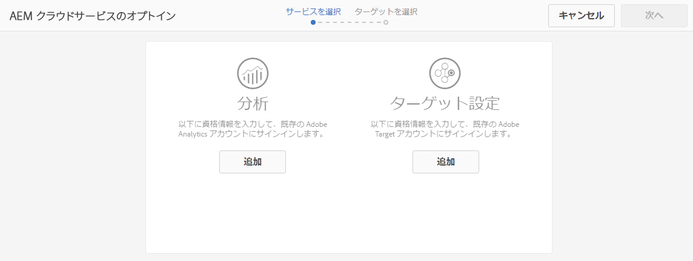

# Adobe Analytics および Adobe Target との統合のオプトイン{#opting-into-adobe-analytics-and-adobe-target}

AEM には、Adobe Analytics および Adobe Target との統合に役立つオプトイン手順が用意されています。これは、管理者ユーザーグループに割り当てられた、事前に読み込まれたタスクとして、標準で使用できます。

管理者としてログインすると、このタスク（**Analytics &amp; Targeting を設定**）を[インボックス](/help/sites-authoring/inbox.md#out-of-the-box-administrative-tasks)から使用できます。指定された資格情報に基づいて、これらのサービスを設定および統合できます。

統合の設定には、次のオプションがあります。

* タスクによる統合の設定。

   これは、即座に、または後でおこなうことができ、何らかのアクションがおこなわれるまで、タスクはインボックスに残ります。どちらの場合も、設定は UI で直接おこなうことも、事前定義された `.properties` ファイル。

* 統合のオプトアウト。

   [手動で統合を設定する](/help/sites-administering/marketing-cloud.md)場合は、このオプションを検討してください。[DTM を使用した AEM と Adobe Target および Adobe Analytics の統合（英語）](https://helpx.adobe.com/jp/experience-manager/using/integrate-digital-marketing-solutions.html)も参照してください。

* スクリプトを使用してセットアップとプロビジョニングを設定します。

## 統合の設定 {#configuring-the-integration}

次との統合をオプトインします。

* Analytics（ページ追跡および分析機能を使用できます）
* Target（パーソナライゼーション機能を使用できます）

どちらのオプションでも、ユーザーアカウント情報を設定して、追跡するページを指定する必要があります。

>[!NOTE]
>
>オプションで、サーバーの起動時に読み込まれるプロパティファイルを使用して、Analytics および Target のアカウント情報を設定できます。[プロパティファイルを使用したアカウント情報の設定](/help/sites-administering/opt-in.md#providing-account-information-using-a-properties-file)を参照してください。

統合をオプトインすると、AEM が次のタスクを実行します。

* Analytics および Target への接続を可能にするクラウド設定を作成する。
* 追跡するデータを決定するフレームワークを作成する。
* これらのサービスを使用するために Web ページを設定する。

>[!NOTE]
>
>AT.js は、デフォルトのクライアントライブラリです。これは、[Target のクラウドサービス設定](/help/sites-administering/target-configuring.md#creating-a-target-cloud-configuration)で設定されています。
>
>AT.js をクライアントライブラリとして使用することをお勧めします。

事前に読み込まれた標準タスクからオプトインするには：

1. [インボックスから、Analytics &amp; Targeting を設定&#x200B;**タスクを選択して**&#x200B;開きます](/help/sites-authoring/inbox.md#taking-action-on-an-item)。

   

1. Analytics の場合：

   1. Analytics のユーザーアカウント情報を入力し、対応する「**追加**」ボタンをクリックします。
   1. 適切な資格情報が認証されます。
   1. Analytics アカウントが認証されたら、使用する Analytics レポートスイートを選択します。AEM がこれらの Analytics レポートスイートを取得します。ステータスが「**追加済み**」に更新されます。

1. Target の場合：

   1. Target のユーザーアカウント情報を入力し、対応する「**追加**」ボタンをクリックします。
   1. 適切な資格情報が認証されます。ステータスが「**追加済み**」に更新されます。

1. 「**次へ**」を選択します。
1. Analytics および Target で使用する必要のあるサイトを選択します。

1. 「**完了**」を選択して完了します。

   >[!CAUTION]
   >
   >設定をオプトインしたら、その変更内容をパブリッシュインスタンスにレプリケーションするために、影響を受けるサイト／ページを公開する必要があります。

## 統合のオプトアウト {#opting-out-of-the-integration}

次の場合に、Analytics および Target との統合をオプトアウトします。

* これらの製品と統合したくない。
* 手動で統合を設定したい。

   手動での統合の設定については、[Adobe Analytics との統合](/help/sites-administering/adobeanalytics.md)および [Adobe Target との統合](/help/sites-administering/target.md)を参照してください。

オプトアウトするには、事前に読み込まれたタスクを完了する必要があります。

* [インボックスから、Analytics &amp; Targeting を設定&#x200B;**タスクを選択して**&#x200B;完了](/help/sites-authoring/inbox.md#taking-action-on-an-item)します。

## プロパティファイルを使用したアカウント情報の設定 {#providing-account-information-using-a-properties-file}

Analytics および Target との統合用のアカウントプロパティを設定するために AEM がサーバーの起動時に読み込むプロパティファイルをインストールします。プロパティファイルを使用すると、オプトインウィザードにファイルのプロパティが自動的に設定され、それに従ってクラウド設定が作成されます。

プロパティファイルは marketingcloud.properties という名前のテキストファイルで、AEM プロセスが使用する作業ディレクトリ（通常は JAR ファイルと同じディレクトリ）に保存します。このファイルには次のプロパティが含まれます。

* analytics.server：使用する Analytics データセンターの URL。
* analytics.company：Analytics ユーザーアカウントに関連付けられた会社。
* analytics.username：Analytics ユーザー名。
* analytics.secret：Analytics ユーザー名に関連付けられた秘密鍵。
* analytics.reportsuite：使用する Analytics レポートスイートの名前。
* target.clientcode：Target アカウントに関連付けられたクライアントコード。
* target.email：Target アカウントの認証に使用する電子メールアドレス。
* target.password：電子メールアドレスに関連付けられたパスワード。

プロパティと値は等号（=）で区切ります。 プロパティの先頭には `analytics`analytics が付き、 プロパティの先頭には `target`target が付きます。サービスを設定するには、そのサービスのすべてのプロパティの値を設定します。サービスを設定しない場合は、そのサービスの値を設定しないでください。

次の例 `.properties` ファイルには、Analytics 用のクラウド設定を作成するための次のプロパティ値が含まれます。

```xml
analytics.server=https://test.omniture.com/login/
analytics.company=MyCompany
analytics.username=sbroders
analytics.secret=12345678
analytics.reportsuite=myreportsuite
target.clientcode=
target.email=
target.password=
```

プロパティファイルを使用して統合をオプトインする手順を以下に示します。

1. AEM プロセスが使用する作業ディレクトリ（オーサーインスタンス）に `marketingcloud.properties` ファイルを作成します。

   >[!NOTE]
   >
   >作業ディレクトリは、通常、jar または `license.properties` ファイルを保持するディレクトリです。
   >
   >ただし、システムプロパティによる絶対パスとして定義することもできます。
   >
   >`mac.provisioning.file.container`

1. Analytics または Target のアカウントに従って、プロパティ値を追加します。
1. サーバーを起動または再起動し、管理者アカウントを使用してログインします。
1. [統合の設定](/help/sites-administering/opt-in.md#configuring-the-integration)で説明されているように、Analytics &amp; Targeting を設定タスクを開きます。アカウント情報を要求する代わりに、ウィザードでは `.properties` ファイル。

   選択 **追加** 該当するサービスの場合は、ウィザードを続行します。

   

## クラウド設定について {#about-the-cloud-configurations}

Analytics および Target との統合を設定すると、必要なクラウド設定とフレームワークを AEM が自動的に作成します。例えば、Analytics のクラウド設定は Provisioned Analytics Account という名前です。

このクラウド設定を変更する必要はありません。ただし、必要に応じてフレームワークを設定できます( [コンポーネントデータとAdobe Analyticsプロパティのマッピング](/help/sites-administering/adobeanalytics-mapping.md) および [Target フレームワークを追加](/help/sites-administering/target.md).)

>[!NOTE]
>
>デフォルトでは、Adobe Target 設定ウィザードをオプトインすると、正確なターゲット設定が有効になります。
>
>正確なターゲット設定を有効にすると、クラウドサービス設定はコンテンツが読み込まれるまでコンテキストの読み込みを待機します。結果として、正確なターゲット設定を有効にすると、パフォーマンスの面ではコンテンツの読み込みに数ミリ秒の遅延が発生することがあります。
>
>正確なターゲット設定はオーサーインスタンスでは常に有効になっています。ただし、パブリッシュインスタンスではクラウドサービス設定（**http://localhost:4502/etc/cloudservices.html**）の正確なターゲット設定の横にあるチェックマークをオフにすることで、正確なターゲット設定をグローバルにオフにできます。また、クラウドサービス設定の設定に関係なく、個々のコンポーネントの正確なターゲット設定のオンとオフを切り替えることもできます。
>
>この設定を変更しても、作成済み&#x200B;******&#x200B;の対象コンポーネントには影響しません。これらのコンポーネントには直接変更を加える必要があります。

>[!CAUTION]
>
>Analytics 設定をオプトインして特定の `reportsuite` が選択されると、フレームワークがパブリッシュ実行モードに制限されます。これは、パブリッシュインスタンスに対してのみ追跡が機能することを意味します。
>
>追跡がオーサーインスタンスでも必要な場合は、値を `all` に変更する必要があります。

## スクリプトを使用したセットアップとプロビジョニングの設定 {#configuring-the-setup-and-provisioning-via-script}

管理者の場合、ウィザードの手順に従って手動でおこなう代わりに、スクリプトを使用してセットアップとプロビジョニングを実行できます。手順は次のとおりです。

* POST リクエストと必要なパラメーターを **/libs/cq/cloudservicesprovisioning/content/autoprovisioning.json** に送信します。

送信するパラメーターは、次のように場合によって異なります。

* 必要な資格情報がすべて入力された **marketingcloud.properties** ファイルを使用する場合は、次のパラメーターを送信する必要があります。

   * `automaticProvisioning`= `true`
   * `servicename`= `analytics|target`
   * `path`=作成したクラウドサービス設定を接続する AEM ページへのパス

   例えば、Analytics と Target の両方の設定を作成し、それらを we.retail ページに添付する curl 要求は次のとおりです。

   ```shell
   curl -v -u admin:admin -X POST -d"automaticProvisioning=true&servicename=target&servicename=analytics&path=/content/we-retail" http://localhost:4502/libs/cq/cloudservicesprovisioning/content/autoprovisioning.json
   ```

* を使用しない場合は、 **marketingcloud.properties** ファイルを作成したら、パラメーターと共に認証情報を送信する必要があります。例：

   * automaticProvisioning= `true`
   * servicename= `analytics|target`
   * path=作成したクラウドサービス設定を接続する AEM ページへのパス（複数のパスを定義可能）
   * analytics.server= `https://servername`
   * analytics.company= `Name of company`
   * analytics.username= `me`
   * analytics.secret= `secret`
   * analytics.reportsuite= `we-retail`
   * target.clientcode= `mycompany`
   * target.email= `me@adobe.com`
   * target.password= `password`

   この場合、Analytics と Target の両方の設定を作成し、それらを we-retail ページに添付する curl 要求は次のようになります。

   ```shell
   curl -v -u admin:admin -X POST -d"automaticProvisioning=false&servicename=target&servicename=analytics&path=/content/we-retail&analytics.server=https://servername/&analytics.company=Name of company&analytics.username=me&analytics.secret=secret&analytics.reportsuite=weretail&target.clientcode=mycompany&target.email=me@adobe.com&target.password=password" http://localhost:4502/libs/cq/cloudservicesprovisioning/content/autoprovisioning.json
   ```
