# パッケージの操作方法{#how-to-work-with-packages}

>[!CAUTION]
>
>AEM 6.4 の拡張サポートは終了し、このドキュメントは更新されなくなりました。 詳細は、 [技術サポート期間](https://helpx.adobe.com/jp/support/programs/eol-matrix.html). サポートされているバージョンを見つける [ここ](https://experienceleague.adobe.com/docs/?lang=ja).

パッケージを使用すると、リポジトリコンテンツの読み込みと書き出しが可能になります。例えば、パッケージを使用して新しい機能をインストールしたり、インスタンス間でコンテンツを転送したり、リポジトリコンテンツをバックアップしたりできます。

パッケージのアクセスや管理は、次のページからおこなえます。

* [パッケージマネージャー](#package-manager)：ローカルのAEMインスタンスでパッケージを管理するために使用します。

* [パッケージ共有](#package-share)：公開されているパッケージと会社の非公開のパッケージの両方を保持する、一元化されたサーバー。 公開パッケージには、ホットフィックス、新機能、ドキュメントなどを含めることができます。

パッケージマネージャー、パッケージ共有、およびファイルシステム間でパッケージを転送できます。

## パッケージとは {#what-are-packages}

パッケージとは、リポジトリコンテンツを格納する zip ファイルで、ファイルシステムのシリアル化（「vault」シリアル化と呼ばれる）の形式です。 これにより、ファイルやフォルダーを使いやすく、編集しやすく表示できます。

パッケージには、フィルターを使用して選択された、ページコンテンツとプロジェクト関連のコンテンツの両方のコンテンツが含まれます。

パッケージには、フィルター定義や読み込み設定情報など、コンテナのメタ情報も含まれています。説明、視覚的な画像、アイコンなど、追加のコンテンツプロパティ（パッケージの抽出には使用されない）をパッケージに含めることができます。これらのプロパティは、コンテンツパッケージコンシューマー向けのもので、情報提供だけを目的としています。

>[!NOTE]
>
>パッケージは、パッケージの構築時のコンテンツの現在のバージョンを表します。 リポジトリに保持するAEMコンテンツの以前のバージョンは含まれません。

パッケージでは、以下の操作を実行できます。

* 新しいパッケージを作成する。必要に応じてパッケージ設定とフィルターを定義
* パッケージのコンテンツをプレビュー（ビルド前）
* パッケージのビルド
* パッケージ情報を表示
* パッケージのコンテンツを表示（ビルド後）
* 既存のパッケージの定義の変更
* 既存のパッケージを再構築します。
* パッケージを再ラップ
* パッケージをAEMからファイルシステムにダウンロードする
* ファイルシステムからローカルのAEMインスタンスにパッケージをアップロード
* インストール前にパッケージコンテンツを検証する
* ドライランのインストールを実行する
* パッケージのインストール (AEMは、アップロード後にパッケージを自動的にインストールしません )
* パッケージの削除
* パッケージ共有ライブラリから、ホットフィックスなどのパッケージをダウンロードします
* パッケージ共有ライブラリの社内セクションにパッケージをアップロード

## パッケージ情報 {#package-information}

パッケージ定義は、次の様々なタイプの情報で構成されます。

* [パッケージ設定](#package-settings)
* [パッケージフィルター](#package-filters)
* [パッケージスクリーンショット](#package-screenshots)
* [パッケージアイコン](#package-icons)

### パッケージ設定 {#package-settings}

様々なパッケージ設定を編集して、パッケージの説明、関連するバグ、依存関係、プロバイダー情報などの側面を定義できます。

この **パッケージ設定** ダイアログは、 **編集** ボタンを [作成中](#creating-a-new-package) または [編集中](#viewing-and-editing-package-information) 1 つのパッケージと、3 つのタブで設定できます。 変更がおこなわれたら、 **OK** をクリックして保存します。


| **フィールド** | **説明** |
|---|---|
| 名前 | パッケージの名前. |
| グループ | パッケージを整理するために、パッケージを追加するグループの名前。 新しいグループの名前を入力するか、既存のグループを選択します。 |
| バージョン | カスタムバージョンに使用するテキスト。 |
| 説明 | パッケージの簡単な説明。 HTMLのマークアップを書式設定に使用できます。 |
| サムネール | パッケージリストと共に表示されるアイコン. 「参照」をクリックして、ローカルファイルを選択します。 |

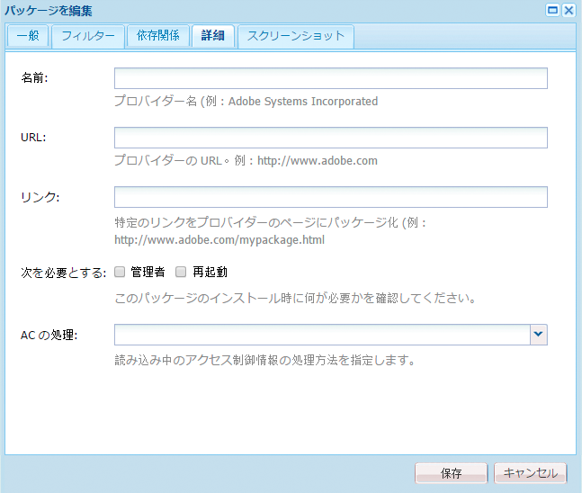

<table> 
 <tbody> 
  <tr> 
   <th><strong>フィールド</strong></th> 
   <th><strong>説明</strong></th> 
   <th><strong>形式/例</strong></th> 
  </tr> 
  <tr> 
   <td>名前</td> 
   <td>プロバイダーの名前。</td> 
   <td><em>AEMGeometrixx<br /> </em></td> 
  </tr> 
  <tr> 
   <td>URL</td> 
   <td>プロバイダーの URL。</td> 
   <td><em>https://www.aem-geometrixx.com</em></td> 
  </tr> 
  <tr> 
   <td>リンク</td> 
   <td>プロバイダーページへのパッケージ専用のリンク.</td> 
   <td><em>https://www.aem-geometrixx.com/mypackage.html</em></td> 
  </tr> 
  <tr> 
   <td>次を必要とする<br /> </td> 
   <td> 
    <ul> 
     <li>管理者：管理者権限を持つアカウントによってのみパッケージをインストールできる場合に選択します。</li> 
     <li>再起動：パッケージのインストール後にサーバーを再起動する必要がある場合に選択します。</li> 
    </ul> </td> 
   <td> </td> 
  </tr> 
  <tr> 
   <td>AC の処理</td> 
   <td><p>パッケージが読み込まれる際の、パッケージで定義されたアクセス制御情報の処理方法を指定します。</p> 
    <ul> 
     <li><strong>無視</strong></li> 
     <li><strong>上書き</strong></li> 
     <li><strong>結合</strong></li> 
     <li><strong>明確</strong></li> 
     <li><strong>MergePreserve</strong></li> 
    </ul> <p>デフォルト値は <strong>無視</strong>.</p> </td> 
   <td> 
    <ul> 
     <li><strong>無視</strong>  — リポジトリ内の ACL を保持</li> 
     <li><strong>上書き</strong>  — リポジトリ内の ACL を上書き</li> 
     <li><strong>結合</strong>  — 両方の ACL セットをマージ</li> 
     <li><strong>クリア</strong> - ACL をクリア</li> 
     <li><strong>MergePreserve</strong>  — コンテンツ内に存在しないプリンシパルのアクセス制御エントリを追加して、コンテンツ内のアクセス制御をパッケージに付属するエントリとマージします</li> 
    </ul> </td> 
  </tr> 
 </tbody> 
</table>


| **フィールド** | **説明** | **形式/例** |
|---|---|---|
| テスト条件 | このパッケージのターゲットまたは互換性のある製品名およびバージョン。 | *AEM6* |
| バグ/問題の修正 | このパッケージで修正されたバグの詳細をリストできるテキストフィールド。 各バグを別々の行にリストしてください。 | バグ番号の概要 |
| 依存 | 現在のパッケージを期待どおりに実行するために他のパッケージが必要な場合に考慮する必要がある依存関係情報をリストします。 このフィールドは、ホットフィックスを使用する際に重要です。 | groupId:name:version |
| 置き換え | このパッケージで置き換えられる、廃止されたパッケージのリスト。インストールする前に、このパッケージに古いパッケージの必要なコンテンツがすべて含まれていることを確認し、コンテンツが上書きされないようにします。 | groupId:name:version |

### パッケージフィルター {#package-filters}

フィルターは、パッケージに含めるリポジトリノードを識別します。**フィルター定義**&#x200B;によって、以下の情報が指定されます。

* 含めるコンテンツの&#x200B;**ルートパス**。。
* **ルール** ルートパスの下の特定のノードを含めるか除外する。

フィルターにはルールを含めないことも、いくつか含めることもできます。ルールを何も定義しない場合、パッケージにはルートパスの下のすべてのコンテンツが含まれます。

1 つのパッケージに対して 1 つまたは複数のフィルター定義を指定できます。複数のルートパスのコンテンツを含めるには、複数のフィルターを使用します。

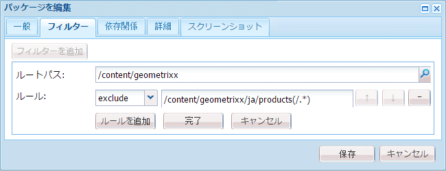

次の表に、これらのルールと例を示します。

<table> 
 <tbody> 
  <tr> 
   <th> ルールタイプ</th> 
   <th>説明 </th> 
   <th>例 </th> 
  </tr> 
  <tr> 
   <td> include</td> 
   <td>パスを定義するか、正規表現を使用して、含めるすべてのノードを指定できます。<br /> <br /> ディレクトリを含めると、次のことがおこなわれます。 
    <ul> 
     <li>そのディレクトリを含める <i>および</i> そのディレクトリ内のすべてのファイルとフォルダー（サブツリー全体）</li> 
     <li><strong>not</strong> 指定したルートパスの下の他のファイルまたはフォルダを含める</li> 
    </ul> </td> 
   <td>/libs/sling/install(/.*)? </td> 
  </tr> 
  <tr> 
   <td> exclude</td> 
   <td>パスを指定するか、正規表現を使用して、除外するすべてのノードを指定できます。<br /> <br /> ディレクトリを除外すると、そのディレクトリが除外されます <i>および</i> そのディレクトリ内のすべてのファイルとフォルダー（サブツリー全体）。<br /> </td> 
   <td>/libs/wcm/foundation/components(/.*)?</td> 
  </tr> 
 </tbody> 
</table>

>[!NOTE]
>
>1 つのパッケージに複数のフィルター定義を含めることができるので、異なる場所のノードを 1 つのパッケージに簡単に組み合わせることができます。

パッケージフィルターは、最初に [パッケージを作成](#creating-a-new-package)ただし、後から編集することもできます（その後、パッケージを再構築する必要があります）。

### パッケージスクリーンショット {#package-screenshots}

パッケージにスクリーンショットを添付して、コンテンツがどのように表示されるかを視覚的に示すことができます。例えば、新機能のスクリーンショットを提供することで、

### パッケージアイコン {#package-icons}

また、パッケージにアイコンを付けて、パッケージに含まれる内容を視覚的にすばやく参照できるようにすることもできます。 これがパッケージリストに表示され、パッケージやパッケージのクラスを簡単に識別できます。

パッケージにはアイコンを含めることができるので、公式パッケージには次の規則を使用します。

>[!NOTE]
>
>混乱を避けるには、パッケージに説明的なアイコンを使用し、公式のアイコンは使用しないでください。

公式のホットフィックスパッケージ：


公式のAEMインストールまたは拡張機能パッケージ：

公式機能パック：


## パッケージマネージャー {#package-manager}

パッケージマネージャーは、ローカルのAEMインストール上のパッケージを管理します。 次の条件が満たされた後 [必要な権限を割り当て](#permissions-needed-for-using-the-package-manager) パッケージマネージャーは、パッケージの設定、構築、ダウンロード、インストールなど、様々なアクションに使用できます。 設定する主な要素は次のとおりです。

* [パッケージ設定](#package-settings)
* [パッケージフィルター](#package-filters)

### パッケージマネージャーの使用に必要な権限 {#permissions-needed-for-using-the-package-manager}

パッケージを作成、変更、アップロード、インストールする権限をユーザーに付与するには、次の場所で適切な権限をユーザーに付与する必要があります。

* **/etc/packages** （削除を除く完全な権限）
* パッケージの内容を含むノード

詳しくは、 [権限の設定](/help/sites-administering/security.md) 権限の変更手順については、を参照してください。

### 新しいパッケージの作成 {#creating-a-new-package}

新しいパッケージ定義を作成するには：

1. AEMのようこそ画面で、 **パッケージ** ( または **ツール** コンソールをダブルクリック **パッケージ**) をクリックします。

1. 次に、 **パッケージマネージャー**.
1. 「**パッケージを作成**」をクリックします。

   >[!NOTE]
   >
   >インスタンスに多数のパッケージがある場合は、フォルダー構造が存在する可能性があるので、新しいパッケージを作成する前に必要なターゲットフォルダーに移動できます。

1. ダイアログで、以下の操作を実行します。

   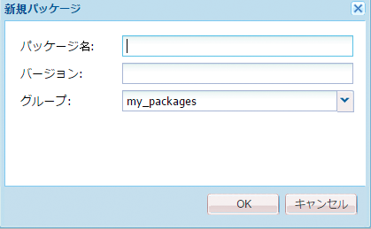

   以下を入力します。

   * **グループ名**

      ターゲットグループ（またはフォルダー）の名前。 グループは、パッケージの整理に役立つように作成されています。

      グループに対してフォルダーが作成されます（存在しない場合）。 グループ名を空白のままにすると、メインのパッケージリスト（ホーム/パッケージ）にパッケージが作成されます。

   * **パッケージ名**

      新しいパッケージの名前。 説明的な名前を選択して、（その他のユーザーが）パッケージのコンテンツを簡単に識別できるようにします。

   * **バージョン**

      バージョンを示すためのテキストフィールド。 これがパッケージ名に追加され、zip ファイルの名前が形成されます。
   「**OK**」をクリックしてパッケージを作成します。

1. AEMでは、適切なグループフォルダーに新しいパッケージがリストされます。

   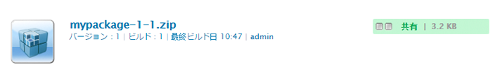

   アイコンまたはパッケージ名をクリックして開きます。

   

   >[!NOTE]
   >
   >必要に応じて、後の段階でこのページに戻ることができます。

1. クリック **編集** 編集 [パッケージ設定](#package-settings).

   ここで、情報を追加したり、特定の設定を定義したりできます。例えば、説明を含めると、 [アイコン](#package-icons)、関連するバグ、およびプロバイダーの詳細の追加。

   クリック **OK** 設定の編集が終了したら、次の手順に従います。

1. 追加 **[スクリーンショット](#package-screenshots)** 必要に応じて、パッケージに追加します。 パッケージの作成時に 1 つのインスタンスを使用でき、必要に応じて、 **パッケージのスクリーンショット** サイドキックから。

   実際の画像を追加するには、 **スクリーンショット** 領域、画像の追加、クリック **OK**.

1. 次を定義： **[パッケージフィルター](#package-filters)** インスタンスを **フィルター定義** サイドキックから、ダブルクリックして編集用に開きます。

   

   以下を指定します。

   * **ルートパス**
パッケージ化するコンテンツサブツリーのルートにすることができます。
   * **ルール**
ルールはオプションです。単純なパッケージ定義の場合、「含める」または「除外」のルールを指定する必要はありません。

      必要に応じて、 [**次を含む** または **除外** ルール](#package-filters) をクリックして、パッケージのコンテンツを正確に定義します。

      を使用してルールを追加する **+** 記号を使用するか、 **-** 記号 ルールは順序に従って適用され、必要に応じて **上** および **下** ボタン
   次に、 **OK** フィルターを保存します。

   >[!NOTE]
   >
   >フィルター定義は必要な数だけ使用できますが、競合しないように注意する必要があります。 用途 **プレビュー** をクリックして、パッケージの内容を確認します。

1. パッケージに含まれる内容を確認するには、次を使用します。 **プレビュー**. これはビルドプロセスのドライランを実行し、実際にビルドされたときにパッケージに追加されるすべての項目を一覧表示します。
1. これで、パッケージを[ビルド](#building-a-package)できます。

   >[!NOTE]
   >
   >この時点でパッケージをビルドする必要はありません。後でビルドすることもできます。

### パッケージのビルド {#building-a-package}

多くの場合、パッケージはユーザーと同時に構築されます [パッケージ定義の作成](#creating-a-new-package)を使用する必要がありますが、後で戻って、パッケージをビルドまたは再構築できます。 これは、リポジトリ内のコンテンツが変更された場合に役立ちます。

>[!NOTE]
>
>パッケージをビルドする前に、パッケージのコンテンツをプレビューすると便利です。 これをおこなうには、 **プレビュー**.

1. 次の場所からパッケージ定義を開きます。 **パッケージマネージャー** （パッケージのアイコンまたは名前をクリック）。

1. 「**ビルド**」をクリックします。パッケージをビルドするかどうかを確認するダイアログが表示されます。

   >[!NOTE]
   >
   >これは特に重要です。パッケージの内容が上書きされるので、パッケージを再構築する際に使用します。

1. 「**OK**」をクリックします。AEMがパッケージをビルドし、パッケージに追加されたすべてのコンテンツがリストされます。 パッケージの構築が完了すると、パッケージが構築されたことを示すダイアログが表示されます。また、（このダイアログを閉じると）パッケージリストの内容が更新されます。

### パッケージを再度含める {#rewrapping-a-package}

パッケージが構築されたら、必要に応じて再ラップできます。

再ラッピングによってパッケージ情報が変更されます — *なし* パッケージの内容の変更 パッケージ情報は、サムネール、説明などです。つまり、 **パッケージ設定** ダイアログ（このクリックを開く） **編集**) をクリックします。

再ラップの主な使用例は、パッケージ共有のパッケージを準備する際に発生します。 例えば、既存のパッケージがあり、それを他のユーザーと共有する場合などです。 サムネールを追加し、説明を追加します。 すべての機能を含むパッケージ全体を再作成する代わりに（時間がかかり、パッケージが元のパッケージと同じでなくなる可能性があります）、パッケージを再度ラップして、サムネールと説明を追加するだけで済みます。

1. 次の場所からパッケージ定義を開きます。 **パッケージマネージャー** （パッケージのアイコンまたは名前をクリック）。

1. 「**編集**」をクリックして、必要に応じて&#x200B;**[パッケージ設定](#package-settings)**&#x200B;を更新します。「**OK**」をクリックして保存します。

1. クリック **再折り返し**&#x200B;を指定すると、確認を求めるダイアログが表示されます。

### パッケージ情報の表示と編集 {#viewing-and-editing-package-information}

パッケージ定義に関する情報を表示または編集するには、次の手順に従います。

1. パッケージマネージャーで、表示するパッケージに移動します。
1. 表示するパッケージのパッケージアイコンをクリックします。 パッケージページが開き、パッケージ定義に関する情報が一覧表示されます。

   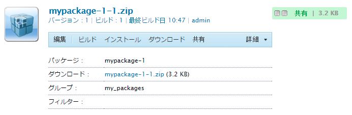

   >[!NOTE]
   >
   >また、このページから、パッケージに対する特定のアクションを編集および実行することもできます。
   >
   >使用できるボタンは、パッケージが既にビルドされているかどうかによって異なります。

1. パッケージが既にビルドされている場合は、 **内容**&#x200B;を指定した場合は、ウィンドウが開き、パッケージのコンテンツ全体がリストされます。

### パッケージコンテンツの表示とインストールのテスト {#viewing-package-contents-and-testing-installation}

パッケージが構築されたら、次の内容を表示できます。

1. パッケージマネージャーで、表示するパッケージに移動します。
1. 表示するパッケージのパッケージアイコンをクリックします。 パッケージページが開き、パッケージ定義に関する情報が一覧表示されます。

1. コンテンツを表示するには、 **内容**&#x200B;を指定した場合は、ウィンドウが開き、パッケージのコンテンツ全体がリストされます。

   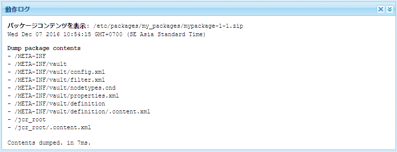

1. インストールのドライランを実行するには、をクリックします。 **インストールのテスト**. 操作を確認すると、ウィンドウが開き、インストールが実行されたかのように結果が表示されます。

   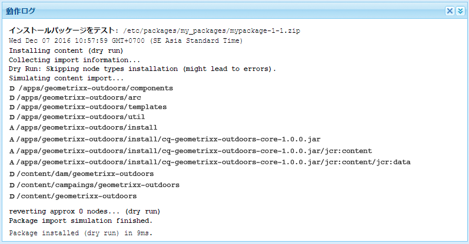

### ファイルシステムへのパッケージのダウンロード {#downloading-packages-to-your-file-system}

この節では、 **パッケージマネージャー**.

>[!NOTE]
>
>詳しくは、 [パッケージ共有](#package-share) 公開領域およびお客様の社内のパッケージ共有領域からホットフィックス、機能パック、パッケージをダウンロードする方法については、
>
>パッケージ共有から、次の操作を実行できます。
>
>* からパッケージをダウンロード [ローカルのAEMインスタンスに直接パッケージ共有](#downloading-and-installing-packages-from-package-share).\
   >  ダウンロード時に、パッケージがリポジトリにインポートされ、その後、を使用してすぐにローカルインスタンスにインストールできます。 **パッケージマネージャー**. これらのパッケージには、ホットフィックスおよびその他の共有パッケージが含まれます。
>
>* からパッケージをダウンロード [ファイルシステムへのパッケージ共有](#downloading-packages-to-your-file-system-from-package-share).
>


1. AEMのようこそ画面で、 **パッケージ**&#x200B;を選択し、「 **パッケージマネージャー**.
1. ダウンロードするパッケージに移動します。

   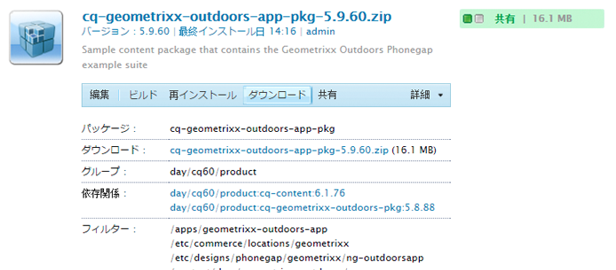

1. ダウンロードするパッケージの zip ファイルの名前（下線付き）で構成されるリンクをクリックします。例： `export-for-offline.zip`.

   AEMは、（標準のブラウザーダウンロードダイアログを使用して）パッケージをコンピューターにダウンロードします。

### ファイルシステムからのパッケージのアップロード {#uploading-packages-from-your-file-system}

パッケージのアップロードでは、ファイルシステムからAEM Package Manager にパッケージをアップロードできます。

>[!NOTE]
>
>詳しくは、 [社内パッケージ共有へのパッケージのアップロード](#uploading-a-package) をクリックして、お客様の会社のパッケージ共有のプライベートエリアにパッケージをアップロードします。

パッケージをアップロードするには：

1. 次に移動： **パッケージマネージャー**. 次に、パッケージのアップロード先のグループフォルダーに移動します。

   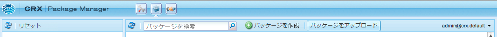

1. 「**パッケージをアップロード**」をクリックします。

   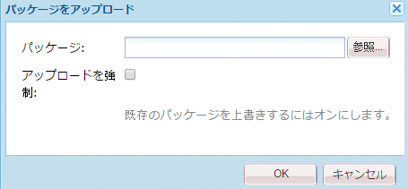

   * **ファイル**

      ファイル名を直接入力するか、 **参照…** 必要なパッケージをローカルファイルシステムから選択するダイアログ（選択後にクリック） **OK**) をクリックします。

   * **アップロードを強制**

      同じ名前のパッケージが既に存在する場合は、このボタンをクリックして、強制的にアップロード（および既存のパッケージを上書き）できます。
   クリック **OK** 新しいパッケージがアップロードされ、「パッケージマネージャー」リストに表示されます。

   >[!NOTE]
   >
   >コンテンツをAEMで使用できるようにするには、必ず [パッケージをインストール](#installing-packages).

### パッケージの検証 {#validating-packages}

パッケージをインストールする前に、その内容を確認する必要があります。 パッケージは、以下のオーバーレイファイルを変更できるので、 `/apps` ACL の追加、変更、削除を行う、または、多くの場合、インストール前にこれらの変更を検証すると便利です。

#### 検証オプション {#validation-options}

検証メカニズムは、パッケージの次の特性を確認できます。

* OSGi パッケージのインポート
* オーバーレイ
* ACL

これらのオプションについては、以下で詳しく説明します。

* **OSGi パッケージの読み込みを検証**

   **チェック内容**

   この検証は、すべての JAR ファイル（OSGi バンドル）のパッケージを検証し、それらを抽出します `manifest.xml` （これには、その OSGi バンドルが依存するバージョン管理された依存関係が含まれます）。また、AEMインスタンスが、その依存関係を正しいバージョンでエクスポートしたことを検証します。

   **レポート方法**

   AEMインスタンスで満たされないバージョン管理された依存関係は、 **アクティビティログ** 」をクリックします。

   **エラー状態**

   依存関係が満たされていない場合、これらの依存関係を含むパッケージ内の OSGi バンドルは起動しません。 これにより、非起動の OSGi バンドルに依存するものはすべて正しく機能しなくなるので、アプリケーションのデプロイメントが壊れます。

   **エラーの解決**

   未満の OSGi バンドルによるエラーを解決するには、未満の読み込みを含むバンドルの依存バージョンを調整する必要があります。

* **オーバーレイを検証**

   **チェック内容**

   この検証では、インストールされるパッケージに、宛先のAEMインスタンスで既にオーバーレイされているファイルが含まれているかどうかを判断します。

   例えば、既存のオーバーレイが `/apps/sling/servlet/errorhandler/404.jsp` にある場合、`/libs/sling/servlet/errorhandler/404.jsp` を含むパッケージは、`/libs/sling/servlet/errorhandler/404.jsp` の既存のファイルを変更します。

   **レポート方法**

   このようなオーバーレイについては、 **アクティビティログ** 」をクリックします。

   **エラー状態**

   エラー状態とは、パッケージが既にオーバーレイされているファイルのデプロイを試みているため、パッケージ内の変更はオーバーレイによって上書きされ（したがって「非表示」になる）、有効にならないことを意味します。

   **エラーの解決**

   この問題を解決するには、 `/apps` は、 `/libs` 必要に応じて変更をオーバーレイ ( `/apps`) をクリックし、オーバーレイされたファイルを再デプロイします。

   >[!NOTE]
   >
   >オーバーレイされたコンテンツがオーバーレイファイルに適切に組み込まれている場合、検証メカニズムでは紐付けがおこなわれないことに注意してください。 したがって、この検証では、必要な変更が加えられた後も競合についてレポートし続けます。

* **ACL を検証**

   **チェック内容**

   この検証では、追加されている権限、それらの処理方法（結合/置換）、現在の権限に影響があるかどうかを確認します。

   **レポート方法**

   権限については、 **アクティビティログ** 」をクリックします。

   **エラー状態**

   明示的なエラーは提供できません。 検証は、新しい ACL 権限がパッケージのインストールによって追加されるか、影響を受けるかを示すだけです。

   **エラーの解決**

   検証で提供された情報を使用して、影響を受けたノードを CRXDE で確認し、必要に応じて ACL をパッケージ内で調整できます。

   >[!CAUTION]
   >
   >ベストプラクティスとして、パッケージはAEMが提供する ACL に影響を与えないようにすることをお勧めします。これは、予期しない製品の動作を引き起こす可能性があるからです。

#### 検証の実行 {#performing-validation}

パッケージの検証は、次の 2 つの方法で実行できます。

* パッケージマネージャー UI を使用
* cURL などの HTTP POST リクエストを介して

>[!NOTE]
>
>検証は、パッケージをアップロードした後で、インストールする前に必ず行う必要があります。

**パッケージマネージャーを使用したパッケージの検証**

1. パッケージマネージャー ( ) を開きます。 `https://<server>:<port>/crx/packmgr`
1. リストからパッケージを選択し、「 」を選択します。 **詳細** 見出しからドロップダウンし、 **検証** を選択します。

   >[!NOTE]
   >
   >これは、コンテンツパッケージをアップロードした後、パッケージをインストールする前におこなう必要があります。

1. 表示されるモーダルダイアログボックスで、チェックボックスを使用して検証の種類を選択し、「**検証**」をクリックして検証を開始します。または、 **キャンセル**.

1. 選択した検証が実行されます。 結果は、パッケージマネージャーのアクティビティログに表示されます。

**HTTP POST リクエストを介したパッケージ検証**

POST リクエストの形式は以下のとおりです。

```
https://<host>:<port>/crx/packmgr/service.jsp?cmd=validate&type=osgiPackageImports,overlays,acls
```

>[!NOTE]
>
>この `type` パラメーターは、次の要素から成る、カンマで区切られた順不同リストです。
>
>* `osgiPackageImports`
>* `overlays`
>* `acls`
>
>の値 `type` デフォルト： `osgiPackageImports` 渡されない場合は。

以下は、cURL を使用してパッケージ検証を実行する例です。

1. cURL を使用する場合は、次のようなステートメントを実行します。

   ```shell
   curl -v -X POST --user admin:admin -F file=@/Users/SomeGuy/Desktop/core.wcm.components.all-1.1.0.zip 'http://localhost:4502/crx/packmgr/service.jsp?cmd=validate&type=osgiPackageImports,overlays,acls'
   ```

1. リクエストされた検証が実行され、応答が JSON オブジェクトとして返されます。

>[!NOTE]
>
>検証 HTTPPOSTリクエストへの応答は、検証の結果を含む JSON オブジェクトになります。

### パッケージのインストール {#installing-packages}

パッケージをアップロードした後、コンテンツをインストールする必要があります。 パッケージコンテンツをインストールして機能させるには、次の両方にする必要があります。

* AEMに読み込まれました ( [ファイルシステムからアップロード済み](#uploading-packages-from-your-file-system) または [パッケージ共有からダウンロード済み](#downloading-and-installing-packages-from-package-share))

* インストール済み

>[!CAUTION]
>
>パッケージをインストールすると、既存のコンテンツが上書きまたは削除される可能性があります。必要なコンテンツが削除または上書きされないと確認できる場合にのみ、パッケージをアップロードしてください。
>
>パッケージのコンテンツや影響を確認するには、次の手順を実行します。
>
>* コンテンツを変更せずに、パッケージのテストインストールを実行します。\
   >  パッケージを開き（パッケージのアイコンまたは名前をクリック）、 **インストールをテスト**.
>
>* パッケージの内容のリストを参照してください。\
   >  パッケージを開き、 **内容**.
>


>[!NOTE]
>
>パッケージをインストールする直前に、上書きされるコンテンツを含むスナップショットパッケージが作成されます。
>
>このスナップショットは、パッケージをアンインストールした場合、またはアンインストールした場合に再インストールされます。

>[!CAUTION]
>
>デジタルアセットをインストールする場合は、次の手順を実行する必要があります。
>
>* まず、WorkflowLauncher を非アクティブ化します。\
   >  OSGi コンソールのコンポーネントメニューオプションを使用して、次のコンポーネントを非アクティブにします。`com.day.cq.workflow.launcher.impl.WorkflowLauncherImpl` です。
>
>* 次に、インストールが完了したら、WorkflowLauncher を再アクティブ化します。
>
>WorkflowLauncher を非アクティブ化すると、Assets インポーターフレームワークによって、インストール時にアセットが（意図せず）操作されなくなります。

1. パッケージマネージャーで、インストールするパッケージに移動します。

   An **インストール** ボタンが、まだインストールされていないパッケージの横に表示されます。

   >[!NOTE]
   >
   >または、パッケージのアイコンをクリックしてパッケージを開き、 **インストール** ボタンをクリックします。

1. クリック **インストール** をクリックして、インストールを開始します。 確認を求めるダイアログが表示され、行われているすべての変更が一覧表示されます。終了したら、 **閉じる** をクリックします。

   次の単語 **インストール済み** は、インストール後、パッケージの横に表示されます。

### ファイルシステムベースのアップロードおよびインストール {#file-system-based-upload-and-installation}

別の方法で、パッケージをインスタンスにアップロードしてインストールすることもできます。 ファイルシステムに、 `crx-quicksart` jar と一緒にフォルダーと `license.properties` ファイル。 次の名前のフォルダーを作成する必要があります： `install` under `crx-quickstart`. その後、次のような情報が表示されます。 `<aem_home>/crx-quickstart/install`

この install フォルダーで、パッケージを直接追加できます。 追加したパッケージは、インスタンスに自動的にアップロードおよびインストールされます。完了したら、パッケージマネージャーにパッケージが表示されます。

インスタンスが実行中の場合、 `install` フォルダーは直接アップロードとインスタンスへのインストールを開始します。 インスタンスが実行されていない場合は、に配置するパッケージ `install` フォルダーは起動時にアルファベット順にインストールされます。

>[!NOTE]
>
>また、インスタンスを初めて起動する前に、この操作をおこなうこともできます。 それには、 `crx-quickstart` フォルダーを手動で作成するには、 `install` フォルダーの下に保存し、パッケージをそこに配置します。 その後、インスタンスを初めて起動したときに、パッケージがアルファベット順にインストールされます。

### パッケージのアンインストール {#uninstalling-packages}

AEMでは、パッケージをアンインストールできます。 この操作により、パッケージのインストール直前に行われたスナップショットに影響を与えたリポジトリの内容が元に戻されます。

>[!NOTE]
>
>インストール時に、上書きされるコンテンツを含むスナップショットパッケージが作成されます。
>
>このパッケージは、パッケージをアンインストールすると再インストールされます。

1. パッケージマネージャーで、アンインストールするパッケージに移動します。
1. アンインストールするパッケージのパッケージアイコンをクリックします。
1. クリック **アンインストール** をクリックして、リポジトリからこのパッケージのコンテンツを削除します。 確認を求めるダイアログが表示され、行われているすべての変更が一覧表示されます。終了したら、 **閉じる** をクリックします。

### パッケージの削除 {#deleting-packages}

パッケージマネージャーリストからパッケージを削除するには：

>[!NOTE]
>
>パッケージからインストールされるファイル/ノードは次のとおりです。 **not** 削除されました。

1. 内 **ツール** コンソール、展開 **パッケージ** フォルダーを使用して、パッケージを右側のウィンドウに表示します。

1. 削除するパッケージをクリックしてハイライト表示し、次のいずれかを選択します。

   * クリック **削除** 」をクリックします。
   * 右クリックして「 」を選択します。 **削除**.

   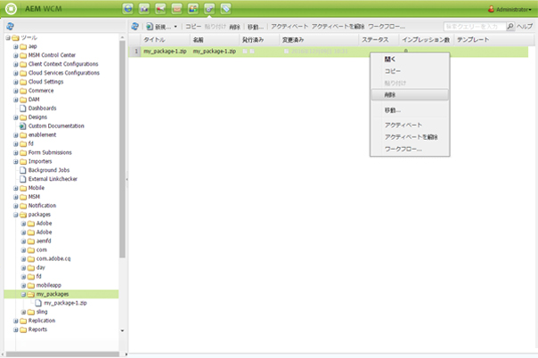

1. パッケージを削除してよいかどうか確認するダイアログが表示されます。「**OK**」をクリックして削除を確認します。

>[!CAUTION]
>
>このパッケージが既にインストールされている場合、 *インストール済み* コンテンツの対象 **not** を削除します。

### パッケージのレプリケーション {#replicating-packages}

パッケージのコンテンツをレプリケートして、パブリッシュインスタンスにインストールします。

1. 内 **パッケージマネージャー**&#x200B;をクリックし、レプリケートするパッケージに移動します。

1. レプリケートするパッケージのアイコンまたは名前をクリックして展開します。
1. 内 **詳細** ツールバーのドロップダウンメニューで、「 **複製**.

## パッケージ共有 {#package-share}

パッケージ共有は、コンテンツパッケージを共有するために公開された一元化されたサーバーです。

がに置き換えられました。 [ソフトウェア配布。](#software-distribution)

## ソフトウェア配布 {#software-distribution}

[ソフトウェア配布](https://downloads.experiencecloud.adobe.com) は、AEMパッケージの検索とダウンロードを簡素化する新しいユーザーインターフェイスです。

詳しくは、 [ソフトウェア配布ドキュメント。](https://experienceleague.adobe.com/docs/experience-cloud/software-distribution/home.html?lang=ja)

>[!CAUTION]
>
>AEM Package Manager は、現在、Software Distribution では使用できません。 パッケージをローカルディスクにダウンロードします。
