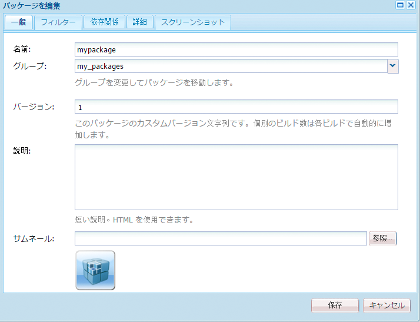
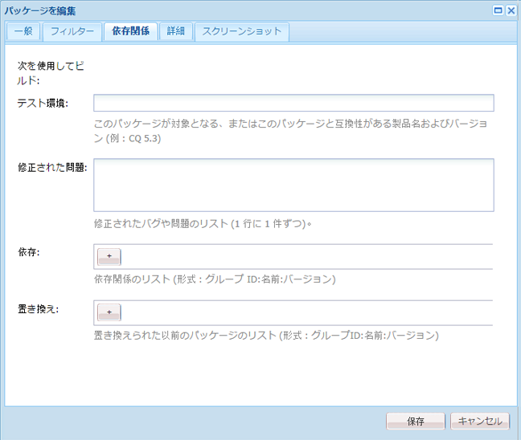

# パッケージの使用方法{#how-to-work-with-packages}

パッケージによって、リポジトリコンテンツの読み込みと書き出しが可能になります。例えば、パッケージを使用すると、新しい機能のインストール、インスタンス間でのコンテンツの転送、リポジトリコンテンツのバックアップが可能です。

パッケージは、以下のページからアクセスおよび保守できます。

* [パッケージマネージャー](#package-manager)：ローカルの AEM インスタンスでパッケージを管理する際に使用します。

* [パッケージ共有](#package-share)：公開されているパッケージと社内用の非公開のパッケージの両方を格納している一元管理用サーバーです。公開パッケージには、ホットフィックス、新機能、ドキュメントなどを含めることができます。

パッケージマネージャー、パッケージ共有、ユーザーのファイルシステムの間でパッケージを転送できます。

## パッケージとは {#what-are-packages}

パッケージとは、ファイルシステムシリアル化（「vault」シリアル化）の形式でリポジトリコンテンツが格納されている zip ファイルです。これにより、使いやすく編集しやすい方法でファイルおよびフォルダーを表現できます。

パッケージには、フィルターを使用して選択された、ページコンテンツとプロジェクト関連コンテンツの両方のコンテンツが含まれます。

パッケージには、フィルタ定義や読み込み設定情報などの Vault メタ情報も含まれています。説明、視覚的な画像、アイコンなど、追加のコンテンツプロパティ（パッケージの抽出には使用されない）をパッケージに含めることができます。これらのプロパティは、コンテンツパッケージコンシューマー向けのもので、情報提供だけを目的としています。

>[!NOTE]
>
>パッケージは、そのパッケージを作成した時点におけるコンテンツの現在のバージョンを表しています。AEM がリポジトリに保持している以前のバージョンのコンテンツは含まれません。

パッケージでは以下のアクションを実行できます。

* 新しいパッケージを作成し、必要に応じてパッケージ設定やフィルターを定義
* パッケージのコンテンツをプレビュー（ビルド前）
* パッケージをビルド
* パッケージ情報を表示
* パッケージのコンテンツを表示（ビルド後）
* 既存のパッケージの定義を変更
* 既存のパッケージを再ビルド
* パッケージを再度含める
* AEM からファイルシステムへパッケージをダウンロード
* ファイルシステムからローカルのAEMインスタンスにパッケージをアップロード
* インストール前にパッケージの内容を検証
* ドライランのインストールを実行する
* パッケージをインストール（AEM はパッケージのアップロード後に自動インストールしません）
* パッケージを削除
* ホットフィックスなどのパッケージをパッケージ共有ライブラリからダウンロード
* パッケージ共有ライブラリの社内セクションにパッケージをアップロード

## パッケージ情報 {#package-information}

パッケージの定義は、次のような様々な種類の情報で構成されています。

* [パッケージ設定](#package-settings)
* [パッケージフィルター](#package-filters)
* [パッケージスクリーンショット](#package-screenshots)
* [パッケージアイコン](#package-icons)

### パッケージ設定 {#package-settings}

様々なパッケージ設定を編集して、パッケージの説明、関連するバグ、依存関係、プロバイダー情報などの側面を定義できます。

**パッケージ設定**&#x200B;ダイアログは、パッケージを&#x200B;**作成**&#x200B;または[編集](#creating-a-new-package)中に「[編集](#viewing-and-editing-package-information)」ボタンをクリックすると表示され、設定用のタブが 3 つ含まれます。変更をおこなったら、「**OK**」をクリックして保存します。



| **フィールド** | **説明** |
|---|---|
| 名前 | パッケージの名前。 |
| グループ | パッケージの追加先の、パッケージを整理するためのグループの名前。新しいグループの名前を入力するか、既存のグループを選択します。 |
| バージョン | カスタムバージョンに使用するテキスト。 |
| 説明 | パッケージの簡単な説明。書式設定に HTML マークアップを使用できます。 |
| サムネール | パッケージリストと共に表示するアイコン。「参照」をクリックしてローカルファイルを選択します。 |


<table> 
 <tbody> 
  <tr> 
   <th><strong>フィールド</strong></th> 
   <th><strong>説明</strong></th> 
   <th><strong>形式／例</strong></th> 
  </tr> 
  <tr> 
   <td>名前</td> 
   <td>プロバイダーの名前。</td> 
   <td><em>AEM Geometrixx<br /> </em></td> 
  </tr> 
  <tr> 
   <td>URL</td> 
   <td>プロバイダーの URL。</td> 
   <td><em>https://www.aem-geometrixx.com</em></td> 
  </tr> 
  <tr> 
   <td>リンク</td> 
   <td>プロバイダーページへの、パッケージ専用のリンク。</td> 
   <td><em>https://www.aem-geometrixx.com/mypackage.html</em></td> 
  </tr> 
  <tr> 
   <td>次を必要とする<br /> </td> 
   <td> 
    <ul> 
     <li>管理者：管理者権限のあるアカウントでのみパッケージがインストール可能な場合に選択します。</li> 
     <li>再起動：パッケージをインストール後にサーバーを再起動する必要がある場合に選択します。</li> 
    </ul> </td> 
   <td> </td> 
  </tr> 
  <tr> 
   <td>AC の処理</td> 
   <td><p>パッケージ読み込み時の、パッケージで定義されているアクセス制御情報の処理方法を指定します。</p> 
    <ul> 
     <li><strong>無視</strong></li> 
     <li><strong>上書き</strong></li> 
     <li><strong>統合</strong></li> 
     <li><strong>消去</strong></li> 
     <li><strong>統合して保存</strong></li> 
    </ul> <p>デフォルト値は <strong>Ignore</strong> です。</p> </td> 
   <td> 
    <ul> 
     <li><strong>無視</strong> - リポジトリ内の ACL を保持</li> 
     <li><strong>上書き</strong> - リポジトリ内の ACL を上書き</li> 
     <li><strong>統合</strong> - 両方の ACL セットを統合</li> 
     <li><strong>消去</strong> - ACL を消去</li> 
     <li><strong>統合して保存</strong> - コンテンツ内に存在しないプリンシパルのアクセス制御エントリを追加し、コンテンツ内のアクセス制御をパッケージが提供するものとマージ</li> 
    </ul> </td> 
  </tr> 
 </tbody> 
</table>



| **フィールド** | **説明** | **形式／例** |
|---|---|---|
| テスト環境 | このパッケージのターゲットまたは互換性のある製品名およびバージョン。 | *AEM 6* |
| 修正された問題 | このパッケージで修正されたバグの詳細をリストできるテキストフィールド。バグはそれぞれ別々の行に入力してください。 | バグ番号と概要 |
| 依存 | 現在のパッケージを期待どおりに実行するために他のパッケージが必要な場合に配慮する必要のある依存関係情報をリストします。このフィールドはホットフィックスを使用する場合に重要です。 | groupId:name:version |
| 置き換え | このパッケージで置き換えられる廃止されたパッケージのリスト。インストール前に、古いパッケージの必要なコンテンツがすべてこのパッケージに含まれていることを確認し、コンテンツが上書きされないようにしてください。 | groupId:name:version |

### パッケージフィルター {#package-filters}

フィルターは、パッケージに含めるリポジトリノードを識別します。A **フィルター定義** 次の情報を指定します。

* 含めるコンテンツの&#x200B;**ルートパス**。
* **ルール** ルートパスの下の特定のノードを含めるか除外する。

フィルターには、0 個以上のルールを含めることができます。ルールが定義されていない場合、パッケージのルートパスの下にすべてのコンテンツが含まれます。

パッケージには、1 つ以上のフィルター定義を定義できます。複数のルートパスのコンテンツを含めるには、複数のフィルターを使用します。


次の表で、これらのルールについて説明し、例を示します。

<table> 
 <tbody> 
  <tr> 
   <th> ルールタイプ</th> 
   <th>説明 </th> 
   <th>例 </th> 
  </tr> 
  <tr> 
   <td> include</td> 
   <td>パスを定義するか、正規表現を使用して、含めるすべてのノードを指定できます。<br />
<br />
ディレクトリを含めると、 
    <ul> 
     <li>そのディレクトリと、そのディレクトリ内のすべてのファイルおよびフォルダー（サブツリー全体）が含まれます。<i></i></li> 
     <li>指定したルートパスの下のその他のファイルやフォルダーは含まれ<strong>ません</strong>。</li> 
    </ul> </td> 
   <td>/libs/sling/install(/.*)?  </td> 
  </tr> 
  <tr> 
   <td> exclude</td> 
   <td>パスを指定するか、正規表現を使用して、除外するすべてのノードを指定できます。<br />
。
<br /><i>
。

ディレクトリを除外すると、そのディレクトリと、そのディレクトリ内のすべてのファイルおよびフォルダー（サブツリー全体）が除外されます。</i><br /> </td> 
   <td>/libs/wcm/foundation/components(/.*)?</td> 
  </tr> 
 </tbody> 
</table>

>[!NOTE]
>
>1 つのパッケージに複数のフィルター定義を含めることができるので、別々の場所のノードを組み合わせて 1 つのパッケージにすることも簡単です。

パッケージフィルターは多くの場合、初めて[パッケージを作成](#creating-a-new-package)するときに定義されますが、後から編集することもできます（その後パッケージを再ビルドする必要があります）。

### パッケージスクリーンショット {#package-screenshots}

パッケージにスクリーンショットを付加すると、コンテンツの外観を視覚的に表現できます。例えば、新機能のスクリーンショットを用意するなどです。

### パッケージアイコン {#package-icons}

また、パッケージにアイコンを付加すると、パッケージの内容をすぐに参照できるように視覚的に表現できます。これはパッケージリストに表示され、パッケージやパッケージのクラスを簡単に識別できます。

1 つのパッケージに含めることができるアイコンは 1 つなので、公式のパッケージには以下の規則が使用されます。

>[!NOTE]
>
>混乱を避けるために、パッケージには説明的なアイコンを使用し、公式アイコンは使用しないでください。

公式のホットフィックスパッケージ：


公式の AEM インストールまたは拡張パッケージ：

公式の機能パック：


## パッケージマネージャー {#package-manager}

パッケージマネージャーでは、ローカルの AEM インストール環境でパッケージが管理されます。[必要な権限の割り当て](#permissions-needed-for-using-the-package-manager)をおこなってから、Package Manager を使用してパッケージの設定、構築、ダウンロード、インストールなど様々なアクションを実行できます。設定する主な要素は次のとおりです。

* [パッケージ設定](#package-settings)
* [パッケージフィルター](#package-filters)

### パッケージマネージャーの使用に必要な権限 {#permissions-needed-for-using-the-package-manager}

パッケージを作成、変更、アップロードおよびインストールする権限をユーザーに付与するには、以下の場所で適切な権限を指定する必要があります。

* **/etc/packages**（削除を除く完全な権限）
* パッケージコンテンツを含むノード

権限の変更手順については、[権限の設定](/help/sites-administering/security.md)を参照してください。

### 新しいパッケージの作成 {#creating-a-new-package}

新しいパッケージ定義を作成するには：

1. AEMのようこそ画面で、 **パッケージ** ( または **ツール** コンソールをダブルクリック **パッケージ**) をクリックします。

1. 次に「**パッケージマネージャー**」を選択します。
1. 「**パッケージを作成**」をクリックします。

   >[!NOTE]
   >
   >多数のパッケージを含むインスタンスの場合は、フォルダー構造が存在する可能性があるので、必要なターゲットフォルダーに移動してから新しいパッケージを作成できます。

1. 次のダイアログで、以下の操作をおこないます。

   

   以下を入力します。

   * **Group Name**

      ターゲットグループ（またはフォルダー）の名前。 グループは、パッケージの整理に役立つように作成されています。

      グループに対してフォルダーが作成されます（存在しない場合）。 グループ名を空白のままにすると、メインのパッケージリスト（ホーム/パッケージ）にパッケージが作成されます。

   * **パッケージ名**

      新しいパッケージの名前。 説明的な名前を選択して、（その他のユーザーが）パッケージのコンテンツを簡単に識別できるようにします。

   * **バージョン**

      バージョンを示すためのテキストフィールド。 これがパッケージ名に追加され、zip ファイルの名前が形成されます。
   「**OK**」をクリックしてパッケージを作成します。

1. AEMでは、適切なグループフォルダーに新しいパッケージがリストされます。

   

   アイコンまたはパッケージ名をクリックして開きます。

   

   >[!NOTE]
   >
   >必要に応じて、後からこのページに戻ることができます。

1. 「**編集**」をクリックして、[パッケージ設定](#package-settings)を編集します。

   ここで、情報の追加や一定の設定の定義ができます。これには、説明、[アイコン](#package-icons)、関連するバグ、プロバイダーの詳細などが含まれます。

   設定の編集が完了したら、「**OK**」をクリックします。

1. 必要に応じて、**[スクリーンショット](#package-screenshots)**&#x200B;をパッケージに追加します。パッケージ作成時は、インスタンスは 1 つです。必要に応じて、サイドキックの&#x200B;**パッケージスクリーンショット**&#x200B;を使用して追加します。

   実際の画像を追加するには、「**スクリーンショット**」領域で画像コンポーネントをダブルクリックし、画像を追加して、「**OK**」をクリックします。

1. **[パッケージフィルター](#package-filters)**&#x200B;を定義するには、サイドキックから&#x200B;**フィルター定義**&#x200B;のインスタンスをドラッグし、ダブルクリックして編集用に開きます。

   

   以下を指定します。

   * **ルートパス**
パッケージ化するコンテンツ。サブツリーのルートを指定できます。
   * **ルール**
ルールはオプションです。単純なパッケージ定義の場合、「含める」または「除外」のルールを指定する必要はありません。

      必要に応じて、 [**次を含む** または **除外** ルール](#package-filters) をクリックして、パッケージのコンテンツを正確に定義します。

      を使用してルールを追加する **+** 記号を使用するか、 **-** 記号 ルールは順序に従って適用され、必要に応じて **上** および **下** ボタン
   「**OK**」をクリックして、フィルターを保存します。

   >[!NOTE]
   >
   >フィルター定義は必要に応じていくつでも使用できますが、競合しないように注意する必要があります。**プレビュー**&#x200B;を使用して、パッケージのコンテンツがどうなるかを確認します。

1. パッケージの内容を確認するには、**プレビュー**&#x200B;を使用できます。ビルドプロセスのドライランが実行され、実際のビルド時にパッケージに追加されるものがすべてリストされます。
1. これで、パッケージを[ビルド](#building-a-package)できます。

   >[!NOTE]
   >
   >この時点でパッケージをビルドしなければならないわけではありません。後からビルドしても構いません。

### パッケージのビルド {#building-a-package}

パッケージは多くの場合、[パッケージ定義の作成](#creating-a-new-package)と同時にビルドされますが、後から戻ってパッケージをビルドまたは再ビルドできます。これは、リポジトリ内のコンテンツが変更された場合に便利です。

>[!NOTE]
>
>パッケージをビルドする前に、パッケージのコンテンツをプレビューすると便利な場合があります。これを行うには、「**プレビュー**」をクリックします。

1. **パッケージマネージャー**&#x200B;からパッケージ定義を開きます（パッケージのアイコンまたは名前をクリック）。

1. 「**ビルド**」をクリックします。パッケージをビルドすることを確認するダイアログが表示されます。

   >[!NOTE]
   >
   >これは、パッケージを再ビルドする場合は特に重要です。パッケージのコンテンツが上書きされるからです。

1. 「**OK**」をクリックします。パッケージが構築されます。パッケージに追加されたすべてのコンテンツがリストされます。パッケージの構築が完了すると、パッケージが構築されたことを示すダイアログが表示されます。また、（このダイアログを閉じると）パッケージリストの内容が更新されます。

### パッケージを再度含める {#rewrapping-a-package}

パッケージは、ビルド後に必要に応じて再度含めることができます。

再ラッピングによってパッケージ情報が変更されます — *なし* パッケージの内容の変更パッケージ情報は、サムネール、説明などです。つまり、 **パッケージ設定** ダイアログ（このクリックを開く） **編集**) をクリックします。

再ラップの主な使用例は、パッケージ共有のパッケージを準備する際に発生します。 例えば、既存のパッケージがあり、それを他のユーザーと共有する場合などです。 サムネールを追加し、説明を追加します。 すべての機能を含むパッケージ全体を再作成する代わりに（時間がかかり、パッケージが元のパッケージと同じでなくなる可能性があります）、パッケージを再度ラップして、サムネールと説明を追加するだけで済みます。

1. **パッケージマネージャー**&#x200B;からパッケージ定義を開きます（パッケージのアイコンまたは名前をクリック）。

1. 「**編集**」をクリックして、必要に応じて&#x200B;**[パッケージ設定](#package-settings)**&#x200B;を更新します。「**OK**」をクリックして保存します。

1. 「**再度含める**」をクリックすると、確認のダイアログが表示されます。

### パッケージ情報の表示と編集 {#viewing-and-editing-package-information}

パッケージ定義に関する情報を表示または編集するには：

1. パッケージマネージャーで、表示するパッケージに移動します。
1. 表示するパッケージのパッケージアイコンをクリックします。パッケージページが開き、パッケージ定義に関する情報が表示されます。

   

   >[!NOTE]
   >
   >このページからも、パッケージに対する編集や一定のアクションを実行できます。
   >
   >使用可能なボタンは、パッケージがビルド済みかどうかによって異なります。

1. パッケージがビルド済みの場合は、「**コンテンツ**」をクリックします。ウィンドウが開き、パッケージのコンテンツ全体が表示されます。

### パッケージコンテンツの表示とインストールのテスト {#viewing-package-contents-and-testing-installation}

パッケージがビルドされたら、コンテンツを表示できます。

1. パッケージマネージャーで、表示するパッケージに移動します。
1. 表示するパッケージのパッケージアイコンをクリックします。パッケージページが開き、パッケージ定義に関する情報が表示されます。

1. コンテンツを表示するには、「**コンテンツ**」をクリックします。ウィンドウが開き、パッケージのコンテンツ全体が表示されます。

   

1. インストールのドライランを実行するには、「**インストールをテスト**」をクリックします。アクションを確定すると、ウィンドウが開き、インストールが実行されたかのように結果が表示されます。

   

### ファイルシステムへのパッケージのダウンロード {#downloading-packages-to-your-file-system}

ここでは、**パッケージマネージャー**&#x200B;を使用して AEM からファイルシステムへパッケージをダウンロードする方法について説明します。

>[!NOTE]
>
>公開領域およびパッケージ共有の社内領域からホットフィックス、機能パックおよびパッケージをダウンロードする方法について詳しくは、[パッケージ共有](#package-share)を参照してください。
>
>パッケージ共有からは、次のことが可能です。
>
>* [パッケージ共有からローカル AEM インスタンスに直接](#downloading-and-installing-packages-from-package-share)パッケージをダウンロード。\
   >  ダウンロードしたパッケージはリポジトリに読み込まれ、**パッケージマネージャー**&#x200B;を使用してすぐにローカルインスタンスにインストールできます。これらのパッケージには、ホットフィックスやその他の共有パッケージが含まれています。
>
>* [パッケージ共有からファイルシステムに](#downloading-packages-to-your-file-system-from-package-share)パッケージをダウンロード。

>


1. AEMのようこそ画面で、 **パッケージ**&#x200B;を選択し、「 **パッケージマネージャー**.
1. ダウンロードするパッケージに移動します。

   

1. ダウンロードするパッケージの、zip ファイルの名前から形成された（下線付きの）リンク（`export-for-offline.zip` など）をクリックします。

   AEMは、（標準のブラウザーダウンロードダイアログを使用して）パッケージをコンピューターにダウンロードします。

### ファイルシステムからのパッケージのアップロード {#uploading-packages-from-your-file-system}

パッケージのアップロードでは、ファイルシステムからAEM Package Manager にパッケージをアップロードできます。

>[!NOTE]
>
>詳しくは、 [社内パッケージ共有へのパッケージのアップロード](#uploading-a-package) をクリックして、お客様の会社のパッケージ共有のプライベートエリアにパッケージをアップロードします。

パッケージをアップロードするには：

1. **パッケージマネージャー**&#x200B;に移動します。次に、パッケージのアップロード先のグループフォルダーに移動します。

   

1. 「**パッケージをアップロード**」をクリックします。

   

   * **File**

      ファイル名を直接入力するか、 **参照…** 必要なパッケージをローカルファイルシステムから選択するダイアログ（選択後にクリック） **OK**) をクリックします。

   * **アップロードを強制**

      同じ名前のパッケージが既に存在する場合は、このボタンをクリックして、強制的にアップロード（および既存のパッケージを上書き）できます。
   「**OK**」をクリックすると、新しいパッケージがアップロードされ、パッケージマネージャーのリストに表示されます。

   >[!NOTE]
   >
   >AEM でコンテンツを利用できるようにするには、必ず[パッケージをインストール](#installing-packages)してください。

### パッケージの検証 {#validating-packages}

パッケージをインストールする前に、内容を確認することが可能です。パッケージは、以下のオーバーレイファイルを変更できるので、 `/apps` ACL の追加、変更、削除を行う、または、多くの場合、インストール前にこれらの変更を検証すると便利です。

#### 検証オプション {#validation-options}

検証メカニズムは、次のようなパッケージの特性を確認できます。

* OSGi パッケージの読み込み
* オーバーレイ
* ACL

これらのオプションについて、以下に説明します。

* **OSGi パッケージの読み込みを検証**

   **チェック内容**

   この検証では、パッケージ内のすべての JAR ファイル（OSGi バンドル）を調べ、それらの `manifest.xml`（OSGi バンドルが依存しているバージョン付きの依存関係が含まれているファイル）を抽出し、AEM インスタンスが正しいバージョンで依存関係を書き出すかを確認します。

   **レポート方法**

   AEMインスタンスで満たされないバージョン管理された依存関係は、 **アクティビティログ** 」をクリックします。

   **エラーの状態**

   未解決の依存関係がある場合、それらの依存関係を持つパッケージ内の OSGi バンドルは開始しません。開始しない OSGi バンドルに依存しているものはすべて正しく機能しなくなるため、これによりアプリケーションのデプロイメントが破損します。

   **エラーの解決**

   依存関係が未解決の OSGi バンドルによるエラーを解決するには、未解決の読み込みがあるバンドルの依存関係バージョンを調整する必要があります。

* **オーバーレイを検証**

   **チェック内容**

   この検証では、インストールするパッケージに、宛先の AEM インスタンスにすでにオーバーレイされているファイルが含まれているかどうかを確認します。

   例えば、既存のオーバーレイが `/apps/sling/servlet/errorhandler/404.jsp`、を含むパッケージ `/libs/sling/servlet/errorhandler/404.jsp`に設定し、 `/libs/sling/servlet/errorhandler/404.jsp`.

   **レポート方法**

   そのようなオーバーレイは、パッケージマネージャーの&#x200B;**アクティビティログ**&#x200B;に記載されます。

   **エラーの状態**

   パッケージがすでにオーバーレイされているファイルをデプロイしようとしています。したがって、パッケージ内の変更はオーバーレイによって上書きされ（つまり「非表示」となり）、有効になりません。

   **エラーの解決**

   この問題を解決するには、 `/apps` は、 `/libs` 必要に応じて変更をオーバーレイ ( `/apps`) をクリックし、オーバーレイされたファイルを再デプロイします。

   >[!NOTE]
   >
   >オーバーレイされたコンテンツがオーバーレイファイルに適切に組み込まれている場合、検証メカニズムでは紐付けがおこなわれないことに注意してください。 したがって、この検証では、必要な変更が加えられた後も競合についてレポートし続けます。

* **ACL を検証**

   **チェック内容**

   この検証では、どの権限が追加されるか、それらがどのように処理されるか（マージ／置換）、および現在の権限が影響を受けるかどうかを確認します。

   **レポート方法**

   権限については、パッケージマネージャーの&#x200B;**アクティビティログ**&#x200B;に記載されます。

   **エラーの状態**

   明示的なエラーはありません。この検証は、パッケージをインストールすることで新しい ACL 権限が追加されるか、または影響があるかどうかを示すだけです。

   **エラーの解決**

   検証によって提供された情報を使用して、影響を受けたノードを CRXDE で確認したり、必要に応じて ACL をパッケージ内で調整したりできます。

   >[!CAUTION]
   >
   >ベストプラクティスとして、予期しない製品の動作を引き起こす可能性があるため、パッケージは AEM 提供の ACL に影響を与えないようにすることをお勧めします。

#### 検証の実行 {#performing-validation}

パッケージの検証は 2 とおりの方法で行うことができます。

* パッケージマネージャーの UI から
* cURL などの HTTP POST リクエストを介して

>[!NOTE]
>
>検証は、パッケージをアップロードした後で、インストールする前に必ず行う必要があります。

**パッケージマネージャーによるパッケージ検証**

1. パッケージマネージャー ( ) を開きます。 `https://<server>:<port>/crx/packmgr`
1. リストからパッケージを選択し、「 」を選択します。 **詳細** 見出しからドロップダウンし、 **検証** を選択します。

   >[!NOTE]
   >
   >これは、コンテンツパッケージをアップロードした後、パッケージをインストールする前に実行する必要があります。

1. 表示されるモーダルダイアログボックスで、チェックボックスを使用して検証の種類を選択し、「**検証**」をクリックして検証を開始します。あるいは「**キャンセル**」をクリックします。

1. 選択された検証が実行されます。実行結果は、パッケージマネージャーのアクティビティログに表示されます。

**HTTP POST リクエストを介したパッケージ検証**

POST リクエストの形式は以下のとおりです。

```
https://<host>:<port>/crx/packmgr/service.jsp?cmd=validate&type=osgiPackageImports,overlays,acls
```

>[!NOTE]
>
>`type` パラメーターは、カンマで区切った順不同リストで、次のもので構成されます。
>
>* `osgiPackageImports`
>* `overlays`
>* `acls`

>
>の値 `type` デフォルト： `osgiPackageImports` 渡されない場合は。

以下は、cURL を使用してパッケージ検証を実行する例です。

1. cURL を使用している場合は、次のようなステートメントを実行してください。

   ```shell
   curl -v -X POST --user admin:admin -F file=@/Users/SomeGuy/Desktop/core.wcm.components.all-1.1.0.zip 'http://localhost:4502/crx/packmgr/service.jsp?cmd=validate&type=osgiPackageImports,overlays,acls'
   ```

1. 要求された検証が実行され、応答が JSON オブジェクトとして送り返されます。

>[!NOTE]
>
>検証 HTTP POST リクエストへの応答は、検証結果を含む JSON オブジェクトになります。

### パッケージのインストール {#installing-packages}

パッケージをアップロードしたら、コンテンツをインストールする必要があります。パッケージコンテンツがインストールされ、機能する状態になるには、以下の両方の条件が満たされている必要があります。

* AEMに読み込まれました ( [ファイルシステムからアップロード済み](#uploading-packages-from-your-file-system) または [パッケージ共有からダウンロード済み](#downloading-and-installing-packages-from-package-share))

* インストールされていること

>[!CAUTION]
>
>パッケージをインストールすると、既存のコンテンツが上書きまたは削除される可能性があります。必要なコンテンツが削除または上書きされないと確認できる場合にのみ、パッケージをアップロードしてください。
>
>パッケージのコンテンツまたは影響を確認する方法は以下のとおりです。
>
>* コンテンツを変更せずに、パッケージのテストインストールを実行します。\
   >  パッケージを開き（パッケージのアイコンまたは名前をクリック）、 **インストールをテスト**.
>
>* パッケージの内容のリストを参照してください。\
   >  パッケージを開き、 **内容**.

>


>[!NOTE]
>
>パッケージのインストールの直前に、上書きされるコンテンツを含むスナップショットパッケージが作成されます。
>
>このスナップショットは、パッケージをアンインストールした場合に再インストールされます。

>[!CAUTION]
>
>デジタルアセットをインストールする場合は、次の手順を実行する必要があります。
>
>* 最初に、ワークフローランチャーをアクティベート解除します。\
   >  OSGi コンソールの「Components」メニューオプションを使用して、アクティベートを解除します。 `com.day.cq.workflow.launcher.impl.WorkflowLauncherImpl`.
>
>* 次に、インストールが完了したら、ワークフローランチャーを再アクティベートします。

>
>ワークフローランチャーをアクティベート解除しておくと、インストール時に Assets インポーターフレームワークによって、アセットに意図しない操作がおこなわれることはありません。

1. パッケージマネージャーで、インストールするパッケージに移動します。

   まだインストールされていないパッケージの横に、「**インストール**」ボタンが表示されます。

   >[!NOTE]
   >
   >また、パッケージのアイコンをクリックしてパッケージを開き、そこで「**インストール**」ボタンにアクセスすることもできます。

1. 「**インストール**」をクリックしてインストールを開始します。確認のダイアログが開き、おこなわれているすべての変更が表示されます。完了したら、ダイアログで「**閉じる**」をクリックします。

   インストールが完了すると、そのパッケージの横に「**インストール済み**」と表示されます。

### ファイルシステムベースのアップロードおよびインストール {#file-system-based-upload-and-installation}

別の方法でパッケージをインスタンスにアップロードおよびインストールすることもできます。ファイルシステムに、 `crx-quicksart` jar と一緒にフォルダーと `license.properties` ファイル。 次の名前のフォルダーを作成する必要があります： `install` under `crx-quickstart`. その後、次のような情報が表示されます。 `<aem_home>/crx-quickstart/install`

この install フォルダーにパッケージを直接追加できます。追加したパッケージは、インスタンスに自動的にアップロードおよびインストールされます。完了すると、パッケージマネージャーにそれらのパッケージが表示されるようになります。

インスタンスが実行中の場合、`install` フォルダーにパッケージを追加すると、ただちにそのインスタンスに対してアップロードおよびインストールが開始されます。インスタンスが実行中でない場合、`install` フォルダーに追加したパッケージは起動時にアルファベット順にインストールされます。

>[!NOTE]
>
>この作業はインスタンスの初回起動前におこなうこともできます。その場合は、`crx-quickstart` フォルダーを手動で作成し、その下に `install` フォルダーを作成してそこにパッケージを追加する必要があります。これで、インスタンスの初回起動時に、パッケージがアルファベット順にインストールされるようになります。

### パッケージのアンインストール {#uninstalling-packages}

AEMでは、パッケージをアンインストールできます。 このアクションにより、パッケージのインストール直前に作成されたスナップショットに含まれているリポジトリのコンテンツが元に戻ります。

>[!NOTE]
>
>インストール時に、上書きされるコンテンツを含むスナップショットパッケージが作成されます。
>
>このパッケージは、パッケージをアンインストールしたときに再インストールされます。

1. パッケージマネージャーで、アンインストールするパッケージに移動します。
1. アンインストールするパッケージのパッケージアイコンをクリックします。
1. 「**アンインストール**」をクリックして、このパッケージのコンテンツをリポジトリから削除します。確認のダイアログが開き、おこなわれているすべての変更が表示されます。完了したら、ダイアログで「**閉じる**」をクリックします。

### パッケージの削除 {#deleting-packages}

パッケージマネージャーのリストからパッケージを削除するには：

>[!NOTE]
>
>パッケージからインストール済みのファイルやノードは削除&#x200B;**されません**。

1. 内 **ツール** コンソール、展開 **パッケージ** フォルダーを使用して、パッケージを右側のウィンドウに表示します。

1. 削除するパッケージをクリックして強調表示し、以下のいずれかの手順を実行します。

   * クリック **削除** 」をクリックします。
   * 右クリックして「**削除**」を選択します。

   

1. AEMは、パッケージを削除するかどうかを確認するメッセージを表示します。 「**OK**」をクリックして削除を確認します。

>[!CAUTION]
>
>このパッケージが既にインストールされている場合、インストール済みの&#x200B;**&#x200B;コンテンツは削除&#x200B;**されません**。

### パッケージのレプリケーション {#replicating-packages}

パッケージのコンテンツをレプリケートして、パブリッシュインスタンスにインストールします。

1. **パッケージマネージャー**&#x200B;で、レプリケートするパッケージに移動します。

1. レプリケートするパッケージのアイコンまたは名前をクリックして展開します。
1. ツールバーの「**詳細**」ドロップダウンメニューで、「**レプリケーション**」を選択します。

## パッケージ共有 {#package-share}

パッケージ共有は、コンテンツパッケージを共有するために公開された一元化されたサーバーです。

がに置き換えられました。 [ソフトウェア配布。](#software-distribution)

## ソフトウェア配布 {#software-distribution}

[ソフトウェア配布](https://downloads.experiencecloud.adobe.com) は、AEMパッケージの検索とダウンロードを簡素化する新しいユーザーインターフェイスです。

詳しくは、 [ソフトウェア配布ドキュメント。](https://experienceleague.adobe.com/docs/experience-cloud/software-distribution/home.html)

>[!CAUTION]
>
>AEM Package Manager は、現在、Software Distribution では使用できません。 パッケージをローカルディスクにダウンロードします。
