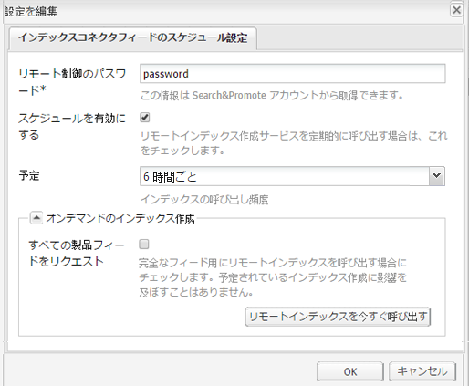

# 製品フィード{#product-feed}

AEMとの統合 [Search&amp;Promote](https://www.adobe.com/solutions/testing-targeting/searchandpromote.html) を使用すると、次のことができます。

* 基になるリポジトリ構造やコマースプラットフォームと関係なく、e コマース API を使用する。
* Search&amp;Promote のインデックスコネクタ機能を利用して、XML 形式で製品フィードを提供する。
* Search&amp;Promote のリモート制御機能を利用して、製品フィードのオンデマンドリクエストまたはスケジュール済みリクエストを実行する。
* クラウドサービス設定として指定された、様々な Search&amp;Promote アカウント用のフィードを生成する。

有効なアカウントと [Search&amp;Promoteへの接続の設定](/help/sites-administering/search-and-promote.md#configuring-the-connection-to-search-promote). また、正しい [データセンター](/help/sites-administering/search-and-promote.md#configuring-the-data-center) 「**リモートサーバー URI**」が設定されていることを確認します。

## 製品フィードの設定 {#set-up-the-product-feed}

まず、Web サイトのルートと、識別子属性を入力する必要があります。次の手順を実行します。

1. Search&amp;Promote 設定に移動します。
1. 「**[!UICONTROL 編集]**」をクリックします。
1. 「**[!UICONTROL インデックスコネクターフィード設定]**」タブをクリックします。
1. 次を入力します。 **[!UICONTROL Web サイトのルート]** および **[!UICONTROL 識別子属性]**.

   >[!NOTE]
   >
   >この **[!UICONTROL Web サイトのルート]** は e コマース Web サイトのルートです（例： ）。 `/content/geometrixx-outdoors/en`.
   >
   >この **[!UICONTROL 識別子属性]** は、製品を一意に識別する JCR プロパティです。 `identifier`.

1. 「**[!UICONTROL OK]**」をクリックします。

また、製品フィードを生成するには、Web コンソールで 2 つの設定を編集する必要があります。

### Geometrixx 用 Day CQ Search&amp;Promote 製品クローラ実装の設定 {#configuring-the-day-cq-search-promote-products-crawler-implementation-for-geometrixx}

1. [http://localhost:4502/system/console/configMgr](http://localhost:4502/system/console/configMgr) に移動します。
1. 「**[!UICONTROL Day CQ Search&amp;Promote products crawler implementation for Geometrixx]**」をクリックします。
1. このクローラをリンクする Search&amp;Promote アカウント番号を指定します。アカウント番号は、このクローラが使用するクラウドサービス設定の検索に使用されます。
1. 「**[!UICONTROL 保存]**」をクリックします。

### Geometrixx 用 Day CQ Search&amp;Promote 製品フィードジェネレーターの設定 {#configuring-the-day-cq-search-promote-products-feed-generator-for-geometrixx}

1. [http://localhost:4502/system/console/configMgr](http://localhost:4502/system/console/configMgr) に移動します。
1. 「**[!UICONTROL Day CQ Search&amp;Promote products feed generator for Geometrixx]**」をクリックします。
1. このジェネレーターをリンクする Search&amp;Promote アカウント番号を指定します。アカウント番号は、このジェネレーターが使用するクラウドサービス設定の検索に使用されます。
1. 「**[!UICONTROL 保存]**」をクリックします。

## 製品フィードのスケジュール設定 {#schedule-the-product-feed}

スケジュール済みフィード生成を有効にするには、そのためのスケジューラーを設定する必要があります。\
スケジューラーは、特定の Search&amp;Promote クラウドサービス設定の子設定として設定されます。

1. Search&amp;Promote 設定に移動します。
1. 「**[!UICONTROL スケジューラー設定]**」の横の「**[!UICONTROL +]**」をクリックします。
1. を入力します。 **[!UICONTROL タイトル]** ページ作成者が認識できる独自の **[!UICONTROL 名前]**.
1. 「**[!UICONTROL 作成]**」をクリックします。ダイアログが表示されます。

   

1. 次を入力します。 **[!UICONTROL リモート制御パスワード]**. これは、Search&amp;Promote アカウントで設定したパスワードです。

   >[!NOTE]
   >
   >Search&amp;Promote アカウントのパスワードではありません。このパスワードは、Search&amp;Promoteアカウントにログインし、 **[!UICONTROL 索引]** その後 **[!UICONTROL リモート制御]**.

1. 「**[!UICONTROL スケジュールを有効にする]**」ボックスをオンにします。
1. **[!UICONTROL スケジュール]**&#x200B;を選択します。これは、実際のフィード生成スケジュールです。
1. 「**[!UICONTROL オンデマンドのインデックス作成]**」を有効にします（または有効にしません）。この機能は、Search&amp;Promote のインデックスを手動で呼び出すために使用されます。If **[!UICONTROL すべての製品フィードをリクエスト]** がオンになっている場合、Search&amp;Promoteは完全な製品フィードをリクエストします。 それ以外の場合は、増分製品フィードがリクエストされます。

   >[!NOTE]
   >
   >オンデマンドのインデックス作成機能は、Search&amp;Promote のリモート制御機能を利用します。リモートインデックス作成が呼び出されると、インデックス作成がただちに開始されるわけではありませんが、リモート制御機能を使用して、インデックス作成リクエストが Search&amp;Promote に送信されます。

1. 「**[!UICONTROL OK]**」をクリックします。

すべての設定が完了したので、設定済みの Web サイトルートの下に、すべての製品を含む XML ページが表示されます。 [http://localhost:4502/etc/commerce/searchpromote/feed/full](http://localhost:4502/etc/commerce/searchpromote/feed/full).
