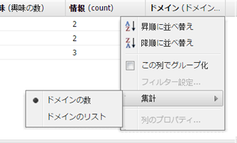
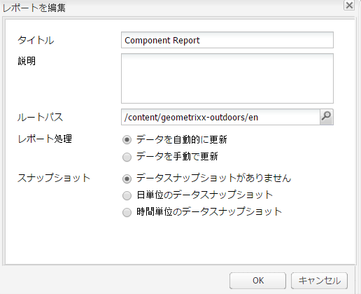
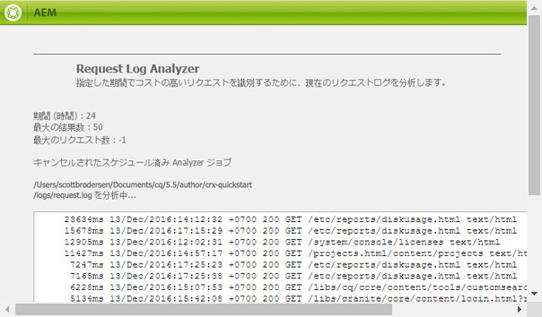
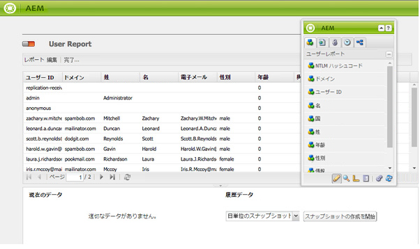
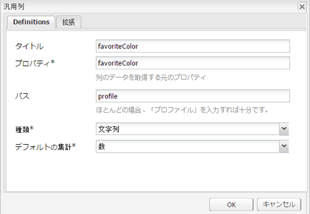
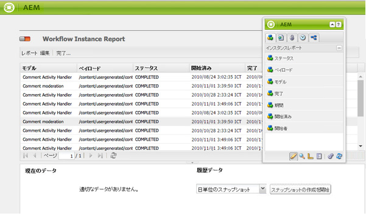
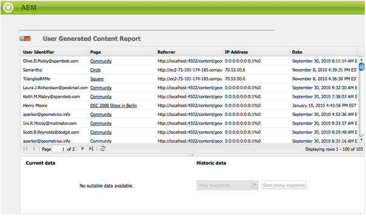

# レポート {#reporting}

>[!CAUTION]
>
>AEM 6.4 の拡張サポートは終了し、このドキュメントは更新されなくなりました。 詳細は、 [技術サポート期間](https://helpx.adobe.com/jp/support/programs/eol-matrix.html). サポートされているバージョンを見つける [ここ](https://experienceleague.adobe.com/docs/?lang=ja).

インスタンスの状態を監視および分析するのに役立つように、AEMでは、個々の要件に合わせて設定できるデフォルトのレポートがいくつか用意されています。

* [コンポーネントのレポート](#component-report)
* [ディスク使用量](#disk-usage)
* [ヘルスチェック](#health-check)
* [ページアクティビティレポート](#page-activity-report)
* [ユーザー生成コンテンツレポート](#user-generated-content-report)
* [ユーザーレポート](#user-report)
* [ワークフローインスタンスレポート](#workflow-instance-report)
* [ワークフローレポート](#workflow-report)

>[!NOTE]
>
>これらのレポートは、クラシック UI でのみ使用できます。最新の UI でのシステム監視とレポートについては、[操作ダッシュボード](/help/sites-administering/operations-dashboard.md)を参照してください。

レポートはすべて&#x200B;**ツール**&#x200B;コンソールからアクセスできます。左側のウィンドウで「**レポート**」を選択し、右側のウィンドウで必要なレポートをダブルクリックして、表示用や設定用に開きます。

レポートの新しいインスタンスも、**ツール**&#x200B;コンソールから作成できます。左側のウィンドウで「**レポート**」を選択し、ツールバーから「**新規**」を選択します。「**タイトル**」と「**名前**」を定義し、必要なレポートタイプを選択して、「**作成**」をクリックします。新しいレポートインスタンスがリストに表示されます。これをダブルクリックして開き、サイドキックからコンポーネントをドラッグして最初の列を作成し、レポートの定義を開始します。

>[!NOTE]
>
>標準で使用できるAEMレポートに加えて、次の操作を実行できます。 [独自の（完全に新しい）レポートの作成](/help/sites-developing/dev-reports.md).

## レポートのカスタマイズの基本 {#the-basics-of-report-customization}

様々な書式のレポートを使用できます。次のレポートはすべて、以下の節の説明に従ってカスタマイズできる列を使用します。

* [コンポーネントのレポート](#component-report)
* [ページアクティビティレポート](#page-activity-report)
* [ユーザー生成コンテンツレポート](#user-generated-content-report)
* [ユーザーレポート](#user-report)
* [ワークフローインスタンスレポート](#workflow-instance-report)

>[!NOTE]
>
>以下のレポートにはそれぞれ独自の形式とカスタマイズがあります。
>
>
>* [ヘルスチェック](#health-check)は、選択フィールドを使用してレポート対象のデータを指定します。
>* [ディスク使用量](#disk-usage) は、リンクを使用してリポジトリ構造をドリルダウンします。
>* [ワークフローレポート](/help/sites-administering/reporting.md#workflow-report) は、インスタンスで実行されるワークフローの概要を示します。
>
>したがって、以下のカラム設定の手順は適切ではありません。 詳しくは、個々のレポートの説明を参照してください。

### データ列の選択と配置 {#selecting-and-positioning-the-data-columns}

列は、標準レポートまたはカスタマイズレポートで、任意のレポートに対して追加、再配置、または削除できます。

この **コンポーネント** サイドキックの「 」タブ（レポートページで使用可能）には、列として選択できるデータのすべてのカテゴリが表示されます。

データ選択を変更するには：

* 新しい列を追加するには、必要なコンポーネントをサイドキックからドラッグして、必要な場所にドロップします。

   * 緑色の目盛りは、位置が有効な時期を示し、矢印の組み合わせは、位置が正確に配置される場所を示します
   * 位置が無効な場合は、赤い非移動記号が示します

* 列を移動するには、ヘッダーをクリックし、長押しして新しい位置にドラッグします
* 列を削除するには、列タイトルをクリックし、キーを押しながらレポートのヘッダー領域までドラッグします（赤いマイナス記号は位置が有効でないことを示します）。マウスボタンを放すと、[ コンポーネントを削除 ] ダイアログが表示され、列を削除するかどうかを確認するメッセージが表示されます。

### 列のドロップダウンメニュー {#column-drop-down-menu}

レポート内の列にはそれぞれドロップダウンメニューがあります。これは、列のタイトルセル上にマウスカーソルを移動すると表示されます。

タイトルセルの右端に矢印が表示されます（タイトルテキストのすぐ右側にある、[現在の並べ替えメカニズム](#sorting-the-data)を示す矢印と混同しないでください）。

メニューで使用可能なオプションは、列の設定（プロジェクト開発時の設定）によって異なり、無効なオプションはグレー表示されます。

### データの並べ替え {#sorting-the-data}

データは、次のいずれかの方法で、特定の列に従って並べ替えることができます。

* 該当する列ヘッダーをクリックすると、そのたびに昇順と降順が切り替わり、タイトルテキストのすぐ横にある矢印で示されます。
* を使用します。 [列のドロップダウンメニュー](#column-drop-down-menu) 具体的に選択する **昇順に並べ替え** または **降順に並べ替え**;この場合も、タイトルテキストのすぐ横に矢印が表示されます

### グループと現在のデータのグラフ {#groups-and-the-current-data-chart}

適切な列で、 **この列でグループ化** から [列のドロップダウンメニュー](#column-drop-down-menu). これにより、その列内の個別の値に従ってデータがグループ化されます。 グループ化する列は複数選択できます。 列内のデータが不適切な場合は、このオプションがグレーアウトされます。各エントリがまったく別個のものであり、一意である場合は、グループを形成できません。例えば、ユーザーレポートの「ユーザー ID」列などがこれに該当します。

少なくとも 1 つの列がグループ化されたら、**現在のデータ**&#x200B;の円グラフがこのグループ化に基づいて生成されます。複数の列がグループ化される場合は、そのことがグラフにも示されます。

円グラフの上にカーソルを移動すると、該当するセグメントの集計値が表示されます。ここでは、数、最小、平均など、列に関して現在定義されている集計が使用されます。

### フィルターと集計 {#filters-and-aggregates}

適切な列で、 **フィルター設定** および/または **集計** から [列のドロップダウンメニュー](#column-drop-down-menu).

#### フィルター {#filters}

フィルター設定を使用すると、表示するエントリの条件を指定できます。 使用可能な演算子は次のとおりです。

* `contains`
* `equals`

フィルターを設定するには：

1. 必要な演算子をドロップダウンリストから選択します。
1. フィルターするテキストを入力します。
1. 「**適用**」をクリックします。

フィルターを非アクティブ化するには：

1. フィルターテキストを削除します。
1. 「**適用**」をクリックします。

#### 集計 {#aggregates}

集計方法（選択している列によって異なる）も選択できます。

### 列のプロパティ {#column-properties}

このオプションは、[ユーザーレポート](#user-report)で[汎用列](#generic-column)が使用されたことがある場合にのみ使用できます。

### 履歴データ {#historic-data}

データの経時的な変化を示すグラフは、 **履歴データ**. これは、一定の間隔で作成されたスナップショットから得られます。

データ：

* 最初の並べ替え済み列（使用可能な場合）、それ以外の場合は最初の（グループ化されていない）列で収集されます
* 適切な列でグループ化

レポートは次の手順で生成できます。

1. 設定 **グループ化** を設定します。
1. **編集** スナップショットの作成頻度を定義する設定。毎時または毎日。
1. **完了…** スナップショットの収集を開始する定義。

   左上の赤と緑のスライダーボタンは、スナップショットが収集されるタイミングを示します。

結果のチャートが右下に表示されます。

データ収集が開始されたら、以下を選択できます。

* **期間**

   レポートデータを表示する開始日と終了日を選択できます。

* **間隔**

   レポートの目盛りと集計には、月、週、日、時間を選択できます。

   例えば、2011年2月に日別のスナップショットを利用できる場合は、次のようになります。

   * 間隔が `Day` に設定されている場合、各スナップショットが単一の値としてチャートに表示されます。
   * 間隔が `Month` に設定されている場合、2月のすべてのスナップショットが単一の値に集計（チャートに単一の「ドット」として表示）されます。

要件を選択し、「**設定**」をクリックしてレポートに適用します。スナップショットがさらに作成された後に表示を更新するには、「**設定**」を再度クリックします。

スナップショットを収集中に、以下の処理が可能です。

* コレクションを再初期化するには、**完了…**&#x200B;を再度使用します。

   **完了**&#x200B;は、レポートの構造（レポートに割り当てられた列や、グループ化、並べ替え、フィルター処理された列など）を「フリーズ」し、スナップショットの作成を開始します。

* **編集**&#x200B;ダイアログを開いて、**データスナップショットがありません**&#x200B;を選択し、必要になるまでコレクションを停止します。

   **編集**&#x200B;は、スナップショットの取得のオンやオフを切り替えるだけです。スナップショットの取得が再度オンになった場合は、さらにスナップショットを取得するために最後に完了した時点のレポートの状態が使用されます。

>[!NOTE]
>
>スナップショットは `/var/reports/...` に格納されます。パスの残りの部分は、レポート完了時に作成されたそれぞれのレポートと ID のパスを反映しています。
>
>
>古いスナップショットは、今後必要ないと確信できる場合は、手動でパージできます。

>[!NOTE]
>
>事前設定済みのレポートはパフォーマンスを集中的に消費しませんが、実稼動環境では毎日のスナップショットを使用することをお勧めします。 可能であれば、web サイト上でのアクティビティが少ない時間帯に、これらの毎日のスナップショットを実行します。これは、**Day CQ Reporting Configuration** の `Daily snapshots (repconf.hourofday)` パラメーターで定義できます。設定の詳細については、[OSGi 設定](/help/sites-deploying/configuring-osgi.md)を参照してください。

#### 表示制限 {#display-limits}

また、履歴データレポートの外観は、選択した期間の結果数に応じて、設定できる制限によって若干変わる場合があります。

水平方向の各線はシリーズと呼ばれ（チャート凡例の各エントリに対応）、垂直方向のドットの列はそれぞれ集計されたスナップショットを表します。

チャートをより長期間にわたってクリーンに保つために、設定可能な制限があります。標準レポートの場合の制限は次のとおりです。

* 水平方向のシリーズ - デフォルトも、システムの最大値も `9`

* 垂直方向の集計スナップショット - デフォルトは `35`（水平方向のシリーズあたり）

したがって、（適切な）制限を超えた場合、次のようになります。

* ドットは表示されません
* 履歴データグラフの凡例には、現在のデータグラフとは異なる数のエントリが表示される場合があります

カスタマイズされたレポートでは、すべてのシリーズの&#x200B;**合計**&#x200B;値も表示できます。これはシリーズ（水平方向の線および凡例のエントリ）として表示されます。

>[!NOTE]
>
>カスタマイズされたレポートの場合は、別の方法で制限を設定できます。

### 編集（レポート） {#edit-report}

この **編集** ボタンをクリックすると、 **レポートの編集** ダイアログ。

これは、[履歴データ](#historic-data)のスナップショットを収集する期間を定義する場所の 1 つですが、その他様々な設定も定義できます。

* **タイトル**

   独自のタイトルを定義できます。

* **説明**

   独自の説明を定義できます。

* **ルートパス**（*特定のレポートでのみ有効*）

   レポートをリポジトリの（サブ）セクションに制限する場合に使用します。

* **レポート処理**

   * **データを自動的に更新**

      レポート定義を更新するたびに、レポートデータが更新されます。

   * **データを手動で更新**

      このオプションは、大量のデータがある場合の自動更新操作による遅延を防ぐために使用できます。

      これを選択すると、レポート設定のいずれかの側面が変更された場合に、レポートデータを手動で更新する必要があることを示します。また、設定の任意の側面を変更すると、レポートテーブルは空白になります。

      これを選択すると「**[データを読み込み](#load-data)**」ボタンが表示されます（レポートの「**編集** 」の横）。**データを読み込み**&#x200B;はデータを読み込み、表示されているレポートデータを更新します。

* **スナップショット**
スナップショットの作成頻度として、日単位、時間単位、まったく作成しない、のいずれかを定義できます。

### データを読み込み {#load-data}

「**データを読み込み**」ボタンは、「**[編集](#edit-report)**」で「**データを手動で更新**」を選択している場合にのみ表示されます。

「**データを読み込み**」をクリックすると、データが再読み込みされ、レポートの表示が更新されます。

データを手動で更新することを選択すると、

1. レポート設定を変更するとすぐに、レポートデータのテーブルが空白になります。

   例えば、列の並べ替えメカニズムを変更した場合、データは表示されません。

1. レポートデータを再度表示する場合は、 **データを読み込み** をクリックして、データを再読み込みします。

### 完了（レポート） {#finish-report}

次の場合： **完了** レポート：

* *その時点*&#x200B;のレポート定義を使用してスナップショットが作成されます（その後、スナップショットから分離されたレポート定義で作業を続行できます）。
* 既存のスナップショットはすべて削除されます。
* [履歴データ](#historic-data)用に新しいスナップショットが収集されます。

このダイアログで、生成されるレポートの独自のタイトルおよび説明を定義または更新できます。

## レポートタイプ {#report-types}

### コンポーネントレポート {#component-report}

コンポーネントのレポートは、web サイトでのコンポーネントの使用方法に関する情報を提供します。

次の内容に関する[情報の列](#selecting-and-positioning-the-data-columns)があります。

* 作成者
* コンポーネントのパス
* コンポーネントの種類
* 最終変更
* ページ

は、次のように表示されることを意味します。

* どのコンポーネントが、どこで使用されているか。

   例えば、テスト時に役立ちます。

* 特定のコンポーネントのインスタンスの配布方法。

   これは、特定のページ（「重いページ」など）で、パフォーマンスの問題が発生している場合に興味深い点となることがあります。

* 頻繁に変更される/少ない頻度でサイトの一部を特定する。
* 時間の経過と共にページコンテンツがどのように開発されていくかを確認します。

コンポーネントはすべて組み込み型で、製品の標準であり、プロジェクト専用です。**編集**&#x200B;ダイアログを使用すると、ユーザーはレポートの開始点を定義する&#x200B;**ルートパス**&#x200B;も設定できます。そのルートの下のすべてのコンポーネントがレポート用に考慮されます。

 

### ディスク使用量 {#disk-usage}

>[!CONTEXTUALHELP]
>id="aemcloud_ctt_diskusage"
>title="ディスク使用量レポート"
>abstract="CTT Calculator への入力として、ユーザーは、「http://HOST:PORT/etc/reports/diskusage.html」のディスク使用量レポートを実行することで、AEM リポジトリのサイズを見積もることができます。また、ユーザーは、「http://HOST:PORT/etc/reports/diskusage.html?path=/content/dam」のように「path」パラメーターを使用することで、特定のリポジトリパスのサイズを見積もることもできます。"

ディスク使用量レポートには、リポジトリ内に保存されているデータに関する情報が表示されます。

レポートはリポジトリのルート（/）で始まります。特定のブランチをクリックすると、リポジトリ内をドリルダウンできます（現在のパスがレポートタイトルに反映されます）。

### ヘルスチェック {#health-check}

このレポートは、現在のリクエストログを分析します。

`<cq-installation-dir>/crx-quickstart/logs/request.log`\

指定された期間内で最も高価なリクエストを特定するのに役立ちます。

レポートを生成するには、以下を指定できます。

* **期間 (時間) ：**

   分析する時間数（過去）。

   デフォルト：`24`

* **max.結果**

   出力行の最大数。

   デフォルト：`50`

* **max.リクエスト**

   分析するリクエストの最大数。

   デフォルト：`-1`（すべて）

* **メールアドレス**

   結果をメールアドレスに送信します。

   （オプション）デフォルト：空白

* **毎日（hh:mm）に実行**

   レポートが毎日自動的に実行される時間を指定します。

   （オプション）デフォルト：空白

### ページアクティビティレポート {#page-activity-report}

ページアクティビティレポートは、ページおよびそこで実行されたアクションをリストします。

次の内容に関する[情報の列](#selecting-and-positioning-the-data-columns)があります。

* ページ
* 時刻
* タイプ
* ユーザー

つまり、以下を監視できます。

* 最新の変更。
* 特定のページで作業する作成者。
* 最近変更されていないページ（アクションが必要な場合があります）。
* 最も頻繁に変更された/最も頻繁に変更されないページ。
* 最も多い/最も少ないアクティブユーザー。

ページアクティビティレポートは、すべての情報を監査ログから取得します。デフォルトでは、ルートパスは `/var/audit/com.day.cq.wcm.core.page` にある監査ログに設定されています。

### ユーザー生成コンテンツレポート {#user-generated-content-report}

このレポートは、コンポーネント、評価、フォーラムなど、ユーザーが生成したコンテンツに関する情報を提供します。

[情報の列](#selecting-and-positioning-the-data-columns) 日付：

* 日付
* IP アドレス
* ページ
* リファラー
* タイプ
* ユーザー識別子

以下が可能です。

* 最もコメントを受け取ったページがわかります。
* 特定のサイト訪問者が残しているすべてのコメントの概要を把握（問題が関係している可能性あり）。
* ページにコメントが残された時期を監視することにより、新しいコンテンツがコメントを誘発しているかどうかを判断。

### ユーザーレポート {#user-report}

このレポートは、アカウントやプロファイルを登録済みのすべてのユーザーに関する情報を提供します。これには組織内の作成者と外部訪問者の両方が含まれます。

[情報の列](#selecting-and-positioning-the-data-columns) （利用可能な場合）以下に関する情報：

* 年齢
* 国
* ドメイン
* メール
* 姓
* 性別
* [一般](#generic-column)
* 名
* 情報
* 興味
* 言語
* NTLM ハッシュコード
* ユーザー ID

以下が可能です。

* ユーザーの人口統計的広がりを確認します。
* プロファイルに追加したカスタマイズ済みフィールドに関するレポート。

#### 汎用列 {#generic-column}

この **汎用** 」列がユーザーレポートで使用可能になり、カスタマイズされた情報 ( 通常は [ユーザープロファイル](/help/sites-administering/identity-management.md#profiles-and-user-accounts);例： [お気に入りの色（プロファイル定義へのフィールドの追加で説明）](/help/sites-administering/identity-management.md#adding-fields-to-the-profile-definition).

汎用列ダイアログは、次のいずれかを実行すると開きます。

* 汎用コンポーネントをサイドキックからレポートにドラッグします。
* 既存の汎用列の列プロパティを選択します。

「**定義**」タブから、以下を定義できます。

* **タイトル**

   汎用列の、独自のタイトル。

* **プロパティ**

   リポジトリに格納されているプロパティ名（通常はユーザーのプロファイル内）。

* **パス**

   通常、プロパティは `profile` から取得されます。

* **タイプ**

    `String`、`Number`、`Integer`、`Date` の中からフィールドタイプを選択します。

* **デフォルトの集計**

   これは、少なくとも 1 つのグループ化された列を含むレポートで列のグループ化が解除された場合に、デフォルトで使用される集計を定義します。`Count`、`Minimum`、`Average`、`Maximum`、`Sum` の中から必要な集計を選択します。

   例えば、`String` フィールドの&#x200B;*カウント*&#x200B;は、集約された状態の列に個別の `String` 値の数が表示されることを意味します。

「**拡張**」タブでは、使用可能な集計およびフィルターも定義できます。

### ワークフローインスタンスレポート {#workflow-instance-report}

これにより、概要が簡潔になり、実行中と完了の両方のワークフローの個々のインスタンスに関する情報が提供されます。

次の内容に関する[情報の列](#selecting-and-positioning-the-data-columns)があります。

* 完了
* 期間
* 開始者
* モデル
* ペイロード
* 開始済み
* ステータス

次のことが可能です。

* ワークフローの平均持続時間を監視する定期的に発生する場合は、ワークフローの問題を強調表示できます。

### ワークフローレポート {#workflow-report}

現在のインスタンスで実行されているワークフローに関する重要な統計を提供します。

## パブリッシュ環境でのレポートの使用 {#using-reports-in-a-publish-environment}

特定の要件に合わせてレポートの設定を完了したら、レポートをアクティブ化して、設定をパブリッシュ環境に転送できます。

>[!CAUTION]
>
>必要に応じて **履歴データ** パブリッシュ環境の場合は、 **完了** オーサー環境に関するレポートを作成してから、ページをアクティベートします。

その後、適切なレポートが以下でアクセスできるようになります。

`/etc/reports`

例えば、ユーザー生成コンテンツレポートは次の場所で見つかります。

`http://localhost:4503/etc/reports/ugcreport.html`

これは今後、パブリッシュ環境から収集されたデータに関するレポートとなります。

パブリッシュ環境ではレポートの設定はできないので、「**編集**」ボタンと「**完了**」ボタンは使用できません。ただし、スナップショットが収集されている場合は、**履歴データ**&#x200B;レポート用に「**期間**」と「**間隔**」を選択できます。

>[!CAUTION]
>
>これらのレポートへのアクセスは、セキュリティ上の問題となる場合があります。したがって、外部の訪問者が `/etc/reports` を使用できないように Dispatcher を設定することをお勧めします。詳しくは、[セキュリティチェックリスト](security-checklist.md)を参照してください。

## レポートの実行に必要な権限 {#permissions-needed-for-running-reports}

必要な権限は、アクションによって異なります。

* レポートデータは、基本的に現在のユーザーの権限を使用して収集されます。
* 履歴データは、レポートを完了したユーザーの権限を使用して収集されます。

標準のAEMインストールでは、レポートに次の権限が事前に設定されています。

* **ユーザーレポート**

   `user administrators` - 読み取りおよび書き込み

* **ページアクティビティレポート**

   `contributors` - 読み取りおよび書き込み

* **コンポーネントのレポート**

   `contributors` - 読み取りおよび書き込み

* **ユーザー生成コンテンツレポート**

   `contributors` - 読み取りおよび書き込み

* **ワークフローインスタンスレポート**

   `workflow-users` - 読み取りおよび書き込み

`administrators` グループのメンバーは全員が、新しいレポートの作成に必要な権限を持っています。
