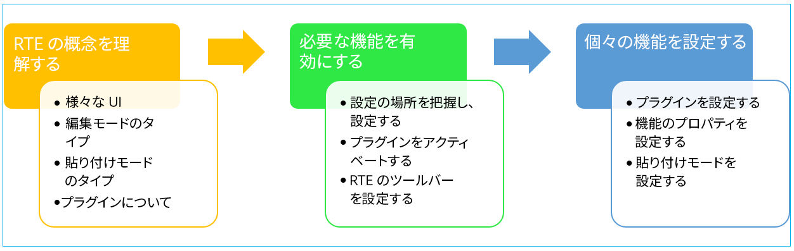
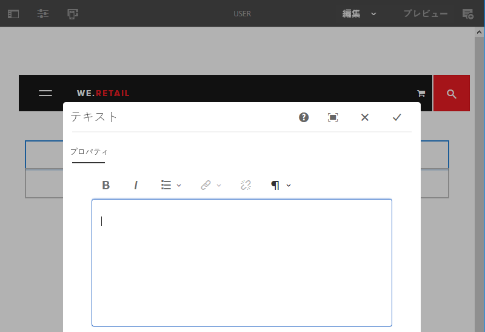
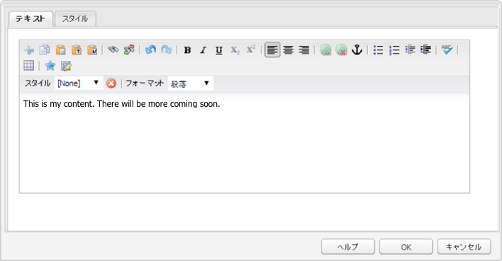

# リッチテキストエディターの設定 {#configure-the-rich-text-editor}

リッチテキストエディター（RTE）には、テキストコンテンツの編集に使用できる幅広い機能が用意されています。アイコン、選択ボックス、ツールバーおよびメニューを使用して、テキストを WYSIWYG で編集できます。

RTE 機能をオーサリングに使用する方法については、[リッチテキストエディターをオーサリングに使用](/help/sites-authoring/rich-text-editor.md)を参照してください。RTE の設定をおこなうことで、オーサリングコンポーネント内で使用可能な機能を有効化、無効化および拡張できます。次のワークフローは、RTE設定タスクを実行する際に推奨される順序を示しています。Experience Manager



*図：リッチテキストエディターを設定するための一般的なワークフロー*

## タッチ操作 UI とクラシック UI について {#understand-touch-enabled-ui-and-classic-ui}

タッチ操作 UI は AEM の標準 UI です。Adobeは、バージョン5.6で、オーサリング環境用に[レスポンシブデザイン](/help/sites-authoring/responsive-layout.md)を備えたタッチUIを導入しました。タッチUIは、タッチデバイスとデスクトップデバイス向けに設計されています。 元のクラシック UI とは大きく異なります。


*図：タッチ操作対応UIのリッチテキストエディターツールバー*


*図：クラシックUIのリッチテキストエディターツールバー*

>[!MORELIKETHIS]
>
>* [UI 推奨事項（英語）](/help/sites-deploying/ui-recommendations.md)
* クラシック UI の廃止については、[AEM 6.4 リリースノート](/help/release-notes/deprecated-removed-features.md)を参照してください。
* UIの違いについては、 [タッチUIとクラシックUI](https://aemcq5pedia.wordpress.com/2018/01/05/touch-enabled-ui-aem6-3/)を参照してください。
* タッチ操作 UI について詳しくは、[AEM タッチ操作向け UI の概念](/help/sites-developing/touch-ui-concepts.md)を参照してください。


## 各種編集モード {#editingmodes}

AEM では、コンポーネントの各種モードを使用して、テキストコンテンツを作成および編集できます。コンテンツを作成およびフォーマットするためのツールバーオプションと、各種編集モードにおける RTE 対応コンポーネントのユーザーエクスペリエンスは、RTE 設定によって異なります。

| 編集モード | 編集領域 | 有効化が推奨される機能 | タッチ UI | クラシック UI |
|--- |--- |--- |--- |--- |
| インライン | 小さな編集をすばやくおこなうのに適したインプレース編集。ダイアログボックスを開かないフォーマット | 最小限の RTE 機能 | ○ | ○ |
| RTE フルスクリーン | ページ全体に広がる | 必要なすべての RTE 機能 | ○ | × |
| ダイアログ | ページコンテンツの上面にダイアログボックスが表示されるが、ページ全体に広がらない | クラシック UI の場合、必要なすべての RTE 機能。タッチ UI の場合、必要に応じて機能を有効化／無効化 | ○ | ○ |
| ダイアログ（フルスクリーン） | フルスクリーンモードと同じ。RTE の横にダイアログのフィールドを含む | 必要なすべての RTE 機能 | ○ | × |

>[!NOTE]
タッチ操作対応UIのインライン編集モードでは、ソース編集機能を使用できません。 フルスクリーンモードでは画像をドラッグできません。その他の機能はすべて全モードで使用できます。

### インライン編集 {#inline-editing}

（ゆっくりしたダブルタップ／ダブルクリックで）開いた場合、コンテンツはページ内で編集できます。基本オプションを備えた、コンパクトなツールバーが表示されます。


*図：タッチ操作対応UIの基本ツールバーを使用したインライン編集*

クラシック UI では、コンポーネントをゆっくりダブルクリックするとインライン編集が可能になり、オレンジ色の輪郭でコンテンツが強調表示されます。コンテンツファインダーが開くと、使用可能な RTE フォーマットオプションを備えたツールバーがウィンドウ上部に表示されます。コンテンツファインダーが開かない場合は、フォーマットオプションは表示されず、基本的なテキスト編集のみおこなうことができます。

### 全画面表示での編集 {#full-screen-editing}

AEM コンポーネントをフルスクリーン表示で開くことができます。この表示にした場合は、ページコンテンツが隠され、使用可能なスクリーンが占有されます。フルスクリーン編集には最も多くの編集オプションがあるので、インライン編集の詳細版と考えてください。フルスクリーン編集を開くには、インライン編集モードの使用中にコンパクトツールバーから  をクリックします。

ダイアログのフルスクリーンモードには、詳細な RTE ツールバー、該当するオプション、ダイアログモードで使用可能なコンポーネントが表示されます。このモードは、他のコンポーネントと共に RTE を含むダイアログにのみ適用されます。


*図：タッチ操作対応UIでフルスクリーンモードで編集する場合の詳細なRTEツールバー*

### ダイアログ編集 {#dialog-editing}

クラシック UI でコンポーネントをダブルクリックすると、コンテンツ編集用のダイアログボックスが既存のページの上面に開きます。一部のシナリオでは、ポップアップウィンドウとして開くこともあります。例えば、複数列から成るページレイアウト内の列の一部がテキストコンポーネントで、ダイアログ用の領域が少ない場合などです。



*図：タッチ操作対応UIのダイアログ編集モード*



*図：編集用の詳細なツールバーを含むクラシックUIのダイアログボックス*

## RTE プラグインと関連機能について {#aboutplugins}

この機能は、一連のプラグインを介して使用可能になります。各プラグインには以下が含まれます。

* `features`プロパティ：

   * プラグインの基本機能をアクティベートまたはアクティベート解除するために使用します。
   * 標準化された手順を使用して設定できます。

* 特別な設定を必要とする詳細なプロパティやオプションが存在する場合があります。

RTE の基本機能は、該当するプラグインのノードにある `features` プロパティの値によって、アクティベートまたはアクティベート解除されます。

以下の表に最新のプラグインを示します。

* API ドキュメントへのリンクを含むプラグイン ID。ID は、[プラグインをアクティベート](/help/sites-administering/configure-rich-text-editor-plug-ins.md#activateplugin)するときにノード名として使用されます。
* `features` プロパティの許可されている値。
* プラグインが提供する機能の説明。

| プラグイン ID | 機能 | 説明 |
|--- |--- |--- |
| edit | cut copy paste-default paste-plaintext paste-wordhtml | [切り取り、コピーおよび 3 つの貼り付けモード](/help/sites-administering/configure-rich-text-editor-plug-ins.md#text-styles)。 |
| [findreplace](https://helpx.adobe.com/experience-manager/6-4/sites/developing/using/reference-materials/widgets-api/index.html?class=CQ.form.rte.plugins.FindReplacePlugin) | find replace | 検索と置換。 |
| [format](https://helpx.adobe.com/experience-manager/6-4/sites/developing/using/reference-materials/widgets-api/index.html?class=CQ.form.rte.plugins.FormatPlugin) | bold italic underline | [基本的なテキストフォーマット](/help/sites-administering/configure-rich-text-editor-plug-ins.md#text-styles)。 |
| [image](https://helpx.adobe.com/experience-manager/6-4/sites/developing/using/reference-materials/widgets-api/index.html?class=CQ.form.rte.plugins.ImagePlugin) | 画像 | 基本的な画像サポート（コンテンツまたはコンテンツファインダーからのドラッグ）。ブラウザーの種類に応じて、様々なサポート機能が提供されます |
| [keys](https://helpx.adobe.com/experience-manager/6-4/sites/developing/using/reference-materials/widgets-api/index.html?class=CQ.form.rte.plugins.KeyPlugin) |  | この値を定義するには、[タブサイズ](/help/sites-administering/configure-rich-text-editor-plug-ins.md#tab-size)を参照してください。 |
| [justify](https://helpx.adobe.com/experience-manager/6-4/sites/developing/using/reference-materials/widgets-api/index.html?class=CQ.form.rte.plugins.JustifyPlugin) | justifyleft justifycenter justifyright | 段落の整列。 |
| [links](https://helpx.adobe.com/experience-manager/6-4/sites/developing/using/reference-materials/widgets-api/index.html?class=CQ.form.rte.plugins.LinkPlugin) | modifylink unlink anchor | [ハイパーリンクおよびアンカー](/help/sites-administering/configure-rich-text-editor-plug-ins.md#link-styles)。 |
| [lists](https://helpx.adobe.com/experience-manager/6-4/sites/developing/using/reference-materials/widgets-api/index.html?class=CQ.form.rte.plugins.ListPlugin) | ordered unordered indent outdent | このプラグインは、[インデントとリスト](/help/sites-administering/configure-rich-text-editor-plug-ins.md#indent-margin)（ネストされたリストを含む）の両方を制御します。 |
| [misctools](https://helpx.adobe.com/experience-manager/6-4/sites/developing/using/reference-materials/widgets-api/index.html?class=CQ.form.rte.plugins.MiscToolsPlugin) | specialchars sourceedit | 各種ツールを使用して、[特殊文字](/help/sites-administering/configure-rich-text-editor-plug-ins.md#special-char)の入力や HTML ソースの編集をおこなうことができます。また、独自のリストを定義する場合は、[特殊文字の範囲](/help/sites-administering/configure-rich-text-editor-plug-ins.md#define-range-char)全体を追加できます。 |
| Paraformat | paraformat | `<h2>`デフォルトの段落形式は、段落、見出し 1、見出し 2 および見出し 3（`<p>`、`<h1>`、`<h3>`）です。[他の段落フォーマットを追加](/help/sites-administering/configure-rich-text-editor-plug-ins.md#para-formats)したり、リストを拡張したりできます。 |
| spellcheck | checktext | [言語ごとのスペルチェッカー](/help/sites-administering/configure-rich-text-editor-plug-ins.md#add-dict)。 |
| styles | スタイル | CSS クラスを使用したスタイル設定のサポート。テキストで使用するスタイルの範囲を独自に追加（または拡張）する場合は、[新しいテキストスタイルを追加](/help/sites-administering/configure-rich-text-editor-plug-ins.md#text-styles)します。 |
| subsuperscript | subscript superscript | 下付き文字や上付き文字を追加して基本的なフォーマットを拡張。 |
| table | table removetable insertrow removerow insertcolumn removecolumn cellprops mergecells splitcell selectrow selectcolumns | テーブル全体または個々のセルに独自のスタイルを追加する場合は、[テーブルスタイルの設定](/help/sites-administering/configure-rich-text-editor-plug-ins.md#table-styles)を参照してください。 |
| undo | undo redo | [取り消しおよびやり直し](/help/sites-administering/configure-rich-text-editor-plug-ins.md#undo-history)操作の履歴サイズ。 |

>[!NOTE]
フルスクリーンプラグインは、ダイアログモードではサポートされません。`dialogFullScreen`設定を使用して、フルスクリーンモード用のツールバーを設定します。

## 設定パスと設定の場所について {#understand-the-configuration-paths-and-locations}

作成者に提供する [RTE 編集のモード（および UI）](#editingmodes)によって、[RTE プラグインをアクティベート](/help/sites-administering/configure-rich-text-editor-plug-ins.md#activateplugin)するときの設定詳細の場所が決まります。

| 編集モード | タッチ UI の場所 | クラシック UI の場所 |
|---|---|---|
| インライン | `cq:editConfig/cq:inplaceEditing` | `cq:editConfig/cq:inplaceEditing` |
| フルスクリーン | `cq:editConfig/cq:inplaceEditing` | 適用なし |
| ダイアログ | `cq:dialog` | `dialog` |
| フルスクリーンダイアログ | `cq:dialog` | 適用なし |

>[!NOTE]
`cq:inplaceEditing` の下のノードの名前を `config` にしないでください。`cq:inplaceEditing` ノードで、以下のプロパティを定義します。
* **名前**：`configPath`
* **型**：`String`
* **値**：実際の設定を含むノードのパス

RTE 設定ノードの名前を `config` にしないでください。この名前にすると、RTE 設定が管理者に対してのみ有効になり、グループ `content-author` のユーザーに対して有効になりません。

ダイアログ編集モードで適用される次のプロパティを設定します（タッチ UI のみ）。

* `useFixedInlineToolbar`：RTE ツールバーをフロートではなく固定にするには、RTE ノード（sling:resourceType= `cq/gui/components/authoring/dialog/richtext` のもの）に定義されているこのブール値プロパティを `True` に設定します。

    このプロパティが true のときは、デフォルト動作により、リッチテキスト編集が「foundation-contentloaded」イベントで開始します。

   これを防ぐには、`customStart` プロパティを `True` に設定し、「rte-start」イベントを呼び出して RTE の編集を開始するようにします。このプロパティが true のときは、デフォルトの動作（クリック時に RTE が開始する）が機能しません。

* `customStart`：RTE を開始するタイミングを `True` イベントの呼び出しによって制御するには、RTE ノードに定義されているこのブール値プロパティを `rte-start` に設定します。

* `rte-start`：このイベントを RTE の `contenteditable-div`（RTE の編集を開始するタイミング）で呼び出します。これは、`customStart` が true に設定されている場合にのみ機能します。

タッチ操作ダイアログで RTE を使用する場合は、問題の発生を避けるために、プロパティ `useFixedInlineToolbar` に true を設定する必要があります。

## インプレース編集のカスタマイズ {#customizing-in-place-editing}

次のプロパティを設定することで、テキストエディターが開始するHTMLセレクターを定義できます。

* **`editElementQuery`**  — で定義され `cq:InplaceEditingConfig`る、このプロパティは、テキストコンポーネントのインライン編集を開始するHTML要素のセレクターを指定するために使用されます。指定しなかった場合、インライン編集はテキストコンポーネントのHTMLで直接開始されます。
* **`textPropertyName`**  — で定義され `cq:InplaceEditingConfig`る、このプロパティは、インライン編集後にテキストコンポーネントのHTML値が保持されるコンテンツノードに保存されるプロパティの名前を指定するために使用されます。

対応するダイアログモードのプロパティは`name`です。

## プラグインのアクティベートによる RTE 機能の有効化 {#enable-rte-functionalities-by-activating-plug-ins}

リッチテキストエディター（RTE）の各機能は一連のプラグインから使用でき、それぞれに features プロパティがあります。features プロパティを設定することで、各プラグインの各種機能を有効化または無効化できます。

RTE プラグインの設定について詳しくは、[RTE プラグインのアクティベートおよび設定方法に関する説明](/help/sites-administering/configure-rich-text-editor-plug-ins.md)を参照してください。

RTE の設定方法について理解するには、このサンプル設定をダウンロードしてください。このパッケージではすべての機能が有効になっています。

[ファイルを入手](/help/assets/assets/rte-sample-all-features-enabled-10.zip)

>[!NOTE]
[コアコンポーネントのテキストコンポーネント](https://helpx.adobe.com/experience-manager/core-components/using/text.html)を使用すると、テンプレートエディターのユーザーインターフェイスで多数の RTE プラグインをコンテンツポリシーとして設定し、技術的な設定を不要にすることができます。コンテンツポリシーは、RTE ユーザーインターフェイス設定と連携させることができます。詳しくは、 [RTEユーザーインターフェイスの設定とコンテンツポリシー](/help/sites-administering/rich-text-editor.md#rtecontentpolicies)、 [ページテンプレートの作成](/help/sites-authoring/templates.md)、および[コアコンポーネント開発者向けドキュメント](https://helpx.adobe.com/experience-manager/core-components/using/developing.html)を参照してください。

>[!NOTE]
参照用として、デフォルトのテキストコンポーネント（標準インストールの一環として提供）が次の場所に用意されています。
* `/libs/wcm/foundation/components/text`
* `/libs/foundation/components/text`

独自のテキストコンポーネントを作成するには、上記のコンポーネントを直接編集するのではなく、コピーしてください。

## RTE ツールバーの設定 {#dialogfullscreen}

AEM では、リッチテキストエディターの UI を編集モードごとに異なる設定にできます。デフォルト設定を以下に示します。これらの設定を必要に応じて上書きできます。

最適なオーサリング環境を実現するには：

* フローティングダイアログでは、そのサイズが小さいことを考慮して、ポップアップがないプラグインのみを有効にします。
* フルスクリーンダイアログでは、必要なプラグインをすべて有効にします。これは、`Paste` プラグインなど、ポップが大きなプラグインについても当てはまります。以下に示す `dialogFullScreen` 設定を使用します。

```java
<uiSettings jcr:primaryType="nt:unstructured">
  <cui jcr:primaryType="nt:unstructured">
    <inline
      jcr:primaryType="nt:unstructured"
      toolbar="[format#bold,format#italic,format#underline,#justify,#lists,links#modifylink,links#unlink,#paraformat]">
      <popovers jcr:primaryType="nt:unstructured">
        <justify
          jcr:primaryType="nt:unstructured"
          items="[justify#justifyleft,justify#justifycenter,justify#justifyright]"
          ref="justify"/>
        <lists
          jcr:primaryType="nt:unstructured"
          items="[lists#unordered,lists#ordered,lists#outdent,lists#indent]"
          ref="lists"/>
        <paraformat
          jcr:primaryType="nt:unstructured"
          items="paraformat:getFormats:paraformat-pulldown"
          ref="paraformat"/>
      </popovers>
    </inline>
    <dialogFullScreen
      jcr:primaryType="nt:unstructured"
      toolbar="[format#bold,format#italic,format#underline,justify#justifyleft,justify#justifycenter,justify#justifyright,lists#unordered,lists#ordered,lists#outdent,lists#indent,links#modifylink,links#unlink,table#createoredit,#paraformat,image#imageProps]">
      <popovers jcr:primaryType="nt:unstructured">
        <paraformat
          jcr:primaryType="nt:unstructured"
          items="paraformat:getFormats:paraformat-pulldown"
          ref="paraformat"/>
      </popovers>
    </dialogFullScreen>
    <tableEditOptions
      jcr:primaryType="nt:unstructured"
      toolbar="[table#insertcolumn-before,table#insertcolumn-after,table#removecolumn,-,table#insertrow-before,table#insertrow-after,table#removerow,-,table#mergecells-right,table#mergecells-down,table#mergecells,table#splitcell-horizontal,table#splitcell-vertical,-,table#selectrow,table#selectcolumn,-,table#ensureparagraph,-,table#modifytableandcell,table#removetable,-,undo#undo,undo#redo,-,table#exitTableEditing,-]">
    </tableEditOptions>
  </cui>
</uiSettings>
```

インラインモードとフルスクリーンモードでは別の UI 設定が使用されます。ツールバープロパティは、ツールバーのボタンの指定に使用します。例えば、ボタン自体が1つの機能（`Bold`など）である場合は、`PluginName#FeatureName`と指定されます（例：`links#modifylink`）。 ボタンがポップオーバー（プラグインの機能の一部を含む）の場合は、`#PluginName`と指定されます（例：`#format`）。 ボタンのグループの間の区切り文字（|）は、「-」で指定できます。

インラインまたはフルスクリーンモードのポップアップノードには、使用するポップオーバーのリストが含まれます。`popovers`ノードの下の各子ノードは、プラグインの名前を取って名前を付けます（例：`format`）。 プラグインの機能のリストを含むプロパティ`items`があります（例：`format#bold`）。

## RTE ユーザーインターフェイス設定とコンテンツポリシー {#rtecontentpolicies}

管理者は、上述のような設定をおこなわなくても、コンテンツポリシーを使用して RTE オプションを制御することができます。コンテンツポリシーでは、[編集可能テンプレート](../sites-authoring/templates.md)の一部として使用されるコンポーネントのデザインプロパティが定義されます。例えば、RTE を使用するテキストコンポーネントが編集可能テンプレートで使用される場合は、コンテンツポリシーの定義によって、太字オプションやいくつかの段落フォーマットオプションを使用可能にできます。コンテンツポリシーは再利用が可能であり、複数のテンプレートに対して適用できます。

AEM 6.4 Service Pack 3 以降では、RTE フローで使用可能なオプションに関するユーザーインターフェイス設定がコンテンツポリシーに影響します。

* ユーザーインターフェイス設定では、コンテンツポリシーで使用可能なオプションを定義します。
* RTE のユーザーインターフェイス設定が削除されたか、どの項目も有効にしていない場合、コンテンツポリシーではその設定ができません。
* 作成者は、ユーザーインターフェイス設定およびコンテンツポリシーによって使用可能となっている機能にのみアクセスできます。

例については、[テキストコアコンポーネントのドキュメント](https://docs.adobe.com/content/help/ja-JP/experience-manager-core-components/using/components/text.html#the-text-component-and-the-rich-text-editor)を参照してください。

## ツールバーアイコンとコマンドのマッピングのカスタマイズ {#iconstoolbar}

RTE ツールバーに表示される Coral アイコンと使用可能なコマンドとのマッピングをカスタマイズできます。Coral アイコンに加えて他のアイコンを使用することはできません。

1. `icons` の下に、`uiSettings/cui` という名前のノードを作成します。

1. そのノードの下に、各アイコンのノードを作成します。
1. 個々のアイコンノードで、Coral アイコンとそのアイコンにマッピングするコマンドを指定します。

以下に、`textItalic` という名前の Coral アイコンにコマンド「Bold」をマッピングするサンプルスニペットを示します。

```java
<text jcr:primaryType="nt:unstructured" sling:resourceType="cq/gui/components/authoring/dialog/richtext" name="./text" useFixedInlineToolbar="{Boolean}true"> 
    <rtePlugins jcr:primaryType="nt:unstructured"> 
        <format jcr:primaryType="nt:unstructured" features="bold,italic"/> 
    </rtePlugins> 
    <uiSettings jcr:primaryType="nt:unstructured"> 
        <cui jcr:primaryType="nt:unstructured"> 
            <inline jcr:primaryType="nt:unstructured" 
                toolbar="[format#bold,format#italic,format#underline,links#modifylink,links#unlink]"> 
            </inline> 
            <icons jcr:primaryType="nt:unstructured"> 
                <bold jcr:primaryType="nt:unstructured" 
                    command="format#bold" 
                    icon="textItalic"/> 
            </icons> 
        </cui> 
    </uiSettings> 
</text>
```

## CoralUI 2 リッチテキストエディターへの切り替え {#switch-to-coralui-rich-text-editor}

ページに、CoralUI 2 RTE clientlibまたはCoralUI 3 RTE clientlibを含めることができます。 デフォルトでは、リッチテキストエディターには CoralUI 3 RTE clientlib が含まれています。CoralUI 2 RTE に切り替えるには、次の手順を実行します。

>[!NOTE]
こうした切り替えは、ベストプラクティスとしてお勧めするものではありません。CoralUI 2 RTE への切り替えは最後の手段です。CoralUI 2 RTE用カスタムプラグインは、CoralUI 3 RTEで動作します（プラグインがクラスなどのRTE内部に依存しない場合）。 CoralUI3 RTE 用カスタムプラグインを使用する場合は、`rte.coralui3` ライブラリを使用してください。

1. `/apps`の下のノード`/libs/cq/gui/components/authoring/editors/clientlibs/core`をオーバーレイし、次の操作を行います。

   * dependenciesプロパティの`rte.coralui3`を`rte.coralui2`に置き換えます。
   * 埋め込みプロパティの`cq.authoring.editor.core.inlineediting.rte.coralui3`を`cq.authoring.editor.core.inlineediting.rte.coralui2`に置き換えます。
   * 埋め込みプロパティの`cq.authoring.rte.coralui3`を`cq.authoring.rte.coralui2`に置き換えます。

1. `/apps`の下のノード`/libs/cq/gui/components/authoring/dialog/richtext/clientlibs/rte/coralui3`と`/libs/cq/gui/components/authoring/dialog/richtext/clientlibs/rte/coralui2`をオーバーレイします。

   `/apps/cq/gui/components/authoring/dialog/richtext/clientlibs/rte/coralui3`からカテゴリ`cq.authoring.dialog`を削除し、`/apps/cq/gui/components/authoring/dialog/richtext/clientlibs/rte/coralui2`に追加します。

1. ページに含まれている他の依存関係を `rte.coralui3` から `rte.coralui2` に変更します。例えば、`/apps`の下のノード`/libs/mcm/campaign/components/touch-ui/clientlibs/rte`をオーバーレイした後、ノードへの依存関係を`rte.coralui3`から`rte.coralui2`に変更します。

1. `/apps`の下のノード`cq/ui/widgets`をオーバーレイします。 ノード`/apps/cq/ui/widgets`の依存関係`cq.rte`を`cq.coralui2.rte`に置き換えます。

>[!NOTE]
CoralUI 2 RTE は、プラグインダイアログのハンドルバーテンプレートを使用します。そのため、CoralUI 2 RTE clientlib は、ハンドルバー clientlib に対して依存関係があります。CoralUI 3 RTE は、ハンドルバーテンプレートを使用しないので、関連する依存関係はありません。カスタムプラグインがハンドルバーテンプレートを使用する場合、Web ページにハンドルバー clientlib を含めます。

## その他の情報 {#further-information}

RTE の設定について詳しくは、[AEM ウィジェット API](https://helpx.adobe.com/jp/experience-manager/6-4/sites/developing/using/reference-materials/widgets-api/index.html) リファレンスを参照してください。

特に、使用可能なプラグインおよび関連オプションを確認するには、以下を参照してください。

* [CQ.form.RichText](https://helpx.adobe.com/experience-manager/6-4/sites/developing/using/reference-materials/widgets-api/index.html?class=CQ.form.RichText) コンポーネントは、スタイル設定されたテキスト情報（リッチテキスト）を編集するためのフォームフィールドを提供します。リッチテキストフォームに使用可能なすべてのパラメーターについては、「設定オプション」を参照してください。
* リッチテキストコンポーネントは、[CQ.form.rte.plugins.Plugin](https://helpx.adobe.com/experience-manager/6-4/sites/developing/using/reference-materials/widgets-api/index.html?class=CQ.form.rte.plugins.Plugin)にリストされているプラグインを使用して、幅広い機能を提供します。プラグインごとに、次の手順を実行します。

   * 有効（または無効）にできる機能について詳しくは、機能を参照してください。
   * 該当するプラグインの詳細な設定に使用できるすべてのパラメーターについては、「設定オプション」を参照してください。

* リンクの HTML ルールに関する詳細も参照できます。

上記のオプションは、独自の RTE を拡張およびカスタマイズするために使用できます。例えば、リンク作成時にページで使用できるアンカーをリストするために、`LinkPlugin` を独自に実装できます。

## 既知の制限事項 {#known-limitations}

AEM RTE 機能には次の制限があります。

* RTE 機能は AEM コンポーネントダイアログでのみサポートされます。RTE は、ウィザードやタッチ操作向け UI の基盤フォーム（[ページプロパティ](/help/sites-developing/page-properties-views.md)や[基礎モード](/help/sites-authoring/scaffolding.md)など）ではサポートされません。

* AEM は[ハイブリッドデバイス](/help/release-notes/known-issues.md)では機能しません。

* RTE 設定ノードの名前を `config` にしないでください。この名前にすると、RTE 設定が管理者に対してのみ有効になり、グループ `content-author` のユーザーに対して有効になりません。

* RTE は、コンテンツを埋め込むインラインフレームまたは iframe をサポートしていません。

>[!MORELIKETHIS]
* [RTE プラグインの設定](configure-rich-text-editor-plug-ins.md)
* [リッチテキストエディターをオーサリングに使用](../sites-authoring/rich-text-editor.md)
* [RTE をアクセス可能なサイト用に設定](rte-accessible-content.md)
* [タッチ UI とクラシック UI 機能の類似点](../release-notes/touch-ui-features-status.md)
* [複合マルチフィールドコンポーネントを作成するためのチュートリアルサンプル](https://experience-aem.blogspot.com/2019/05/aem-65-touchui-composite-multifield-with-coral3-rte-rich-text.html)

