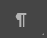

# アクセス可能なサイトを生成するための RTE の設定 {#configuring-rte-for-producing-accessible-sites}

AEM は以下の両方をサポートします。

* 画像の代替テキストを含む標準のアクセシビリティ機能
* リッチテキストエディター（RTE）を使用するコンポーネントでコンテンツを作成するときにアクセスできる追加の機能

>[!NOTE]
>
>* [WCAG 2.0 クイックガイド](/help/managing/qg-wcag.md)
>* [アクセス可能なコンテンツ（WCAG 2.0 適合）の作成](/help/sites-authoring/creating-accessible-content.md)


コンテンツ作成者は、RTE の機能を使用して、アクセシビリティ情報を提供し、同時にコンテンツをページに追加できます。これには、見出しや段落の要素を使用した構造情報の追加が含まれる場合があります。

コンポーネントのRTEプラグインを設定することで [、これらの機能を](#configuring-the-plugin-features) 設定およびカスタマイズできます。 For example, the `paraformat` plugin allows you to add additional block level semantic elements, including extending the number of heading levels supported beyond the basic `H1`, `H2` and `H3` provided by default.

RTEは、タッチ対応UIとクラシックUIの両方から、様々なコンポーネントで使用できます。 ただし、RTEを使用する主なコンポーネントは **Text** コンポーネントです。

AEMの **テキスト** コンポーネントは、タッチ対応UIとクラシックUIの両方で使用できます。 次の画像は、以下を含む様々なプラグインが有効になっているリッチテキストエディターを示していま `paraformat`す。

* The **Text** component in the touch-enabled UI:

   

* クラシック UI の&#x200B;**テキスト**&#x200B;コンポーネント：

   

>[!NOTE]
>
>クラシックUIのRTE機能とタッチ操作対応UIの機能には違いがあります。 詳しくは、以下を参照してください。
>
>* [プラグインとその機能](/help/sites-administering/rich-text-editor.md#aboutplugins)
>* [プラグインとその機能 — タッチ対応UI](/help/sites-administering/rich-text-editor.md#aboutplugins)

>


## プラグイン機能の設定 {#configuring-the-plugin-features}

RTE 設定の完全な手順は、[リッチテキストエディターの設定](/help/sites-administering/rich-text-editor.md)ページを参照してください。重要な手順を含めて、すべての問題に対応しています。

* [プラグインとその機能](/help/sites-administering/rich-text-editor.md#aboutplugins)
* [設定場所](/help/sites-administering/rich-text-editor.md#understand-the-configuration-paths-and-locations)
* [プラグインのアクティベートと features プロパティの設定](/help/sites-administering/rich-text-editor.md#enable-rte-functionalities-by-activating-plug-ins)
* [RTE の他の機能の設定](/help/sites-administering/rich-text-editor.md#enable-rte-functionalities-by-activating-plug-ins)

CRXDE Lite の該当する `rtePlugins` サブブランチ内でプラグインを設定することにより（以下の図を参照）、そのプラグインのすべての機能または特定の機能をアクティベートできます。


### 例 - RTE 選択フィールドで使用可能な段落書式を設定 {#example-specifying-paragraph-formats-available-in-rte-selection-field}

意味的ブロックの新しい書式を選択可能にするには、次の手順を実行します。

1. 使用している RTE によって、[設定場所](/help/sites-administering/rich-text-editor.md#understand-the-configuration-paths-and-locations)を特定し、移動します。
1. [プラグインをアクティベート](/help/sites-administering/rich-text-editor.md#enable-rte-functionalities-by-activating-plug-ins)することにより、[段落選択フィールドを有効](/help/sites-administering/rich-text-editor.md)にします。
1. [段落選択フィールドで使用可能にする書式を指定](/help/sites-administering/rich-text-editor.md)します。
1. これにより、コンテンツ作成者は、指定した段落書式を RTE の選択フィールドから選択できます。アクセス方法は次のとおりです。

   * Using the paragraph ([pilcrow](https://en.wikipedia.org/wiki/Pilcrow)) icon in the touch-enabled UI:

   

   * クラシック UI の「**書式**」フィールド（ドロップダウンセレクター）を使用。


段落書式オプションを介して RTE で構造要素を使用できるので、AEM はアクセス可能なコンテンツの開発に適した基礎を提供します。コンテンツ作成者は、RTE を使用してフォントのサイズや色、その他の関連する属性を書式設定できないので、インライン書式設定は作成できません。代わりに、見出しなどの該当する構造要素を選択し、「スタイル」オプションから選択されたグローバルスタイルを使用する必要があります。これにより、独自のスタイルシートで閲覧するユーザーにとってはマークアップがクリーンになり、オプションも多くなるほか、コンテンツの構造が正確になります。

## ソース編集機能の使用 {#use-of-the-source-edit-feature}

コンテンツ作成者が、RTE を使用して作成された HTML ソースコードを調査および調整することが必要になる場合があります。例えば、WCAG 2.0 を確実に準拠するため、RTE 内で作成されたコンテンツの一部で追加のマークアップが必要となることがあります。これをおこなうには、RTE の[ソースの編集](/help/sites-administering/rich-text-editor.md#aboutplugins)オプションを使用します。You can specify the [ `sourceedit` feature on the `misctools` plugin](/help/sites-administering/rich-text-editor.md#aboutplugins).

>[!CAUTION]
>
>`sourceedit` 機能の使用には十分に注意してください。タイピングの誤りやサポート対象外の機能は、問題を大きくする可能性があります。

## 追加の HTML 要素および属性のサポートの追加 {#adding-support-for-additional-html-elements-and-attributes}

AEM のアクセシビリティ機能をさらに拡張するには、RTE に基づく既存のコンポーネント（**テキスト**&#x200B;コンポーネントや&#x200B;**テーブル**&#x200B;コンポーネント）を、要素や属性を追加して拡張することができます。

The following procedure illustrates how to extend the **Table** component with a **Caption** element that provides information about a data table to assistive technology users:

### 例 - テーブルのプロパティダイアログへのキャプションの追加 {#example-adding-the-caption-to-the-table-properties-dialog}

のコンストラクターで、キャプションの編集に使用するテキスト入力フィールドを追加 `TablePropertiesDialog`します。 コンテンツ `itemId` を自動的に処理するには、 `caption` （DOM属性の名前など）に設定する必要があります。

表 **で** 、DOM要素に対する属性を明示的に設定または削除する必要があります。 値は、 `config` オブジェクトのダイアログによって渡されます。 DOM属性は、ブラウザー実装での一般的な問題を回避するために、対応する `CQ.form.rte.Common` メソッド( `com` のショートカット `CQ.form.rte.Common`)を使用して設定または削除する必要があります。

>[!NOTE]
>
>この手順は、クラシック UI のみに適しています。

### 手順説明 {#step-by-step-instructions}

1. 開始CRXDE Lite。 For example: [http://localhost:4502/crx/de/](http://localhost:4502/crx/de/)
1. コピー：

   `/libs/cq/ui/widgets/source/widgets/form/rte/commands/Table.js`

   リダイレクト先は次のとおりです。

   `/apps/cq/ui/widgets/source/widgets/form/rte/commands/Table.js`

   >[!NOTE]
   >
   >中間フォルダーが存在しない場合は、作成する必要があります。

1. コピー：

   `/libs/cq/ui/widgets/source/widgets/form/rte/plugins/TablePropertiesDialog.js`

   リダイレクト先は次のとおりです。

   `/apps/cq/ui/widgets/source/widgets/form/rte/plugins/TablePropertiesDialog.js`。

1. 次のファイルを編集用に開きます（ダブルクリックで開く）。

   `/apps/cq/ui/widgets/source/widgets/form/rte/plugins/TablePropertiesDialog.js`

1. `constructor` メソッドで、

   ```
   var dialogRef = this;
   ```

   次のコードを追加します。

   ```
   editItems.push({
       "itemId": "caption",
       "name": "caption",
       "xtype": "textfield",
       "fieldLabel": CQ.I18n.getMessage("Caption"),
       "value": (this.table && this.table.caption ? this.table.caption.textContent : "")
   });
   ```

1. 次のファイルを開きます。

   `/apps/cq/ui/widgets/source/widgets/form/rte/commands/Table.js`。

1. Add the following code at the end of the `transferConfigToTable` method:

   ```
   /**
    * Adds Caption Element
   */
   var captionElement;
   if (dom.firstChild && dom.firstChild.tagName.toLowerCase() == "caption")
   {
      captionElement = dom.firstChild;
   }
   if (config.caption)
   {
       var captionTextNode = document.createTextNode(config.caption)
       if (captionElement)
       {
          dom.replaceNode(captionElement.firstChild,captionTextNode);
       } else
       {
           captionElement = document.createElement("caption");
           captionElement.appendChild(captionTextNode);
           if (dom.childNodes.length>0)
           {
              dom.insertBefore(captionElement, dom.firstChild);
           } else
           {
              dom.appendChild(captionElement);
           }
       }
   } else if (captionElement)
   {
     dom.removeChild(captionElement);
   }
   ```

1. Save your changes using **Save All**

>[!NOTE]
>
>プレーンテキストフィールドは、キャプション要素の値に対して許可される入力の種類ではありません。 キャプションの値をその `getValue()` メソッドを通して提供するExtJSウィジェットを使用できます。
>
>追加の要素および属性用に編集機能を追加するには、以下の両方を確認します。
>
>* The `itemId` property for each corresponding field is set to the name of the appropriate DOM attribute (`TablePropertiesDialog`).
>* DOM 要素で属性が設定／削除されていること（`Table`）。

