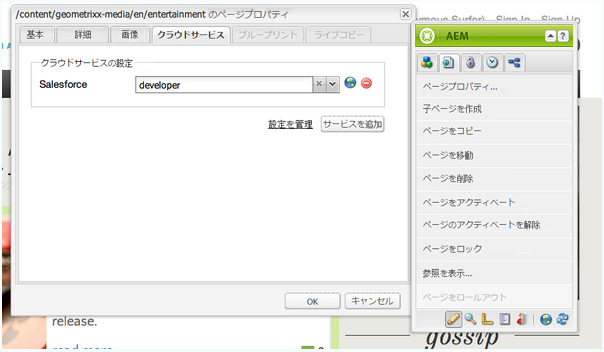

# Salesforce との統合{#integrating-with-salesforce}

>[!CAUTION]
>
>AEM 6.4 の拡張サポートは終了し、このドキュメントは更新されなくなりました。 詳細は、 [技術サポート期間](https://helpx.adobe.com/jp/support/programs/eol-matrix.html). サポートされているバージョンを見つける [ここ](https://experienceleague.adobe.com/docs/?lang=ja).

Salesforce とAEMの統合は、リード管理機能を提供し、Salesforce が提供する既存の機能を活用します。 リードを Salesforce に投稿し、Salesforce から直接データにアクセスするコンポーネントを作成するようにAEMを設定できます。

AEMと Salesforce の双方向で拡張可能な統合により、次のことが可能になります。

* 組織でデータを完全に使用および更新して、顧客体験を強化する。
* マーケティングからセールス活動へのエンゲージメント。
* Salesforce データストアからデータを自動的に送受信する組織。

このドキュメントでは、次の点について説明します。

* SalesforceCloud Servicesの設定方法 (AEMを Salesforce と統合するように設定 )。
* ClientContext での Salesforce リード/連絡先情報の使用方法と、パーソナライゼーションの使用方法。
* Salesforce ワークフローモデルを使用して、AEMユーザーをリードとして salesforce に投稿する方法。
* Salesforce のデータを表示するコンポーネントの作成方法。

## Salesforce と統合するAEMの設定 {#configuring-aem-to-integrate-with-salesforce}

AEMと Salesforce を統合するように設定するには、まず Salesforce でリモートアクセスアプリケーションを設定する必要があります。 次に、このリモートアクセスアプリケーションを指すように Salesforce クラウドサービスを設定します。

>[!NOTE]
>
>Salesforce で無料の開発者アカウントを作成できます。

Salesforce と統合するAEMを設定するには：

1. AEM で「**クラウドサービス**」に移動します。「サードパーティのサービス」で、「**Salesforce**」の「**今すぐ設定**」をクリックします。

   

1. 新しい設定を作成します。例： **開発者**.

   >[!NOTE]
   >
   >新しい設定は、新しいページにリダイレクトされます。 **http://localhost:4502/etc/cloudservices/salesforce/developer.html**. これは、Salesforce でリモートアクセスアプリケーションを作成する際にコールバック URL で指定する必要がある値とまったく同じです。 これらの値が一致しなければなりません。

1. Salesforce アカウントにログインします（アカウントがない場合は [https://developer.force.com](https://developer.force.com) で作成します）。
1. Salesforce で、**Create**／**Apps** に移動して、「**Connected Apps**」を表示します（以前のバージョンの Salesforce では **Deploy**／**Remote Access**）。
1. 「**New**」をクリックして、AEM と Salesforce を接続します。

   

1. 次を入力します。 **接続されたアプリ名**, **API 名**、および **連絡先メール**. を選択します。 **OAuth 設定を有効にする** チェックボックスに **コールバック URL** OAuth 範囲（フルアクセスなど）を追加します。 コールバック URL は以下のようになります。`http://localhost:4502/etc/cloudservices/salesforce/developer.html`

   設定に合わせてサーバー名／ポート番号およびページ名を変更します。

   

1. 「**Save**」をクリックして、Salesforce 設定を保存します。Salesforce が、AEM 設定に必要な&#x200B;**消費者キー**&#x200B;と&#x200B;**消費者の秘密鍵**&#x200B;を作成します。

   

   >[!NOTE]
   >
   >Salesforce のリモートアクセスアプリケーションがアクティブ化されるまで、数分（最大 15 分）待つ必要が生じる場合があります。

1. AEMで、に移動します。 **Cloud Services** 前に作成した salesforce 設定（例： ）に移動します。 **開発者**) をクリックします。 クリック **編集** salesforce.com から顧客キーと顧客秘密鍵を入力します。

   

   | ログイン URL | これは Salesforce 認証エンドポイントです。 この値は事前入力されており、ほとんどの場合に役立ちます。 |
   |---|---|
   | 顧客キー | salesforce.com のリモートアクセスアプリケーション登録ページから取得した値を入力します |
   | 顧客秘密鍵 | salesforce.com のリモートアクセスアプリケーション登録ページから取得した値を入力します |

1. クリック **Salesforce に連携** 接続するには Salesforce は、設定から Salesforce への接続を許可するように要求します。

   

   AEM に、正常に接続されたことを示す確認ダイアログが表示されます。

1. Web サイトのルートページに移動して、「**ページプロパティ**」をクリックします。「**クラウドサービス**」を選択し、「**Salesforce**」を追加して、正しい設定（例：**developer**）を選択します。

   

   これで、ワークフローモデルを使用して、リードを Salesforce に投稿し、Salesforce のデータにアクセスするコンポーネントを作成できます。

## AEMユーザーを Salesforce リードとしてエクスポート中 {#exporting-aem-users-as-salesforce-leads}

AEMユーザーを Salesforce のリードとしてエクスポートする場合は、リードを Salesforce に投稿するようにワークフローを設定する必要があります。

AEMユーザーを Salesforce リードとしてエクスポートするには：

1. `http://localhost:4502/workflow` で、「**Salesforce.com でのエクスポート**」ワークフローを右クリックし、「**開始**」をクリックして、この Salesforce ワークフローに移動します。

   

1. リードとして作成するAEMユーザーを **ペイロード** このワークフロー（ホーム/ユーザー）の場合。 ユーザーのプロファイルノードは、次のような情報が含まれているので、必ず選択してください。 **givenName**, **familyName**&#x200B;など。Salesforce リードの **名** および **姓** フィールド。

   

   >[!NOTE]
   >
   >このワークフローを開始する前に、必須フィールドを設定します。AEM のリードノードには、Salesforce に公開する前に設定しておく必要がある必須フィールドがいくつかあります。必須フィールドは、**givenName**、**familyName**、**company** および **email** です。AEM ユーザーと Salesforce のリードのマッピングの詳細なリストは、[AEM ユーザーと Salesforce のリードのマッピング設定](#mapping-configuration-between-aem-user-and-salesforce-lead)を参照してください。

1. 「**OK**」をクリックします。ユーザ情報が salesforce.com にエクスポートされます。 salesforce.com で確認できます。

   >[!NOTE]
   >
   >エラーログに、リードがインポートされたかどうかが示されます。 詳しくは、エラーログを確認してください。

### Salesforce.com 書き出しワークフローの設定 {#configuring-the-salesforce-com-export-workflow}

正しい Salesforce.com 設定に合わせたり、他の変更を行うには、Salesforce.com 書き出しワークフローを設定する必要がある場合があります。

Salesforce.com の書き出しワークフローを設定するには：

1. `http://localhost:4502/cf#/etc/workflow/models/salesforce-com-export.html.` に移動します。

   

1. 「Salesforce.com でのエクスポート」ステップを開き、「**引数**」タブを選択し、正しい設定を選択して「**OK**」をクリックします。さらに、Salesforce で削除されたリードをワークフローで再作成する場合は、このチェックボックスをオンにします。

   

1. 「**保存**」をクリックして変更を保存します。

   

### AEM ユーザーと Salesforce のリードのマッピング設定 {#mapping-configuration-between-aem-user-and-salesforce-lead}

AEM ユーザーと Salesforce リードの現在のマッピング設定を表示または編集するには、Configuration Manager（`https://<hostname>:<port>/system/console/configMgr`）を開いて「**Salesforce Lead Mapping Configuration**」を検索します。

1. 「**Web コンソール**」をクリックするか、直接 `https://<hostname>:<port>/system/console/configMgr.` にアクセスして Configuration Manager を開きます。
1. 「**Salesforce Lead Mapping Configuration**」を検索します。

   

1. 必要に応じてマッピングを変更します。デフォルトのマッピングは、** aemUserAttribute=sfLeadAttribute**のパターンに従います。 「**保存**」をクリックして変更を保存します。

## Salesforce ClientContext Store の設定 {#configuring-salesforce-client-context-store}

Salesforce クライアントコンテキストストアには、AEM内で既に利用可能な情報よりも、現在ログインしているユーザーに関する追加情報が表示されます。 ユーザーと Salesforce の連携に応じて、この追加情報を Salesforce から取り込みます。

これをおこなうには、次の設定をおこなう必要があります。

1. Salesforce Connect コンポーネントを使用して、AEMユーザーを Salesforce ID にリンクします。
1. Salesforce プロファイルデータを ClientContext ページに追加し、表示するプロパティを設定します。
1. （オプション）Salesforce Client Context Store のデータを使用するセグメントを作成します。

### AEMユーザーと Salesforce ID のリンク {#linking-an-aem-user-with-a-salesforce-id}

ClientContext に読み込むには、AEMユーザーを Salesforce ID にマッピングする必要があります。 実際のシナリオでは、既知のユーザーデータに基づいてリンクし、検証をおこないます。 デモ目的で、この手順では、 **Salesforce Connect** コンポーネント。

1. AEMで Web サイトに移動し、ログインして、 **Salesforce Connect** サイドキックからコンポーネントを選択します。

   >[!NOTE]
   >
   >この **Salesforce Connect** コンポーネントを使用できません。次に移動します。 **デザイン** 表示して選択し、で使用できるようにします。 **編集** 表示

   

   コンポーネントをページにドラッグすると、「**Salesforce へのリンク**」が「オフ」と表示されます。

   

   >[!NOTE]
   >
   >このコンポーネントは、デモ目的でのみ使用します。 実際のシナリオでは、ユーザーをリードとリンク/マッチングする別のプロセスが存在します。

1. ページ上にコンポーネントをドラッグした後、開いて設定します。 設定、連絡先のタイプ、Salesforce のリードまたは連絡先を選択し、 **OK**.

   

   AEM がユーザーと Salesforce の連絡先またはリードをリンクします。

   

### ClientContext への Salesforce データの追加 {#adding-salesforce-data-to-client-context}

ClientContext で Salesforce からユーザーデータを読み込み、パーソナライゼーションに使用できます。

1. 例えば `http://localhost:4502/etc/clientcontext/default/content.html.` に移動して、拡張したいクライアントコンテキストを開きます。

   

1. **Salesforce プロフィールデータ**&#x200B;コンポーネントを ClientContext にドラッグします。

   

1. コンポーネントをダブルクリックして開きます。 選択 **項目を追加** をクリックし、ドロップダウンリストからプロパティを選択します。 必要な数のプロパティを追加して、「 」を選択します。 **OK**.

   

1. これで、Salesforce 固有のプロパティが ClientContext に表示されます。

   

### Salesforce Client Context Store のデータを使用したセグメントの作成 {#building-a-segment-using-data-from-salesforce-client-context-store}

Salesforce Client Context Store のデータを使用するセグメントを構築できます。 次の手順を実行します。

1. **ツール**／**セグメント化**&#x200B;に移動するか、[http://localhost:4502/miscadmin#/etc/segmentation](http://localhost:4502/miscadmin#/etc/segmentation) に移動して、AEM のセグメント化に移動します。
1. セグメントを作成または更新して、Salesforce のデータを含めます。 詳しくは、 [セグメント化](/help/sites-administering/campaign-segmentation.md).

## リードの検索 {#searching-leads}

AEMには、指定した条件に従って Salesforce 内のリードを検索する、サンプルの検索コンポーネントが付属しています。 このコンポーネントでは、Salesforce REST API を使用して Salesforce オブジェクトを検索する方法を示します。 salesforce.com への呼び出しをトリガーするには、ページを Salesforce 設定にリンクする必要があります。

>[!NOTE]
>
>これは、Salesforce REST API を使用して Salesforce オブジェクトに対してクエリを実行する方法を示すサンプルコンポーネントです。 これを例として使用し、ニーズに基づいて、より複雑なコンポーネントを作成します。

このコンポーネントを使用するには：

1. この設定を使用するページに移動します。 ページのプロパティを開き、「 」を選択します。 **Cloud Services。** クリック **サービスを追加** を選択し、 **Salesforce** をクリックし、適切な設定を行って、 **OK**.

   

1. Salesforce 検索コンポーネントを（有効になっている場合）ページにドラッグします。 有効にするには、デザインモードに移動し、適切な領域に追加します。

   

1. 検索コンポーネントを開き、検索パラメーターを指定して、「**OK**」をクリックします。

   

1. 検索コンポーネントで指定した条件に一致するリードが表示されます。

   
