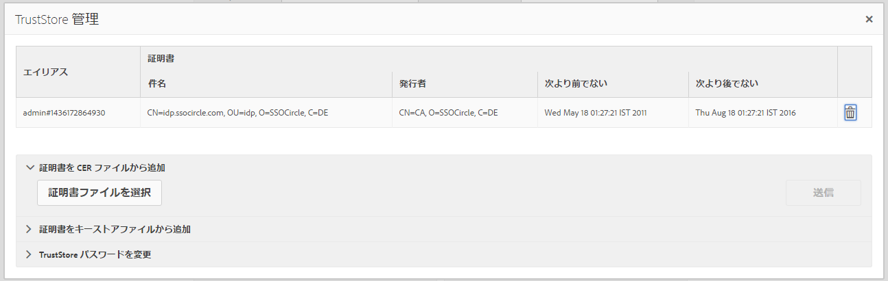

# SAML 2.0 認証ハンドラー{#saml-authentication-handler}

AEM には、[SAML](http://saml.xml.org/saml-specifications) 認証ハンドラーが付属しています。このハンドラーによって、[ バインディングを使用した ](http://saml.xml.org/saml-specifications)SAML`HTTP POST` 2.0 認証要求プロトコル（Web-SSO プロファイル）のサポートが提供されます。

サポート対象は次のとおりです。

* メッセージの署名と暗号化
* ユーザーの自動作成
* AEMの既存のグループに対するグループの同期
* サービスプロバイダーおよび ID プロバイダーが認証を開始しました

このハンドラーは、暗号化された SAML 応答メッセージをユーザーノード（`usernode/samlResponse`）に格納して、サードパーティのサービスプロバイダーとの通信を容易にします。

>[!NOTE]
>
>[AEM と SAML の統合のデモンストレーション](https://helpx.adobe.com/experience-manager/kb/simple-saml-demo.html)を参照してください。
>
>エンドツーエンドのコミュニティの記事については、[Integrating SAML with Adobe Experience Manager](https://helpx.adobe.com/jp/experience-manager/using/aem63_saml.html)を参照してください。

## SAML 2.0 認証ハンドラーの設定 {#configuring-the-saml-authentication-handler}

[Web コンソール](/help/sites-deploying/configuring-osgi.md)を使用すると、[SAML](http://saml.xml.org/saml-specifications) 2.0 認証ハンドラーの設定（**Adobe Granite SAML 2.0 Authentication Handler**）にアクセスできます。設定可能なプロパティを以下に示します。

>[!NOTE]
>
>SAML 2.0 認証ハンドラーはデフォルトでは無効になっています。このハンドラーを有効にするには、次のどちらかのプロパティを設定する必要があります。
>
>* ID プロバイダーの POST の URL
>* サービスプロバイダーのエンティティ ID

>

>[!NOTE]
>
>SAML アサーションは署名されます。オプションとして暗号化することもできます。この機能を使用するには、少なくとも TrustStore の ID プロバイダーの公開証明書を提供する必要があります。 詳しくは、[TrustStore への IdP 証明書の追加](/help/sites-administering/saml-2-0-authenticationhandler.md#add-the-idp-certificate-to-the-aem-truststore)の節を参照してください。

**パス** この認証ハンドラーを Sling が使用するリポジトリパス。 このプロパティが空の場合は、認証ハンドラーが無効になります。

**サービスランキング** OSGi Framework Service Ranking 値。このサービスを呼び出す順序を示します。 これは整数値で、値が大きいほど優先順位が高くなります。

**IDP 証明書エイリアス** グローバルトラストストア内の IdP の証明書のエイリアス。 このプロパティが空の場合は、認証ハンドラーが無効になります。設定方法は、以下の「AEM TrustStore への IdP 証明書の追加」を参照してください。

**ID プロバイダー URL** SAML 認証リクエストの送信先となる IDP の URL。 このプロパティが空の場合は、認証ハンドラーが無効になります。

>[!CAUTION]
>
>ID プロバイダーのホスト名は **Apache Sling Referrer Filter** の OSGi 設定に追加する必要があります。詳しくは、[Web コンソール](/help/sites-deploying/configuring-osgi.md)に関する節を参照してください。

**サービスプロバイダーエンティティ ID** ID プロバイダーでこのサービスプロバイダーを一意に識別する ID。 このプロパティが空の場合は、認証ハンドラーが無効になります。

**デフォルトのリダイレクト** 認証が成功した後のリダイレクト先のデフォルトの場所。

>[!NOTE]
>
>この場所は、 `request-path` cookie が設定されていません。 設定されたパスの下に有効な login-token がないページをリクエストした場合、リクエストされたパスは cookie に保存されます\
>認証が成功すると、ブラウザーはこの場所に再度リダイレクトされます。

**User-ID 属性** CRX リポジトリでのユーザーの認証と作成に使用されるユーザー ID を含む属性の名前。

>[!NOTE]
>
>ユーザー ID は SAML アサーションの `saml:Subject` ノードではなく、この `saml:Attribute` から取得されます。

**暗号化を使用** この認証ハンドラーが暗号化された SAML アサーションを想定するかどうか。

**CRX ユーザーを自動作成** 認証に成功した後、リポジトリ内の既存以外のユーザーを自動的に作成するかどうか。

>[!CAUTION]
>
>CRX ユーザーの自動作成が無効な場合は、ユーザーを手動で作成する必要があります。

**グループに追加** 認証に成功した後、ユーザーを CRX グループに自動的に追加する必要があるかどうか。

**グループメンバーシップ** このユーザーを追加する CRX グループのリストを含む saml:Attribute の名前。

## AEM TrustStore への IdP 証明書の追加 {#add-the-idp-certificate-to-the-aem-truststore}

SAML アサーションは署名されます。オプションとして暗号化することもできます。そのためには、少なくともリポジトリ内の IDP の公開証明書を指定する必要があります。これをおこなうには、次の手順を実行する必要があります。

1. に移動します。 *http:/serveraddress:serverport/libs/granite/security/content/truststore.html*
1. を押します。 **[!UICONTROL TrustStore リンクを作成]**
1. TrustStore のパスワードを入力して「**[!UICONTROL 保存]**」を押します。
1. 「**[!UICONTROL TrustStore を管理]**」をクリックします。
1. IdP 証明書をアップロードします。
1. 証明書エイリアスを記録します。以下の例では、エイリアスは **[!UICONTROL admin#1436172864930]** です。

   

## AEM キーストアへのサービスプロバイダーキーと証明書チェーンの追加 {#add-the-service-provider-key-and-certificate-chain-to-the-aem-keystore}

>[!NOTE]
>
>以下の手順は必須です。それ以外の場合は、次の例外がスローされます。 `com.adobe.granite.keystore.KeyStoreNotInitialisedException: Uninitialised system trust store`

1. 移動先： [http://localhost:4502/libs/granite/security/content/useradmin.html](http://localhost:4502/libs/granite/security/content/useradmin.html)
1. を編集します。 `authentication-service` ユーザー。
1. 「**アカウント設定**」の「**キーストアを作成**」をクリックしてキーストアを作成します。

>[!NOTE]
>
>以下の手順は、ハンドラーがメッセージに署名または復号化できる必要がある場合にのみ必要です。

1. 「**秘密鍵ファイルを選択**」をクリックして秘密鍵ファイルをアップロードします。キーは PKCS#8 形式で、DER エンコードである必要があります。
1. 「**証明書チェーンファイルを選択**」をクリックして証明書ファイルをアップロードします。
1. 以下のようにエイリアスを割り当てます。

   

## SAML 用のロガーの設定 {#configure-a-logger-for-saml}

SAML の設定ミスにより発生する可能性があるすべての問題をデバッグするようにロガーを設定することができます。手順は次のとおりです。

1. Web コンソール ( ) に移動します。 *http://localhost:4502/system/console/configMgr*
1. 次の名前のエントリを検索してクリックします。 **Apache Sling Logging Logger Configuration**
1. 次の設定でロガーを作成します。

   * **Log Level：** Debug
   * **Log File：** logs/saml.log
   * **Logger：** com.adobe.granite.auth.saml
