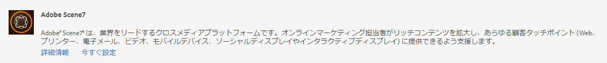
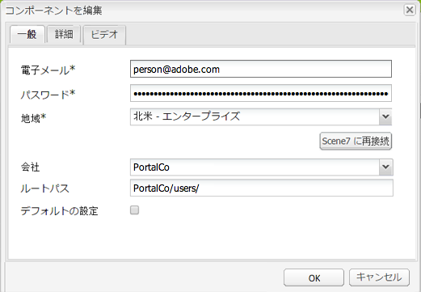
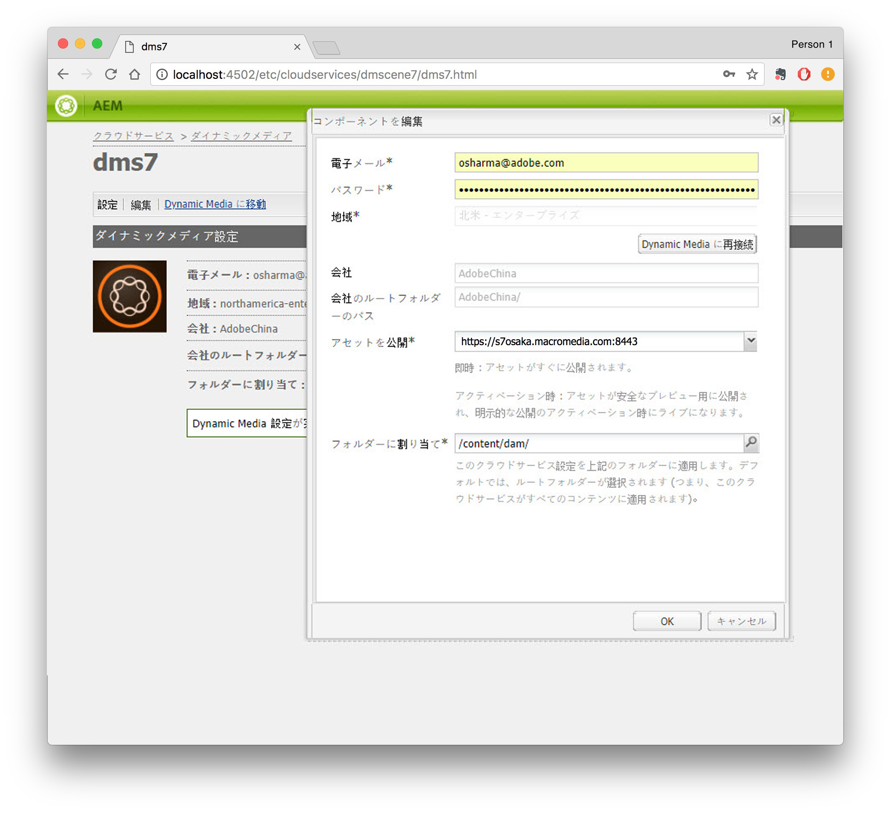
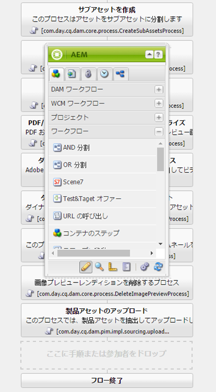
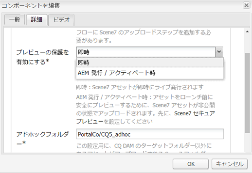
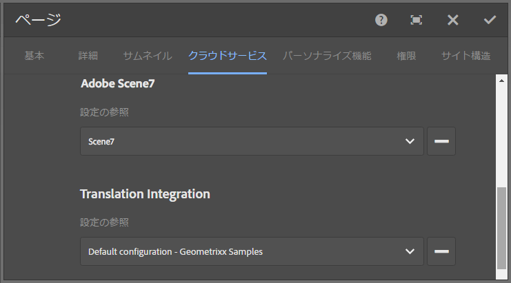
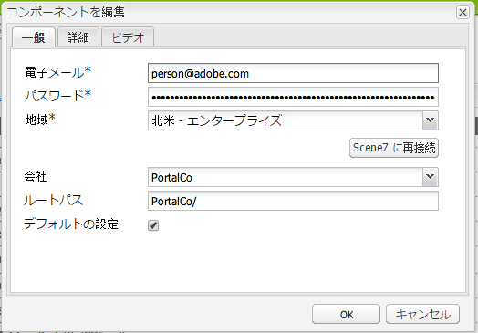
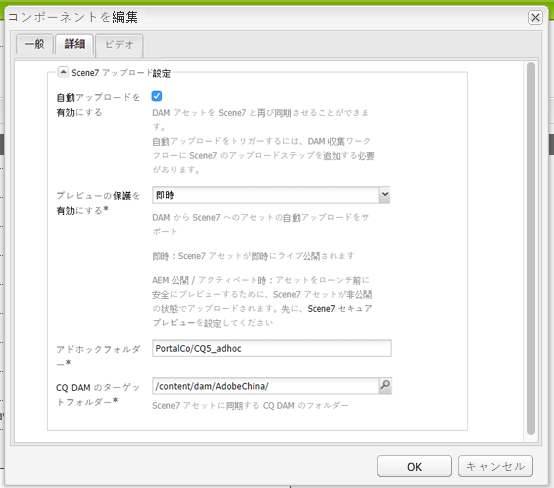

# Dynamic Media Classicとの統合 {#integrating-with-dynamic-media-classic-scene}

Adobe Dynamic Media Classicは、リッチメディアアセットを管理、強化、公開、および Web、モバイル、電子メール、インターネットに接続されたディスプレイと印刷できる、ホストソリューションです。

Dynamic Media Classicを使用するには、Dynamic Media ClassicとAdobe Experience Manager Assets が相互にやり取りできるようにクラウド設定を指定する必要があります。 このドキュメントでは、Experience ManagerとDynamic Media Classicの設定方法について説明します。

ページ上でのすべてのDynamic Media Classicコンポーネントの使用とビデオの操作について詳しくは、 [Dynamic Media Classicの使用](../assets/scene7.md).

>[!NOTE]
>
>* Dynamic Media Classicの DHTML ビューアプラットフォームは、2014 年 1 月 31 日に正式にサポート終了となりました。 詳しくは、 [DHTML ビューアのサポート終了に関する FAQ](../sites-administering/dhtml-viewer-endoflifefaqs.md).
>* Experience Managerを使用するようにDynamic Media Classicを設定する前に、 [ベストプラクティス](#best-practices-for-integrating-scene-with-aem) Dynamic Media ClassicとExperience Managerの統合
>* Dynamic Media Classicをカスタムプロキシ設定で使用している場合は、Experience Managerの一部の機能で 3.x API を使用し、他の機能で 4.x API を使用するので、両方の HTTP クライアントプロキシ設定を設定します。 3.x は [http://localhost:4502/system/console/configMgr/com.day.commons.httpclient](http://localhost:4502/system/console/configMgr/com.day.commons.httpclient) と 4.x はで設定します。 [http://localhost:4502/system/console/configMgr/org.apache.http.proxyconfigurator](http://localhost:4502/system/console/configMgr/org.apache.http.proxyconfigurator).

>

## Experience ManagerとDynamic Media Classicの統合とDynamic Mediaの統合 {#aem-scene-integration-versus-dynamic-media}

Experience Managerユーザーは、Dynamic Mediaで使用する次の 2 つのソリューションの中から選択できます。

* との統合されたExperience Managerインスタンスの使用 *Dynamic Media Classic*.
* 使用 *Dynamic Media* Experience Manager

次の条件に従って、最適なソリューションを決定します。

* 次の場合、 **既存** Dynamic Media Classicのお客様で、リッチメディアアセットが公開および配信用にDynamic Media Classicに存在し、これらのアセットを Sites(WCM) オーサリングまたはExperience Manager Assets（管理用）と統合する場合は、 [Experience Manager/Dynamic Media Classicのポイントツーポイント統合](#aem-scene-point-to-point-integration) このドキュメントで説明しています。

* 次の場合、 **新規** リッチメディア配信のニーズを持つExperience Managerのお客様は、 [Dynamic Mediaオプション](#aem-dynamic-media). このオプションは、既存の S7 アカウントを持たず、システムに多くのアセットを保存している場合に最も有用です。

* 場合によっては、両方のソリューションを使用します。 この [二重使用シナリオ](/help/sites-administering/scene7.md#dual-use-scenario) は、そのシナリオについて説明します。

### Experience Manager/Dynamic Media Classicのポイントツーポイント統合 {#aem-scene-point-to-point-integration}

このソリューションのアセットを使用して作業する場合、次のいずれかの操作をおこないます。

* アセットをDynamic Media Classicに直接アップロードし、 **Dynamic Media Classic** ページオーサリング用のコンテンツブラウザー
* Experience Manager Assetsにアップロードして、Dynamic Media Classicへの自動公開を有効にする。次を介してにアクセス **Assets** ページオーサリング用のコンテンツブラウザー

この統合に使用するコンポーネントは、 **Dynamic Media Classic** コンポーネント領域 [デザインモード。](/help/sites-authoring/author-environment-tools.md#page-modes)

### Experience ManagerDynamic Media {#aem-dynamic-media}

Experience ManagerDynamic Mediaは、Experience Managerプラットフォーム内で直接Dynamic Media Classic機能を統合する機能です。

このソリューションのアセットを使用して作業する場合、次のワークフローに従います。

1. 単一の画像およびビデオアセットをExperience Managerに直接アップロード。
1. ビデオをExperience Manager内で直接エンコード
1. 画像ベースのセットをExperience Manager内で直接作成する。
1. 必要に応じて、画像やビデオにインタラクティブ機能を追加する。

ダイナミックメディア用に使用するコンポーネントは、**[!UICONTROL デザインモード]**&#x200B;の[ダイナミックメディア](/help/sites-authoring/author-environment-tools.md#page-modes)コンポーネント領域にあります。これらには、次が含まれます。

* **[!UICONTROL ダイナミックメディア]** - **[!UICONTROL ダイナミックメディア]**&#x200B;コンポーネントでは、追加しているアセットが画像であるかビデオであるかに応じて、様々なオプションを使用できます。このコンポーネントは画像プリセット、画像ベースのビューア（画像セット、スピンセット、混在メディアセットなど）およびビデオをサポートします。また、レスポンシブビューアなので、画面のサイズは画面のサイズに基づいて自動的に変更されます。 すべてのビューアは HTML5 ビューアです。

* **[!UICONTROL インタラクティブメディア]** - **[!UICONTROL インタラクティブメディア]** コンポーネントは、カルーセルバナー、インタラクティブ画像およびインタラクティブビデオ用で、その中にホットスポットや画像マップなどのインタラクティブ機能が含まれています。 このコンポーネントはスマートです。追加する画像とビデオのどちらに応じて、様々なオプションがあります。 また、ビューアはレスポンシブです。 つまり、画面のサイズは画面のサイズに基づいて自動的に変更されます。 すべてのビューアは HTML5 ビューアです。

### 両方を利用するシナリオ {#dual-use-scenario}

標準設定では、Dynamic MediaとDynamic Media ClassicのExperience Manager統合機能の両方を同時に使用できます。 次の使用例の表で、特定の領域のオン/オフを切り替える場合について説明します。

Dynamic MediaとDynamic Media Classicを同時に使用するには：

1. 設定 [Dynamic Media Classic](#creating-a-cloud-configuration-for-scene) (Cloud Services)
1. 次の中からお使いのユースケースに合致する手順を実行します。

   <table> 
    <tbody> 
    <tr> 
    <td> </td> 
    <td> </td> 
    <td><strong>Dynamic Media</strong></td> 
    <td> </td> 
    <td><strong>Dynamic Media Classic統合</strong></td> 
    <td> </td> 
    </tr> 
    <tr> 
    <td><strong>実行する操作...</strong></td> 
    <td><strong>ユースケースのワークフロー</strong></td> 
    <td><strong>画像／ビデオ</strong></td> 
    <td><strong>ダイナミックメディアコンポーネント</strong></td> 
    <td><strong>S7 コンテンツブラウザーとコンポーネント</strong></td> 
    <td><strong>Assets から S7 への自動アップロード</strong></td> 
    </tr> 
    <tr> 
    <td>Sites とダイナミックメディアを初めて使用する</td> 
    <td>アセットをExperience Managerにアップロードし、Experience ManagerDynamic Mediaコンポーネントを使用して Sites ページでアセットを作成する</td> 
    <td>
オン
 
（手順 3 を参照）
 </td> 
    <td><a href="/help/assets/adding-dynamic-media-assets-to-pages.md">オン</a></td> 
    <td>オフ</td> 
    <td>オフ</td> 
    </tr> 
    <tr> 
    <td>小売で、Sites とDynamic Mediaを初めて使用</td> 
    <td>管理および配信のために、製品以外のアセットをExperience Managerにアップロードします。 PRODUCT アセットをDynamic Media Classicにアップロードし、Experience ManagerとコンポーネントでDynamic Media Classicコンテンツブラウザーを使用して、Sites 上の製品の詳細ページを作成します。</td> 
    <td>
オン
 
（手順 3 を参照）
 </td> 
    <td><a href="/help/assets/adding-dynamic-media-assets-to-pages.md">オン</a></td> 
    <td><a href="/help/assets/scene7.md#scene-content-browser">オン</a></td> 
    <td>オフ</td> 
    </tr> 
    <tr> 
    <td>Assets とダイナミックメディアを初めて使用する</td> 
    <td>Experience Manager Assetsにアセットをアップロードし、Dynamic Mediaから公開された URL/埋め込みコードを使用する</td> 
    <td>
オン
 
（手順 3 を参照）
 </td> 
    <td>オフ</td> 
    <td>オフ</td> 
    <td>オフ</td> 
    </tr> 
    <tr> 
    <td>ダイナミックメディアを使用して初めてテンプレートを作成する</td> 
    <td>Dyamic Media を使用して画像とビデオを作成する。Dynamic Media Classicで画像テンプレートを作成し、Dynamic Media Classicコンテンツファインダーを使用して Sites ページにテンプレートを含めます。</td> 
    <td>
オン
 
（手順 3 を参照）
 </td> 
    <td><a href="/help/assets/adding-dynamic-media-assets-to-pages.md">オン</a></td> 
    <td><a href="/help/assets/scene7.md#scene-content-browser">オン</a></td> 
    <td>オフ</td> 
    </tr> 
    <tr> 
    <td>既存のDynamic Media Classicのお客様で、Sites を初めて使用する方</td> 
    <td>Dynamic Media Classicにアセットをアップロードし、Experience ManagerDynamic Media Classicコンテンツブラウザーを使用して Sites ページでアセットを検索および作成する</td> 
    <td>オフ</td> 
    <td>オフ</td> 
    <td><a href="/help/assets/scene7.md#scene-content-browser">オン</a></td> 
    <td>オフ</td> 
    </tr> 
    <tr> 
    <td>既存のDynamic Media Classicのお客様で、 Sites と Assets を初めて使用する</td> 
    <td>アセットを DAM にアップロードし、配信用にDynamic Media Classicに自動的に公開します。 Experience ManagerDynamic Media Classicコンテンツブラウザーを使用して、Sites ページ上のアセットを検索およびオーサリングします。</td> 
    <td>オフ</td> 
    <td>オフ</td> 
    <td><a href="/help/assets/scene7.md#scene-content-browser">オン</a></td> 
    <td>
<a href="#configuringautouploadingfromaemassets">オン</a>
 
（手順 4 を参照）
 </td> 
    </tr> 
    <tr> 
    <td>既存のDynamic Media Classicをご利用のお客様で、Assets を初めて使用するお客様</td> 
    <td>
アセットをExperience Managerにアップロードし、Dynamic Mediaを使用してダウンロード/共有用のレンディションを生成します。 配信用にExperience Manager AssetsをDynamic Media Classicに自動的に公開します。
 
<strong>重要：</strong> 重複処理が発生し、Experience Managerで生成されたレンディションがDynamic Media Classicに同期されない
 </td> 
    <td>
オン
 
（手順 3 を参照）
 </td> 
    <td>オフ</td> 
    <td>オフ</td> 
    <td>
<a href="#configuringautouploadingfromaemassets">オン</a>
 
（手順 4 を参照）
 </td> 
    </tr> 
    </tbody> 
    </table>

1. ( オプション、（使用例の表を参照） — [Dynamic Mediaクラウド設定](/help/assets/config-dynamic.md) および [Dynamic Mediaサーバーの有効化](/help/assets/config-dynamic.md).
1. ( オプション、（使用例の表を参照） — 「 Assets からDynamic Media Classicへの自動アップロード」を有効にする場合は、次の項目を追加する必要があります。

   1. Dynamic Media Classicへの自動アップロードを設定する
   1. を **Dynamic Media Classicのアップロード** すべてのDynamic Mediaワークフローステップの後の手順 *～の終わりに* **DAM アセットの更新** ワークフロー ( `https://<server>:<host>/cf#/etc/workflow/models/dam/update_asset.html)`
   1. （オプション）で MIME タイプ別にDynamic Media Classicアセットのアップロードを制限 [https://&lt;server>:&lt;port>/system/console/configMgr/com.day.cq.dam.scene7.impl.Scene7AssetMimeTypeServiceImpl](http://localhost:4502/system/console/configMgr/com.day.cq.dam.scene7.impl.Scene7AssetMimeTypeServiceImpl). このリストにないアセットの MIME タイプは、Dynamic Media Classicサーバーにアップロードされません。
   1. （オプション） Dynamic Media Classic設定でビデオをセットアップします。 ビデオエンコーディングは、Dynamic MediaとDynamic Media Classicのどちらかまたは両方に対して同時に有効にできます。 動的レンディションは、Experience Managerインスタンスでのプレビューとローカルでの再生に使用されます。一方、Dynamic Media Classicビデオレンディションは、Dynamic Media Classicサーバーで生成され、保存されます。 Dynamic MediaとDynamic Media Classicの両方でビデオエンコーディングサービスを設定する場合は、 [ビデオ処理プロファイル](/help/assets/video-profiles.md) をDynamic Media Classic asset フォルダーに追加します。
   1. （オプション） [Dynamic Media Classicでのセキュアプレビューの設定](/help/sites-administering/scene7.md#configuring-the-state-published-unpublished-of-assets-pushed-to-scene).

#### 制限事項 {#limitations}

Dynamic Media ClassicとDynamic Mediaの両方を有効にしている場合、次の制限があります。

* アセットを選択し、Experience Managerページ上のDynamic Media ClassicコンポーネントにドラッグしてDynamic Media Classicに手動でアップロードしても、機能しません。
* Experience ManagerとDynamic Media Classicの同期されたアセットは、Assets でアセットが編集されると自動的にDynamic Media Classicに更新されますが、ロールバックアクションでは新しいアップロードがトリガーされません。 したがって、Dynamic Media Classicでは、ロールバック後すぐに最新バージョンは取得されません。 回避策は、ロールバックが完了した後に再度編集することです。
* 1 つの使用例でDynamic Mediaを使用し、別の使用例でDynamic Media Classic Assets とDynamic Media Classicシステムとのやり取りをしないようにDynamic Media統合を使用する必要がある場合は、Dynamic Media Classic設定をDynamic Mediaフォルダーに適用しないでください。 また、Dynamic Media設定（処理プロファイル）をDynamic Media Classicフォルダーに適用しないでください。

## Dynamic Media ClassicとExperience Managerの統合のベストプラクティス {#best-practices-for-integrating-scene-with-aem}

Dynamic Media ClassicをExperience Managerと統合する場合、次の点を考慮すべき重要なベストプラクティスがあります。

* 統合のテストドライブ
* 特定のシナリオで推奨されるDynamic Media Classicからのアセットの直接アップロード

詳しくは、 [既知の制限事項](#known-limitations-and-design-implications).

### 統合のテストドライブ {#test-driving-your-integration}

Adobeでは、ルートフォルダーを会社全体ではなく、サブフォルダーのみを指すように設定して、統合をテストドライブすることをお勧めします。

>[!CAUTION]
>
>既存のDynamic Media Classic会社アカウントからアセットを読み込むと、読み込みに時間がかかる場合があります。Experience Manager Dynamic Media Classic内で指定するフォルダーに、多くのアセットがないことを確認してください（例えば、ルートフォルダーのアセットが多すぎることが多く、システムをクラッシュさせる可能性があります）。

### Experience Manager AssetsからのアセットのアップロードとDynamic Media Classicからのアセットのアップロード {#uploading-assets-from-aem-assets-versus-from-scene}

アセットをアップロードするには、 Assets (Digital Asset Management) 機能を使用するか、Dynamic Media ClassicコンテンツブラウザーをExperience Managerして直接Dynamic Media Classicにアクセスします。 どちらを選択するかは、次の要素によって異なります。

* Experience Manager AssetsがまだサポートしていないDynamic Media Classicアセットタイプは、Dynamic Media Classicコンテンツブラウザーを使用して、Dynamic Media Classicから直接Experience ManagerWeb サイトに追加する必要があります。 例えば、画像テンプレートなどです。
* Experience Manager AssetsとDynamic Media Classicの両方でサポートされているアセットタイプの場合、アップロード方法は次のように決定します。

   * アセットが現在ある場所、および
   * 共有リポジトリでのそれらの管理の重要度

アセットが既にDynamic Media Classicに存在し、共通のリポジトリでそれらを管理することが重要でない場合、アセットをExperience Manager Assetsに書き出して配信用にDynamic Media Classicに同期するだけでは、不要なラウンドトリップになります。 アセットを単一のリポジトリに保持し、配信のためにDynamic Media Classicと同期することをお勧めします。

## Dynamic Media Classic統合の設定 {#configuring-scene-integration}

Dynamic Media ClassicにアセットをアップロードするExperience Managerを設定できます。 CQ のターゲットフォルダー内のアセットは、Experience ManagerからDynamic Media Classicの会社アカウントに（自動または手動で）アップロードできます。

>[!NOTE]
>
>Adobeでは、Dynamic Media Classicアセットの読み込みに、指定されたターゲットフォルダーのみを使用することをお勧めします。 ターゲットフォルダーの外部にあるデジタルアセットは、Dynamic Media Classic設定が有効になっているページ上のDynamic Media Classicコンポーネントでのみ使用できます。 また、これらはDynamic Media Classicのオンデマンドフォルダーに配置されます。 オンデマンドフォルダーはExperience Managerと同期されません ( ただし、Dynamic Media Classicコンテンツブラウザーでアセットが検出可能です )。

Dynamic Media ClassicをExperience Managerと統合するように設定するには、次の手順を実行する必要があります。

1. [クラウド設定を定義](#creating-a-cloud-configuration-for-scene) - Dynamic Media Classicフォルダーと Assets フォルダーの間のマッピングを定義します。 一方向 (Experience Manager AssetsからDynamic Media Classic) の同期のみが必要な場合でも、この手順を実行します。
1. [を有効にします。 **Adobe CQ s7dam Dam Listener**](#enabling-the-adobe-cq-scene-dam-listener)  — で完了 [!UICONTROL OSGi] コンソール。
1. Experience ManagerアセットをDynamic Media Classicに自動的にアップロードする場合は、「 」オプションをオンにし、DAM アセットの更新ワークフローにDynamic Media Classicを追加します。 また、手動でアセットをアップロードできます。
1. サイドキックにDynamic Media Classicコンポーネントを追加する。 これにより、ユーザーは、Experience ManagerページでDynamic Media Classicコンポーネントを使用できます。
1. [設定をExperience Manager内のページにマッピング](#enabling-scene-for-wcm)  — この手順は、Dynamic Media Classicで作成したビデオプリセットを表示する場合に必要です。 また、CQ のターゲットフォルダー外からDynamic Media Classicにアセットを公開する必要がある場合にも必要です。

ここでは、これらのすべての手順の実行方法を説明し、重要な制限を示します。

### Dynamic Media ClassicとExperience Manager Assets間の同期の仕組み {#how-synchronization-between-scene-and-aem-assets-works}

Experience Manager AssetsとDynamic Media Classicの同期を設定する場合は、次の点を理解することが重要です。

#### Experience Manager AssetsからDynamic Media Classicにアップロード中 {#uploading-to-scene-from-aem-assets}

* Dynamic Media Classicのアップロード用に指定された同期Experience Managerーがあります。
* 指定した同期フォルダーにデジタルアセットが配置されている場合は、Dynamic Media Classicへのアップロードを自動化できます。
* フォルダー内のフォルダーとサブExperience Managerーの構造がDynamic Media Classicにレプリケートされます。

>[!NOTE]
>
>Experience Managerは、Dynamic Media Classicにアップロードする前に、すべてのメタデータをXMPとして埋め込むので、メタデータノードのすべてのプロパティは、Dynamic Media Classic as XMPで使用できます。

#### 既知の制限および設計の意味 {#known-limitations-and-design-implications}

Experience Manager AssetsとDynamic Media Classicの間の同期により、現在、次の制限/デザイン上の影響があります。

<table> 
 <tbody> 
  <tr> 
   <td><strong>制限／設計の意味</strong></td> 
   <td><strong>説明</strong></td> 
  </tr> 
  <tr> 
   <td>1 つの指定された同期（ターゲット）フォルダー</td> 
   <td>Dynamic Media Classicのアップロードでは、会社ごとに 1 つの指定フォルダーのみExperience Managerできます。 Dynamic Media Classicの複数の会社アカウントへのアクセス権が必要な場合は、複数の設定を作成できます。</td> 
  </tr> 
  <tr> 
   <td>フォルダー構造</td> 
   <td>アセットと共に同期されたフォルダーを削除すると、Dynamic Media Classicのすべてのリモートアセットは削除されますが、フォルダーは残ります。</td> 
  </tr> 
  <tr> 
   <td>アドホックフォルダー</td> 
   <td>WCM でDynamic Media Classicに手動でアップロードしたターゲットフォルダーの外部にあるアセットは、Dynamic Media Classic上の別のアドホックフォルダーに自動的に配置されます。 この機能は、Experience Managerのクラウド設定で設定します。</td> 
  </tr> 
  <tr> 
   <td>混在メディア</td> 
   <td>混在メディアセットは、Experience Managerではサポートされていませんが、Experience Managerで表示されます。</td> 
  </tr> 
  <tr> 
   <td>PDF</td> 
   <td>Dynamic Media Classicの eCatalog から生成されたPDFは、CQ ターゲットフォルダーに読み込まれます。</td> 
  </tr> 
  <tr> 
   <td>UI 更新</td> 
   <td>Experience ManagerとDynamic Media Classicの間で同期を行う場合は、必ずユーザーインターフェイスを更新して変更を表示してください。 </td> 
  </tr> 
  <tr> 
   <td>ビデオサムネール</td> 
   <td>Dynamic Media Classicを使用したエンコーディング用にビデオをExperience Manager Assetsにアップロードしている場合、ビデオのサムネールとエンコードされたビデオがExperience Manager Assetsで使用できるようになるまでに時間がかかることがあります。</td> 
  </tr> 
  <tr> 
   <td>ターゲットサブフォルダー</td> 
   <td>
ターゲットフォルダー内でサブフォルダーを使用する場合は、場所に関係なく、各アセットに一意の名前を付けるか、（設定領域で）Dynamic Media Classicを設定して、場所に関係なくアセットが上書きされないようにします。
 
そうしないと、Dynamic Media Classicのターゲットサブフォルダーにアップロードされたのと同じ名前のアセットがアップロードされますが、ターゲットフォルダー内の同じ名前のアセットは削除されます。 
 </td> 
  </tr> 
 </tbody> 
</table>

### Dynamic Media Classicサーバーの設定 {#configuring-scene-servers}

プロキシの背後でExperience Managerを実行する場合、または特別なファイアウォール設定を使用する場合は、異なる地域のホストを明示的に有効にする必要があります。 サーバーは、 `/etc/cloudservices/scene7/endpoints` 必要に応じてカスタマイズできます。 必要に応じて、URL をタップし、編集して URL を変更します。 以前のバージョンのExperience Managerでは、これらの値はハードコードされていました。

次に移動した場合： `/etc/cloudservices/scene7/endpoints.html`に設定すると、次のサーバーが表示されます（URL をクリックして編集できます）。

### Dynamic Media Classicのクラウド設定の作成 {#creating-a-cloud-configuration-for-scene}

クラウド設定では、Dynamic Media ClassicフォルダーとExperience Manager Assetsフォルダーの間のマッピングを定義します。 Experience Manager AssetsとDynamic Media Classicを同期するように設定する必要があります。 詳しくは、同期の仕組みを参照してください。

>[!CAUTION]
>
>既存のDynamic Media Classic会社アカウントからアセットを読み込むと、読み込みに時間がかかる場合があります。Experience Manager Dynamic Media Classicで指定するフォルダーに、多くのアセットを含まないフォルダーを指定していることを確認してください。 例えば、ルートフォルダーのアセットが多すぎる場合があります。
>
>統合をテストする場合は、ルートフォルダーが会社全体ではなく、サブフォルダーのみを指すようにしてください。

>[!NOTE]
>
>次の複数の設定を指定できます。1 つのクラウド設定は、Dynamic Media Classicの会社の 1 人のユーザーを表します。 他のDynamic Media Classicの会社またはユーザーにアクセスする場合は、複数の設定を作成します。

Experience ManagerがDynamic Media Classicにアセットを公開できるように設定するには：

1. Experience Managerアイコンをタップし、に移動します。 **[!UICONTROL 導入/Cloud Services]** Adobe Dynamic Media Classicにアクセスするには

1. タップ **[!UICONTROL 今すぐ設定]**.

   

1. 「**[!UICONTROL タイトル]**」フィールド、およびオプションで「**[!UICONTROL 名前]**」フィールドで、適切な情報を入力します。「**[!UICONTROL 作成]**」をタップします。

   >[!NOTE]
   >
   >さらに設定を作成する場合、 **[!UICONTROL 親設定]** フィールドが表示されます。
   >
   >親設定は&#x200B;**変更しない**&#x200B;でください。親設定の変更は、統合を解除する可能性があります。

1. Dynamic Media Classicアカウントの電子メールアドレス、パスワード、地域を入力して、をタップします。 **[!UICONTROL Dynamic Media Classicに接続]**. Dynamic Media Classicサーバーに接続すると、ダイアログが拡張され、追加のオプションが表示されます。

1. 次を入力します。 **[!UICONTROL 会社]** 名前と **[!UICONTROL ルートパス]**. この情報は、公開されたサーバ名と、指定するパスです。 公開先のサーバー名がわからない場合は、Dynamic Media Classicで、に移動します。 **[!UICONTROL 設定/アプリケーション設定]**.

   >[!NOTE]
   >
   >Dynamic Media Classicのルートパスは、Dynamic Media ClassicフォルダーExperience Managerが接続する場所です。 特定のフォルダーに絞り込むことができます。

   >[!CAUTION]
   >
   >Dynamic Media Classicフォルダーのサイズによっては、ルートフォルダーの読み込みに時間がかかる場合があります。 さらに、Dynamic Media ClassicのデータがExperience Managerストレージを超える可能性があります。 正しいフォルダーを読み込んでいることを確認してください。読み込むデータが多すぎると、システムが停止する可能性があります。

   

1. 「**[!UICONTROL OK]**」をクリックします。Experience Managerが設定を保存します。

>[!NOTE]
>
>再接続する場合：
>
>* 公開時にDynamic Media Classicに再接続する場合、公開時または再接続時にパスワードをリセットしても機能しません（オーサーインスタンスの問題ではありません）。
>* 地域、会社名などの値を変更した場合は、Dynamic Media Classicに再接続する必要があります。 設定オプションが変更されたが保存されていない場合、Experience Managerは設定が有効であることを誤って示します。 必ず再接続するようにします。

>

### Adobe CQ Dynamic Media Classic Dam Listener の有効化 {#enabling-the-adobe-cq-scene-dam-listener}

Adobe CQ Dynamic Media Classic Dam Listener を有効にします。このリスナーはデフォルトで無効になっています。

Adobe CQ Dynamic Media Classic Dam Listener を有効にするには：

1. 次をタップします。 [!UICONTROL ツール] アイコンをクリックし、 **[!UICONTROL 操作/Web コンソール]**. Web コンソールが開きます。
1. に移動します。 **[!UICONTROL Adobe CQ Dynamic Media Classic Dam Listener]** をクリックし、 **[!UICONTROL 有効]** チェックボックスをオンにします。

   

1. 「**[!UICONTROL 保存]**」をタップします。

### Dynamic Media Classic Upload ワークフローへの設定可能なタイムアウトの追加 {#adding-configurable-timeout-to-scene-upload-workflow}

Experience ManagerインスタンスがDynamic Media Classicを通じてビデオエンコーディングを処理するように設定されている場合、デフォルトでは、アップロードジョブに 35 分のタイムアウトがあります。 長時間実行される可能性があるビデオエンコーディングジョブに対応するために、次の設定を行います。

1. に移動します。 **http://localhost:4502/system/console/configMgr/com.day.cq.dam.scene7.impl.Scene7UploadServiceImpl**.

   

1. 「**[!UICONTROL Active job timeout]**」フィールドの数値を目的の値に変更します。負以外の数値であれば、任意の数値を指定できます。単位は秒です。デフォルトでは、この数は 2100 に設定されています。

   >[!NOTE]
   >
   >ベストプラクティス：ほとんどのアセットが長くても数分以内に収集されます（画像など）。ただし、大きなビデオなどの場合は、長い処理時間に対応するために、タイムアウト値を 7200 秒（2 時間）に増やします。 それ以外の場合、このDynamic Media Classicアップロードジョブは **[!UICONTROL UploadFailed]** JCR メタデータ内で使用します。

1. 「**[!UICONTROL 保存]**」をタップします。

### Experience Manager Assetsからの自動アップロード {#autouploading-from-aem-assets}

Experience Manager6.3.2 以降では、Experience Manager Assetsが設定され、Digital Asset Manager にアップロードするデジタルアセットが CQ のターゲットフォルダーにある場合、Dynamic Media Classicに自動的に更新されるようになりました。

アセットをExperience Manager Assetsに追加すると、Dynamic Media Classicに自動的にアップロードされて公開されます。

>[!NOTE]
>
>Experience Manager AssetsからDynamic Media Classicに自動アップロードされるファイルの最大サイズは 500 MB です。

Experience Manager Assetsからの自動アップロードを設定するには：

1. Experience Managerアイコンをタップし、に移動します。 **[!UICONTROL 導入/Cloud Services]** 次に、「Dynamic Media」見出しの下にある「利用可能な設定」で、をタップします。 **[!UICONTROL dms7 (Dynamic Media)]**)
1. 次をタップします。 **[!UICONTROL 詳細]** タブで、 **[!UICONTROL 自動アップロードを有効にする]** チェックボックスをオンにして、 **[!UICONTROL OK]**. 次に、DAM Asset ワークフローを設定して、Dynamic Media Classicへのアップロードを含める必要があります。

   >[!NOTE]
   >
   >詳しくは、 [Dynamic Media Classicにプッシュされたアセットの状態（公開/非公開）の設定](#configuring-the-state-published-unpublished-of-assets-pushed-to-scene) 非公開状態のDynamic Media Classicへのアセットのプッシュに関する情報を参照してください。

   

1. Experience Managerのようこそページに戻り、をタップします。 **[!UICONTROL ワークフロー]**. 「**DAM アセットの更新**」ワークフローをダブルクリックして開きます。
1. サイドキックで、 **[!UICONTROL ワークフロー]** コンポーネントと選択 **[!UICONTROL Dynamic Media Classic]**. ドラッグ **[!UICONTROL Dynamic Media Classic]** ワークフローに移動して、 **[!UICONTROL 保存]**. ターゲットフォルダー内のExperience Manager Assetsに追加されたアセットは、Dynamic Media Classicに自動的にアップロードされます。

   

   >[!NOTE]
   >
   >* 自動化後にアセットを追加する場合、CQ のターゲットフォルダーに配置されていない場合、アセットはDynamic Media Classicにアップロードされません。
   >* Experience Managerは、Dynamic Media Classicにアップロードする前に、すべてのメタデータをXMPとして埋め込むので、メタデータノードのすべてのプロパティは、Dynamic Media Classic as XMPで使用できます。

### Dynamic Media Classicにプッシュされたアセットの状態（公開/非公開）の設定 {#configuring-the-state-published-unpublished-of-assets-pushed-to-scene}

Experience Manager AssetsからDynamic Media Classicにアセットをプッシュする場合は、アセットを自動的にパブリッシュするか（デフォルトの動作）、非公開の状態でDynamic Media Classicにプッシュすることができます。

運用を開始する前にステージング環境でテストしたい場合は、Dynamic Media Classicに直ちにアセットを公開したくない可能性があります。 Dynamic Media Classicのセキュアテスト環境でExperience Managerを使用して、Assets からDynamic Media Classicに非公開の状態で直接アセットをプッシュできます。

Dynamic Media Classic Assets は、安全なプレビューで引き続き使用できます。 Experience Manager内でアセットが公開された場合にのみ、Dynamic Media Classicアセットも実稼動環境に公開されます。

アセットをDynamic Media Classicにプッシュする際にアセットを直ちに公開する場合は、オプションを設定する必要はありません。 この動作がデフォルトです。

ただし、Dynamic Media ClassicにプッシュされたExperience Managerを自動的に公開したくない場合は、アセットとDynamic Media Classicでこの機能を実行するように設定する方法について説明します。

#### アセットをDynamic Media Classic未公開にプッシュするための前提条件 {#prerequisites-to-push-assets-to-scene-unpublished}

アセットを公開せずにDynamic Media Classicにプッシュする前に、次の設定を行う必要があります。

1. [Admin Console を使用して、サポートケースを作成します。](https://helpx.adobe.com/jp/enterprise/admin-guide.html/enterprise/using/support-for-experience-cloud.ug.html) サポートケースで、Dynamic Media Classicアカウントのセキュアプレビューが有効になっていることをリクエストします。
1. 指示に従う： [Dynamic Media Classicアカウントのセキュアプレビューを設定します。](https://experienceleague.adobe.com/docs/dynamic-media-classic/using/upload-publish/testing-assets-making-them-public.html#upload-publish)

これらの手順は、Dynamic Media Classicで安全なテスト設定を作成する場合と同じです。

>[!NOTE]
>
>インストール環境が UNIX® 64 ビットオペレーティングシステムの場合は、 [https://helpx.adobe.com/experience-manager/kb/enable-xmp-write-back-64-bit-redhat.html](https://helpx.adobe.com/experience-manager/kb/enable-xmp-write-back-64-bit-redhat.html) その他の設定オプションに関しては、を設定する必要があります。

#### 非公開状態でのアセットのプッシュに関する既知の制限  {#known-limitations-for-pushing-assets-in-unpublished-state}

この機能を使用する場合は、次の制限事項に注意してください。

* バージョン管理のサポートはありません。
* Experience Managerで既にアセットが公開されていて、後続のバージョンが作成されている場合、その新しいバージョンは即座に実稼動環境に公開されます。 アクティベーションに対する公開は、アセットの最初の公開でのみ動作します。

>[!NOTE]
>
>アセットをすぐに公開する場合は、 **[!UICONTROL プレビューの保護を有効にする]** に設定 **[!UICONTROL 即時]** また、 **[!UICONTROL 自動アップロードを有効にする]** 機能。

### Dynamic Media Classicに非公開としてプッシュされたアセットの状態を設定しています {#setting-the-state-of-assets-pushed-to-scene-as-unpublished}

>[!NOTE]
>
>ユーザーがExperience Managerでアセットを公開すると、S7 アセットが実稼動/ライブアセットに自動的にトリガーされます（アセットはセキュリティで保護されたプレビュー/非公開になりません）。

Dynamic Media Classicに非公開としてプッシュされたアセットの状態を設定するには：

1. Experience Managerアイコンをタップし、に移動します。 **[!UICONTROL 導入/Cloud Services]**&#x200B;をタップします。 **[!UICONTROL Dynamic Media Classic]**&#x200B;をクリックし、Dynamic Media Classicで設定を選択します。
1. 「**[!UICONTROL 詳細]**」タブをタップします。内 **[!UICONTROL セキュアビューの有効化]** ドロップダウンメニューで、「 **[!UICONTROL AEM 公開のアクティベーション時]** を使用して、公開せずにDynamic Media Classicにアセットをプッシュします。 ( デフォルトでは、この値は **[!UICONTROL 即時]**( Dynamic Media Classic Assets は直ちに公開されます )。

   詳しくは、 [Dynamic Media Classicドキュメント](https://experienceleague.adobe.com/docs/dynamic-media-classic/using/upload-publish/testing-assets-making-them-public.html#upload-publish) を参照してください。

   

1. 「**[!UICONTROL OK]**」をタップします。

「セキュアビューを有効にする」は、アセットが非公開のセキュアプレビューサーバーにプッシュされることを意味します。

セキュアプレビューが有効かどうかを確認するには、Experience Manager内のページ上のDynamic Media Classicコンポーネントに移動します。 「**[!UICONTROL 編集]**」をタップします。アセットの URL にセキュリティで保護されたプレビューサーバーが表示されています。 Experience Managerで公開すると、ファイル参照のサーバードメインがプレビュー URL から実稼動 URL に更新されます。

### WCM でのDynamic Media Classicの有効化 {#enabling-scene-for-wcm}

WCM に対するDynamic Media Classicの有効化は、次の 2 つの理由で必要です。

* ページオーサリング用のユニバーサルビデオプロファイルのドロップダウンリストを有効にします。 このリストがない場合、 **[!UICONTROL ユニバーサルビデオプリセット]** ドロップダウンが空で、設定できません。
* デジタルアセットがターゲットフォルダーにない場合、ページプロパティでDynamic Media Classicを有効にしている場合は、Dynamic Media Classicにアセットをアップロードできます。 次に、アセットをDynamic Media Classicコンポーネントにドラッグ&amp;ドロップします。 通常の継承ルールが適用されます（つまり、子ページは親ページから設定を継承します）。

WCM に対してDynamic Media Classicを有効にする場合、他の設定と同様に、継承ルールが適用されます。 WCM 用のDynamic Media Classicは、タッチ操作向け UI またはクラシック UI で有効にできます。

#### タッチ操作向け UI での WCM 用Dynamic Media Classicの有効化 {#enabling-scene-for-wcm-in-the-touch-optimized-user-interface}

タッチ操作向け UI でDynamic Media Classic for WCM を有効にするには：

1. Experience Managerアイコンをタップし、に移動します。 **[!UICONTROL サイト]** 次に、Web サイトのルートページ（特定言語向けではない）を表示します。

1. ツールバーで、 [!UICONTROL 設定] アイコンとタップ **[!UICONTROL プロパティを開く]**.

1. タップ **[!UICONTROL Cloud Services]** とタップします。 **[!UICONTROL 設定を追加]** を選択し、 **[!UICONTROL Dynamic Media Classic]**.
1. 内 **[!UICONTROL Adobe Dynamic Media Classic]** ドロップダウンリストから目的の設定を選択し、 **[!UICONTROL OK]**.

   

   Dynamic Media Classicのその設定のビデオプリセットは、そのページと子ページのDynamic Media ClassicビデオコンポーネントとのExperience Managerで使用できます。

#### クラシックユーザーインターフェイスでの WCM 用Dynamic Media Classicの有効化 {#enabling-scene-for-wcm-in-the-classic-user-interface}

クラシック UI でDynamic Media Classic for WCM を有効にするには：

1. Experience Managerで、 **[!UICONTROL Web サイト]** また、Web サイトのルートページ（特定言語向けではない）に移動します。

1. サイドキックで、 **[!UICONTROL ページ]** アイコンとタップ **[!UICONTROL ページプロパティ]**.

1. タップ **[!UICONTROL Cloud Services/サービスを追加/ Dynamic Media Classic]**.
1. 内 **[!UICONTROL Adobe Dynamic Media Classic]** ドロップダウンリストから目的の設定を選択し、 **[!UICONTROL OK]**.

   Dynamic Media Classicのその設定のビデオプリセットは、そのページと子ページのDynamic Media ClassicビデオコンポーネントとのExperience Managerで使用できます。

### デフォルト設定の設定 {#configuring-a-default-configuration}

複数のDynamic Media Classic設定がある場合、そのうちの 1 つをDynamic Media Classicコンテンツブラウザーのデフォルトとして指定できます。

特定の時点で、1 つのDynamic Media Classic設定のみをデフォルトとして指定できます。 デフォルトの設定は、Dynamic Media Classicコンテンツブラウザーにデフォルトで表示される会社のアセットです。

デフォルト設定を設定するには：

1. Experience Managerアイコンをタップし、に移動します。 **[!UICONTROL 導入/Cloud Services]**&#x200B;をタップします。 **[!UICONTROL Dynamic Media Classic]**&#x200B;をクリックし、Dynamic Media Classicで設定を選択します。
1. 設定を開くには、をタップします。 **[!UICONTROL 編集]**.

1. 内 **[!UICONTROL 一般]** タブで、 **[!UICONTROL デフォルト設定]** 「 」チェックボックスをオンにして、Dynamic Media Classicコンテンツブラウザーに表示されるデフォルトの会社とルートパスにします。

   

   >[!NOTE]
   >
   >1 つの設定しかない場合、「**[!UICONTROL デフォルト設定]**」チェックボックスを選択しても、効果はありません。

### アドホックフォルダーの設定 {#configuring-the-ad-hoc-folder}

アセットが CQ ターゲットフォルダーにない場合に、Dynamic Media Classicでアセットのアップロード先のフォルダーを設定できます。 CQ ターゲットフォルダーの外部からのアセットの公開を参照してください。

アドホックフォルダーを設定するには：

1. Experience Managerアイコンをタップし、に移動します。 **[!UICONTROL 導入/Cloud Services]**&#x200B;をタップします。 **[!UICONTROL Dynamic Media Classic]**&#x200B;をクリックし、Dynamic Media Classicで設定を選択します。
1. 設定を開くには、をタップします。 **[!UICONTROL 編集]**.

1. 「**[!UICONTROL 詳細]**」タブをタップします。「**[!UICONTROL アドホックフォルダー]**」フィールドで、**アドホック**&#x200B;フォルダーを変更できます。デフォルトでは、**name_of_the_company/CQ5_adhoc** です。

   

### ユニバーサルプリセットの設定 {#configuring-universal-presets}

ビデオコンポーネント用のユニバーサルプリセットを設定するには、[ビデオ](/help/assets/s7-video.md)を参照してください。

## MIME タイプベースの Assets/Dynamic Media Classicアップロードジョブパラメーターサポートの有効化 {#enabling-mime-type-based-assets-scene-upload-job-parameter-support}

Digital Asset Manager/Dynamic Media Classicアセットの同期でトリガーされる、設定可能なDynamic Media Classicアップロードジョブパラメーターを有効にすることができます。

特に、Experience ManagerWeb コンソールの設定パネルの「OSGi (Open Service Gateway initiative)」領域で、MIME タイプ別に受け入れられるファイル形式を設定します。 次に、JCR(Java™ Content Repository) の MIME タイプごとに使用される個々のアップロードジョブパラメーターをカスタマイズできます。

**MIME タイプベースのアセットを有効にするには：**

1. Experience Managerアイコンをタップし、に移動します。 **[!UICONTROL ツール/操作/ Web コンソール]**.
1. Adobe Experience Manager Web Console Configuration パネルで、 **[!UICONTROL OSGi]** メニュー、タップ **[!UICONTROL 設定]**.
1. 「名前」列で、を探してタップします。 **[!UICONTROL Adobe CQ Dynamic Media Classic Asset MIME type Service]** 設定を編集します。
1. 「MIME タイプマッピング」領域で、任意のプラス記号 (+) をタップして、MIME タイプを追加します。

   詳しくは、 [サポートされる MIME タイプ](/help/assets/assets-formats.md#supported-mime-types).

1. テキストフィールドに、新しい MIME タイプ名を入力します。

   例えば、次のように入力します。 `<file_extension>=<mime_type>` 次に示すように `EPS=application/postscript` または `PSD=image/vnd.adobe.photoshop`.

1. 設定ウィンドウの右下隅の「**[!UICONTROL 保存]**」をタップします。
1. 「Experience Manager」に戻り、左側のレールで「CRXDE Lite」をタップします。
1. CRXDE Liteページの左パネルで、に移動します。 `/etc/cloudservices/scene7/<environment>` ( `<environment>` （実際の名前）。
1. 展開 `<environment>` ( `<environment>` （実際の名前）を使用して、 `mimeTypes` ノード。
1. 追加した mimeType をタップします。

   例： `mimeTypes > application_postscript` または `mimeTypes > image_vnd.adobe.photoshop`.

1. CRXDE Lite ページの右側で、「**[!UICONTROL プロパティ]**」タブをタップします。
1. でのDynamic Media Classicアップロードジョブパラメーターの指定 **[!UICONTROL jobParam]** 値フィールド

   （例：`psprocess="rasterize"&psresolution=120`）。

   詳しくは、 [Adobe Dynamic Media Classic Image Production System API](https://experienceleague.adobe.com/docs/dynamic-media-developer-resources/image-production-api/c-overview.html) 使用できるその他のアップロードジョブパラメータについては、を参照してください。

   >[!NOTE]
   >
   >PSDファイルをアップロードしていて、レイヤー抽出を使用してテンプレートとして処理する場合は、次のように入力します。 **[!UICONTROL jobParam]** 値フィールド：
   >
   >`process=MaintainLayers&layerNaming=AppendName&createTemplate=true`
   >
   >PSD ファイルに「レイヤー」が存在することを確認します。厳密に 1 つの画像またはマスク付きの画像の場合、処理するレイヤーがないので、画像としてのみ処理されます。

1. CRXDE Lite ページの左上隅の「**[!UICONTROL すべて保存]**」をタップします。

## Dynamic Media ClassicとExperience Managerの統合のトラブルシューティング {#troubleshooting-scene-and-aem-integration}

Dynamic Media ClassicとのExperience Managerの統合で問題が発生した場合は、次のシナリオを参照してください。

**Dynamic Media Classicへのデジタルアセット公開に失敗した場合：**

* アップロードしようとしているアセットが **[!UICONTROL CQ ターゲット]** フォルダーに保存されます ( このフォルダーはDynamic Media Classicクラウド設定で指定します )。
* 設定されていない場合は、 **[!UICONTROL ページプロパティ]** を設定して、 **[!UICONTROL CQ アドホック]** フォルダー。

* ログの情報を確認します。

**ビデオプリセットが表示されない場合：**

* **[!UICONTROL ページのプロパティ]**&#x200B;で、そのページのクラウド設定が設定されていることを確認します。ビデオプリセットは、Dynamic Media Classicビデオコンポーネントで使用できます。

**ビデオアセットがExperience Managerで再生されない場合：**

* 正しいビデオコンポーネントを使用していることを確認します。Dynamic Media Classicビデオコンポーネントは、基盤ビデオコンポーネントとは異なります。 詳しくは、 [基盤ビデオコンポーネントとDynamic Media Classicビデオコンポーネントの比較](/help/assets/s7-video.md).

**Experience Manager内の新しいアセットや変更されたアセットがDynamic Media Classicに自動的にアップロードされない場合：**

* アセットが CQ ターゲットフォルダーにあることを確認します。CQ ターゲットフォルダー内にあるアセットのみが自動的に更新されます ( アセットを自動的にアップロードするようにExperience Manager Assetsを設定した場合 )。
* 「自動アップロードを有効にする」Cloud Services設定を行っていること、および DAM Asset ワークフローを更新し保存してDynamic Media Classicアップロードを含めるように設定していることを確認します。
* 画像をDynamic Media Classicのターゲットフォルダーのサブフォルダーにアップロードする場合は、次のいずれかの操作を行ってください。

   * 場所に関係なく、すべてのアセットの名前が一意であることを確認します。そうしないと、メインターゲットフォルダーのアセットが削除され、サブフォルダーのアセットだけが残ります。
   * Dynamic Media Classicアカウントの「セットアップ」領域で、Dynamic Media Classicによるアセットの上書き方法を変更します。 サブフォルダーで同じ名前のアセットを使用する場合は、場所に関係なく、アセットを上書きするようにDynamic Media Classicを設定しないでください。

**削除したアセットやフォルダーがDynamic Media ClassicとExperience Managerーの間で同期されない場合：**

* Experience Manager Assetsで削除されたアセットとフォルダーは、Dynamic Media Classicの同期済みフォルダーに引き続き表示されます。 手動で削除します。

**ビデオのアップロードに失敗した場合**

* ビデオのアップロードに失敗し、Experience Managerを使用してDynamic Media Classic統合を通じてビデオをエンコードする場合は、 [Dynamic Media Classic Upload ワークフローへの設定可能なタイムアウトの追加](#adding-configurable-timeout-to-scene-upload-workflow).

>[!CAUTION]
>
>既存のDynamic Media Classic会社アカウントからアセットを読み込むと、読み込みに時間がかかる場合があります。Experience Manager Dynamic Media Classicで指定するフォルダーに、多くのアセットを含まないようにしてください（例えば、ルートフォルダーに含まれるアセットが多すぎる場合があります）。
>
>統合をテストする場合は、ルートフォルダーが会社全体ではなく、サブフォルダーのみを指すようにしてください。
