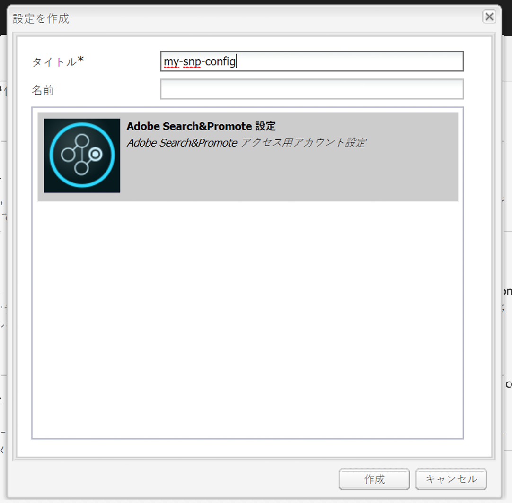

# Adobe Search&amp;Promote との統合{#integrating-with-adobe-search-promote}

Web サイトから Adobe Search&amp;Promote サービスを呼び出すには、次のタスクを実行します。

1. クラウドの URL を指定します。
1. Search&amp;Promote サービスへの接続を設定します。
1. Search&amp;Promoteコンポーネントの追加先 [!UICONTROL サイドキック].
1. コンポーネントを使用して、コンテンツを作成します（[Web ページへの Search&amp;Promote 機能の追加](/help/sites-authoring/search-and-promote.md)を参照）。
1. バナーをページに追加します。バナー画像は、Search&amp;Promote データの影響を受けます。
1. Search&amp;Promote サービスが使用するサイトマップを生成します。

>[!NOTE]
>
>カスタムプロキシ設定で Search&amp;Promote を使用している場合、AEM には 3.x API を使用する機能と 4.x API を使用する機能があるので、両方の HTTP クライアントプロキシを設定する必要があります。
>
>* 3.x は [http://localhost:4502/system/console/configMgr/com.day.commons.httpclient](http://localhost:4502/system/console/configMgr/com.day.commons.httpclient) のように設定します。
>* 4.x は [http://localhost:4502/system/console/configMgr/org.apache.http.proxyconfigurator](http://localhost:4502/system/console/configMgr/org.apache.http.proxyconfigurator) のように設定します。

>

## Search&amp;Promote サービス URL の変更 {#changing-the-search-promote-service-url}

Search&amp;Promoteサービス用に設定されるデフォルトの URL は、 `https://searchandpromote.omniture.com/px/`. 別のサービスを使用するには、OSGi コンソールを使用して別の URL を指定します。

**Search&amp;Promoteサービス URL を変更するには**:

1. を開きます。 [!UICONTROL OSGi] コンソールを開き、 **[!UICONTROL 設定]** タブをクリックします。 （[http://localhost:4502/system/console/configMgr](http://localhost:4502/system/console/configMgr)）。

1. 次をクリック： **[!UICONTROL Day CQSearch&amp;Promote設定]** 項目。
1. 内 **[!UICONTROL リモートサーバー URI]** テキストフィールドに URL を入力し、 **[!UICONTROL 保存]**.

## Search&amp;Promote への接続の設定 {#configuring-the-connection-to-search-promote}

Search&amp;Promote への 1 つ以上の接続を設定して、Web ページがサービスとやり取りできるようにします。接続するには、Search&amp;Promote アカウントのメンバー ID とアカウント番号が必要です。

**データへの接続を設定するには、以下を実行します。Search&amp;Promote**:

1. 次の **[!UICONTROL ツール]** アイコン/ **[!UICONTROL 導入]**&#x200B;を選択します。 **[!UICONTROL Cloud Services]**.

   これにより、クラウドサービスダッシュボードが表示されます。ローカルマシンの場合、ダッシュボードの URI は、次のようになります。

   [http://localhost:4502/libs/cq/core/content/tools/cloudservices.html](http://localhost:4502/libs/cq/core/content/tools/cloudservices.html)

1. 内 [!UICONTROL Cloud Services] ページで、 **[!UICONTROL AdobeSearch&amp;Promote]** リンクまたは **[!UICONTROL Search&amp;Promote]** アイコン

1. これが初めてのAdobeSearch&amp;Promoteの場合は、 **[!UICONTROL 今すぐ設定]** 開く [!UICONTROL 設定を作成] パネル。

   データの詳細を知りたい場合は、Search&amp;Promoteをクリック **[!UICONTROL 詳細情報]** 代わりに、

   

1. を入力します。 **[!UICONTROL タイトル]** ページ作成者が認識できる独自の **[!UICONTROL 名前]**&#x200B;次に、 **[!UICONTROL 作成]**.

   また、新しく作成した設定が、**[!UICONTROL クラウドサービスダッシュボード]**&#x200B;の Adobe Search&amp;Promote リスト項目の「**[!UICONTROL 利用可能な設定]**」の下に表示されます。

   

1. 内 [!UICONTROL コンポーネントを編集] ダイアログボックスで、次の項目をフィールドに追加します。

   * **[!UICONTROL メンバー ID]**
   * **[!UICONTROL アカウント番号]**

   >[!NOTE]
   >
   >この情報を自分で取得するには、次にログインします。
   >
   >[https://searchandpromote.omniture.com/center/](https://searchandpromote.omniture.com/center/)
   >
   >有効な Seach&amp;Promote 資格情報（電子メール／パスワード）を使用します。
   >
   >ブラウザーのアドレスバーに URL が表示されます。 次のようになります。
   >
   >
   >
   >[https://searchandpromote.omniture.com/px/home/?sp_id=XXXXXXXX-spYYYYYYYY](https://searchandpromote.omniture.com/px/home/?sp_id=XXXXXXXX-spYYYYYYYY)
   >
   >ここで、 **XXXXXXX** は、 **[!UICONTROL メンバー ID]** および **[!UICONTROL spYYYYYYY]** は、お使いのアカウント番号に対応しています。

1. タップ **[!UICONTROL Search&amp;Promoteに接続]**.

   接続成功メッセージが表示されたら、をタップします。 **[!UICONTROL OK]**.

   （接続後、ボタンのテキストが「**[!UICONTROL Search&amp;Promote に再接続]**」に変更されます。）

1. 「**[!UICONTROL OK]**」をタップします。今作成した設定の Search&amp;Promote 設定ページが表示されます。

## データセンターの設定 {#configuring-the-data-center}

Search&amp;Promoteアカウントがアジアまたはヨーロッパにある場合、デフォルトのデータセンターを変更して、適切なデータセンターを指すようにする必要があります（デフォルトのデータセンターは北米のアカウント用です）。

**データセンターを設定するには**:

1. Web コンソール ( ) に移動します。 `http://localhost:4502/system/console/configMgr/com.day.cq.searchpromote.impl.SearchPromoteServiceImpl`

   

1. サーバーの場所に応じて、URI を次のいずれかに変更します。

   * 北米： [https://center.atomz.com/px/](https://center.atomz.com/px/)
   * EMEA: [https://center.lon5.atomz.com/px/](https://center.lon5.atomz.com/px/)
   * APAC: [https://center.sin2.atomz.com/px/](https://center.sin2.atomz.com/px/)

1. 「**[!UICONTROL 保存]**」をタップします。

## Search&amp;Promote コンポーネントのサイドキックへの追加 {#adding-search-promote-components-to-sidekick}

In [!UICONTROL デザイン] モード、編集 **[!UICONTROL 額]** コンポーネント：でSearch&amp;Promoteコンポーネントを許可 [!UICONTROL サイドキック]. （詳しくは、[コンポーネント](/help/sites-developing/components.md)のドキュメントを参照）。

コンポーネントの使用について詳しくは、 [Web ページへのSearch&amp;Promote機能の追加](/help/sites-authoring/search-and-promote.md).

## ページで使用する Search&amp;Promote サービスの指定 {#specifying-the-search-promote-service-that-your-pages-use}

特定の Search&amp;Promote サービスを使用できるように、Web ページを設定します。Search&amp;Promote コンポーネントは、自動的にホストページのサービスを使用します。

ページの Search&amp;Promote プロパティを設定すると、すべての子ページが設定を継承します。必要に応じて、継承された設定を上書きするように子ページを設定できます。

>[!NOTE]
>
>サービス接続は、既に設定されている必要があります詳しくは、 [Search&amp;Promoteへの接続の設定](#configuring-the-connection-to-search-promote).

1. **[!UICONTROL ページプロパティ]**&#x200B;ダイアログボックスを開きます。例えば、**[!UICONTROL Web サイト]**&#x200B;ページで、ページを右クリックし、「**[!UICONTROL プロパティ]**」をクリックします。

1. 「**[!UICONTROL クラウドサービス]**」タブをクリックします。

1. 親ページからのクラウドサービス設定の継承を無効にするには、継承パスの横にある南京錠アイコンをクリックします。

   

1. クリック **[!UICONTROL サービスを追加]**&#x200B;を選択します。 **[!UICONTROL AdobeSearch&amp;Promote]**&#x200B;を選択し、「 **[!UICONTROL OK]**.

1. 使用するSearch&amp;Promoteアカウントの接続設定を選択し、 **[!UICONTROL OK]**.

## 製品フィード {#product-feed}

Search&amp;Promote統合により、次の操作を実行できます。

* 以下を使用： [!UICONTROL e コマース] 基になるリポジトリ構造とコマースプラットフォームとは独立した API。
* 以下を利用する： [!UICONTROL インデックスコネクタ] XML 形式の製品フィードを提供するSearch&amp;Promoteの機能。
* 以下を利用する： [!UICONTROL リモート制御] 製品フィードのオンデマンドリクエストまたはスケジュール済みリクエストを実行するSearch&amp;Promoteの機能。
* 様々なSearch&amp;Promoteアカウントのフィード生成（クラウドサービス設定として設定）。

詳しくは、 [製品フィード](/help/sites-administering/product-feed.md).
