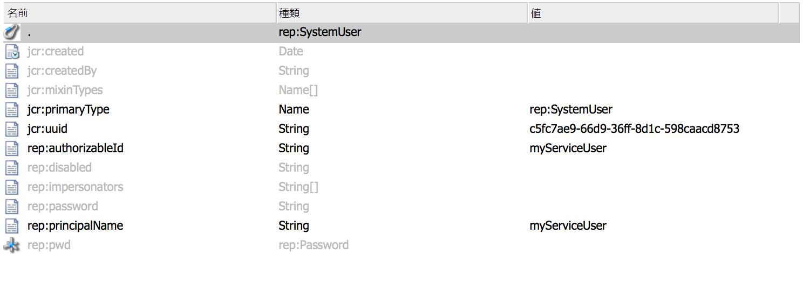

# AEM のサービスユーザー {#service-users-in-aem}

## 概要 {#overview}

これまで、AEM で管理セッションやリソースリゾルバーを取得する主な方法は、Sling に用意されている `SlingRepository.loginAdministrative()` および `ResourceResolverFactory.getAdministrativeResourceResolver()` メソッドを使用することでした。

ただし、これらのメソッドはいずれも[最小権限の原則](https://ja.wikipedia.org/wiki/%E6%9C%80%E5%B0%8F%E6%A8%A9%E9%99%90%E3%81%AE%E5%8E%9F%E5%89%87)に基づいて設計されておらず、開発者がコンテンツの構造や対応するアクセス制御レベル（ACL）を早期に適切に計画しないことがよくあります。そのため、このようなサービスに脆弱性があると、コード自体を動作させるのに管理者権限が不要であっても、`admin` ユーザーへの権限のエスカレーションが発生することがよくあります。

## 管理セッションを段階的に廃止する方法 {#how-to-phase-out-admin-sessions}

### 優先度 0:機能はアクティブ、必要、または破棄されていますか？ {#priority-is-the-feature-active-needed-derelict}

管理セッションが使用されていなかったり、機能が完全に無効化されている場合があります。現在の実装環境がこれに当てはまる場合は、機能を削除するか、[NOP コード](https://ja.wikipedia.org/wiki/NOP)を埋め込んでください。

### 優先度 1:リクエストセッションの使用 {#priority-use-the-request-session}

可能な限り機能をリファクタリングし、指定された認証済みのリクエストセッションを使用して、コンテンツの読み取りや書き込みをおこなうことができるようにします。 これができない場合は、多くの場合、次の優先度に従って適用することで達成できます。

### 優先度 2:コンテンツの再構築 {#priority-restructure-content}

問題の多くは、コンテンツの再構築によって解決できます。 再構築を行う際は、次のシンプルなルールに留意してください。

* **アクセス制御の変更**

   * 実際にアクセスを必要とするユーザーまたはグループが実際にアクセス権を持っていることを確認します。

* **コンテンツ構造を調整**

   * アクセス制御が使用可能なリクエストセッションと一致する場所など、他の場所に移動します。
   * コンテンツの精度を変更する。

* **コードのリファクタリングを行って適切なサービスになるようにする**

   * ビジネスロジックを JSP コードからサービスに移動します。 これにより、異なるコンテンツモデリングが可能になります。

また、開発する新機能が、次の原則に従っていることを確認します。

* **コンテンツ構造はセキュリティ要件に基づいて進める必要があります**

   * アクセス制御の管理は自然に行われる
   * アクセス制御は、アプリケーションではなく、リポジトリによって適用される必要があります

* **ノードタイプを使用する**

   * 設定可能なプロパティのセットを制限

* **プライバシー設定に配慮する**

   * 非公開プロファイルを例に挙げると、非公開の `/profile` ノードにあるプロファイル画像、メールまたは氏名を公開しないようにします。

## 厳格なアクセス制御 {#strict-access-control}

コンテンツの再構築時にアクセス制御を適用したり、新しいサービスユーザーに対してアクセス制御を適用する場合には、可能な限り厳格な ACL を適用する必要があります。考えられるすべてのアクセス制御機能を使用してください。

* 例えば、`jcr:read` を `/apps` に適用するのではなく、`/apps/*/components/*/analytics` にのみ適用します。

* [制限](https://jackrabbit.apache.org/oak/docs/security/authorization/restriction.html)を使用します。

* ノードタイプに ACL を適用
* 権限の制限

   * 例えば、プロパティの書き込みのみが必要な場合は、`jcr:write` 権限を付与するのではなく、代わりに `jcr:modifyProperties` を使用してください。

## サービスユーザーとマッピング {#service-users-and-mappings}

前述の方法がうまくいかない場合は、Sling 7 に用意されているサービスユーザーマッピングサービスを使用して、バンドルとユーザーのマッピングを設定したり、2 つの対応する API メソッド（` [SlingRepository.loginService()](https://sling.apache.org/apidocs/sling7/org/apache/sling/jcr/api/SlingRepository.html#loginService-java.lang.String-java.lang.String-)` および ` [ResourceResolverFactory.getServiceResourceResolver()](https://sling.apache.org/apidocs/sling7/org/apache/sling/api/resource/ResourceResolverFactory.html#getServiceResourceResolver-java.util.Map-)`）を設定したりすることができます。これらのメソッドは、設定されたユーザーの権限に限定してセッション／リソースリゾルバーを返します。これらのメソッドの特徴は次のとおりです。

* サービスをユーザーにマッピングできます。
* サブサービスユーザーを定義できます。
* 中央設定ポイントは `org.apache.sling.serviceusermapping.impl.ServiceUserMapperImpl` です。
* `service-id` = `service-name` [ “:” subservice-name ]

* `service-id` は、認証用にリソースリゾルバーまたは JCR リポジトリユーザー ID（あるいはその両方）にマッピングされます。
* `service-name` は、サービスを提供するバンドルの記号名です。

## その他のRecommendations {#other-recommendations}

### admin-session のサービスユーザーへの置き換え {#replacing-the-admin-session-with-a-service-user}

サービスユーザーは、パスワードが設定されていない JCR ユーザーで、特定のタスクの実行に必要な最小限の権限が設定されています。 パスワードが設定されていない場合、サービスユーザーとのログインはできなくなります。

管理セッションを廃止する方法の 1 つは、管理セッションをサービスユーザーセッションに置き換えることです。 必要に応じて、複数のサブサービスユーザーに置き換えることもできます。

admin セッションをサービスユーザーに置き換えるには、次の手順を実行する必要があります。

1. 最小権限の原則を念頭に置いて、サービスに必要な権限を特定します。
1. 必要な権限設定で既にユーザーが使用できるかどうかを確認します。 必要に応じた既存のユーザーがない場合は、新しいシステムサービスユーザーを作成します。 新しいサービスユーザを作成するには、RTC が必要です。 複数のサブサービスユーザー（例えば、書き込み用と読み取り用に 1 つ）を作成して、アクセスをさらに区分化すると効果的な場合があります。
1. ユーザーの ACE を設定およびテストします。
1. サービスおよび `user/sub-users` に `service-user` マッピングを追加します。

1. サービスユーザーの sling 機能をバンドルから使用できるようにします。つまり、`org.apache.sling.api` を最新バージョンに更新します。

1. コード内の `admin-session` を `loginService` API または `getServiceResourceResolver` API に置き換えます。

## 新しいサービスユーザーの作成 {#creating-a-new-service-user}

AEMサービスユーザーのリストに含まれるユーザーがユースケースに適用されないこと、および対応する RTC の問題が承認されたことを確認したら、先に進み、新しいユーザーをデフォルトコンテンツに追加できます。

推奨されるアプローチは、リポジトリエクスプローラー（*https://&lt;server>:&lt;port>/crx/explorer/index.jsp*）を使用するサービスユーザーを作成することです。

目的は、有効な `jcr:uuid` プロパティを取得することです。このプロパティは、コンテンツパッケージのインストール環境を使用してユーザーを作成する場合に必須です。

サービスユーザーは次の方法で作成できます。

1. *https://&lt;server>:&lt;port>/crx/explorer/index.jsp* のリポジトリエクスプローラーにアクセスします。
1. 管理者としてログインするには、 **ログイン** リンクをクリックします。
1. 次に、システムユーザーを作成し、名前を付けます。 ユーザーをシステムユーザーとして作成するには、中間パスとして `system` を設定し、ニーズに合わせてオプションのサブフォルダーを追加します。

   

1. システムユーザーノードが次のようになっていることを確認します。

   

   >[!NOTE]
   >
   >サービスユーザーに mixin タイプが関連付けられていないことに注意してください。これは、システムユーザーに対するアクセス制御ポリシーが存在しないことを意味します。

対応する .content.xml をバンドルのコンテンツに追加する際には、`rep:authorizableId` を設定し、プライマリタイプを `rep:SystemUser` にしてください。次のようになります。

```xml
<?xml version="1.0" encoding="UTF-8"?>
<jcr:root xmlns:jcr="https://www.jcp.org/jcr/1.0" xmlns:rep="internal"
    jcr:primaryType="rep:SystemUser"
    jcr:uuid="4917dd68-a0c1-3021-b5b7-435d0044b0dd"
    rep:principalName="authentication-service"
    rep:authorizableId="authentication-service"/>
```

## ServiceUserMapper 構成に構成の修正を追加しています {#adding-a-configuration-amendment-to-the-serviceusermapper-configuration}

サービスから対応するシステムユーザーへのマッピングを追加するには、` [ServiceUserMapper](https://sling.apache.org/apidocs/sling7/org/apache/sling/serviceusermapping/ServiceUserMapper.html)` サービスのファクトリ設定を作成する必要があります。このモジュラーを維持するために、 [Sling 修正メカニズム](https://issues.apache.org/jira/browse/SLING-3578). このような設定をバンドルにインストールする場合は、 [Sling の初期コンテンツの読み込み](https://sling.apache.org/documentation/bundles/content-loading-jcr-contentloader.html):

1. バンドルの src/main/resources フォルダーの下にサブフォルダー SLING-INF/content を作成します。
1. このフォルダーに、ファクトリ設定の内容（すべてのサブサービスユーザーマッピングを含む）を定義した org.apache.sling.serviceusermapping.impl.ServiceUserMapperImpl.amended-&lt;ファクトリ設定の一意の名前>.xml という名前のファイルを作成します。例：

1. バンドルの `src/main/resources` フォルダーの下に `SLING-INF/content` フォルダーを作成します。
1. このフォルダーに、ファクトリ設定の内容（すべてのサブサービスユーザーマッピングを含む）を定義した `named org.apache.sling.serviceusermapping.impl.ServiceUserMapperImpl.amended-<a unique name for your factory configuration>.xml` というファイルを作成します。

   例として、ファイル名は `org.apache.sling.serviceusermapping.impl.ServiceUserMapperImpl.amended-com.adobe.granite.auth.saml.xml` としています。

   ```xml
   <?xml version="1.0" encoding="UTF-8"?>
   <node>
       <primaryNodeType>sling:OsgiConfig</primaryNodeType>
       <property>
           <name>user.default</name>
           <value></value>
       </property>
       <property>
           <name>user.mapping</name>
           <values>
               <value>com.adobe.granite.auth.saml=authentication-service</value>
           </values>
       </property>
   </node>
   ```

1. バンドルの `pom.xml` 内の `maven-bundle-plugin` 設定で Sling の初期コンテンツを参照します。例：

   ```xml
   <Sling-Initial-Content>
      SLING-INF/content;path:=/libs/system/config;overwrite:=true;
   </Sling-Initial-Content>
   ```

1. バンドルをインストールし、ファクトリ設定がインストールされていることを確認します。 手順は次のとおりです。

   * Web コンソール（*https://serverhost:serveraddress/system/console/configMgr*）にアクセスします。
   * **Apache Sling Service User Mapper Service Amendment** を探します。
   * リンクをクリックして、設定が適切に行われていることを確認します。

## サービスでの共有セッションの処理 {#dealing-with-shared-sessions-in-services}

`loginAdministrative()` を呼び出すと、多くの場合、共有セッションも表示されます。これらのセッションはサービスのアクティベート時に取得され、サービスが停止された場合にのみログアウトされます。これは一般的な動作ですが、次の 2 つの問題を伴います。

* **セキュリティ：** このような管理セッションは、共有セッションにバインドされているリソースや他のオブジェクトをキャッシュして返すために使用されます。 呼び出しスタックの後半で、これらのオブジェクトは、高い特権を持つセッションやリソースリゾルバーに適応することができ、多くの場合、呼び出し元が操作している管理者セッションであることが明確ではありません。
* **パフォーマンス：** Oak の共有セッションは、パフォーマンスの問題を引き起こす可能性があるので、現在は使用しないことをお勧めします。

このセキュリティリスクに対する最も明白な解決策は、`loginAdministrative()` の呼び出しを `loginService()` に置き換え、権限が制限されたユーザーを対象とすることです。ただし、これは、潜在的なパフォーマンス低下には影響しません。 この問題を軽減するには、セッションと関連付けられていないオブジェクト内で要求されたすべての情報をラップします。 次に、オンデマンドでセッションを作成（または破棄）します。

推奨されるアプローチは、呼び出し元がセッションの作成/破壊を制御できるように、サービスの API をリファクタリングすることです。

## JSP での管理セッション {#administrative-sessions-in-jsps}

JSP では、関連するサービスがないので `loginService()` を使用できません。ただし、JSP の管理セッションは、通常、MVC パラダイムの違反の兆候を示しています。

これは、次の 2 つの方法で修正できます。

1. ユーザーセッションで操作できるようにコンテンツを再構築する。
1. JSP で使用できる API を提供するサービスにロジックを抽出します。

推奨される方法は前者です。

## イベント、レプリケーションプリプロセッサー、ジョブの処理 {#processing-events-replication-preprocessors-and-jobs}

イベントやジョブを処理する場合、場合によっては、イベントをトリガーした対応するセッションは通常失われます。 これにより、多くの場合、管理セッションを使用して作業を行うイベントハンドラーやジョブプロセッサが発生します。 この問題を解決する方法は、それぞれの利点と欠点があり、考えられる方法が異なります。

1. `user-id` をイベントペイロードに渡し、代理実行を使用します。

    **メリット：**&#x200B;容易に使用できます。

   **デメリット：** `loginAdministrative()` を使用する必要があります。認証済みのリクエストを再認証します。

1. データにアクセスできるサービスユーザーを作成または再利用します。

   **メリット：**&#x200B;現在の設計と一貫しています。変更が最小限で済みます。

   **デメリット：**&#x200B;非常に強力なサービスユーザーに柔軟性を持たせる必要があり、権限のエスカレーションが必要になる可能性が高くなります。セキュリティモデルに抜け道ができます。

1. `Subject` のシリアル化をイベントペイロードに渡し、そのサブジェクトに基づいて `ResourceResolver` を作成します。例えば、`ResourceResolverFactory` で JAAS `doAsPrivileged` を使用します。

   **メリット：**&#x200B;セキュリティの観点からクリーンな実装が行えます。再認証を避け、元の権限で動作します。 セキュリティ関連のコードは、イベントの消費者に対して透過的です。

   **デメリット：**&#x200B;リファクタリングが必要です。セキュリティ関連のコードがイベントの消費者に対して透過的であるという事実も、問題を引き起こす可能性があります。

現在、第 3 のアプローチが推奨される処理方法です。

## ワークフロープロセス {#workflow-processes}

ワークフロープロセスの実装内では、通常、ワークフローをトリガーした対応するユーザーセッションは失われます。 これにより、多くの場合、管理セッションを使用して作業を実行するワークフロープロセスが発生します。

これらの問題を修正するには、 [イベント、レプリケーションプリプロセッサー、ジョブの処理](/help/sites-administering/security-service-users.md#processing-events-replication-preprocessors-and-jobs) を使用します。

## SlingPOSTプロセッサーと削除済みページ {#sling-post-processors-and-deleted-pages}

SlingPOST・プロセッサの実装で使用される管理セッションが 2 つあります。 通常、管理セッションは、処理中のPOST内で削除を保留しているノードにアクセスするために使用されます。 その結果、リクエストセッションからは使用できなくなります。 削除待ちのノードにアクセスして、アクセス不可のメタデータを開示することができます。
