# ユーザー管理とセキュリティ{#user-administration-and-security}

>[!CAUTION]
>
>AEM 6.4 の拡張サポートは終了し、このドキュメントは更新されなくなりました。 詳細は、 [技術サポート期間](https://helpx.adobe.com/jp/support/programs/eol-matrix.html). サポートされているバージョンを見つける [ここ](https://experienceleague.adobe.com/docs/?lang=ja).

この章では、ユーザー認証を設定および維持する方法と、AEMでの認証および承認の動作の背後にある理論について説明します。

## AEMのユーザーとグループ {#users-and-groups-in-aem}

この節では、様々なエンティティと関連する概念について詳しく説明し、ユーザー管理の概念を簡単に管理できるように設定する際に役立ちます。

### ユーザー {#users}

ユーザーは、自分のアカウントでAEMにログインします。 各ユーザーアカウントは一意で、基本的なアカウントの詳細と割り当てられた権限が保持されます。

多くの場合、ユーザーはグループのメンバーで、これらの権限や権限の割り当てを簡略化します。

### グループ {#groups}

グループとは、ユーザーや他のグループの集まりです。これらはすべてグループのメンバーと呼ばれます。

グループに対する変更がグループのすべてのメンバーに適用されるので、更新するエンティティの数を減らし、メンテナンスプロセスを簡略化することが主な目的です。 多くの場合、グループは次のように反映します。

* 出願内の役割例えば、コンテンツの閲覧を許可された人や、コンテンツの投稿を許可された人などです。
* 自分の組織コンテンツツリー内の異なるブランチに制限されている場合は、役割を拡張して、寄稿者を異なる部門から区別する必要がある場合があります。

したがって、グループは安定したままになる傾向がありますが、ユーザーは頻繁に訪れたり来たりします。

計画とクリーンな構造を使用すると、グループの使用が構造を反映し、明確な概要と効率的な更新メカニズムを提供できます。

### ビルトインユーザーとグループ {#built-in-users-and-groups}

AEM WCM では、多数のユーザーとグループがインストールされます。 これらは、インストール後に最初に Security Console にアクセスすると表示されます。

次の表に、各項目とを示します。

* 簡単な説明
* 必要な変更に関する推奨事項

（特定の事情によりアカウント自体を削除しない場合、）デフォルトのパスワードはすべて変更してください&#x200B;*。*

<table> 
 <tbody> 
  <tr> 
   <td>ユーザー ID</td> 
   <td>タイプ</td> 
   <td>説明</td> 
   <td>推奨</td> 
  </tr> 
  <tr> 
   <td>
admin
 
デフォルトのパスワード：admin
 </td> 
   <td>User</td> 
   <td>
フルアクセス権を持つシステム管理アカウント。
 
このアカウントは、AEM WCM と CRX との間の接続に使用されます。
 
このアカウントを誤って削除した場合は、（デフォルト設定で）リポジトリの再起動時に再作成されます。
 
管理者アカウントは、AEMプラットフォームに必要なアカウントです。 つまり、このアカウントは削除できません。
 </td> 
   <td>
Adobeでは、このユーザーアカウントのパスワードをデフォルトから変更することを強くお勧めします。
 
後で実行できますが、インストール時に行うことができます。
 
注意：このアカウントは、CQ Servlet Engine の admin アカウントと混同しないでください。
 </td> 
  </tr> 
  <tr> 
   <td>
anonymous
 
 
 </td> 
   <td>User</td> 
   <td>
インスタンスへの未認証アクセスに関するデフォルトの権限を保持します。 デフォルトでは、これには最小限のアクセス権が保持されます。
 
誤ってこのアカウントを削除した場合は、起動時に再作成されます。 完全に削除することはできませんが、無効にすることができます。
 </td> 
   <td>このアカウントは、オーサーインスタンスの機能に悪影響を与えるので、削除または無効にしないでください。 削除を義務付けるセキュリティ要件がある場合は、まず、システムに与える影響を適切にテストしてください。</td> 
  </tr> 
  <tr> 
   <td>
作成者
 
デフォルトのパスワード：作成者
 </td> 
   <td>ユーザー</td> 
   <td>
/content への書き込みが許可された作成者アカウント。 貢献者とサーファーの権限を含みます。
 
/content ツリー全体へのアクセス権があるので、Web マスターとして使用できます。
 
これは組み込みユーザーではなく、別の geometrixx デモユーザーです
 </td> 
   <td>
このアカウントを完全に削除するか、デフォルトのパスワードを変更することをお勧めします。
 
後で実行できますが、インストール時に行うことができます。
 </td> 
  </tr> 
  <tr> 
   <td>管理者</td> 
   <td>グループ</td> 
   <td>
すべてのメンバーに管理者権限を付与するグループ。 このグループの編集は管理者のみが許可されています。
 
フルアクセス権を持っています。
 </td> 
   <td>ノードに対して「deny-everyone」を設定すると、ノードがこのグループで再び有効になった場合に、administrators にのみアクセス権限が割り当てられます。</td> 
  </tr> 
  <tr> 
   <td>content-authors</td> 
   <td>グループ</td> 
   <td>
コンテンツ編集を担当するグループ。読み取り、変更、作成および削除の権限が必要です。
 </td> 
   <td>読み取り、変更、作成および削除の権限を追加すると、プロジェクト専用のアクセス権限を持つ独自の content-authors グループを作成できます。</td> 
  </tr> 
  <tr> 
   <td>投稿者</td> 
   <td>グループ</td> 
   <td>
ユーザーがコンテンツを書き込むのを許可する基本権限（機能のみと同様）。
 
/content ツリーに対する権限が割り当てられることはありません。このような権限は個々のグループまたはユーザーに対して割り当てる必要があります。
 </td> 
   <td> </td> 
  </tr> 
  <tr> 
   <td>dam-users</td> 
   <td>グループ</td> 
   <td>一般的なAEM Assetsユーザー向けの標準の参照グループです。 このグループのメンバーは、アセットやコレクションのアップロード/共有を有効にする適切な権限を持っています。</td> 
   <td> </td> 
  </tr> 
  <tr> 
   <td>全員</td> 
   <td>グループ</td> 
   <td>
AEMのすべてのユーザーは、すべてのツールでグループまたはメンバーシップの関係が表示されていない場合でも、すべてのユーザーのグループメンバーです。
 
このグループは、全員（将来作成されるユーザーも含む）に権限を適用するために使用できるので、デフォルトの権限と見なすことができます。
 </td> 
   <td>
このグループを変更または削除しないでください。
 
このアカウントを変更すると、セキュリティに影響が出ます。
 </td> 
  </tr> 
  <tr> 
   <td>tag-administrators</td> 
   <td>グループ</td> 
   <td>タグの編集が許可されているグループ。</td> 
   <td> </td> 
  </tr> 
  <tr> 
   <td>user-administrators</td> 
   <td>グループ</td> 
   <td>ユーザー管理をおこなうことができます。つまり、ユーザーとグループを作成する権限が与えられます。</td> 
   <td> </td> 
  </tr> 
  <tr> 
   <td>ワークフロー編集者</td> 
   <td>グループ</td> 
   <td>ワークフローモデルの作成と変更が許可されているグループ。</td> 
   <td> </td> 
  </tr> 
  <tr> 
   <td>ワークフローユーザー</td> 
   <td>グループ</td> 
   <td>
ワークフローに参加するユーザーは、workflow-users グループのメンバーである必要があります。 これにより、ユーザーは次の項目に完全にアクセスできます。/etc/workflow/instances を設定して、ワークフローインスタンスを更新できるようにします。
 
このグループは標準インストールに含まれていますが、ユーザーを手動でグループに追加する必要があります。
 </td> 
  </tr> 
 </tbody> 
</table>

## AEM の権限 {#permissions-in-aem}

AEM では、ACL を使用して、ユーザーまたはグループが実行できるアクションとそのアクションを実行できる場所を決定します。

### 権限と ACL {#permissions-and-acls}

権限では、リソースに対してどのユーザーがどのようなアクションを実行できるかを定義します。権限は、[アクセス制御](#access-control-lists-and-how-they-are-evaluated)の評価の結果です。

AEM の個々の[アクション](security.md#actions)のチェックボックスをオン／オフにすることで、特定のユーザーに対して付与／拒否された権限を変更できます。チェックマークありは、アクションが許可されていることを示します。チェックマークなしは、アクションが拒否されていることを示します。

グリッド内のチェックマークは、AEM内のどの場所（つまり、どのパス）でユーザーが持っている権限を示します。

### アクション {#actions}

アクションは、ページ（リソース）で実行できます。 階層内の各ページで、ユーザーがそのページに対して実行できるアクションを指定できます。 [権限](#permissions-and-acls)を使用してアクションを許可または拒否できます。

<table> 
 <tbody> 
  <tr> 
   <td><strong>アクション </strong></td> 
   <td><strong>説明 </strong></td> 
  </tr> 
  <tr> 
   <td>読み取り</td> 
   <td>ユーザーは、ページおよびその子ページを読み取ることが許可されます。</td> 
  </tr> 
  <tr> 
   <td>変更</td> 
   <td>
ユーザーは次の操作を実行できます。
 
    <ul> 
     <li>ページ上および任意の子ページ上の既存のコンテンツを変更します。</li> 
     <li>ページ上または任意の子ページ上に新しい段落を作成します。</li> 
    </ul> 
JCR レベルでは、ユーザーは、プロパティの変更、ロック、バージョン管理、nt-modifications を行うことでリソースを変更できます。また、jcr:content 子ノード（例：cq:Page、nt:file、cq:Asset）を定義するノードに対する完全な書き込み権限を持っています。
 </td> 
  </tr> 
  <tr> 
   <td>作成</td> 
   <td>
ユーザーは次の操作を実行できます。
 
    <ul> 
     <li>新しいページまたは子ページを作成します。</li> 
    </ul> 
If <strong>変更</strong> jcr:content およびその子ノードの作成はページの変更と見なされるので、jcr:content の下のサブツリーは特に除外されます。 これは、jcr:content 子ノードを定義するノードにのみ適用されます。
 </td> 
  </tr> 
  <tr> 
   <td>削除</td> 
   <td>
ユーザーは次の操作を実行できます。
 
    <ul> 
     <li>既存の段落をページまたは子ページから削除します。</li> 
     <li>ページまたは子ページを削除する。</li> 
    </ul> 
<strong>変更</strong>が拒否されると、jcr:content およびその子ノードの削除がページの変更と見なされるので、jcr:content の下のサブツリーが明確に除外されます。これは、jcr:content 子ノードを定義するノードにのみ適用されます。
 </td> 
  </tr> 
  <tr> 
   <td>ACL 読み取り</td> 
   <td>ユーザーは、ページまたは子ページのアクセス制御リストを読み取ることができます。</td> 
  </tr> 
  <tr> 
   <td>ACL 編集</td> 
   <td>ユーザーは、ページまたは子ページのアクセス制御リストを変更できます。</td> 
  </tr> 
  <tr> 
   <td>レプリケーション</td> 
   <td>ユーザーは、別の環境（パブリッシュ環境など）にコンテンツをレプリケートできます。 この権限は子ページにも適用されます。</td> 
  </tr> 
 </tbody> 
</table>

>[!NOTE]
>
>AEM は[コレクション](/help/assets/managing-collections-touch-ui.md)で role-assignment のユーザーグループ（所有者、編集者、閲覧者）を自動的に生成します。ただし、このようなグループに ACL を手動で追加すると、AEM内にセキュリティの脆弱性が生じる可能性があります。 Adobeでは、ACL を手動で追加しないことをお勧めします。

### アクセス制御リストとその評価方法 {#access-control-lists-and-how-they-are-evaluated}

AEM WCM は、アクセス制御リスト (ACL) を使用して、様々なページに適用される権限を整理します。

アクセス制御リストは、個々の権限で構成され、これらの権限が実際に適用される順序を決定するために使用されます。 リストは、考慮するページの階層に従って形成されます。 次に、ページに適用する最初の適切な権限が見つかるまで、このリストが下から順にスキャンされます。

>[!NOTE]
>
>サンプルに含まれる ACL があります。 アプリケーションに適した内容を確認し、決定することをお勧めします。 付属の ACL を確認するには、CRXDE にアクセスし、以下のノードの「**アクセス制御**」タブを選択します。
>
>`/etc/cloudservices/facebookconnect/geometrixx-outdoorsfacebookapp`：全員に読み取りアクセスを許可します。
>`/etc/cloudservices/twitterconnect/geometrixx-outdoors-twitter-app`：全員に読み取りアクセスを許可します。
>`/home/users/geometrixx-outdoors`：全員に`*/profile*`の読み取りアクセスを許可します。\
>`*/social/relationships/following/*`。
>
>カスタムアプリケーションは、次のような他の関係`*/social/relationships/friend/*`や`*/social/relationships/pending-following/*`用のアクセスを設定できます。 
>
>コミュニティ特有の ACL を作成する場合は、そのコミュニティに参加するメンバーに追加の権限を付与できます。例えば、ユーザーが `/content/geometrixx-outdoors/en/community/hiking` または `/content/geometrixx-outdoors/en/community/winter-sports` のコミュニティに参加する場合などです。

### 権限の状態 {#permission-states}

>[!NOTE]
>
>CQ 5.3 ユーザーの場合：
>
>以前の CQ バージョンとは異なり、 **作成** および **削除** ユーザーがページの変更のみをおこなう必要がある場合は、を許可しなくなりました。 代わりに、 **変更** アクションは、既存のページ上のコンポーネントをユーザーが作成、変更または削除できるようにする場合にのみ実行します。
>
>後方互換性のため、アクションのテストでは、を定義するノードの特別な処理は行われません **jcr:content** を考慮に入れます。

| **アクション** | **説明** |
|---|---|
| 許可（チェックマーク） | AEM WCM を使用すると、ユーザーはこのページまたは任意の子ページでアクションを実行できます。 |
| 拒否（チェックマークなし） | AEM WCM では、ユーザーはこのページまたは子ページでアクションを実行できません。 |

権限は子ページにも適用されます。

親ノードから権限が継承されず、その権限の対象となるローカルエントリが 1 つ以上ある場合は、次の記号がチェックボックスに表示されます。ローカルエントリは CRX 2.2 インターフェイスで作成されたものです（現時点では、ワイルドカード ACL は CRX でのみ作成できます）。

特定のパスにおけるアクションには次の記号が表示されます。

<table> 
 <tbody> 
  <tr> 
   <td>*（アスタリスク）</td> 
   <td>少なくとも 1 つのローカルエントリが存在します（有効または無効）。 このようなワイルドカード ACL は CRX で定義されます。</td> 
  </tr> 
  <tr> 
   <td>! （感嘆符）</td> 
   <td>現在、効果のないエントリが少なくとも 1 つあります。</td> 
  </tr> 
 </tbody> 
</table>

アスタリスクまたは感嘆符の上にマウスポインターを置くと、宣言されたエントリの詳細がツールチップに表示されます。 ツールチップは 2 つの部分に分割されます。

<table> 
 <tbody> 
  <tr> 
   <td>上部</td> 
   <td>
有効なエントリをリストします。
 </td> 
  </tr> 
  <tr> 
   <td>下部</td> 
   <td>ツリー内の他の場所に影響を及ぼす可能性のある非有効なエントリのリストを表示します（エントリの範囲を制限する対応する ACE を含む特別な属性で示されます）。 または、特定のパスまたは上位ノードで定義された別のエントリによって効果が取り消されたエントリです。</td> 
  </tr> 
 </tbody> 
</table>

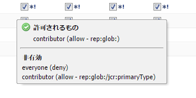

>[!NOTE]
>
>ページに対して権限が定義されていない場合、すべてのアクションが拒否されます。

アクセス制御リストの管理に関する推奨事項を次に示します。

* ユーザーに直接権限を割り当てないでください。 グループにのみ割り当てます。

   グループ数はユーザー数よりもはるかに少なく、また不安定なので、メンテナンスが簡単になります。

* グループまたはユーザーがページの変更のみを行えるようにする場合は、作成または拒否の権限を付与しないでください。 変更および読み取り権限のみを付与します。
* 「拒否」を慎重に使用します。 可能な限り、「許可」のみを使用します。

   deny を使用すると、許可が想定された順序とは異なる順序で適用される場合、予期しない影響が生じる可能性があります。 ユーザーが複数のグループのメンバーである場合、1 つのグループの拒否ステートメントは、別のグループの許可ステートメントをキャンセルすることも、別のグループの許可ステートメントをキャンセルすることもできます。 この場合、概要を維持するのは困難で、予期しない結果が生じやすくなりますが、「割り当てを許可」ではこのような競合は発生しません。

   Adobeでは、「拒否」ではなく「許可」を使用することをお勧めします。 [ベストプラクティス](#best-practices).

どちらの権限も変更する前に、権限の仕組みと相互の関係を理解しておく必要があります。 AEM WCM の仕組みについては、CRX のドキュメントを参照してください [アクセス権を評価](/help/sites-administering/user-group-ac-admin.md#how-access-rights-are-evaluated) およびアクセス制御リストの設定例

### 権限 {#permissions}

権限を持つユーザーとグループは、AEMページのAEM機能にアクセスできます。

パス別の権限を参照するには、ノードを展開したり折りたたんだりします。権限の継承はルートノードまで追跡できます。

権限を許可または拒否するには、対応するチェックボックスをオンまたはオフにします。

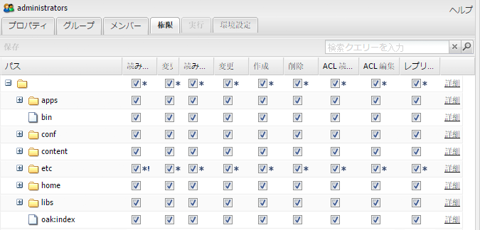

### 詳細な権限情報の表示 {#viewing-detailed-permission-information}

AEMは、グリッド表示に加えて、特定のパスで選択したユーザーまたはグループの権限の詳細な表示を提供します。 詳細ビューには、追加情報が表示されます。

情報の表示だけでなく、ユーザー／グループをグループに追加したり、グループから除外したりすることもできます。[権限を追加する際のユーザーまたはグループの追加](#adding-users-or-groups-while-adding-permissions)を参照してください。ここで行った変更は、詳細表示の上部にすぐに反映されます。

詳細表示にアクセスするには、「**権限**」タブで、選択したグループ／ユーザーおよびパスの「**詳細**」をクリックします。

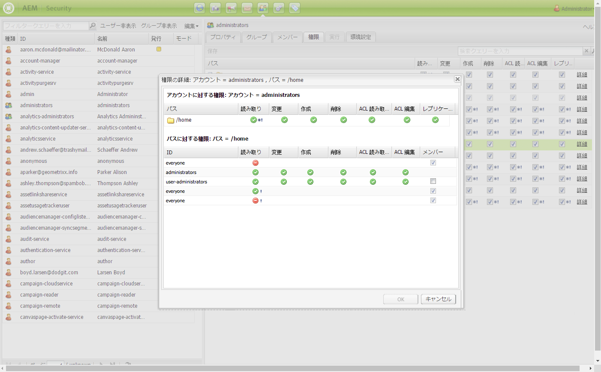

詳細は 2 つの部分に分かれています。

<table> 
 <tbody> 
  <tr> 
   <td>上部</td> 
   <td>
ツリーグリッドに表示される情報を繰り返します。 アクションごとに、アクションが許可されるか拒否されるかを示すアイコンが表示されます。
 
    <ul> 
     <li>アイコンなし=宣言されたエントリなし</li> 
     <li>（チェックマーク） = 宣言されたアクション（許可）</li> 
     <li>（マイナス記号） = 宣言されたアクション（拒否）</li> 
    </ul> </td> 
  </tr> 
  <tr> 
   <td>下部</td> 
   <td>
次の操作を行うユーザーとグループのグリッドが表示されます。
 
    <ul> 
     <li>特定のパスのエントリを宣言する</li> 
     <li>指定された許可可能な OR がグループである</li> 
    </ul> </td> 
  </tr> 
 </tbody> 
</table>

### 別のユーザーとして実行中 {#impersonating-another-user}

[別のユーザーとして実行する機能](/help/sites-authoring/user-properties.md#user-settings)では、ユーザーは別のユーザーに成り代わって作業を行うことができます。

つまり、ユーザーアカウントは、自分のアカウントで操作できる他のアカウントを指定できます。 つまり、user-B が user-A として実行することを許可されている場合、user-B は user-A の完全なアカウント詳細を使用してアクションを実行できます。

これにより、別のユーザーアカウントが、別のユーザーとして実行しているアカウントを使用している場合と同様に、タスクを完了できます。例えば、不在時や過剰な負荷を短期間共有する場合などです。

>[!NOTE]
>
>管理者以外のユーザーが別のユーザーとして実行するには、そのユーザー（上述の場合はユーザー B）に `/home/users` パスの READ 権限が必要です。
>
>これを実現する方法の詳細については、[AEM の権限](/help/sites-administering/security.md#permissions-in-aem)を参照してください。

>[!CAUTION]
>
>あるアカウントが別のアカウントを装う場合、表示は非常に困難です。 偽装の開始と終了の際に、監査ログにエントリが作成されますが、他のログファイル（アクセスログなど）には、偽装がイベントで発生したことに関する情報は含まれません。 したがって、ユーザー B がユーザー A として実行している場合、すべてのイベントは、ユーザー A が個人的に実行したかのように見えます。

>[!CAUTION]
>
>ページのロックは、別のユーザーとして実行している場合にも実行できます。ただし、この方法でロックされたページは、別のユーザーとして実行されたか、管理者権限を持つユーザーとしてのみロック解除できます。
>
>実際にページのロック作業を行ったユーザーに成り代わっても、ページをロック解除できません。

### ベストプラクティス {#best-practices}

次に、権限と権限を使用する際のベストプラクティスを示します。

| ルール | 理由 |
|--- |--- |
| *グループを使用する* | アクセス権をユーザーごとに割り当てないようにします。 これには、いくつかの理由があります。<ul><li>グループよりも多くのユーザーがいるので、グループを使用すると構造が簡単になります。</li><li>グループは、すべてのアカウントの概要を示すのに役立ちます。</li> <li>グループを使用すると、継承が簡単になります。</li><li>ユーザーが来たり来たりします。 グループは長期的なものです。</li></ul> |
| *ポジティブに* | 常に「許可」ステートメントを使用してグループの権限を指定します（可能な限り）。「拒否」ステートメントの使用は避けてください。グループは順番に評価されます。この順番はユーザーごとに異なる方法で定義される可能性があります。つまり、文の実装と評価の順序は、ほとんど制御できない場合があります。 「許可」ステートメントのみを使用する場合、順序は関係ありません。 |
| *シンプルにする* | 新しいインストールの設定時にある程度時間をかけて検討すると、より良い設定となります。明確な構造を適用すると、継続的なメンテナンスと管理が簡単になり、現在の同僚や将来の後継者が実装されている内容を容易に理解できるようになります。 |
| *テスト* | 練習のためのテストインストールを利用して、様々なユーザーとグループ間の関係を把握してください。 |
| *デフォルトのユーザー／グループ* | セキュリティ上の問題を防ぐため、インストール直後に必ずデフォルトのユーザーとグループを更新してください。 |

## ユーザーとグループの管理 {#managing-users-and-groups}

ユーザーには、システムを使用する人と、システムにリクエストを行う外国のシステムを使用する人が含まれます。

グループとは、一連のユーザーのことです。

どちらも、Security Console 内の User Administration 機能を使用して設定できます。

### セキュリティコンソールを使用したユーザー管理へのアクセス {#accessing-user-administration-with-the-security-console}

すべてのユーザー、グループ、および関連する権限には、セキュリティコンソールを使用してアクセスできます。 このセクションで説明するすべての手順は、このウィンドウで実行されます。

AEM WCM セキュリティにアクセスするには、次のいずれかの操作を行います。

* ようこそ画面または AEM の様々な場所で、セキュリティアイコンをクリックします。

* `https://<server>:<port>/useradmin` に直接アクセスします。管理者として AEM にログインしてください。

次のウィンドウが表示されます。

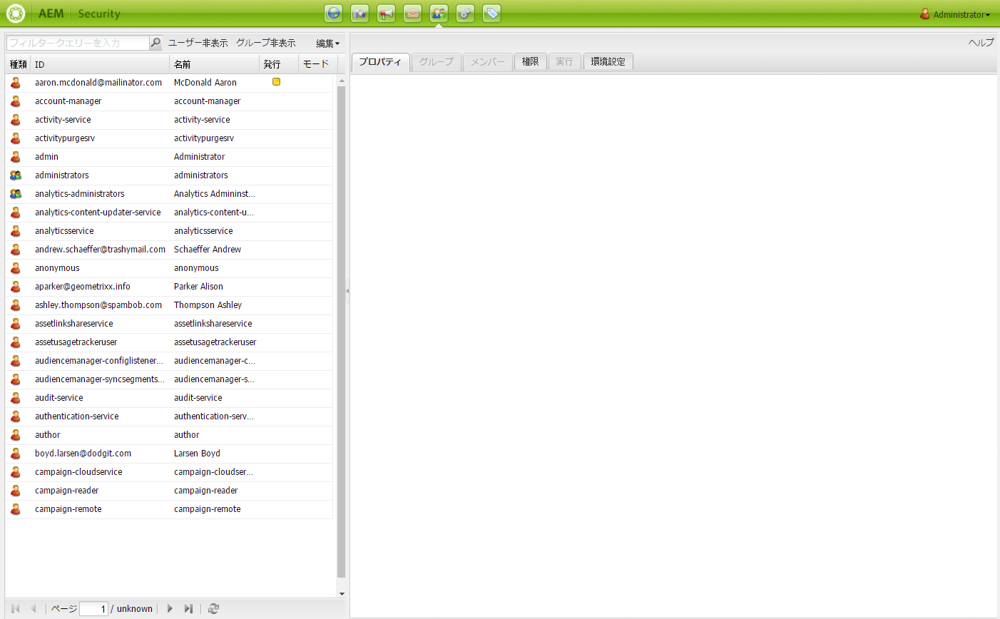

左側のツリーには、現在システムに存在するすべてのユーザーとグループが一覧表示されます。 列ヘッダーを新しい位置にドラッグすると、表示する列を選択したり、列の内容を並べ替えたり、列の表示順序を変更したりできます。

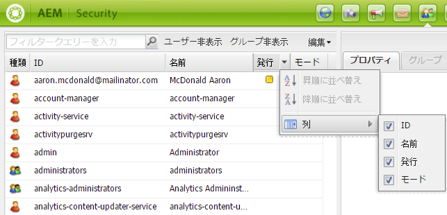

タブを使用すると、様々な設定にアクセスできます。

<!-- ??? in table below. -->

| タブ | 説明 |
|--- |--- |
| フィルターボックス | リストされたユーザーやグループをフィルタリングするメカニズム。 詳しくは、 [ユーザーとグループのフィルタリング](#filtering-users-and-groups). |
| ユーザー非表示 | 表示されているすべてのユーザーを非表示にし、グループのみを残すトグルスイッチ。 詳しくは、 [ユーザーとグループの非表示](#hiding-users-and-groups). |
| グループ非表示 | リストに表示されているすべてのグループを非表示にし、ユーザーのみを残すトグルスイッチ。 詳しくは、 [ユーザーとグループの非表示](#hiding-users-and-groups). |
| 編集 | ユーザーまたはグループの作成、削除、アクティベートおよびアクティベート解除を行うためのメニューです。[ユーザーとグループの作成](#creating-users-and-groups)および[ユーザーとグループの削除](#deleting-users-and-groups)を参照してください。 |
| プロパティ | 電子メール情報、説明、名前情報を含めることができるユーザーまたはグループに関する情報をリストします。 また、ユーザーのパスワードを変更することもできます。 [ユーザーとグループの作成](#creating-users-and-groups)、[ユーザーとグループのプロパティの変更](#modifying-user-and-group-properties)および[ユーザーパスワードの変更](#changing-a-user-password)を参照してください。 |
| グループ | 選択したユーザーまたはグループが属するすべてのグループのリストが表示されます。 選択したユーザーまたはグループを追加のグループに割り当てたり、グループから削除したりできます。 詳しくは、 [グループ](#adding-users-or-groups-to-a-group). |
| メンバー | グループに対してのみ使用できます。 特定のグループのメンバーをリストします。 詳しくは、 [メンバー](#members-adding-users-or-groups-to-a-group). |
| 権限 | ユーザーまたはグループに権限を割り当てることができます。 以下を制御できます。<ul><li>特定のページ/ノードに関連する権限。 [権限の設定](#setting-permissions)を参照してください。 </li><li>ページの作成と削除および階層の変更に関連する権限。??? を使用すると、ページを作成および削除するための[権限を割り当てる](#settingprivileges)ことができます（階層の変更など）。</li><li>に関連する権限 [レプリケーション権限](#setting-replication-privileges) （通常はオーサーからパブリッシュまで）パスに従って指定します。</li></ul> |
| 実行 | 別のユーザーがアカウントを偽装できるようにします。 ユーザーが別のユーザーの代わりに行動する必要がある場合に役立ちます。 詳しくは、 [別のユーザーとして実行](#impersonating-another-user)を参照してください。 |
| 環境設定 | [グループまたはユーザーの環境設定](#setting-user-and-group-preferences)を指定します。例えば、言語の環境設定などです。 |

### ユーザーとグループのフィルタリング {#filtering-users-and-groups}

フィルター式を入力してリストをフィルタリングできます。これにより、式に一致しないすべてのユーザーとグループが非表示になります。また、[ユーザー非表示とグループ非表示](#hiding-users-and-groups)の各ボタンを使用してユーザーとグループを非表示にすることもできます。

ユーザーまたはグループをフィルターするには：

1. 左側のツリーリストで、用意されているスペースにフィルター式を入力します。 例： **admin** この文字列を含むすべてのユーザーとグループが表示されます。
1. 虫眼鏡をクリックしてリストをフィルタリングします。

   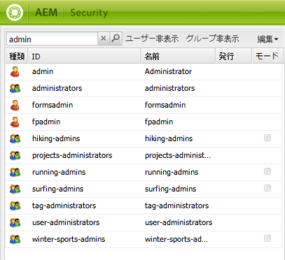

1. すべてのフィルターを削除する場合は、**x** をクリックします。

### ユーザーとグループの非表示 {#hiding-users-and-groups}

ユーザーやグループを非表示にする方法も、システム内のすべてのユーザーやグループのリストをフィルタリングする方法の 1 つです。 切り替えメカニズムは 2 つあります。 「ユーザーを非表示」をクリックすると、すべてのユーザーが表示から非表示になり、「グループを非表示」をクリックすると、すべてのグループが表示から非表示になります（ユーザーとグループの両方を同時に非表示にすることはできません）。 フィルター式を使用してリストをフィルターするには、 [ユーザーとグループのフィルタリング](#filtering-users-and-groups).

ユーザーおよびグループを非表示にするには：

1. **セキュリティ**&#x200B;コンソールで、「**ユーザー非表示**」または「**グループ非表示**」をクリックします。選択したボタンがハイライト表示されます。

   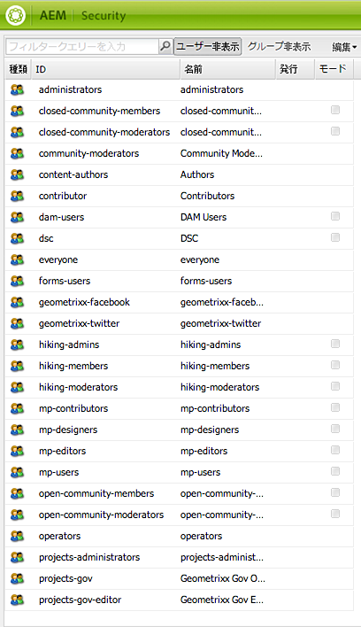

1. ユーザーまたはグループを再度表示するには、対応するボタンをもう一度クリックします。

### ユーザーとグループの作成 {#creating-users-and-groups}

新しいユーザーまたはグループを作成するには：

1. **セキュリティ**&#x200B;コンソールのツリーリストで、「**編集**」をクリックし、「**ユーザーを作成**」または「**グループを作成**」をクリックします。

   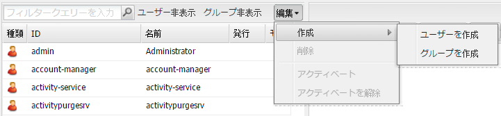

1. ユーザーとグループのどちらを作成しているかに応じて、必要な詳細を入力します。

   * 「**ユーザーを作成**」を選択した場合は、ログイン ID、姓名、メールアドレスおよびパスワードを入力します。デフォルトでは、AEM は姓の最初の文字に基づいてパスを作成しますが、別のパスを選択することもできます。

   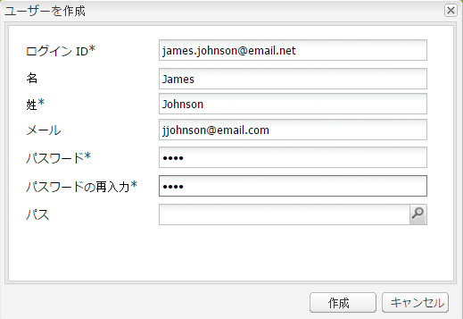

   * 「**グループを作成**」を選択した場合は、グループ ID と説明（オプション）を入力します。

   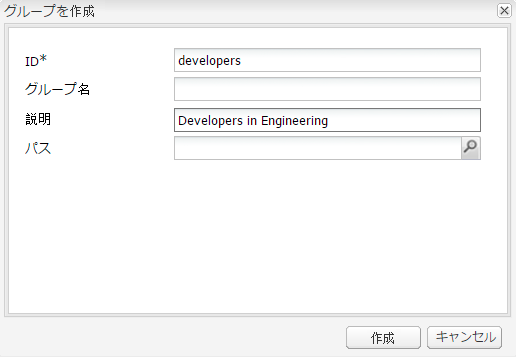

1. 「**作成**」をクリックします。作成したユーザーまたはグループがツリーリストに表示されます。

### ユーザーとグループの削除 {#deleting-users-and-groups}

ユーザーまたはグループを削除するには：

1. 内 **セキュリティ** コンソールで、削除するユーザーまたはグループを選択します。 複数の項目を削除する場合は、Shift キーまたは Ctrl キーを押しながらクリックして選択します。
1. クリック **編集、** 「削除」を選択します。 ユーザーまたはグループを削除するかどうかを確認するメッセージがAEM WCM に表示されます。
1. 「**OK**」をクリックして確定するか、「キャンセル」をクリックしてアクションをキャンセルします。

### ユーザーおよびグループのプロパティの変更 {#modifying-user-and-group-properties}

ユーザーおよびグループのプロパティを変更するには、次の手順に従います。

1. **セキュリティ**&#x200B;コンソールで、変更するユーザーまたはグループの名前をダブルクリックします。

1. 「**プロパティ**」タブをクリックし、必要な変更を行なって「**保存**」をクリックします。

   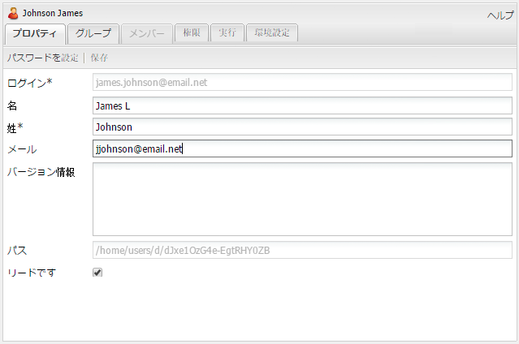

>[!NOTE]
>
>ユーザーのプロパティの一番下にユーザーのパスが表示されます。このパスは変更できません。

### ユーザーパスワードの変更 {#changing-a-user-password}

以下の手順を使用して、ユーザーのパスワードを変更します。

>[!NOTE]
>
>セキュリティコンソールを使用して admin パスワードを変更することはできません。admin アカウントのパスワードを変更するには、Granite Operations が提供する[ユーザーコンソール](/help/sites-administering/granite-user-group-admin.md#changing-the-password-for-an-existing-user)を使用してください。

1. **セキュリティ**&#x200B;コンソールで、パスワードを変更するユーザーの名前をダブルクリックします。
1. 「**プロパティ**」タブをクリックします（まだアクティブでない場合）。

1. 「**パスワードを設定**」をクリックします。パスワードを設定ウィンドウが開きます。このウィンドウでパスワードを変更できます。

   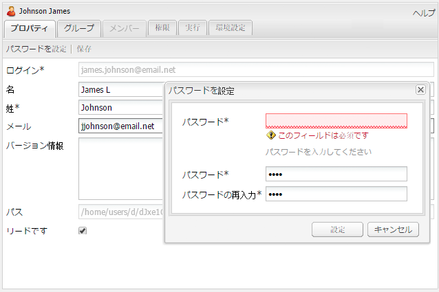

1. 新しいパスワードを 2 回入力します。明確なテキストには表示されないので、確認用です。一致しない場合は、エラーが表示されます。
1. クリック **設定** ：アカウントの新しいパスワードを有効化します。

### グループへのユーザーまたはグループの追加 {#adding-users-or-groups-to-a-group}

AEMでは、次の 3 つの方法で既存のグループにユーザーまたはグループを追加できます。

* グループ内にいる場合、メンバー（ユーザーまたはグループ）を追加できます。
* メンバーの中にいる場合は、メンバーをグループに追加できます。
* 権限を操作する際に、グループにメンバーを追加できます。

### グループ — グループへのユーザーまたはグループの追加 {#groups-adding-users-or-groups-to-a-group}

この **グループ** 「 」タブには、現在のアカウントが属するグループが表示されます。 これを使用して、選択したアカウントをグループに追加できます。

1. グループに割り当てるアカウント（ユーザーまたはグループ）の名前をダブルクリックします。
1. 次をクリック： **グループ** タブをクリックします。 アカウントが既に属しているグループのリストが表示されます。
1. ツリーリストで、アカウントに追加するグループの名前をクリックし、 **グループ** ウィンドウ （複数のユーザーを追加する場合は、Shift キーまたは Ctrl キーを押しながら名前をクリックしてドラッグします）。

   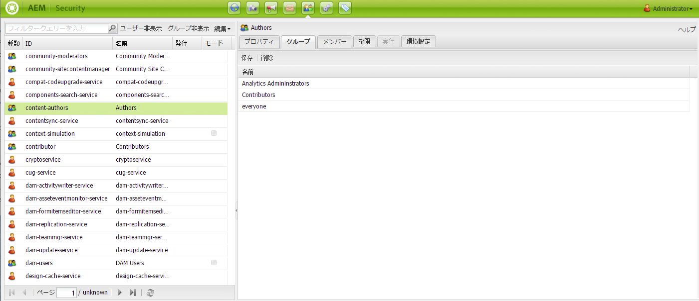

1. 「**保存**」をクリックして変更を保存します。

### メンバー — グループへのユーザーまたはグループの追加 {#members-adding-users-or-groups-to-a-group}

「**メンバー**」タブはグループについてのみ使用できます。このタブには、現在のグループに属しているユーザーとグループが表示されます。このタブを使用して、アカウントをグループに追加できます。

1. メンバーを追加するグループの名前をダブルクリックします。
1. 次をクリック： **メンバー** タブをクリックします。 このグループに既に属するメンバーのリストが表示されます。
1. ツリー・リストで、グループに追加するメンバの名前をクリックし、 **メンバー** ウィンドウ （複数のユーザーを追加する場合は、Shift キーまたは Ctrl キーを押しながら名前をクリックしてドラッグします）。

   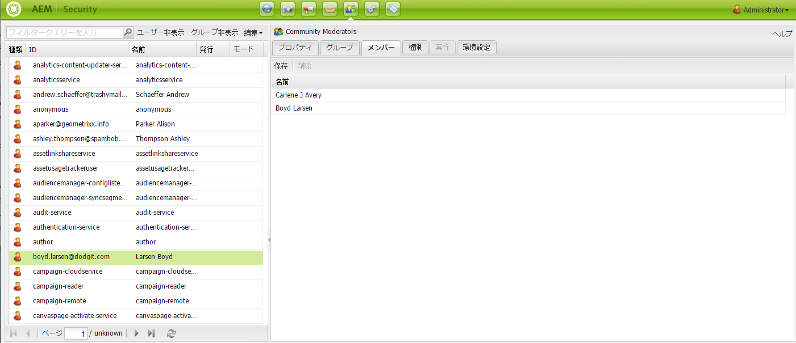

1. 「**保存**」をクリックして変更を保存します。

### 権限を追加する際のユーザーまたはグループの追加 {#adding-users-or-groups-while-adding-permissions}

特定のパスにあるグループにメンバーを追加するには：

1. ユーザーを追加するグループまたはユーザーの名前をダブルクリックします。

1. 「**権限**」タブをクリックします。

1. 権限を追加するパスに移動して、「**詳細**」をクリックします。詳細ウィンドウの下部には、対象のページに対する権限を持つユーザーの情報が表示されます。

   

1. 「 **メンバー** 列を使用して、そのパスに対する権限を持つメンバーを指定します。 権限を削除するメンバーのチェックボックスをオフにします。 変更を加えたセルに赤い三角形が表示されます。
1. 「**OK**」をクリックして、変更を保存します。

### グループからのユーザーまたはグループの削除 {#removing-users-or-groups-from-groups}

AEMでは、次の 3 つの方法でユーザーまたはグループをグループから削除できます。

* グループプロファイル内にいる場合、メンバー（ユーザーまたはグループ）を削除できます。
* メンバープロファイルにいる場合は、グループからメンバーを削除できます。
* 権限を操作しているときに、グループからメンバーを削除できます。

### グループ - グループからのユーザーまたはグループの削除 {#groups-removing-users-or-groups-from-groups}

グループからユーザーまたはグループアカウントを削除するには：

1. グループから削除するグループまたはユーザーアカウントの名前をダブルクリックします。
1. 次をクリック： **グループ** タブをクリックします。 選択したアカウントが属するグループが表示されます。
1. **グループ**&#x200B;ウィンドウで、グループから削除するユーザーまたはグループの名前をクリックして、「**削除**」をクリックします（複数のアカウントを削除する場合は、Shift キーまたは Ctrl キーを押しながら名前をクリックして、「**削除**」をクリックします）。

   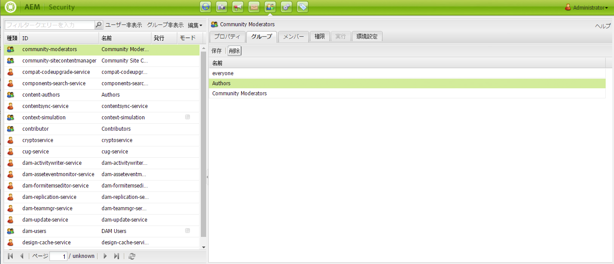

1. 「**保存**」をクリックして変更を保存します。

### メンバー - グループからのユーザーまたはグループの削除 {#members-removing-users-or-groups-from-groups}

グループからアカウントを削除するには：

1. メンバーを削除するグループの名前をダブルクリックします。
1. 次をクリック： **メンバー** タブをクリックします。 このグループに既に属するメンバーのリストが表示されます。
1. 内 **メンバー** ウィンドウで、グループから削除するメンバの名前をクリックし、 **削除**. ( 複数のユーザーを削除する場合は、Shift キーまたは Ctrl キーを押しながら名前をクリックし、 **削除**.)

   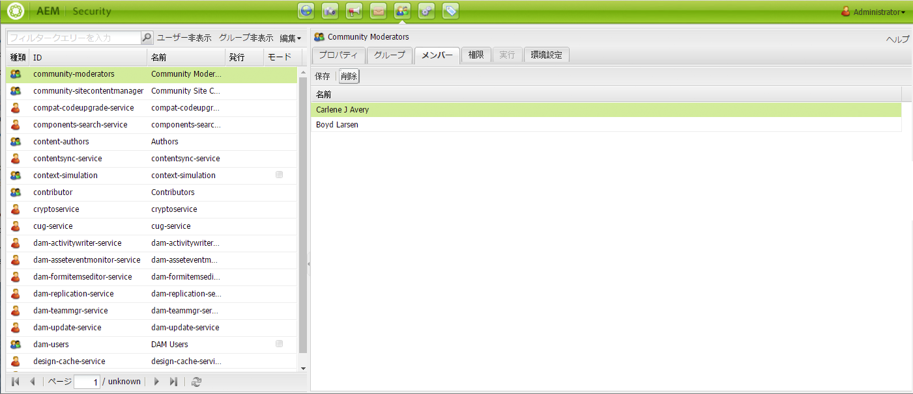

1. 「**保存**」をクリックして変更を保存します。

### 権限を追加する際のユーザーまたはグループの削除 {#removing-users-or-groups-while-adding-permissions}

特定のパスにあるグループからメンバーを削除するには：

1. ユーザーを削除するグループまたはユーザーの名前をダブルクリックします。

1. 「**権限**」タブをクリックします。

1. 権限を削除するパスに移動して、「**詳細**」をクリックします。詳細ウィンドウの下部には、対象のページに対する権限を持つユーザーの情報が表示されます。

   

1. 「 **メンバー** 列を使用して、そのパスに対する権限を持つメンバーを指定します。 権限を削除するメンバーのチェックボックスをオフにします。 変更を加えたセルに赤い三角形が表示されます。
1. 「**OK**」をクリックして、変更を保存します。

### ユーザー同期 {#user-synchronization}

デプロイメントが[パブリッシュファーム](/help/sites-deploying/recommended-deploys.md#tarmk-farm)であるとき、ユーザーとグループをすべてのパブリッシュノード間で同期する必要があります。

ユーザー同期と有効化の方法については、 [ユーザーの同期](/help/sites-administering/sync.md).

## 権限の管理 {#managing-permissions}

ここでは、権限（レプリケーション権限を含む）を設定する方法について説明します。

### 権限の設定 {#setting-permissions}

ユーザーは権限を使用して、特定のパスにあるリソースに対して特定のアクションを実行できます。権限にはページを作成または削除する機能も含まれます。

権限を追加、変更または削除するには：

1. **セキュリティ**&#x200B;コンソールで、権限を設定するユーザーまたはグループの名前をダブルクリックするか、[ノードを検索](#searching-for-nodes)します。

1. 「**権限**」タブをクリックします。

   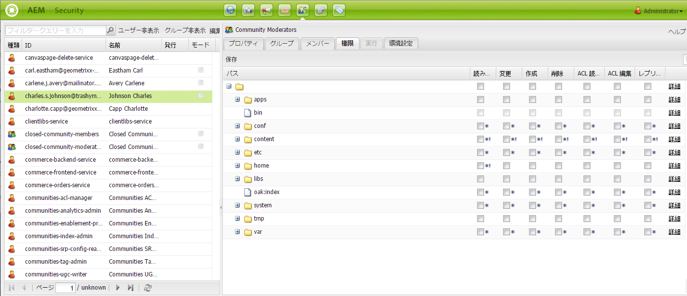

1. ツリーグリッドで、チェックボックスをオンにして、選択したユーザーまたはグループによるアクションの実行を許可します。または、チェックボックスをオフにして、選択したユーザーまたはグループによるアクションの実行を拒否します。詳細を確認するには、「**詳細**」をクリックします。

1. 完了したら、「**保存**」をクリックします。

### レプリケーション権限の設定 {#setting-replication-privileges}

レプリケーション権限は、コンテンツを公開する権利で、グループとユーザーに対して設定できます。

>[!NOTE]
>
>* グループに適用されるレプリケーション権限は、そのグループ内のすべてのユーザーに適用されます。
>* ユーザーのレプリケーション権限は、グループのレプリケーション権限よりも優先されます。
>* 「許可」レプリケーション権限の優先順位は「拒否」レプリケーション権限よりも高くなります。詳しくは、[AEM の権限](#permissions-in-aem)を参照してください。
>

レプリケーション権限を設定するには、次の手順に従います。

1. リストからユーザーまたはグループを選択し、ダブルクリックして開き、 **権限**.
1. グリッドで、ユーザーにレプリケーション権限を設定するパスに移動するか、[ノードを検索](#searching-for-nodes)します。

1. 選択したパスの「**レプリケーション**」列で、チェックボックスをオンにして、対象のユーザーまたはグループのレプリケーション権限を追加します。または、チェックボックスをオフにして、レプリケーション権限を削除します。AEM では、変更を行った（未保存の）項目に赤い三角形が表示されます。

   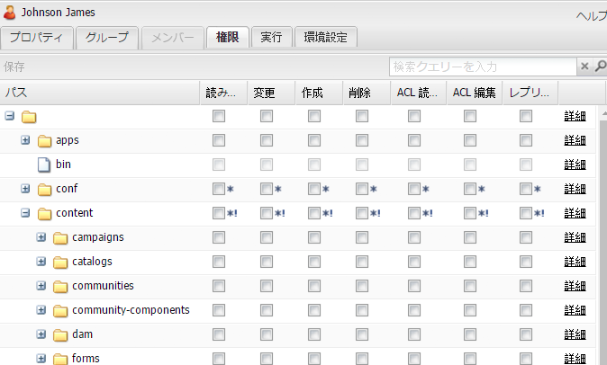

1. 「**保存**」をクリックして変更を保存します。

### ノードの検索 {#searching-for-nodes}

権限を追加または削除する際に、ノードを参照または検索できます。

パス検索には、次の 2 つの異なるタイプがあります。

* パス検索 — 検索文字列が「/」で始まる場合、指定されたパスの直接のサブノードを検索します。

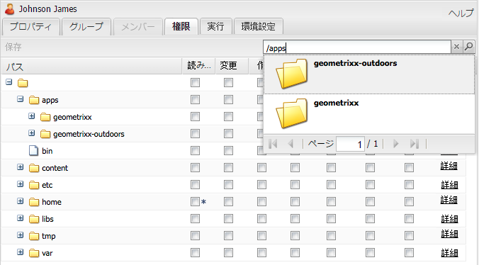

検索ボックスでは以下の操作を行うことができます。

| アクション | 動作 |
|--- |--- |
| 右向き矢印キー | 検索結果内のサブノードを選択 |
| 下矢印キー | 検索を再開します。 |
| Enter (Return) キー | サブノードを選択し、ツリーグリッドに読み込みます。 |

* フルテキスト検索 — 検索文字列が「/」で始まらない場合、パス「/content」の下のすべてのノードでフルテキスト検索が実行されます。

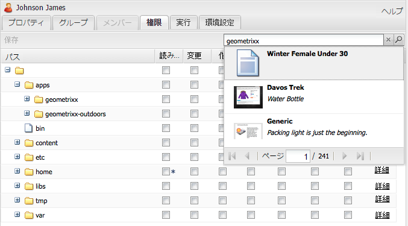

パス検索またはフルテキスト検索を実行するには：

1. セキュリティコンソールで、ユーザーまたはグループを選択して、「**権限**」タブをクリックします。

1. 「検索」ボックスに検索する用語を入力します。

### 別のユーザーとして実行 {#impersonating-users}

現在のユーザーとして実行できる 1 人以上のユーザーを指定できます。 つまり、ユーザーは、自分のアカウント設定を現在のユーザーのアカウント設定に切り替え、このユーザーの代理として操作できます。

この関数は、ユーザーが自分のユーザーが実行できないアクションを実行できる場合があるので、注意して使用します。 別のユーザーとして実行する場合、ユーザーは、自分自身としてログインしていないことを通知されます。

この機能を使用する場合は、次のような様々なシナリオが考えられます。

* 不在の場合は、不在の間に別のユーザーに偽装させることができます。 この機能を使用すると、誰かが自分のアクセス権を持っていることを確認でき、ユーザープロファイルを変更したり、パスワードを提供する必要がなくなります。
* デバッグ目的で使用できます。 たとえば、アクセス権が制限されたユーザーを Web サイトでどのように検索するかを確認する場合などです。 また、ユーザーが技術的な問題に関して不満を持った場合は、そのユーザーになりすまして、問題を診断および修正できます。

既存のユーザーを偽装するには：

1. ツリーリストで、他のユーザーに偽装するユーザーを割り当てるユーザーの名前を選択します。 ダブルクリックして開きます。
1. 次をクリック： **実行** タブをクリックします。
1. 選択したユーザーとして実行するユーザーをクリックします。 リストから別のユーザーとして実行するユーザーを、別のユーザーとして実行ウィンドウにドラッグします。 名前がリストに表示されます。

   

1. 「**保存**」をクリックします。

### ユーザーおよびグループの環境設定の指定 {#setting-user-and-group-preferences}

言語、ウィンドウ管理、ツールバー環境設定など、ユーザーとグループの環境設定を設定するには、次の手順に従います。

1. 左側のツリーで、環境設定を変更するユーザーまたはグループを選択します。 複数のユーザーまたはグループを選択するには、Ctrl キーまたは Shift キーを押しながら選択項目をクリックします。
1. 次をクリック： **環境設定** タブをクリックします。

   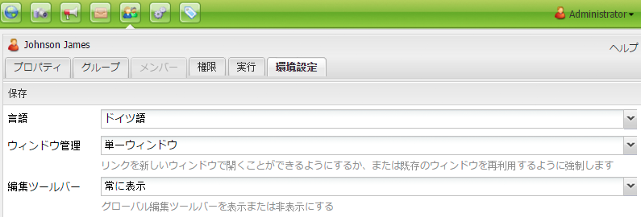

1. 必要に応じて、グループまたはユーザーの環境設定に変更を加え、 **保存** 終了したとき。

### 他のユーザーを管理する権限をユーザーまたは管理者に与える設定 {#setting-users-or-administrators-to-have-the-privilege-to-manage-other-users}

ユーザーまたは管理者が他のユーザーを削除／アクティベート／アクティベート解除する権限を付与するための設定を行うには：

1. 他のユーザーを管理する権限を付与するユーザーを administrators グループに追加して、変更を保存します。

   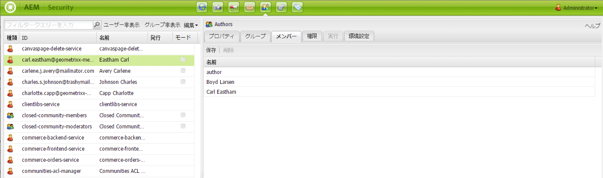

1. ユーザーの「**権限**」タブで、「/」に移動します。「レプリケーション」列で、チェックボックスをオンにして「/」におけるレプリケーションを許可し、「**保存**」をクリックします。

   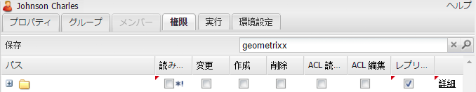

   これで、選択したユーザーは、ユーザーを非アクティブ化、アクティブ化、削除および作成できます。

### プロジェクトレベルでの権限の拡張 {#extending-privileges-on-a-project-level}

アプリケーション固有の権限を実装する場合、次の情報で、カスタム権限の実装に必要な情報と、CQ 全体でカスタム権限を適用する方法を説明します。

階層の変更権限は JCR 権限の組み合わせによってカバーされます。レプリケーション権限の名前は **crx:replicate** です。この権限は、他の権限と共に JCR リポジトリに保存され、評価されます。ただし、この権限は JCR レベルでは適用されません。

カスタム権限の定義と登録は、公式には [Jackrabbit API](https://jackrabbit.apache.org/api/2.8/org/apache/jackrabbit/api/security/authorization/PrivilegeManager.html)（バージョン 2.4 以降）の一部です（[JCR-2887](https://issues.apache.org/jira/browse/JCR-2887) も参照）。その他の使用方法は、[JSR 283](https://jcp.org/en/jsr/detail?id=283)（Section 16）で定義されているとおり、JCR アクセス制御管理によってカバーされます。また、Jackrabbit API では複数の拡張機能を定義します。

権限の登録メカニズムは、**リポジトリ設定**&#x200B;の下の UI に反映されます。

新しい（カスタム）権限の登録は、リポジトリレベルで付与する必要のある組み込みの権限によって保護されます（JCR の場合、AC MGT API で「absPath」パラメーターとして「null」を渡します。詳しくは、JSR 333 を参照してください）。デフォルトでは、**admin** と administrators のすべてのメンバーにこの権限が付与されています。

>[!NOTE]
>
>カスタム権限の検証と評価を実装で行う場合は、その権限が組み込みの権限の集合でない限り適用できません。
