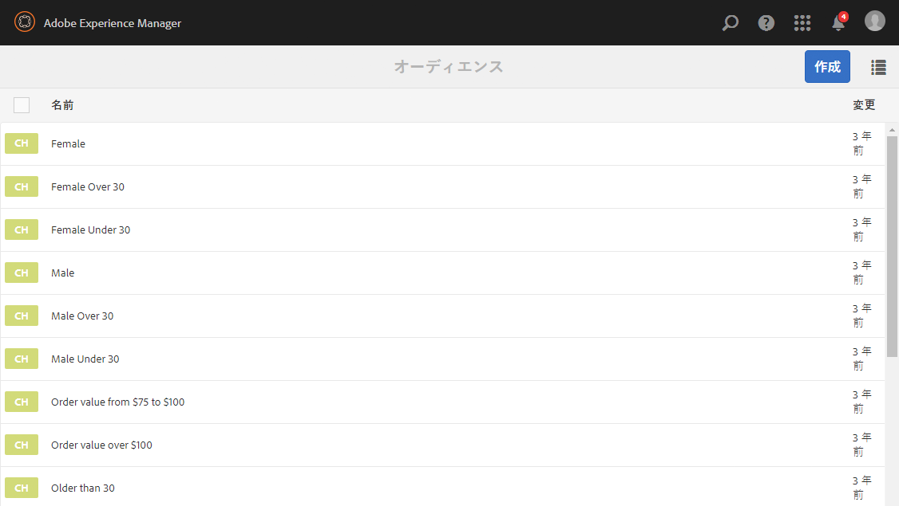
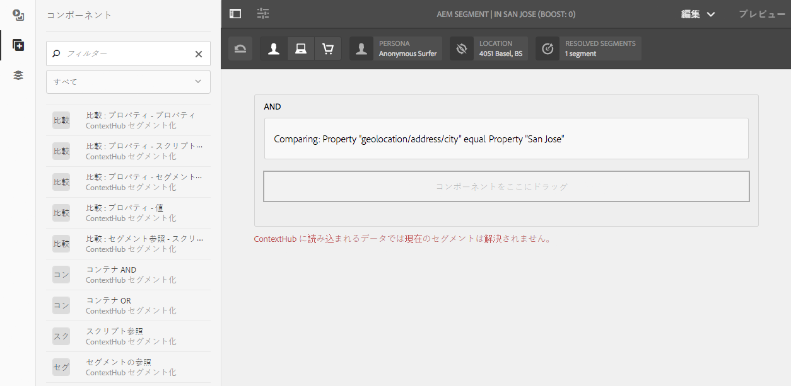
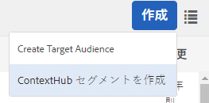
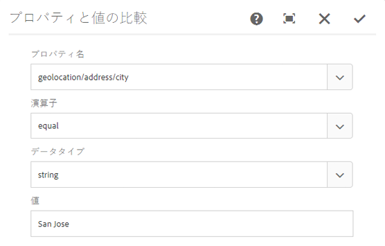
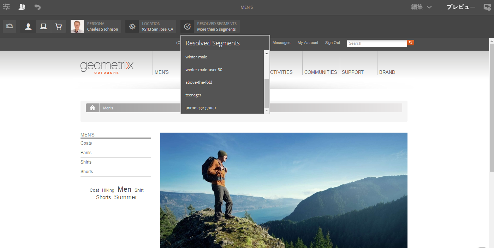

# ContextHub でのセグメント化の設定{#configuring-segmentation-with-contexthub}

>[!NOTE]
>
>この節では、ContextHub を使用したセグメント化の設定について説明します。ClientContext 機能を使用する場合は、[ClientContext のセグメント化の設定](/help/sites-administering/campaign-segmentation.md)に関するドキュメントを参照してください。


キャンペーンを作成する場合、セグメント化を考えることが重要になります。セグメント化の仕組みと主な用語について詳しくは、[オーディエンスの管理](/help/sites-authoring/managing-audiences.md)を参照してください。

サイト訪問者についてこれまでに収集した情報と、達成する目標に応じて、ターゲットコンテンツに必要なセグメントと戦略を定義する必要があります。

このようなセグメントを使用して、訪問者に特定のターゲットコンテンツを提供します。This content is maintained in the [Personalization](/help/sites-authoring/personalization.md) section of the website. ここで定義された[アクティビティ](/help/sites-authoring/activitylib.md)は、任意のページに追加できます。また、専用のコンテンツを適用できる訪問者セグメントを定義できます。

AEM では、ユーザーエクスペリエンスを簡単にパーソナライズできます。また、セグメント定義の結果を検証することもできます。

## セグメントへのアクセス {#accessing-segments}

[オーディエンス](/help/sites-authoring/managing-audiences.md)コンソールは、ContextHub または ClientContext のセグメントを管理したり、Adobe Target アカウントのオーディエンスを管理したりする目的で使用します。このドキュメントでは、ContextHub のセグメントの管理について取り上げます。[ClientContext セグメント](/help/sites-administering/campaign-segmentation.md)および Adobe Target セグメントについては、それぞれ関連するドキュメントを参照してください。

セグメントにアクセスするには、グローバルナビゲーションで&#x200B;**ナビゲーション／パーソナライズ機能／オーディエンス**&#x200B;を選択します。



## セグメントエディター {#segment-editor}

The **Segment Editor** allows you to easily modify a segment. セグメントを編集するには、[セグメントリスト](/help/sites-administering/segmentation.md#accessing-segments)からセグメントを選択し、「**編集**」ボタンをクリックします。



Using the components browser you can add **AND** and **OR** containers to define the segment logic, then add additional components to compare properties and values or reference scripts and other segments to define the selection criteria (see [Creating a New Segment](#creating-a-new-segment)) to define the exact scenario for selecting the segment.

ステートメント全体が true と評価されると、セグメントは解決されます。In the event of multiple segments being applicable, then the **Boost** factor is also used. [ブースト率の詳細については、「新しいセグメントの](#creating-a-new-segment) 作成 [」を参照してください。](/help/sites-administering/campaign-segmentation.md#boost-factor)

>[!CAUTION]
>
>セグメントエディターは、循環参照をチェックしません。例えば、セグメント A が別のセグメント B を参照していて、そのセグメント B がセグメント A を参照している場合などです。このため、セグメントに循環参照が存在しないことを必ず確認してください。

### コンテナ {#containers}

次のコンテナは標準で用意されており、比較や参照をグループ化してブール評価をおこなうために使用できます。これらはコンポーネントブラウザーからエディターにドラッグできます。See the following section [Using AND and OR Containers](/help/sites-administering/segmentation.md#using-and-and-or-containers) for more information.

<table> 
 <tbody> 
  <tr> 
   <td>コンテナ AND<br /> </td> 
   <td>The boolean AND operator<br /> </td> 
  </tr> 
  <tr> 
   <td>コンテナ OR<br /> </td> 
   <td>ブールOR演算子</td> 
  </tr> 
 </tbody> 
</table>

### 比較 {#comparisons}

次のセグメント比較は標準で用意されており、セグメントプロパティを評価するために使用できます。これらはコンポーネントブラウザーからエディターにドラッグできます。

<table> 
 <tbody> 
  <tr> 
   <td>プロパティ — 値<br /> </td> 
   <td>ストアのプロパティと定義済みの値を比較<br /> </td> 
  </tr> 
  <tr> 
   <td>プロパティ — プロパティ</td> 
   <td>ストアの1つのプロパティと別のプロパティを比較<br /> </td> 
  </tr> 
  <tr> 
   <td>プロパティセグメントの参照</td> 
   <td>店舗のプロパティを、参照されている別のセグメントと比較します<br /> </td> 
  </tr> 
  <tr> 
   <td>プロパティスクリプトの参照</td> 
   <td>ストアのプロパティとスクリプトの結果を比較<br /> </td> 
  </tr> 
  <tr> 
   <td>セグメントリファレンススクリプトリファレンス</td> 
   <td>参照セグメントとスクリプトの結果を比較<br /> </td> 
  </tr> 
 </tbody> 
</table>

>[!NOTE]
>
>値を比較する際に、比較のデータタイプが設定されていない場合（つまり自動検出に設定されている場合）、ContextHubのセグメント化エンジンは、値をJavaScriptと同様に比較します。 値が想定されたタイプにキャストされないので、誤解を招く結果となることがあります。次に例を示します。
>
>`null < 30 // will return true`
>
>Therefore when [creating a segment](/help/sites-administering/segmentation.md#creating-a-new-segment), you should select a **data type** whenever the types of compared values are known. 次に例を示します。
>
>When comparing the property `profile/age`, you already know that the compared type will be **number**, so even if `profile/age` is not set, a comparison `profile/age` less-than 30 will return **false**, as you would expect.

### 参照 {#references}

次の参照は標準で用意されており、スクリプトや別のセグメントに直接リンクするために使用できます。これらはコンポーネントブラウザーからエディターにドラッグできます。

<table> 
 <tbody> 
  <tr> 
   <td>セグメントの参照<br /> </td> 
   <td>参照先セグメントを評価</td> 
  </tr> 
  <tr> 
   <td>スクリプト参照</td> 
   <td>参照先のスクリプトを評価します。 詳しくは、次の「スクリプト参照の <a href="/help/sites-administering/segmentation.md#using-script-references">使用</a> 」の節を参照してください。</td> 
  </tr> 
 </tbody> 
</table>

## 新しいセグメントの作成 {#creating-a-new-segment}

新しいセグメントを定義するには：

1. [セグメントへのアクセス](/help/sites-administering/segmentation.md#accessing-segments)後、「作成」ボタンをクリックまたはタップし、「**ContextHub セグメントを作成**」を選択します。

   

1. 「**新しい ContextHub セグメント**」で、セグメントのタイトルと必要に応じてブースト値を入力し、「**作成**」をタップまたはクリックします。

   

   各セグメントには、重み付け係数として使用されるブーストパラメータがあります。 複数のセグメントが有効である場合、数値が小さいセグメントよりも、数値が大きいセグメントのほうが優先して選択されます。

   * 最小値：`0`
   * 最大値：`1000000`

1. 比較または参照をセグメントエディターにドラッグすると、デフォルトの AND コンテナに表示されます。
1. 新しい参照またはセグメントの設定オプションをダブルクリックまたはタップして、特定のパラメーターを編集します。この例では、サンノゼの人物をテストしています。

   

   比較が適切に評価されるように、可能であれば常に「**データタイプ**」を設定します。詳しくは、[比較](/help/sites-administering/segmentation.md#comparisons)を参照してください。

1. 「**OK**」をクリックして定義を保存します。
1. 必要に応じてその他のコンポーネントを追加します。AND 比較および OR 比較のコンテナコンポーネントを使用して、ブール式を作成できます（後述の [AND コンテナと OR コンテナの使用](/help/sites-administering/segmentation.md#using-and-and-or-containers)を参照）。セグメントエディターでは、不要になったコンポーネントを削除したり、コンポーネントをステートメント内の別の場所へドラッグしたりすることができます。

### AND コンテナと OR コンテナの使用 {#using-and-and-or-containers}

AND および OR コンテナコンポーネントを使用すると、AEM で複雑なセグメントを作成できます。この際、次の基本事項に留意してください。

* 定義の最上位レベルは必ず、最初に作成された AND コンテナになります。これは変更できませんが、他のセグメント定義には影響しません。
* コンテナのネストが意味のあるものになっていることを確認してください。コンテナは、ブール式の括弧として見ることができます。

次の例では、プライムエイジグループに属すると見なされる訪問者を選択しています。

30 才～ 59 才の男性

または

30 才～ 59 才の女性

最初に、OR コンテナコンポーネントをデフォルトの AND コンテナ内に配置します。ORコンテナ内に2つのANDコンテナを追加し、その両方にプロパティまたは参照コンポーネントを追加できます。


### スクリプト参照の使用 {#using-script-references}

スクリプト参照コンポーネントを使用すると、セグメントプロパティの評価を外部スクリプトに委任できます。適切に設定したスクリプトは、セグメント条件の他のコンポーネントと同じように使用できます。

#### 参照するスクリプトの定義 {#defining-a-script-to-reference}

1. Add file to `contexthub.segment-engine.scripts` clientlib.
1. 値を返す関数を実装します。次に例を示します。

   ```
   ContextHub.console.log(ContextHub.Shared.timestamp(), '[loading] contexthub.segment-engine.scripts - script.profile-info.js');
   
   (function() {
       'use strict';
   
       /**
        * Sample script returning profile information. Returns user info if data is available, false otherwise.
        *
        * @returns {Boolean}
        */
       var getProfileInfo = function() {
           /* let the SegmentEngine know when script should be re-run */
           this.dependOn(ContextHub.SegmentEngine.Property('profile/age'));
           this.dependOn(ContextHub.SegmentEngine.Property('profile/givenName'));
   
           /* variables */
           var name = ContextHub.get('profile/givenName');
           var age = ContextHub.get('profile/age');
   
           return name === 'Joe' && age === 123;
       };
   
       /* register function */
       ContextHub.SegmentEngine.ScriptManager.register('getProfileInfo', getProfileInfo);
   
   })();
   ```

1. Register the script with `ContextHub.SegmentEngine.ScriptManager.register`.

その他のプロパティに依存するスクリプトでは、`this.dependOn()` () を呼び出す必要があります。For example if the script depends on `profile/age`:

```
this.dependOn(ContextHub.SegmentEngine.Property('profile/age'));
```

#### スクリプトの参照 {#referencing-a-script}

1. ContextHub セグメントを作成します。
1. **スクリプト参照**&#x200B;コンポーネントをセグメントの目的の場所に追加します。
1. **スクリプト参照**&#x200B;コンポーネントの編集ダイアログを開きます。スクリプトが[適切に設定](/help/sites-administering/segmentation.md#defining-a-script-to-reference)されていれば、「**スクリプト名**」ドロップダウンに表示されます。

## セグメントの適用のテスト {#testing-the-application-of-a-segment}

セグメントを定義したら、**[ContextHub](/help/sites-authoring/ch-previewing.md)**を使用して、考えられる結果についてテストすることができます。

1. ページのプレビュー
1. ContextHub アイコンをクリックして ContextHub ツールバーを表示します。
1. 作成したセグメントと一致するペルソナを選択します。
1. ContextHub によって、選択したペルソナに適用できるセグメントが解決されます。

例えば、この例のプライムエイジグループに属するユーザーを識別するための単純なセグメント定義は、ユーザーの年齢と性別に基づいています。これらの条件に一致する特定の人物を読み込むと、セグメントが正常に解決されたかどうかが表示されます。


解決されていない場合は次のようになります。


>[!NOTE]
>
>すべての特性がただちに解決されます。ただし、ほとんどの特性はページを再読み込みしたときにのみ変更されます。

このようなテストは、ターゲットコンテンツや関連する&#x200B;**アクティビティ**&#x200B;および&#x200B;**エクスペリエンス**&#x200B;と組み合わせて、コンテンツページでも実行できます。

前述のプライムエイジグループセグメントの例を使用してアクティビティおよびエクスペリエンスを設定した場合は、そのアクティビティを使用してセグメントを簡単にテストできます。アクティビティの設定について詳しくは、[ターゲットコンテンツのオーサリングに関するドキュメント](/help/sites-authoring/content-targeting-touch.md)を参照してください。

1. ターゲットコンテンツを設定したページの編集モードでは、ターゲットとなるコンテンツが矢印アイコンによって示されます。

   

1. プレビューモードに切り替えてから、ContextHub を使用して、エクスペリエンスに設定されているセグメント化と一致しないペルソナに切り替えます。

   

1. エクスペリエンスに設定されているセグメント化と一致するペルソナに切り替え、それに応じてエクスペリエンスが変化することを確認します。

   

## セグメントの使用 {#using-your-segment}

これらのセグメントを使用して、特定のターゲットオーディエンスに向けられた実際のコンテンツを制御することができます。See [Managing Audiences](/help/sites-authoring/managing-audiences.md) for more information about audiences and segments and [Authoring Targeted Content](/help/sites-authoring/content-targeting-touch.md) about using audiences and segments to target content.
