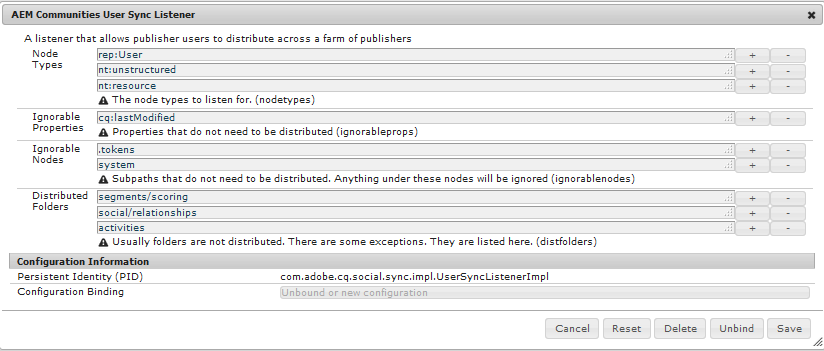
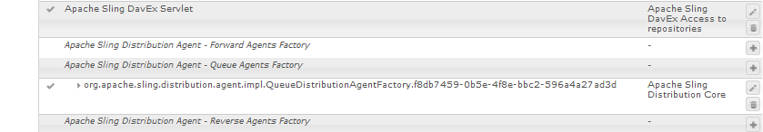

# ユーザー同期{#user-synchronization}

>[!CAUTION]
>
>AEM 6.4 の拡張サポートは終了し、このドキュメントは更新されなくなりました。 詳細は、 [技術サポート期間](https://helpx.adobe.com/jp/support/programs/eol-matrix.html). サポートされているバージョンを見つける [ここ](https://experienceleague.adobe.com/docs/?lang=ja).

## はじめに {#introduction}

デプロイメントが[パブリッシュファーム](/help/sites-deploying/recommended-deploys.md#tarmk-farm)であるとき、メンバーはすべてのパブリッシュノードにログインしてその中のデータを閲覧できる必要があります。

パブリッシュ環境で作成されたユーザーとユーザーグループ（ユーザーデータ）は、オーサー環境では必要ありません。

オーサー環境で作成されたほとんどのユーザーデータは、オーサー環境にとどまり、パブリッシュインスタンスにはコピーされません。

1 つのパブリッシュインスタンスで加えられた登録と変更は、他のパブリッシュインスタンスと同期して、同じユーザーデータにアクセスできるようにする必要があります。

 AEM 6.1 では、ユーザー同期を有効にすると、ユーザーデータがファーム内のパブリッシュインスタンス全体に自動的に同期され、オーサー環境には作成されません。

## Sling 配布 {#sling-distribution}

ユーザーデータは [ACL](/help/sites-administering/security.md) と共に Oak JCR の下のレイヤーの [Oak Core](/help/sites-deploying/platform.md) に格納され、[Oak API](https://helpx.adobe.com/experience-manager/6-4/sites/developing/using/reference-materials/javadoc/org/apache/jackrabbit/oak/api/package-tree.html) を使用してアクセスできます。アップデートの頻度が少ない場合は、[Sling コンテンツ配布](https://github.com/apache/sling/blob/trunk/contrib/extensions/distribution/README.md)（Sling 配布）を使用してユーザーデータを他のパブリッシュインスタンスに同期するのが適切です。

従来のレプリケーションと比較して、Sling 配布を使用してユーザーを同期する利点は次のとおりです。

* パブリッシュインスタンスで作成された&#x200B;*ユーザー*、*ユーザープロファイル*&#x200B;および&#x200B;*ユーザーグループ*&#x200B;がオーサー環境に作成されません

* Sling 配布は、jcr イベントのプロパティを設定するので、無限レプリケーションループを気にせずに、パブリッシュ側のイベントリスナー内で動作できます
* Sling 配布では、ユーザーデータを非開始パブリッシュインスタンスにのみ送信し、不要なトラフィックを排除します
* [ACL](/help/sites-administering/security.md) ユーザーノードに設定された値が同期に含まれる

>[!NOTE]
>
>セッションが必要な場合は、SSO ソリューションを使用するか、スティッキーセッションを使用し、別のパブリッシャーに切り替えられた場合は顧客にログインさせることをお勧めします。

>[!CAUTION]
>
>*の同期&#x200B;**管理者** *group は、ユーザー同期が有効な場合でもサポートされません。 代わりに、「差分のインポート」が失敗した旨を示すログがエラーログに記録されます。
>
>したがって、デプロイメントがパブリッシュファームの場合、ユーザーが*に追加または削除された場合、**管理者** *group の場合、変更は各パブリッシュインスタンスで手動でおこなう必要があります。

## ユーザー同期の有効化 {#enable-user-sync}

>[!NOTE]
>
>デフォルトでは、ユーザー同期は `disabled` になっています。
>
>ユーザー同期を有効にするには、OSGi の既存の設定を変更する必要があります&#x200B;*。*
>
>ユーザーの同期を有効にした結果、新しい設定を追加しないでください。

ユーザー同期では、作成者にユーザーデータが作成されていない場合でも、ユーザーデータの配布を管理する際には作成者環境が必要です。 すべてではありませんが、設定の大多数はオーサー環境にあり、それをオーサー環境またはパブリッシュ環境で実行するかどうかは各手順で明確に識別します。

ユーザー同期の有効化に必要な手順と、[トラブルシューティング](#troubleshooting)の節を以下に示します。

### 前提条件 {#prerequisites}

1. ）1 つのパブリッシャーでユーザーおよびユーザーグループが既に作成されている場合は、ユーザー同期を設定して有効にする前に、ユーザーデータをすべてのパブリッシャーと[手動で同期](#manually-syncing-users-and-user-groups)することをお勧めします。

   ユーザー同期を有効にすると、新規に作成されたユーザーおよびグループのみが同期されるようになります。

1. 最新のコードがインストールされていることを確認します。

* [AEM プラットフォームの更新](https://helpx.adobe.com/jp/experience-manager/kb/aem62-available-hotfixes.html)
* [AEM Communities の更新](/help/communities/deploy-communities.md#latest-releases)

### 1. Apache Sling Distribution Agent - Sync Agents Factory {#apache-sling-distribution-agent-sync-agents-factory}

**ユーザー同期を有効にする**

* **オーサー環境で**

   * 管理者権限でサインイン
   * [Web コンソール](/help/sites-deploying/configuring-osgi.md)にアクセスします

      * 例： [http://localhost:4502/system/console/configMgr](http://localhost:4502/system/console/configMgr)
   * `Apache Sling Distribution Agent - Sync Agents Factory` を見つけます

      * 編集する既存の設定を選択します（鉛筆アイコン）。

         `name` が **`socialpubsync`** であることを確認します

      * 「`Enabled`」チェックボックスをオンにします
      * 「`Save`」を選択します。


### 2.認証済みユーザーの作成 {#createauthuser}

**権限の設定**
この承認済みユーザーは、手順 3 で作成者の Sling 配布を設定するために使用されます。

* **各パブリッシュインスタンスで**

   * 管理者権限でサインイン
   * [セキュリティコンソール](/help/sites-administering/security.md)にアクセスします

      * 例： [http://localhost:4503/useradmin](http://localhost:4503/useradmin)
   * 新しいユーザーを作成します

      * 例：`usersync-admin`
   * このユーザーを **`administrators`** ユーザーグループに追加します
   * [このユーザーに対する ACL を /home に追加します](#addacls)

      * `Allow jcr:all` 制限付きで `rep:glob=*/activities/*`


>[!CAUTION]
>
>新しいユーザーを作成する必要があります。
>
>* デフォルトで割り当てられるユーザーは **`admin`** です。
>* `*communities-user-admin *user*.*` を使用しないでください。
>


#### ACL の追加方法 {#addacls}

* アクセスCRXDE Lite

   * 例： [http://localhost:4503/crx/de](http://localhost:4503/crx/de)

* `/home` ノードを選択します
* 右側のペインで「`Access Control`」タブを選択します
* `+` ボタンを選択して、ACL エントリを追加します

   * **プリンシパル**：*ユーザー同期用に作成されたユーザーを検索*
   * **タイプ**：`Allow`
   * **権限**：`jcr:all`
   * **制限** rep:glob: `*/activities/*`
   * 選択 **OK**

* 選択 **すべて保存**


関連トピック

* [アクセス権限の管理](/help/sites-administering/user-group-ac-admin.md#access-right-management)
* トラブルシューティングの節の[応答処理中の操作の例外の変更](#modify-operation-exception-during-response-processing)。

### 3.AdobeGranite 配布 — 暗号化パスワードトランスポート秘密鍵プロバイダ {#adobegraniteencpasswrd}

**権限の設定**

**`administrators`**ユーザーグループのメンバーである承認済みユーザーがすべてのパブリッシュインスタンスで作成されたら、ユーザーデータをオーサー環境からパブリッシュ環境に同期する権限があるその承認済みユーザーをオーサー環境で識別する必要があります。

* **オーサー環境で**

   * 管理者権限でサインイン
   * [Web コンソール](/help/sites-deploying/configuring-osgi.md)にアクセスします

      * 例： [http://localhost:4502/system/console/configMgr](http://localhost:4502/system/console/configMgr)
   * `com.adobe.granite.distribution.core.impl.CryptoDistributionTransportSecretProvider.name` を見つけます
   * 編集する既存の設定を選択します（鉛筆アイコン）。

      `property name` が **`socialpubsync-publishUser`** であることを確認します

   * 手順 2 でパブリッシュ環境で作成した[承認済みユーザー](#createauthuser)のユーザー名とパスワードを設定します

      * 例：`usersync-admin`


### 4. Apache Sling Distribution Agent - Queue Agents Factory {#apache-sling-distribution-agent-queue-agents-factory}

**ユーザー同期を有効にする**

* **パブリッシュ環境で**：

   * 管理者権限でサインイン
   * [Web コンソール](/help/sites-deploying/configuring-osgi.md)にアクセスします

      * 例： [http://localhost:4503/system/console/configMgr](http://localhost:4503/system/console/configMgr)
   * `Apache Sling Distribution Agent - Queue Agents Factory` を見つけます

      * 編集する既存の設定を選択します（鉛筆アイコン）。

         `Name` が `socialpubsync-reverse` であることを確認します

      * 「`Enabled`」チェックボックスをオンにします
      * 「`Save`」を選択します。
   * 各パブリッシュインスタンスで&#x200B;**繰り返し**&#x200B;ます


### 5.Adobe花崗岩配布 — 差分監視者ファクトリー {#diffobserver}

**グループ同期の有効化**

* **各パブリッシュインスタンスで**：

   * 管理者権限でサインイン
   * [Web コンソール](/help/sites-deploying/configuring-osgi.md)にアクセスします

      * 例： [http://localhost:4503/system/console/configMgr](http://localhost:4503/system/console/configMgr)
   * `Adobe Granite Distribution - Diff Observer Factory` を見つけます

      * 編集する既存の設定を選択します（鉛筆アイコン）。

         `agent name` が `socialpubsync-reverse` であることを確認します

      * 「`Enabled`」チェックボックスをオンにします
      * 「`Save`」を選択します。


### 6. Apache Sling 配布トリガー — 予定トリガーファクトリ {#apache-sling-distribution-trigger-scheduled-triggers-factory}

**（オプション）ポーリング間隔の変更**

デフォルトでは、オーサーは 30 秒ごとに変更をポーリングします。 この間隔を変更するには、以下の手順を実行します。

* **オーサー環境で**

   * 管理者権限でサインイン
   * [Web コンソール](/help/sites-deploying/configuring-osgi.md)にアクセスします

      * 例： [http://localhost:4502/system/console/configMgr](http://localhost:4502/system/console/configMgr)
   * `Apache Sling Distribution Trigger - Scheduled Triggers Factory` を見つけます

      * 編集する既存の設定を選択します（鉛筆アイコン）。

         * `Name` が `socialpubsync-scheduled-trigger` であることを確認します
      * 「`Interval in Seconds`」に任意の間隔を指定します
      * 「`Save`」を選択します。


## 複数のパブリッシュインスタンス用にを設定 {#configure-for-multiple-publish-instances}

デフォルトの設定は、単一のパブリッシュインスタンス用です。 ユーザー同期を有効にする理由は、複数のパブリッシュインスタンス（パブリッシュファーム用になど）を同期することなので、追加のパブリッシュインスタンスを Sync Agents Factory に追加する必要があります。

### 7. Apache Sling Distribution Agent - Sync Agents Factory {#apache-sling-distribution-agent-sync-agents-factory-1}

**パブリッシュインスタンスを追加するには：**

* **オーサー環境で**

   * 管理者権限でサインイン
   * [Web コンソール](/help/sites-deploying/configuring-osgi.md)にアクセスします

      * 例： [http://localhost:4502/system/console/configMgr](http://localhost:4502/system/console/configMgr)
   * `Apache Sling Distribution Agent - Sync Agents Factory` を見つけます

      * 編集する既存の設定を選択します（鉛筆アイコン）。

         `Name` が `socialpubsync` であることを確認します


* **Exporter Endpoints**
各パブリッシャーにエクスポーターエンドポイントが必要です。例えば、パブリッシャーが localhost:4503 と 4504 の 2 つの場合、以下の 2 つのエントリが必要です。

   * http://localhost:4503/libs/sling/distribution/services/exporters/socialpubsync-reverse
   * http://localhost:4504/libs/sling/distribution/services/exporters/socialpubsync-reverse

* **Importer Endpoints**
各パブリッシャーにインポーターエンドポイントが必要です。例えば、パブリッシャーが localhost:4503 と 4504 の 2 つの場合、次の 2 つのエントリが必要です。

   * http://localhost:4503/libs/sling/distribution/services/importers/socialpubsync
   * http://localhost:4504/libs/sling/distribution/services/importers/socialpubsync

* 「`Save`」を選択します

### 8. AEM Communities User Sync Listener {#aem-communities-user-sync-listener}

**（オプション）追加の JCR ノードを同期**

複数のパブリッシュインスタンス間で同期するカスタムデータがある場合は、次のようにします。

* **各パブリッシュインスタンスで**：

   * 管理者権限でサインイン
   * [Web コンソール](/help/sites-deploying/configuring-osgi.md)にアクセスします

      * 例： [http://localhost:4503/system/console/configMgr](http://localhost:4503/system/console/configMgr)
   * `AEM Communities User Sync Listener` を見つけます
   * 編集する既存の設定を選択します（鉛筆アイコン）。

      `Name` が `socialpubsync-scheduled-trigger` であることを確認します




* **ノードタイプ**

   これは、同期するノードタイプのリストです。 sling:Folder 以外のすべてのノードタイプがここにリストされます（sling:folder は別個に処理されます）。


   同期されるノードタイプのデフォルトのリストは次のとおりです。

   * rep:User
   * nt:unstructured
   * nt:resource

* **無視可能なプロパティ**

    
何らかの変更が検出された場合に無視されるプロパティのリストです。これらのプロパティに対する変更は、他の変更の副作用として同期される場合がありますが（同期は常にノードレベルで行われるので）、これらのプロパティに対する変更そのものが同期をトリガーすることはありません。


   無視されるデフォルトのプロパティは次のとおりです。

   * cq:lastModified

* **無視可能なノード**

   同期中に完全に無視されるサブパス。 このサブパスの下にあるものはどのタイミングでも同期されません。


   無視されるデフォルトのノードは次のとおりです。

   * .tokens
   * system

* **配布フォルダ**

    
同期が不要であるのでほとんどの sling:Folders は無視されます。数少ない例外を次に示します。


   同期されるデフォルトのフォルダーは次のとおりです。

   * セグメント/スコアリング
   * ソーシャル/関係
   * activities

### 9.一意の Sling ID {#unique-sling-id}

>[!CAUTION]
>
>2 つ以上のパブリッシュインスタンスで Sling ID が一致すると、ユーザーグループの同期が失敗します。

Sling ID がパブリッシュファームの複数のパブリッシュインスタンスで同じである場合、ユーザーグループは同期されません。

すべての Sling ID の値が異なることを確認するには、各パブリッシュインスタンスで次の手順を実行します。

1. `http://<host>:<port>/system/console/status-slingsettings`を参照してください。
1. **Sling ID** の値を確認します。


あるパブリッシュインスタンスの Sling ID が他のパブリッシュインスタンスの Sling ID と一致する場合は、次のようにします。

1. 一致する Sling ID を持つパブリッシュインスタンスの 1 つを停止します。
1. crx-quickstart/launchpad/felix ディレクトリ内

   * 次の名前のファイルを検索して削除します。 *sling.id.file*

      * 例えば、Linux システムの場合、次のようになります。

         `rm -i $(find . -type f -name sling.id.file)`

      * 例えば、Windows システムの場合、次のようになります。

         `use windows explorer and search for *sling.id.file*`

1. パブリッシュインスタンスを開始する

   * 起動時に、新しい Sling ID が割り当てられます

1. を検証します。 **Sling ID** は、現在一意です

すべてのパブリッシュインスタンスに一意の Sling ID が割り当てられるまで、これらの手順を繰り返します。

## Vault Package Builder Factory {#vault-package-builder-factory}

更新が適切に同期されるようにするには、ユーザー同期用に Vault Package Builder を変更する必要があります。

* 各AEMパブリッシュインスタンスで
* [Web コンソール](/help/sites-deploying/configuring-osgi.md)にアクセスします

   * 例： [http://localhost:4503/system/console/configMgr](http://localhost:4503/system/console/configMgr)

* `Apache Sling Distribution Packaging - Vault Package Builder Factor`を見つけます。 

   * `Builder name: socialpubsync-vlt`

* 編集アイコンを選択します。
* 2 つを追加 `Package Filters`：

   * `/home/users|-.*/.tokens`
   * `/home/users|-.*/rep:cache`

* ポリシーの処理：

   * 既存の rep:policy ノードを新しいノードで上書きするには、3 つ目のパッケージフィルターを追加します

      * `/home/users|+.*/rep:policy`
   * ポリシーが配布されないようにするには、次のように設定します

      * `Acl Handling :` `IGNORE`


## 次の場合に発生する処理 {#what-happens-when}

### 公開時のユーザーの自己登録またはプロファイル編集 {#user-self-registers-or-edits-profile-on-publish}

仕様上、パブリッシュ環境で作成されたユーザーとプロファイル（自己登録）は、オーサー環境では表示されません。

トポロジが[パブリッシュファーム](/help/sites-deploying/recommended-deploys.md#tarmk-farm)であり、ユーザー同期が正しく設定されると、Sling 配布を使用して*ユーザー*と&#x200B;*ユーザープロファイル*&#x200B;がパブリッシュファーム間で同期されます。

### ユーザーまたはユーザーグループは、セキュリティコンソールを使用して作成されます {#users-or-user-groups-are-created-using-security-console}

設計上、パブリッシュ環境で作成されたユーザーデータはオーサー環境には表示されず、オーサー環境にもその逆も表示されます。

[ユーザー管理およびセキュリティ](/help/sites-administering/security.md)コンソールを使用してパブリッシュ環境で新しいユーザーを追加すると、ユーザーの同期機能により、新しいユーザーとそのグループメンバーシップがその他のパブリッシュインスタンスに同期されます（必要な場合）。ユーザー同期により、セキュリティコンソールによって作成されたユーザーグループも同期されます。

## トラブルシューティング {#troubleshooting}

### ユーザー同期をオフラインにする方法 {#how-to-take-user-sync-offline}

ユーザー同期をオフラインにして、 [発行者を削除](#how-to-remove-a-publisher) または [データの手動同期](#manually-syncing-users-and-user-groups)を指定する場合、配布キューは空で静止している必要があります。

配布キューの状態をチェックするには：

* オーサー環境で:

   * [CRXDE Lite](/help/sites-developing/developing-with-crxde-lite.md) を使用する場合

      * `/var/sling/distribution/packages`内で次のエントリを探します

         * `distrpackage_*`という名前パターンを持つフォルダーノード
   * using [パッケージマネージャー](/help/sites-administering/package-manager.md)

      * 保留中のパッケージを探します（まだインストールされていません）

         * `socialpubsync-vlt*`という名前パターンを持つもの
         * 作成者 `communities-user-admin`


配布キューが空である場合は、ユーザー同期を無効にします。

* オーサー環境で

   * [Apache Sling Distribution Agent - Sync Agents Factory](#apache-sling-distribution-agent-sync-agents-factory) の「`Enabled`」チェックボックスをオフにします

タスク完了後にユーザー同期を再び有効にするには：

* オーサー環境で

   * [Apache Sling Distribution Agent - Sync Agents Factory](#apache-sling-distribution-agent-sync-agents-factory) の「`Enabled`」チェックボックスをオンにします

### ユーザー同期診断 {#user-sync-diagnostics}

ユーザー同期診断は、構成を確認し、問題を特定しようとするツールです。

オーサー環境で、メインコンソールから&#x200B;**ツール／操作／診断／ユーザー同期診断**&#x200B;の順に移動します。

結果はユーザー同期診断コンソールに表示されます。

ユーザー同期が有効になっていない場合は、次のように表示されます。


#### パブリッシャーに対する診断の実行方法 {#how-to-run-diagnostics-for-publishers}

診断をオーサー環境から実行した場合、合格/不合格の結果には [情報] 設定済みのパブリッシュインスタンスのリストを確認するためのセクションを表示しています。

このリストには、診断が実行される各パブリッシュインスタンスの URL が記載されています。URL パラメーター `syncUser` が診断の URL に追加され、その値は[手順 2](/help/sites-administering/sync.md#createauthuser) で作成した&#x200B;*承認済み同期ユーザー* に設定されています。

**注意**：URL を起動するには、*承認済み同期ユーザー*&#x200B;がそのパブリッシュインスタンスに既にログインしている必要があります。


### 設定が正しく追加されていません {#improperconfig}

ユーザー同期が正しく機能しないのは、主に余分な設定が追加されていることが原因です&#x200B;*。*&#x200B;代わりに、既存のデフォルト設定を&#x200B;*編集*&#x200B;する必要があります。

Web コンソールに表示される、編集されたデフォルトの設定は次のとおりです。複数のインスタンスが表示される場合は、追加の設定を削除してください。

#### （オーサー）Apache Sling Distribution Agent - Sync Agents Factory 1 つ {#author-one-apache-sling-distribution-agent-sync-agents-factory}


#### (author) 1 つのAdobeGranite 配布 — 暗号化されたパスワードトランスポート秘密鍵プロバイダー {#author-one-adobe-granite-distribution-encrypted-password-transport-secret-provider}


#### （パブリッシュ）1 つの Apache Sling Distribution Agent - Queue Agents Factory {#publish-one-apache-sling-distribution-agent-queue-agents-factory}



#### （パブリッシュ）1 つのAdobeGranite 配布 — 差分監視者ファクトリー {#publish-one-adobe-granite-distribution-diff-observer-factory}


#### （オーサー）Apache Sling 配布トリガー — スケジュール済みトリガーファクトリ {#author-one-apache-sling-distribution-trigger-scheduled-triggers-factory}


### 応答処理中の操作の例外の変更 {#modify-operation-exception-during-response-processing}

ログに次の内容が表示される場合：

`org.apache.sling.servlets.post.impl.operations.ModifyOperation Exception during response processing.`

`java.lang.IllegalStateException: This tree does not exist`

その後その節を検証します [2. 承認済みユーザーの作成](#createauthuser)に正しく従っていることを確認してください。

この節では、すべてのパブリッシュインスタンスに存在する承認済みユーザーを作成し、それらをオーサー環境の「秘密鍵プロバイダー」OSGi 設定で特定する方法について説明します。デフォルトでは、ユーザーは `admin` です。

承認済みユーザーは **`administrators`** ユーザーグループのメンバーにして、そのグループの権限は変更しないでください。

承認済みユーザーは、すべてのパブリッシュインスタンスに対する次の権限および制限を明示的に保持している必要があります。

| **path** | **jcr:all** | **rep:glob** |
|---|---|---|
| /home | X | &amp;ast;/activities/&amp;ast; |
| /home/users | X | &amp;ast;/activities/&amp;ast; |
| /home/groups | X | &amp;ast;/activities/&amp;ast; |

承認済みユーザーは、`administrators` グループのメンバーであるので、すべてのパブリッシュインスタンスに対する次の権限があります。

| **path** | **jcr:all** | **jcr:read** | **rep:write** |
|---|---|---|---|
| /etc/packages/sling/distribution |  |  | X |
| /libs/sling/distribution |  | X |  |
| /var |  |  | X |
| /var/eventing |  | X | X |
| /var/sling/distribution |  | X | X |

### ユーザーグループの同期に失敗しました {#user-group-sync-failed}

2 つ以上のパブリッシュインスタンスで Sling ID が一致すると、ユーザーグループの同期が失敗します。

[9. 一意の Sling ID](#unique-sling-id)

### ユーザーとユーザーグループの手動同期 {#manually-syncing-users-and-user-groups}

* ユーザーおよびユーザーグループが存在するパブリッシャーで：

   * [ユーザー同期が有効になっている場合は無効にします](#how-to-take-user-sync-offline)
   * `/home` の[パッケージを作成](/help/sites-administering/package-manager.md#creating-a-new-package)します

      * パッケージの編集時

         * 「フィルター」タブ／フィルターを追加／ルートパス：`/home`
         * 「詳細」タブ／AC の処理：`Overwrite`
   * [パッケージをエクスポート](/help/sites-administering/package-manager.md#downloading-packages-to-your-file-system)


* その他のパブリッシュインスタンスで：

   * [パッケージをインポートします](/help/sites-administering/package-manager.md#installing-packages)

ユーザー同期を設定したり、有効にしたりするには、手順 1（[Apache Sling Distribution Agent - Sync Agents Factory](#apache-sling-distribution-agent-sync-agents-factory)）に進みます。

### 投稿者が利用できなくなったとき {#when-a-publisher-becomes-unavailable}

パブリッシュインスタンスが使用不能になっても、今後オンラインに戻る場合は削除しないでください。パブリッシャーに対する変更はキューに入れられ、パブリッシャーがオンラインに戻った時点で処理されます。

パブリッシュインスタンスがオンラインに戻ることがない場合や永続的にオフラインのままである場合は、削除する必要があります。そのままにしておくと、キューの蓄積によってオーサー環境のディスク使用量が著しく増加します。

パブリッシャーが停止した場合、オーサー環境のログに次のような例外が記録されます。

```
28.01.2016 15:57:48.475 ERROR
 [pool-12-thread-34-org_apache_sling_distribution_queue_socialpubsync_endpoint1
 (org/apache/sling/distribution/queue/socialpubsync/endpoint1)]
 org.apache.sling.distribution.agent.impl.SimpleDistributionAgent [agent][socialpubsync] could not deliver package distrpackage_1454014575838_a2b45ec8-0400-42f3-bed8-ae09b66381cb
 org.apache.sling.distribution.packaging.DistributionPackageImportException: failed in importing package ...
```

### 投稿者を削除する方法 {#how-to-remove-a-publisher}

投稿者を [Apache Sling Distribution Agent - Sync Agents Factory](#apache-sling-distribution-agent-sync-agents-factory)を指定する場合、配布キューは空で静止している必要があります。

* オーサー環境で :

   * [ユーザー同期をオフラインにする](#how-to-take-user-sync-offline)
   * [手順 7](#apache-sling-distribution-agent-sync-agents-factory)に従って、次の両方のサーバーリストからパブリッシャーを削除します。

      * `Exporter Endpoints`
      * `Importer Endpoints`
   * ユーザー同期を再び有効にする

      * [Apache Sling Distribution Agent - Sync Agents Factory](#apache-sling-distribution-agent-sync-agents-factory) の「`Enabled`」チェックボックスをオンにします
