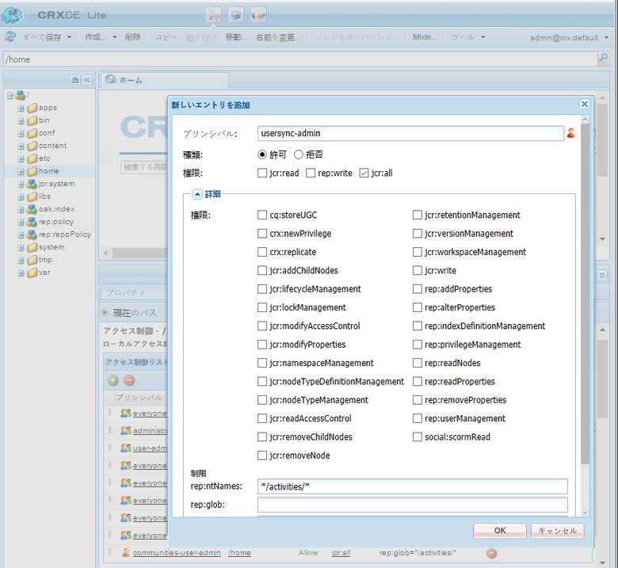

# ユーザー同期{#user-synchronization}

## はじめに {#introduction}

デプロイメントが [パブリッシュファーム](/help/sites-deploying/recommended-deploys.md#tarmk-farm)の場合、メンバーは任意のパブリッシュノードでログインして、自分のデータを確認できる必要があります。

パブリッシュ環境で作成されたユーザーとユーザーグループ（ユーザーデータ）は、オーサー環境では必要ありません。

オーサー環境で作成されたほとんどのユーザーデータはオーサー環境に残るものと想定されており、パブリッシュインスタンスにはコピーされません。

他のパブリッシュインスタンスが同じユーザーデータにアクセスするには、1 つのパブリッシュインスタンスに加えられた登録と変更をそれらのパブリッシュインスタンスに同期する必要があります。

AEM 6.1 以降では、ユーザーの同期が有効になっている場合、ユーザーデータはファーム内のパブリッシュインスタンス間で自動的に同期され、オーサー環境では作成されません。

## Sling 配布 {#sling-distribution}

ユーザーデータと、 [ACL](/help/sites-administering/security.md)を含め、 [Oak Core](/help/sites-deploying/platform.md)、Oak JCR の下のレイヤー、およびを使用してアクセスします。 [Oak API](https://helpx.adobe.com/experience-manager/6-4/sites/developing/using/reference-materials/javadoc/org/apache/jackrabbit/oak/api/package-tree.html). 頻繁に更新されない場合は、を使用して他のパブリッシュインスタンスとユーザーデータを同期させるのが妥当です。 [Sling コンテンツ配布](https://github.com/apache/sling/blob/trunk/contrib/extensions/distribution/README.md) （Sling 配布）。

従来のレプリケーションと比較して、Sling 配布を使用したユーザー同期のメリットは次のとおりです。

* パブリッシュインスタンスで作成されたユーザー&#x200B;**、ユーザープロファイル&#x200B;**&#x200B;およびユーザーグループ&#x200B;**&#x200B;がオーサー環境に作成されません

* Sling 配布により JCR イベントにプロパティが設定されることで、レプリケーションが無限に繰り返されることなく、パブリッシュ側のイベントリスナーで実行できます
* Sling 配布は派生元でないパブリッシュインスタンスにのみユーザーデータを送信するので、不要なトラフィックが発生しません
* [ACL](/help/sites-administering/security.md) ユーザーノードに設定された値が同期に含まれる

>[!NOTE]
>
>セッションが必要な場合は、SSO ソリューションか定着セッションを使用して、別のパブリッシャーに切り替わった際にはお客様にログインしてもらうことをお勧めします。

>[!CAUTION]
>
>*の同期&#x200B;**管理者** *group は、ユーザー同期が有効な場合でもサポートされません。 代わりに、「差分を読み込み」に失敗した場合は、エラーログに記録されます。
>
>したがって、デプロイメントがパブリッシュファームの場合、ユーザーが*に追加または削除された場合、**管理者** *group の場合、変更は各パブリッシュインスタンスで手動でおこなう必要があります。

## ユーザー同期の有効化 {#enable-user-sync}

>[!NOTE]
>
>デフォルトでは、ユーザー同期は `disabled`.
>
>ユーザー同期を有効にするには、OSGi の既存の&#x200B;**&#x200B;設定を変更する必要があります。
>
>ユーザー同期を有効にした結果、新しい設定が追加されることはありません。

ユーザー同期では、オーサー環境で作成されていないユーザーデータでもその配布の管理はオーサー環境に依存します。設定の多くは（すべてではなく）、オーサー環境でおこなわれ、各手順で、オーサー環境とパブリッシュ環境のどちらで実行するかが明確に示されます。

次にユーザー同期の有効化に必要な手順と、[トラブルシューティング](#troubleshooting)の節を示します。

### 前提条件 {#prerequisites}

1. ユーザーとユーザーグループが既に 1 つのパブリッシャー上に作成されている場合は、 [手動同期](#manually-syncing-users-and-user-groups) ユーザー同期を設定して有効にする前に、すべてのパブリッシャーに対してユーザーデータを送信します。

   ユーザー同期を有効にすると、新規に作成されたユーザーおよびグループのみが同期されるようになります。

1. 最新のコードがインストールされていることを確認します。

* [AEM プラットフォームの更新](https://helpx.adobe.com/jp/experience-manager/kb/aem62-available-hotfixes.html)
* [AEM Communities の更新](/help/communities/deploy-communities.md#latest-releases)

### 1. Apache Sling Distribution Agent - Sync Agents Factory {#apache-sling-distribution-agent-sync-agents-factory}

**ユーザー同期の有効化**

* **オーサー環境で**

   * 管理者権限でログインします
   * [Web コンソール](/help/sites-deploying/configuring-osgi.md)にアクセスします

      * 例：[http://localhost:4502/system/console/configMgr](http://localhost:4502/system/console/configMgr)
   * locate `Apache Sling Distribution Agent - Sync Agents Factory`

      * 編集する既存の設定を選択します（鉛筆アイコン）

         検証 `name`: **`socialpubsync`**

      * を選択します。 `Enabled` チェックボックス
      * 選択 `Save`


### 2. 承認済みユーザーの作成 {#createauthuser}

**権限の設定**&#x200B;この承認済みユーザーが手順 3 のオーサー環境での Sling 配布の設定に使用されます。

* **各パブリッシュインスタンスで**

   * 管理者権限でログインします
   * [セキュリティコンソール](/help/sites-administering/security.md)にアクセスします

      * 例：[http://localhost:4503/useradmin](http://localhost:4503/useradmin)
   * 新しいユーザーを作成します

      * 例： `usersync-admin`
   * このユーザーを **`administrators`** ユーザーグループ
   * [このユーザーの ACL を/home に追加](#addacls)

      * `Allow jcr:all` 制限付きで `rep:glob=*/activities/*`


>[!CAUTION]
>
>新しいユーザーを作成する必要があります。
>
>* デフォルトで割り当てられるユーザーは **`admin`** です。
>* コンテンツに `*communities-user-admin *user*.*`

>


#### ACL の追加方法 {#addacls}

* CRXDE Lite にアクセスします

   * 例：[http://localhost:4503/crx/de](http://localhost:4503/crx/de)

* 選択 `/home` ノード
* 右側のウィンドウで、 `Access Control` タブ
* を選択します。 `+` ACL エントリを追加するボタン

   * **プリンシパル**：ユーザー同期用に作成されたユーザーを検索&#x200B;**
   * **型**：`Allow`
   * **権限**: `jcr:all`
   * **制限事項** rep:glob: `*/activities/*`
   * 「**OK**」を選択します。

* 「**すべて保存**」を選択します。



関連トピック

* [アクセス権限の管理](/help/sites-administering/user-group-ac-admin.md#access-right-management)
* トラブルシューティング節 [応答処理中の操作の例外の変更](#modify-operation-exception-during-response-processing).

### 3. Adobe Granite Distribution - Encrypted Password Transport Secret Provider {#adobegraniteencpasswrd}

**権限の設定**

認証済みユーザーが 1 人で、そのユーザーの**員`administrators`**ユーザーグループは、すべてのパブリッシュインスタンスで作成されています。認証済みのユーザーは、オーサーからパブリッシュにユーザーデータを同期する権限を持っていると認識される必要があります。

* **オーサー環境で**

   * 管理者権限でログインします
   * [Web コンソール](/help/sites-deploying/configuring-osgi.md)にアクセスします

      * 例：[http://localhost:4502/system/console/configMgr](http://localhost:4502/system/console/configMgr)
   * locate `com.adobe.granite.distribution.core.impl.CryptoDistributionTransportSecretProvider.name`
   * 編集する既存の設定を選択します（鉛筆アイコン）

      検証 `property name` : **`socialpubsync-publishUser`**

   * 手順 2 でパブリッシュ環境で作成した[承認済みユーザー](#createauthuser)のユーザー名とパスワードを設定します

      * 例： `usersync-admin`


### 4. Apache Sling Distribution Agent - Queue Agents Factory {#apache-sling-distribution-agent-queue-agents-factory}

**ユーザー同期の有効化**

* **パブリッシュ環境で**

   * 管理者権限でログインします
   * [Web コンソール](/help/sites-deploying/configuring-osgi.md)にアクセスします

      * 例：[http://localhost:4503/system/console/configMgr](http://localhost:4503/system/console/configMgr)
   * locate `Apache Sling Distribution Agent - Queue Agents Factory`

      * 編集する既存の設定を選択します（鉛筆アイコン）

         検証 `Name` : `socialpubsync-reverse`

      * を選択します。 `Enabled` チェックボックス
      * 選択 `Save`
   * 各パブリッシュインスタンスで&#x200B;**繰り返し**&#x200B;ます


### 5. Adobe Granite Distribution - Diff Observer Factory {#diffobserver}

**グループ同期の有効化**

* **各パブリッシュインスタンスで**：

   * 管理者権限でログインします
   * [Web コンソール](/help/sites-deploying/configuring-osgi.md)にアクセスします

      * 例：[http://localhost:4503/system/console/configMgr](http://localhost:4503/system/console/configMgr)
   * locate `Adobe Granite Distribution - Diff Observer Factory`

      * 編集する既存の設定を選択します（鉛筆アイコン）

         検証 `agent name` : `socialpubsync-reverse`

      * を選択します。 `Enabled` チェックボックス
      * 選択 `Save`


### 6. Apache Sling Distribution Trigger - Scheduled Triggers Factory {#apache-sling-distribution-trigger-scheduled-triggers-factory}

**（オプション）ポーリング間隔の変更**

デフォルトでは、オーサー環境では 30 秒ごとに変更をポーリングします。この間隔を変更するには：

* **オーサー環境で**

   * 管理者権限でログインします
   * [Web コンソール](/help/sites-deploying/configuring-osgi.md)にアクセスします

      * 例：[http://localhost:4502/system/console/configMgr](http://localhost:4502/system/console/configMgr)
   * locate `Apache Sling Distribution Trigger - Scheduled Triggers Factory`

      * 編集する既存の設定を選択します（鉛筆アイコン）

         * 検証 `Name` : `socialpubsync-scheduled-trigger`
      * 設定 `Interval in Seconds` 希望の間隔まで
      * 選択 `Save`


## 複数のパブリッシュインスタンスの設定 {#configure-for-multiple-publish-instances}

デフォルトの設定は、単一のパブリッシュインスタンス用の設定です。ユーザーの同期を有効にする理由は、パブリッシュファームの場合など、複数のパブリッシュインスタンスを同期するためなので、追加のパブリッシュインスタンスを Sync Agents Factory に追加する必要があります。

### 7. Apache Sling Distribution Agent - Sync Agents Factory {#apache-sling-distribution-agent-sync-agents-factory-1}

**パブリッシュインスタンスを追加するには：**

* **オーサー環境で**

   * 管理者権限でログインします
   * [Web コンソール](/help/sites-deploying/configuring-osgi.md)にアクセスします

      * 例：[http://localhost:4502/system/console/configMgr](http://localhost:4502/system/console/configMgr)
   * locate `Apache Sling Distribution Agent - Sync Agents Factory`

      * 編集する既存の設定を選択します（鉛筆アイコン）

         検証 `Name` : `socialpubsync`


* **Exporter Endpoints** 各パブリッシャーにエクスポーターエンドポイントが必要です。例えば、パブリッシャーが localhost:4503 と 4504 の 2 つの場合、次の 2 つのエントリが必要です。

   * http://localhost:4503/libs/sling/distribution/services/exporters/socialpubsync-reverse
   * http://localhost:4504/libs/sling/distribution/services/exporters/socialpubsync-reverse

* **インポーターエンドポイント**
各パブリッシャーにインポーターエンドポイントが必要です。 例えば、パブリッシャーが localhost:4503 と 4504 の 2 つの場合、次の 2 つのエントリが必要です。

   * http://localhost:4503/libs/sling/distribution/services/importers/socialpubsync
   * http://localhost:4504/libs/sling/distribution/services/importers/socialpubsync

* 選択 `Save`

### 8. AEM Communities User Sync Listener {#aem-communities-user-sync-listener}

**（オプション）追加の JCR ノードの同期**

複数のパブリッシュインスタンス間で同期するカスタムデータがある場合は、次のようにします。

* **各パブリッシュインスタンスで**:

   * 管理者権限でサインインします。
   * [Web コンソール](/help/sites-deploying/configuring-osgi.md)にアクセスします

      * 例：[http://localhost:4503/system/console/configMgr](http://localhost:4503/system/console/configMgr)
   * locate `AEM Communities User Sync Listener`
   * 編集する既存の設定を選択します（鉛筆アイコン）

      検証 `Name`: `socialpubsync-scheduled-trigger`


* **ノードタイプ**

   これは、同期するノードタイプのリストです。 sling:Folder 以外のすべてのノードタイプがここにリストされます（sling:folder は別個に処理されます）。

    同期されるノードタイプのデフォルトのリストは次のとおりです。

   * rep:User
   * nt:unstructured
   * nt:resource

* **無視可能なプロパティ**

    何らかの変更が検出された場合に無視されるプロパティのリストです。これらのプロパティに対する変更は、他の変更の副作用として同期される場合がありますが（同期は常にノードレベルでおこなわれるので）、これらのプロパティに対する変更そのものが同期をトリガーすることはありません。

    無視されるデフォルトのプロパティは次のとおりです。

   * cq:lastModified

* **無視可能なノード**

   同期中に完全に無視されるサブパス。 このサブパスの下にあるものはどのタイミングでも同期されません。

    無視されるデフォルトのノードは次のとおりです。

   * .tokens
   * system

* **配布フォルダ**

   同期は不要なので、ほとんどの sling:Folders は無視されます。 数少ない例外を次に示します。

    同期されるデフォルトのフォルダーは次のとおりです。

   * segments/scoring
   * social/relationships
   * activities

### 9. 一意の Sling ID {#unique-sling-id}

>[!CAUTION]
>
>2 つ以上のパブリッシュインスタンスで Sling ID が一致すると、ユーザーグループの同期が失敗します。

Sling ID がパブリッシュファームの複数のパブリッシュインスタンスで同じである場合、ユーザーグループは同期されません。

すべての Sling ID の値が異なることを確認するには、各パブリッシュインスタンスで次の手順を実行します。

1. 参照先 `http://<host>:<port>/system/console/status-slingsettings`
1. **Sling ID** の値を確認する


あるパブリッシュインスタンスの Sling ID が他のパブリッシュインスタンスの Sling ID と一致する場合は、次のようにします。

1. Sling ID が一致するパブリッシュインスタンスの一方を停止する
1. crx-quickstart/launchpad/felix ディレクトリで

   * *sling.id.file* という名前のファイルを検索して削除する

      * 例えば、Linux システムの場合は、次のようになります。

         `rm -i $(find . -type f -name sling.id.file)`

      * 例えば、Windows システムの場合、次のようになります。

         `use windows explorer and search for *sling.id.file*`

1. パブリッシュインスタンスを起動します。

   * スタートアップ時に新しい Sling ID が割り当てられる

1. **Sling ID** が一意であることを確認する

すべてのパブリッシュインスタンスの Sling ID が一意になるまでこの手順を繰り返します。

## Vault Package Builder Factory {#vault-package-builder-factory}

更新が適切に同期されるようにするには、ユーザー同期用に Vault Package Builder を変更する必要があります。

* 各 AEM パブリッシュインスタンスで
* [Web コンソール](/help/sites-deploying/configuring-osgi.md)にアクセスします

   * 例：[http://localhost:4503/system/console/configMgr](http://localhost:4503/system/console/configMgr)

* を見つけます。 `Apache Sling Distribution Packaging - Vault Package Builder Factor`

   * `Builder name: socialpubsync-vlt`

* 編集アイコンを選択します。
* 2 つを追加 `Package Filters` :

   * `/home/users|-.*/.tokens`
   * `/home/users|-.*/rep:cache`

* ポリシーの処理：

   * 既存の rep:policy ノードを新しいノードで上書きするには、3 つ目のパッケージフィルターを追加します

      * `/home/users|+.*/rep:policy`
   * ポリシーが配布されないようにするには、次のように設定します

      * `Acl Handling :` `IGNORE`


## 特定状況での動作 {#what-happens-when}

### ユーザーがパブリッシュ環境でプロファイルを自身で登録または編集する場合 {#user-self-registers-or-edits-profile-on-publish}

仕様上、パブリッシュ環境で作成されたユーザーとプロファイル（自己登録）は、オーサー環境では表示されません。

トポロジが [パブリッシュファーム](/help/sites-deploying/recommended-deploys.md#tarmk-farm) とユーザー同期が正しく設定されている場合、 *ユーザープロファイル* は、Sling 配布を使用してパブリッシュファーム全体で同期されます。

### セキュリティコンソールでのユーザーまたはユーザーグループの作成 {#users-or-user-groups-are-created-using-security-console}

仕様上、パブリッシュ環境で作成されたユーザーデータは、オーサー環境では表示されません。その反対も同様です。

[ユーザー管理およびセキュリティ](/help/sites-administering/security.md)コンソールを使用してパブリッシュ環境で新しいユーザーを追加すると、ユーザーの同期機能により、新しいユーザーとそのグループメンバーシップがその他のパブリッシュインスタンスに同期されます（必要な場合）。ユーザー同期は、セキュリティコンソールを使用して作成されたユーザーグループも同期します。

## トラブルシューティング {#troubleshooting}

### ユーザー同期をオフラインにする方法 {#how-to-take-user-sync-offline}

[パブリッシャーを削除](#how-to-remove-a-publisher)したり、[データを手動で同期](#manually-syncing-users-and-user-groups)したりするためにユーザー同期をオフラインにするには、配布キューが空であり、静止している必要があります。

配布キューの状態をチェックするには：

* オーサー環境で:

   * using [CRXDE Lite](/help/sites-developing/developing-with-crxde-lite.md)

      * エントリを探す `/var/sling/distribution/packages`

         * `distrpackage_*` _* という名前パターンを持つフォルダー名
   * [パッケージマネージャー](/help/sites-administering/package-manager.md)を使用する場合

      * （まだインストールされていない）保留中のパッケージを探します

         * パターンで名前が付けられる `socialpubsync-vlt*`
         * 作成者 `communities-user-admin`


配布キューが空である場合は、ユーザー同期を無効にします。

* オーサー環境で

   * *をオフ* `Enabled` チェックボックス [Apache Sling Distribution Agent - Sync Agents Factory](#apache-sling-distribution-agent-sync-agents-factory)

タスク完了後にユーザー同期を再び有効にするには：

* オーサー環境で

   * チェック `Enabled` チェックボックス [Apache Sling Distribution Agent - Sync Agents Factory](#apache-sling-distribution-agent-sync-agents-factory)

### ユーザー同期診断 {#user-sync-diagnostics}

ユーザー同期診断は、設定をチェックして問題の特定を試みるツールです。

作成者の場合は、メインコンソールから **ツール、操作、診断、ユーザー同期診断。**

結果はユーザー同期診断コンソールに表示されます。

ユーザー同期が有効になっていない場合は、次のように表示されます。


#### パブリッシャーに対する診断の実行方法 {#how-to-run-diagnostics-for-publishers}

診断をオーサー環境から実行した場合、合格/不合格の結果には [情報] 設定済みのパブリッシュインスタンスのリストを確認するためのセクションを表示しています。

このリストには、診断が実行される各パブリッシュインスタンスの URL が記載されています。url パラメーター `syncUser` は診断 URL に追加され、その値は *認証済み同期ユーザー* 次で作成： [手順 2](/help/sites-administering/sync.md#createauthuser).

**注意**：URL を起動するには、承認済み同期ユーザー&#x200B;**&#x200B;がそのパブリッシュインスタンスに既にログインしている必要があります。


### 正しく追加されていない設定 {#improperconfig}

ユーザー同期が正しく機能しないのは、主に余分な設定が追加されていることが原因です。**&#x200B;代わりに、デフォルト設定が *編集済み*.

Web コンソールに表示される、編集されたデフォルトの設定は次のとおりです。複数のインスタンスが表示される場合は、追加した設定を削除する必要があります。

#### （オーサー）Apache Sling Distribution Agent - Sync Agents Factory 1 つ {#author-one-apache-sling-distribution-agent-sync-agents-factory}


#### （オーサー）Adobe Granite Distribution - Encrypted Password Transport Secret Provider 1 つ {#author-one-adobe-granite-distribution-encrypted-password-transport-secret-provider}


#### （パブリッシュ）Apache Sling Distribution Agent - Queue Agents Factory 1 つ {#publish-one-apache-sling-distribution-agent-queue-agents-factory}


#### （パブリッシュ）Adobe Granite Distribution - Diff Observer Factory 1 つ {#publish-one-adobe-granite-distribution-diff-observer-factory}


#### （オーサー）Apache Sling Distribution Trigger - Scheduled Triggers Factory 1 つ {#author-one-apache-sling-distribution-trigger-scheduled-triggers-factory}


### 応答処理中の操作の例外の変更 {#modify-operation-exception-during-response-processing}

ログに次の内容が表示される場合：

`org.apache.sling.servlets.post.impl.operations.ModifyOperation Exception during response processing.`

`java.lang.IllegalStateException: This tree does not exist`

次に、「 」セクションを確認します。 [2. 認証済みユーザーの作成](#createauthuser) 適切に追跡された

この節では、すべてのパブリッシュインスタンスに存在する承認済みユーザーを作成し、それらをオーサー環境の「秘密鍵プロバイダー」OSGi 設定で特定する方法について説明します。デフォルトでは、ユーザーは `admin`.

承認済みユーザーは **`administrators`** ユーザーグループのメンバーにして、そのグループの権限は変更しないでください。

承認済みユーザーは、すべてのパブリッシュインスタンスに対する次の権限および制限を明示的に保持している必要があります。

| **path** | **jcr:all** | **rep:glob** |
|---|---|---|
| /home | X | &amp;ast;/activities/&amp;ast; |
| /home/users | X | &amp;ast;/activities/&amp;ast; |
| /home/groups | X | &amp;ast;/activities/&amp;ast; |

を `administrators` グループの権限を持つユーザーは、すべてのパブリッシュインスタンスに対して次の権限を持っている必要があります。

| **パス** | **jcr:all** | **jcr:read** | **rep:write** |
|---|---|---|---|
| /etc/packages/sling/distribution |  |  | X |
| /libs/sling/distribution |  | X |  |
| /var |  |  | X |
| /var/eventing |  | X | X |
| /var/sling/distribution |  | X | X |

### ユーザーグループ同期の失敗 {#user-group-sync-failed}

2 つ以上のパブリッシュインスタンスで Sling ID が一致すると、ユーザーグループの同期が失敗します。

[9.一意の Sling ID](#unique-sling-id) の節を参照してください

### ユーザーおよびユーザーグループの手動同期 {#manually-syncing-users-and-user-groups}

* ユーザーおよびユーザーグループが存在するパブリッシャーで：

   * [ユーザー同期が有効になっている場合は無効にします](#how-to-take-user-sync-offline)
   * [パッケージの作成](/help/sites-administering/package-manager.md#creating-a-new-package) / `/home`

      * パッケージの編集時

         * 「フィルター」タブフィルターを追加：ルートパス： `/home`
         * 「詳細」タブAC の処理： `Overwrite`
   * [パッケージを書き出します](/help/sites-administering/package-manager.md#downloading-packages-to-your-file-system)


* その他のパブリッシュインスタンスで：

   * [パッケージを読み込みます](/help/sites-administering/package-manager.md#installing-packages)

ユーザー同期を設定または有効にするには、手順 1 に進みます。 [Apache Sling Distribution Agent - Sync Agents Factory](#apache-sling-distribution-agent-sync-agents-factory)

### パブリッシャーが使用不能になった場合 {#when-a-publisher-becomes-unavailable}

パブリッシュインスタンスが使用不能になっても、今後オンラインに戻る場合は削除しないでください。変更は、パブリッシャーに対してキューに入れられ、オンラインに戻ると、変更が処理されます。

パブリッシュインスタンスがオンラインに戻らない場合、恒久的にオフラインになっている場合は削除する必要があります。キューの構築により、オーサー環境でのディスク容量の使用が目立つためです。

パブリッシャーが停止した場合、オーサー環境のログに次のような例外が記録されます。

```
28.01.2016 15:57:48.475 ERROR
 [pool-12-thread-34-org_apache_sling_distribution_queue_socialpubsync_endpoint1
 (org/apache/sling/distribution/queue/socialpubsync/endpoint1)]
 org.apache.sling.distribution.agent.impl.SimpleDistributionAgent [agent][socialpubsync] could not deliver package distrpackage_1454014575838_a2b45ec8-0400-42f3-bed8-ae09b66381cb
 org.apache.sling.distribution.packaging.DistributionPackageImportException: failed in importing package ...
```

### パブリッシャーの削除方法 {#how-to-remove-a-publisher}

[Apache Sling Distribution Agent - Sync Agents Factory](#apache-sling-distribution-agent-sync-agents-factory) からパブリッシャーを削除するには、配布キューが空であり、静止している必要があります。

* オーサー環境で：

   * [ユーザー同期をオフラインにします](#how-to-take-user-sync-offline)
   * [手順 7](#apache-sling-distribution-agent-sync-agents-factory) に従って、次の両方のサーバーリストからパブリッシャーを削除します

      * `Exporter Endpoints`
      * `Importer Endpoints`
   * ユーザー同期を再び有効にします

      * チェック `Enabled` チェックボックス [Apache Sling Distribution Agent - Sync Agents Factory](#apache-sling-distribution-agent-sync-agents-factory)
