# 翻訳の機能強化{#translation-enhancements}

>[!CAUTION]
>
>AEM 6.4 の拡張サポートは終了し、このドキュメントは更新されなくなりました。 詳細は、 [技術サポート期間](https://helpx.adobe.com/jp/support/programs/eol-matrix.html). サポートされているバージョンを見つける [ここ](https://experienceleague.adobe.com/docs/?lang=ja).

このページでは、AEM翻訳管理機能の段階的な機能強化と絞り込みについて説明します。

## 翻訳プロジェクトの自動化 {#translation-project-automation}

翻訳開始の自動促進や削除、翻訳プロジェクトの反復実行のスケジュール化など、翻訳プロジェクトの生産性を向上させるためのオプションが追加されました。

1. 翻訳プロジェクトで、「**翻訳の概要**」タイルの下部にある省略記号をクリックまたはタップします。

   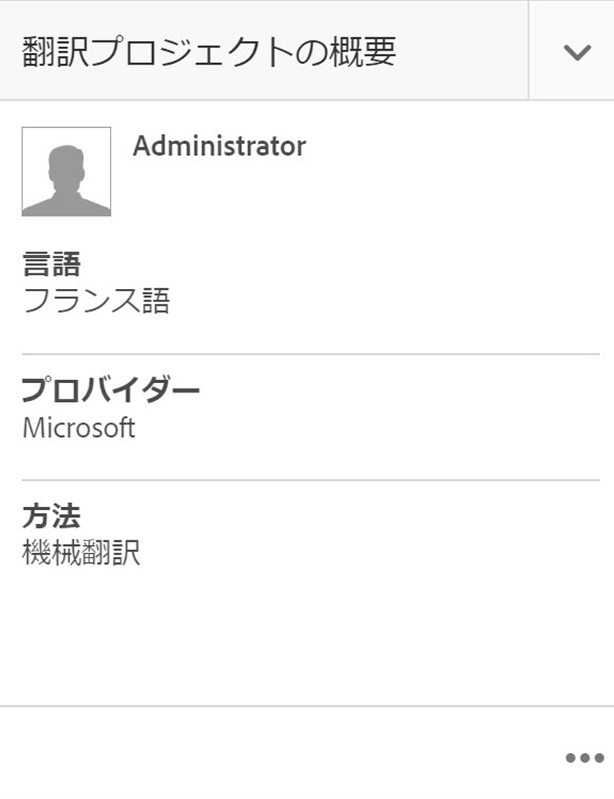

1. 「**詳細**」タブに切り替えます。下部で、「**翻訳開始を自動的に促進**」を選択します。

   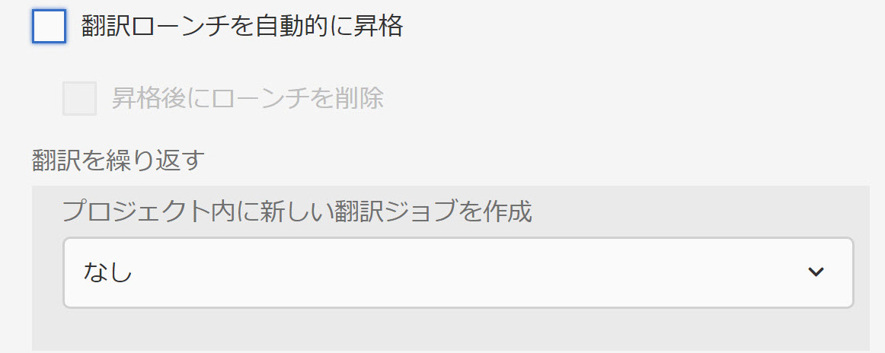

1. オプションで、翻訳済みコンテンツを受信後、翻訳開始を自動的に促したり削除したりすることを選択できます。

   

1. 翻訳プロジェクトの反復実行を選択するには、「**翻訳を繰り返す**」の下のドロップダウンで頻度を選択します。プロジェクトの反復実行は、指定した間隔で翻訳ジョブを自動的に作成および実行します。

   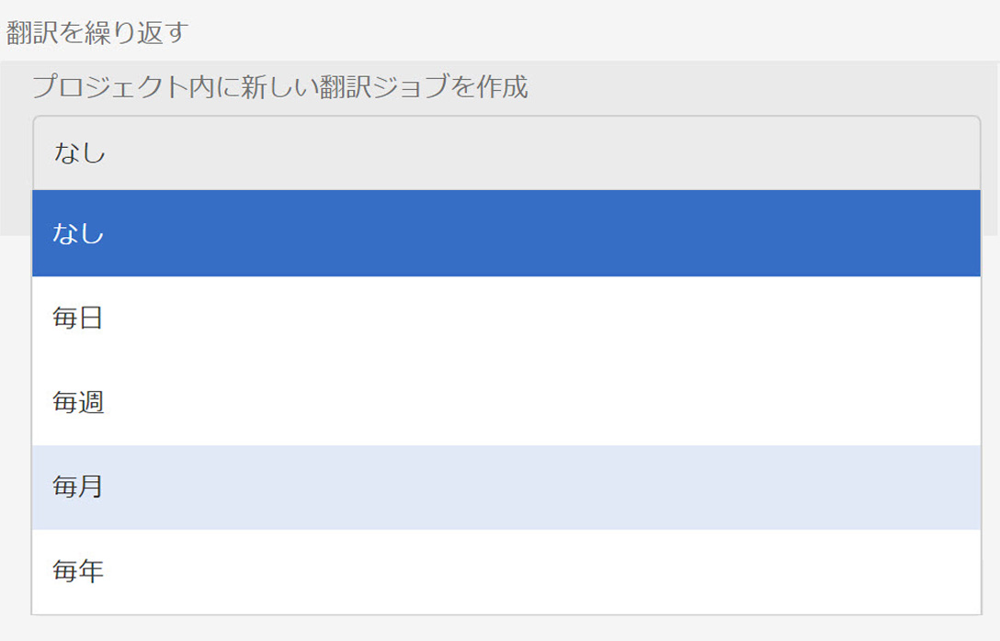

## 多言語翻訳プロジェクト {#multilingual-translation-projects}

翻訳プロジェクトで複数のターゲット言語を設定して、作成される翻訳プロジェクトの総数を減らすことができます。

1. 翻訳プロジェクトで、「**翻訳の概要**」タイルの下部にある省略記号をクリックまたはタップします。

   

1. 「**詳細**」タブに切り替えます。**ターゲット言語**&#x200B;に複数の言語を追加できます。

   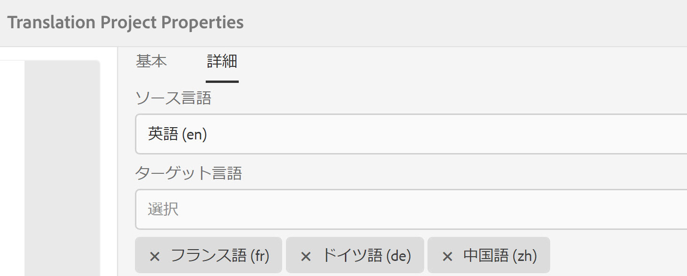

1. または、Sites の参照レールで翻訳を開始している場合、言語を追加して、「**多言語翻訳プロジェクトを作成**」を選択します。

   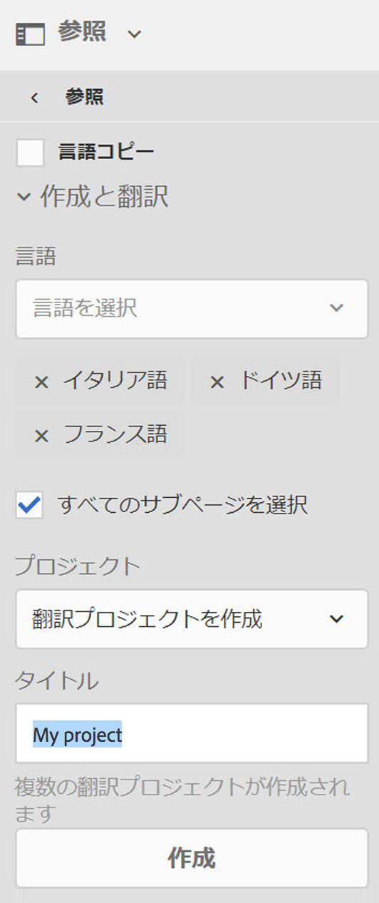

1. すべてのターゲット言語について、プロジェクトの翻訳ジョブが作成されます。プロジェクト内で 1 つずつ開始することも、プロジェクト管理でプロジェクトをグローバルに実行することで一度にすべてを開始することもできます。

   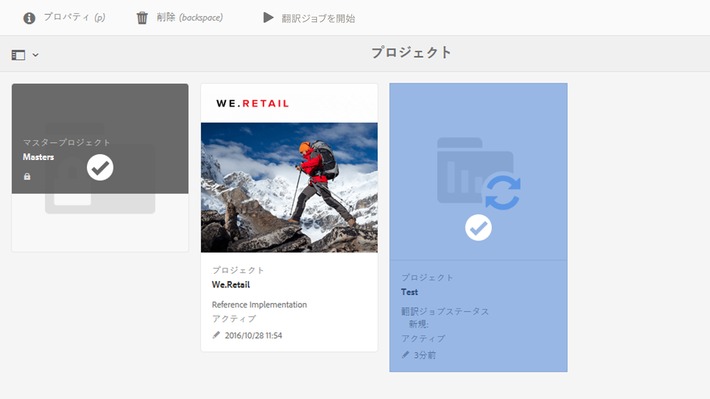

## 翻訳メモリの更新 {#translation-memory-updates}

翻訳済みコンテンツの手動編集は、翻訳管理システム（TMS）に同期し直され、翻訳メモリに反映されます。

1. Sites コンソールから、翻訳済みページのテキストコンテンツを更新した後、「**翻訳メモリを更新**」を選択します。

   

1. リスト表示では、編集されたすべてのテキストコンポーネントについて、ソースと翻訳が横に並んで比較表示されます。翻訳メモリに同期する必要がある翻訳の更新を選択して、「**メモリを更新**」を選択します。

   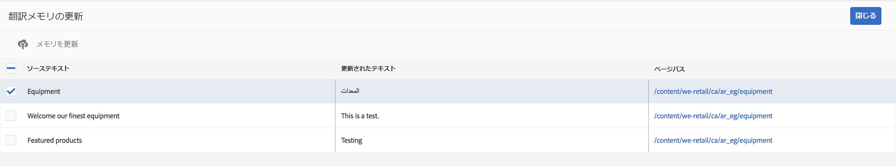

   >[!NOTE]
   >
   >AEM は、選択された文字列を翻訳管理システムに送り返します。

## 複数のレベルの言語コピー {#language-copies-on-multiple-levels}

言語ルートは、言語コピーのルートを認識できる状態で、ノード（地域など）の下にグループ化できるようになりました。

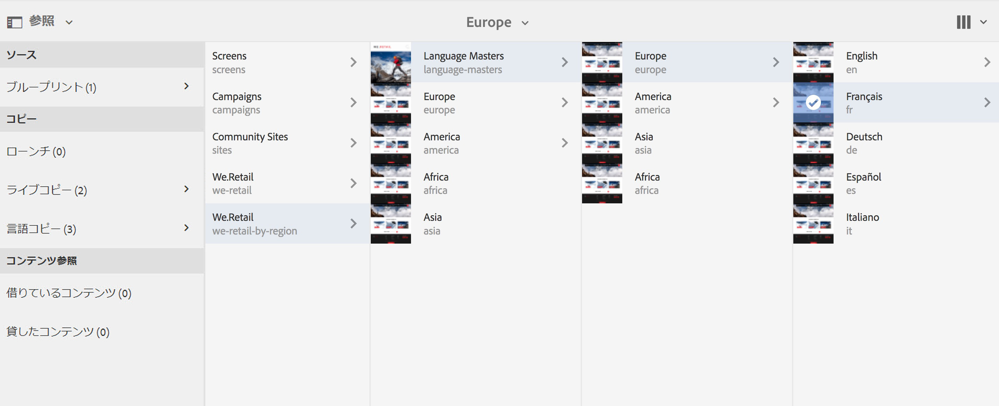

>[!CAUTION]
>
>1 レベルのみ許可されます。例えば、次の場合は、「es」ページで言語コピーを解決できません。
>
>* `/content/we-retail/language-masters/en`
>* `/content/we-retail/language-masters/americas/central-america/es`
>
>この `es` 言語コピーは、`en` ノードから 2 レベル離れている（americas/central-america）ので、検出されません。

>[!NOTE]
>
>言語ルートには、言語の ISO コードだけでなく、任意のページ名を含めることができます。 AEMは常に最初にパスと名前を確認しますが、ページ名が言語を識別しない場合は、AEMはページの cq:language プロパティで言語識別を確認します。

## 翻訳ステータスのレポート {#translation-status-reporting}

ページが翻訳済みか、翻訳中か、またはまだ翻訳されていないかを示すプロパティをサイトリスト表示で選択できるようになりました。 プロパティを表示するには：

1. Sites で、**リスト表示**&#x200B;に切り替えます。

   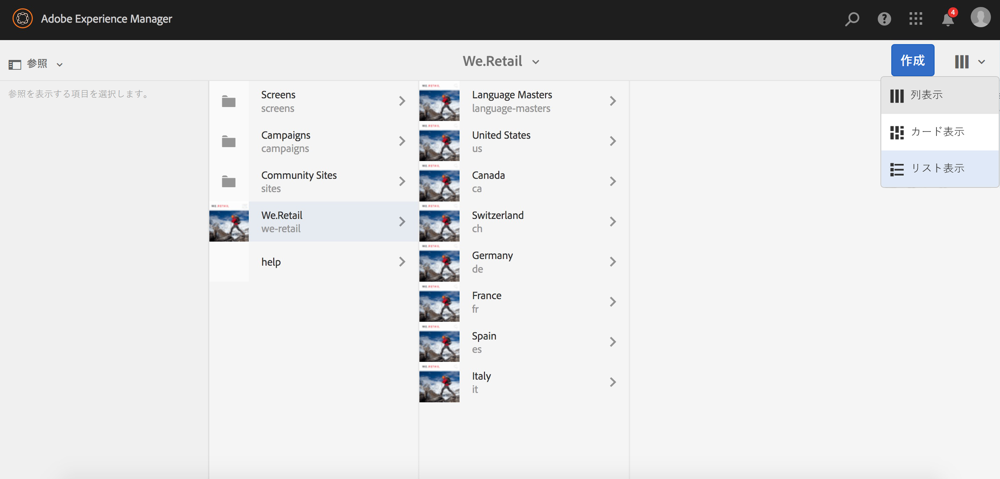

1. **設定を表示**&#x200B;をクリックまたはタップします。

   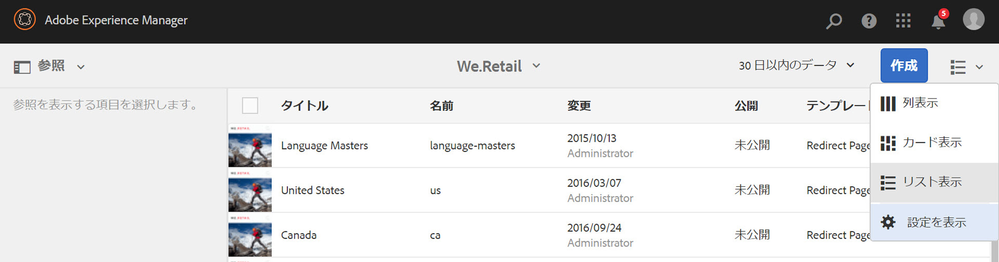

1. 「**翻訳**」の下の「**翻訳済み**」チェックボックスをオンにして、「**更新**」をタップまたはクリックします。

   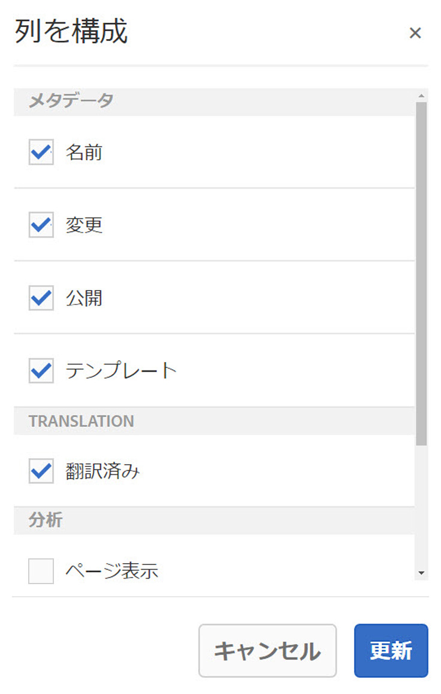

**翻訳済み**&#x200B;列にページの翻訳ステータスが表示されているのを確認できます。

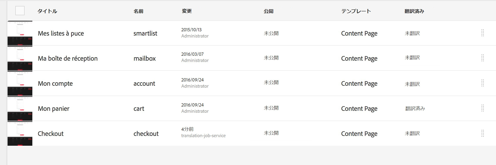
