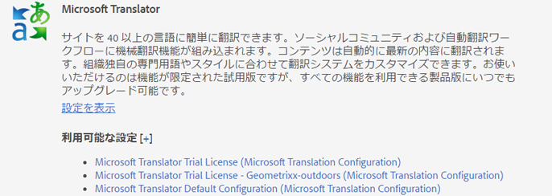
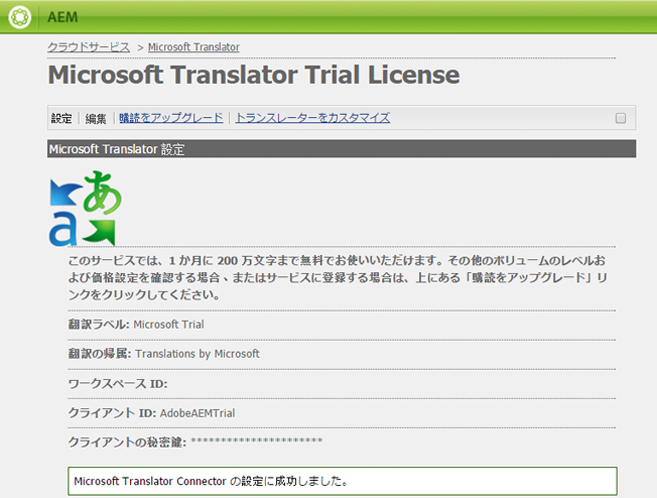

# Microsoft Translator への接続{#connecting-to-microsoft-translator}

Microsoft Translator クラウドサービスの設定を作成し、Microsoft Translation アカウントを使用してAEMページのコンテンツ、コミュニティコンテンツまたはアセットを翻訳します。

| プロパティ | 説明 |
|---|---|
| 翻訳ラベル | 翻訳サービスの表示名。 |
| 翻訳の帰属 | （オプション）ユーザー生成コンテンツの場合に、翻訳済みのテキストの横に表示される帰属情報（例：「`Translations by Microsoft`」）。 |
| ワークスペース ID | （オプション）使用するカスタム Microsoft Translator エンジンの ID。 |
| サブスクリプションキー | Microsoft Translator の Microsoft サブスクリプションキー。 |

設定を作成したら、その[設定をアクティベートする](/help/sites-administering/tc-msconf.md#activating-the-translator-service-configurations)必要があります。

次の手順では、タッチ操作向け UI を使用して Microsoft Translator の設定を作成します。

1. レールで、ツール/Cloud Servicesをクリックまたはタップします。
1. 「Microsoft Translator」領域で、「設定を表示」をクリックまたはタップします。
1. 「利用可能な設定」の横の「 + 」リンクをクリックします。

   

1. 設定のタイトルを入力します。このタイトルによって、クラウドサービスコンソールおよびページプロパティのドロップダウンリストで設定が識別されます。デフォルトの名前はタイトルに基づいています。 オプションとして、設定を格納するリポジトリノードに使用する名前を入力します。リポジトリノードのパスである Parent Configuration プロパティには、デフォルト値を使用する必要があります。
1. 「作成」をクリックします。
1. 表示されるダイアログボックスで、プロパティの値を入力し、「OK」をクリックします。

## Microsoft TranslatorCloud Service設定の例 {#sample-microsoft-translator-cloud-service-configurations}

以下に示す Microsoft Translator クラウドサービスの設定が Geometrixx のサンプルと共にインストールされます。一部のサンプル設定では、Microsoft Translation の試用版アカウントを使用します。このアカウントを使用すると、1 か月に最大 200 万文字の翻訳を無料で行うことができます。

### Microsoft Translator 試用版ライセンス {#microsoft-translator-trial-license}

Microsoft Translator 試用版ライセンス設定は、Geometrixx Outdoors サンプルパッケージと共にインストールされるサンプル設定です。この設定では、1 か月に 200 万文字の翻訳を行うことができる無料サブスクリプションが付属する Microsoft Translator アカウントを使用します。

### Microsoft Translator 体験版ライセンス —Geometrixxアウトドア {#microsoft-translator-trial-license-geometrixx-outdoors}

Microsoft Translator 体験版ライセンス —Geometrixxアウトドア設定は、Geometrixx Outdoorsと共にインストールされるサンプル設定です。 この設定では、Microsoft Translator 体験版ライセンス設定と同じ無料のMicrosoft Translator アカウントが使用されます。 アカウントには、1 か月に 200 万文字の翻訳を行うことができる無料サブスクリプションが付属します。

このMicrosoft Translator の設定は、Translators サンプルサイトのコンテンツの種類に合わせて最適化されています。

### Microsoft Translator 体験版ライセンス設定のアップグレード {#upgrading-the-microsoft-translator-trial-license-configuration}

Microsoft Translation 設定ページには、実稼動システムに適したアカウントのサブスクリプションを取得する場合に役立つ、Microsoft web サイトへのリンクが表示されます。

1. レールで、ツール/操作/クラウド/Cloud Servicesをクリックまたはタップします。
1. 「Microsoft Translator」領域で、「設定を表示」をクリックまたはタップし、「 Microsoft Translator 体験版ライセンス (Microsoft Translation Configuration) 」をクリックまたはタップします。

   

1. 設定ページで、「購読をアップグレード」をクリックします。 開いたMicrosoft Web ページを使用して、アカウントを設定します。

   

### Microsoft Translator エンジンのカスタマイズ {#customizing-your-microsoft-translator-engine}

Microsoft Translation 設定ページには、Microsoft Translator エンジンをカスタマイズする場合に役立つ、Microsoft web サイトへのリンクが表示されます。（[https://hub.microsofttranslator.com](https://hub.microsofttranslator.com/)）

1. レールで、ツール/操作/クラウド/Cloud Servicesをクリックまたはタップします。
1. Microsoft Translator 領域で、「設定を表示」をクリックまたはタップし、カスタマイズする設定をクリックまたはタップします。
1. 設定ページで、「トランスレータをカスタマイズ」(Customize Translator) をクリックします。 開いたMicrosoft Web ページを使用して、サービスをカスタマイズします。

## Translator サービス設定のアクティベート {#activating-the-translator-service-configurations}

パブリッシュインスタンスでレプリケートされる翻訳コンテンツをサポートするには、クラウドサービス設定をアクティベートする必要があります。[セクション全体（ツリー）のアクティベート](/help/sites-authoring/publishing-pages.md#publishing-and-unpublishing-a-tree)方法を使用して、Microsoft Translator またはサードパーティのクラウドサービスの設定を格納するリポジトリノードをアクティベートします。このノードは以下に示す親ノードの下にあります。

* Microsoft Translation サービス：/libs/settings/cloudconfigs/translation/msft-translation
* サードパーティ翻訳：/etc/cloudservices/machine-translation
