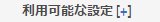

# Microsoft Translator への接続{#connecting-to-microsoft-translator}

Microsoft Translation アカウントを使用して AEM ページのコンテンツ、コミュニティのコンテンツまたはアセットを翻訳するには、Microsoft Translator クラウドサービス用の設定を作成します。

| プロパティ | 説明 |
|---|---|
| 翻訳ラベル | 翻訳サービスの表示名. |
| 翻訳の帰属 | （オプション）ユーザー生成コンテンツの場合に、翻訳済みのテキストの横に表示される帰属情報（例：「`Translations by Microsoft`」）。 |
| ワークスペース ID | （オプション）使用するカスタム Microsoft Translator エンジンの ID。 |
| サブスクリプションキー | Microsoft Translator の Microsoft サブスクリプションキー。 |

設定を作成したら、その[設定をアクティベートする](/help/sites-administering/tc-msconf.md#activating-the-translator-service-configurations)必要があります。

次の手順では、タッチ操作向け UI を使用して Microsoft Translator の設定を作成します。

1. パネルで、ツール／クラウドサービスをクリックまたはタップします。
1. 「Microsoft Translator」領域で、「設定を表示」をクリックまたはタップします。
1. 「利用可能な設定」の横にある + リンクをクリックします。

   

1. 設定のタイトルを入力します。このタイトルによって、クラウドサービスコンソールおよびページプロパティのドロップダウンリストで設定が識別されます。デフォルト名はタイトルに基づいて指定されます。オプションとして、設定を格納するリポジトリーノードに使用する名前を入力します。リポジトリノードのパスである「親設定」プロパティにはデフォルト値を使用する必要があります。
1. 「作成」をクリックします。
1. 表示されるダイアログボックスで、プロパティの値を入力して「OK」をクリックします。

## Microsoft Translator クラウドサービスのサンプル設定 {#sample-microsoft-translator-cloud-service-configurations}

次のMicrosoft Translator クラウドサービス設定が、Geometrixxサンプルと共にインストールされています。一部の設定例では、1 ヶ月あたり最大 2,000,000 個の無料翻訳文字を使用できる体験版Microsoft翻訳アカウントを使用しています。

### Microsoft Translator 試用版ライセンス {#microsoft-translator-trial-license}

Microsoft Translator 体験版ライセンス設定は、Geometrixx Outdoorsサンプルパッケージと共にインストールされるサンプル設定です。この設定では、1 ヶ月に 2000 文字の翻訳文字を使用できる無料のサブスクリプションを持つMicrosoft Translator アカウントを使用します。

### Microsoft Translator 試用版ライセンス - Geometrixx-outdoors {#microsoft-translator-trial-license-geometrixx-outdoors}

Microsoft Translator 試用版ライセンス - Geometrixx-outdoors 設定は、Geometrixx Outdoors サンプルパッケージと共にインストールされるサンプル設定です。この設定では、Microsoft Translator 試用版ライセンス設定と同じ無料の Microsoft Translator アカウントを使用します。このアカウントには、1 か月に 2000,000 文字の翻訳が可能な無料のサブスクリプションがあります。

この Microsoft Translator 設定は、Geometrixx Outdoors サンプルサイトのコンテンツのタイプで使用するために最適化されます。

### Microsoft Translator 体験版ライセンス設定のアップグレード {#upgrading-the-microsoft-translator-trial-license-configuration}

Microsoft Translation 設定ページには、実稼動システムに適したアカウントのサブスクリプションを取得する場合に役立つ、Microsoft Web サイトへのリンクが表示されます。

1. レールで、ツール／操作／クラウド／クラウドサービスをクリックまたはタップします。
1. 「Microsoft Translator」領域で、「設定を表示」をクリックまたはタップして、「Microsoft Translator 試用版ライセンス (Microsoft Translation の設定)」をクリックまたはタップします。

   

1. 設定ページで、「購読をアップグレード」をクリックします。表示された Microsoft の Web ページを使用して、アカウントを設定します。

   

### Microsoft Translator エンジンのカスタマイズ {#customizing-your-microsoft-translator-engine}

Microsoft Translation 設定ページには、Microsoft Translator エンジンをカスタマイズする場合に役立つ、Microsoft Web サイトへのリンクが表示されます([https://hub.microsofttranslator.com](https://hub.microsofttranslator.com/))

1. レールで、ツール／操作／クラウド／クラウドサービスをクリックまたはタップします。
1. 「Microsoft Translator」領域で、「設定を表示」をクリックまたはタップして、カスタマイズする設定をクリックまたはタップします。
1. 設定ページで、「トランスレーターをカスタマイズ」をクリックします。表示された Microsoft の Web ページを使用して、サービスをカスタマイズします。

## 翻訳サービス設定のアクティベート {#activating-the-translator-service-configurations}

パブリッシュインスタンスでレプリケーションされる翻訳コンテンツをサポートするには、クラウドサービス設定をアクティベートする必要があります。次のメソッドを使用： [セクション全体（ツリー）のアクティブ化](/help/sites-authoring/publishing-pages.md#publishing-and-unpublishing-a-tree) : Microsoft Translator またはサードパーティのクラウドサービス設定を保存するリポジトリノードをアクティベートする場合。 このノードは以下に示す親ノードの下にあります。

* Microsoft翻訳サービス：/libs/settings/cloudconfigs/translation/msft-translation
* サードパーティの翻訳：/etc/cloudservices/machine-translation
