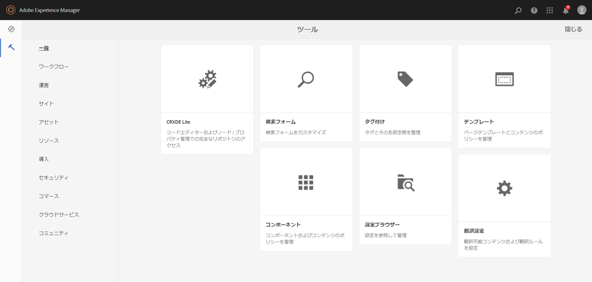
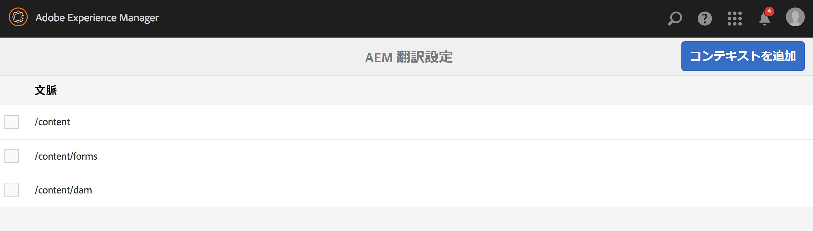
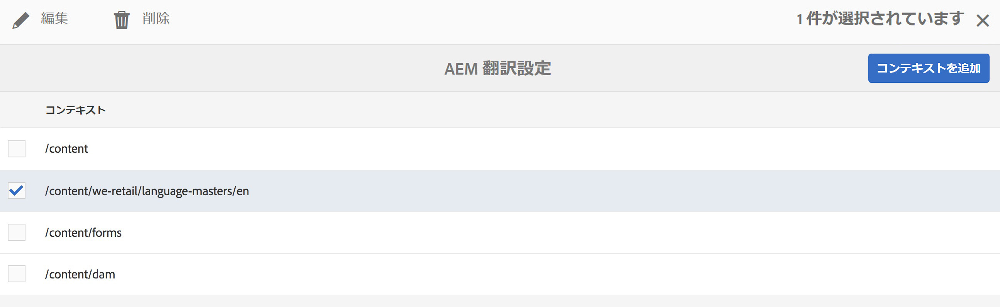
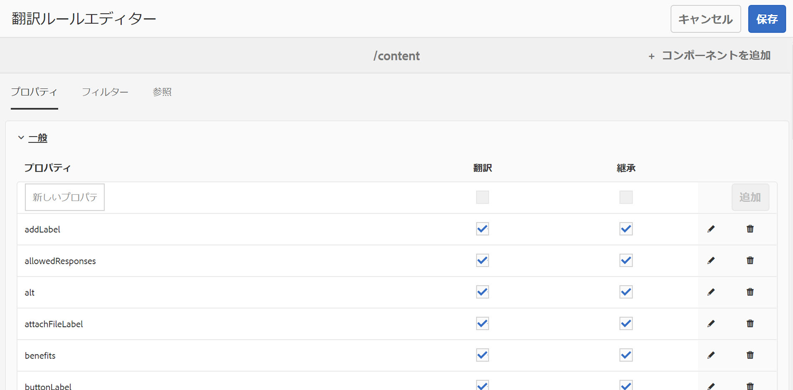
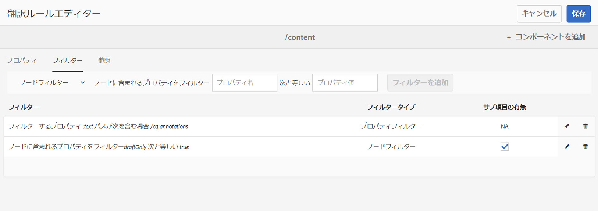
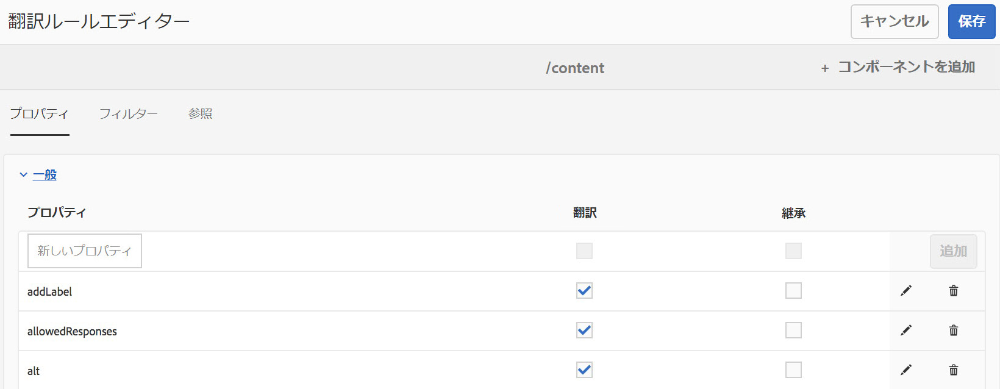
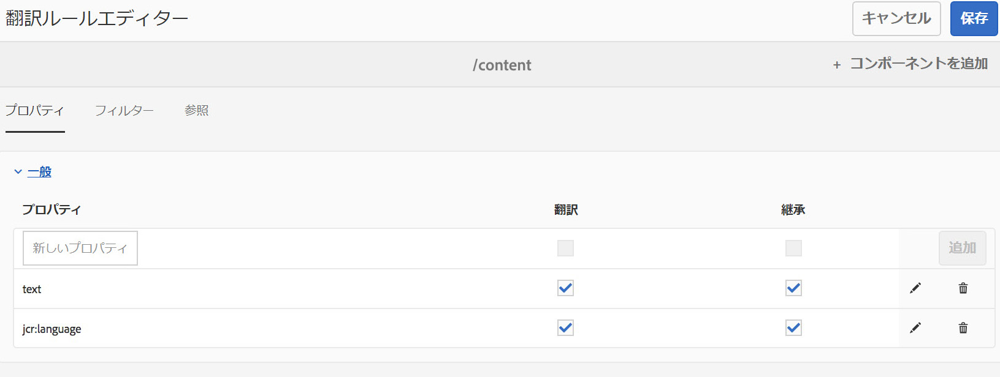

# 翻訳するコンテンツの特定{#identifying-content-to-translate}

翻訳プロジェクトに追加する、または翻訳プロジェクトから除外するページ、コンポーネントおよびアセットの翻訳対象コンテンツは翻訳ルールによって特定されます。ページまたはアセットを翻訳する場合は、AEM がそのコンテンツを抽出して、翻訳サービスに送信できるようにします。

ページとアセットは、JCR リポジトリー内のノードとして表されます。抽出されるコンテンツはノードの 1 つ以上のプロパティ値です。抽出するコンテンツを格納するプロパティは翻訳ルールによって特定されます。

翻訳ルールは XML 形式で表現され、次の場所に格納されています。

* `/libs/settings/translation/rules/translation_rules.xml`
* `/apps/settings/translation/rules/translation_rules.xml`
* `/conf/global/settings/translation/rules/translation_rules.xml`

このファイルはすべての翻訳プロジェクトに適用されます。

>[!NOTE]
>
>6.4 にアップグレードした後は、/etcからファイルを移動することをお勧めします。詳しくは、 [AEM 6.4 における一般的なリポジトリの再構築](/help/sites-deploying/all-repository-restructuring-in-aem-6-4.md#translation-rules) を参照してください。

ルールには以下の情報が含まれます。

* ルールが適用されるノードのパス. ノードの子ノードにもルールが適用されます。
* 翻訳するコンテンツを含んだノードプロパティの名前。このプロパティは、特定のリソースタイプに固有のものでも、すべてのリソースタイプに固有のものでもかまいません。

例えば、作成者がページ上のすべてのAEM基盤テキストコンポーネントに追加するコンテンツを翻訳するルールを作成できます。 このルールでは、`/content` ノードと `foundation/components/text` コンポーネントの `text` プロパティを識別できます。

翻訳ルールの設定用に追加された[コンソール](#translation-rules-ui)があります。UI での定義の内容がファイルに自動的に入力されます。

AEM のコンテンツ翻訳機能の概要については、[多言語サイトのコンテンツの翻訳](/help/sites-administering/translation.md)を参照してください。

>[!NOTE]
>
>AEM は、ページ上の参照コンテンツの翻訳に関して、リソースタイプと参照属性の 1 対 1 マッピングをサポートしています。

## ページ、コンポーネントおよびアセット用のルールの構文 {#rule-syntax-for-pages-components-and-assets}

ルールとは、1 個以上の `node` 子要素と 0 個以上の `property` 子要素を含む `node` 要素です。

```xml
<node path="content path">
          <property name="property name" [translate="false"]/>
          <node resourceType="component path" >
               <property name="property name" [translate="false"]/>
          </node>
</node>
```

これらの各 `node` 要素には以下の特徴があります。

* `path` 属性には、ルールが適用されるブランチのルートノードのパスが格納されます。
* `property` 子要素は、すべてのリソースタイプについて、翻訳するノードプロパティを特定します。

   * `name` 属性には、プロパティ名が格納されます。
   * プロパティが翻訳されていない場合、オプションの `translate` 属性は `false` になります。デフォルト値は `true` です。この属性は、以前のルールを上書きする場合に役立ちます。

* `node` 子要素は、特定のリソースタイプについて、翻訳するノードプロパティを特定します。

   * `resourceType` 属性には、リソースタイプを実装するコンポーネントに解決されるパスが格納されます。
   * `property` 子要素は、翻訳するノードプロパティを特定します。このノードは、ノードルールの `property` 子要素と同じ方法で使用します。

以下のルール例を適用すると、`/content` ノード下のすべてのページについて、すべての `text` プロパティのコンテンツが翻訳されます。このルールは、 `text` プロパティ（基盤テキストコンポーネントや基盤画像コンポーネントなど）。

```xml
<node path="/content">
          <property name="text"/>
</node>
```

次の例では、すべての `text` プロパティのコンテンツを翻訳し、基盤画像コンポーネントのその他のプロパティも翻訳します。その他のコンポーネントに同じ名前のプロパティが含まれている場合、それらのプロパティにはルールが適用されません。

```xml
<node path="/content">
      <property name="text"/>
      <node resourceType="foundation/components/textimage">
         <property name="image/alt"/>
         <property name="image/jcr:description"/>
         <property name="image/jcr:title"/>
      </node>
</node>
```

## ページからアセットを抽出するルールの構文  {#rule-syntax-for-extracting-assets-from-pages}

次に示すルールの構文を使用して、コンポーネントに埋め込むアセットまたはコンポーネントから参照するアセットを追加します。

```xml
<assetNode resourceType="path to component" assetReferenceAttribute="property that stores asset"/>
```

各 `assetNode` 要素には以下の特徴があります。

* 1 つの `resourceType` 属性は、コンポーネントに解決されるパスと等しくなります。。
* 1 つの `assetReferenceAttribute` 属性は、（埋め込みアセット用の）アセットバイナリを格納するプロパティの名前または参照先のアセットのパスと等しくなります。

次の例では、基盤画像コンポーネントから画像を抽出します。

```xml
<assetNode resourceType="foundation/components/image" assetReferenceAttribute="fileReference"/>
```

## ルールの上書き {#overriding-rules}

translation_rules.xml ファイルは、 `nodelist` 複数の子を持つ要素 `node` 要素。 AEM は、このノードリストを上から下に読み取ります。複数のルールが同じノードをターゲットにする場合は、ファイル内で下方にあるルールが使用されます。例えば、以下のルールを適用すると、ページの `/content/mysite/en` ブランチを除く、`text` プロパティのすべてのコンテンツが翻訳されます。

```xml
<nodelist>
     <node path="/content”>
           <property name="text" />
     </node>
     <node path=“/content/mysite/en”>
          <property name=“text” translate=“false" />
     </node> 
<nodelist>
```

## プロパティのフィルタリング {#filtering-properties}

`filter` 要素を使用して、特定のプロパティを持つノードをフィルタリングできます。

例えば、次のルールを使用すると、プロパティ `text` が `draft` に設定されている場合を除き、`true` プロパティのすべてのコンテンツが翻訳されます。

```xml
<nodelist>
    <node path="/content”>
     <filter>
   <node containsProperty="draft" propertyValue="true" />
     </filter>
        <property name="text" />
    </node>
<nodelist>
```

## 翻訳ルール UI {#translation-rules-ui}

コンソールを使用して翻訳ルールを設定することもできます。

コンソールにアクセスするには：

1. **ツール**／**一般**&#x200B;に移動します。

   

1. 「**翻訳設定**」を選択します。

   

ここから、次の操作が可能です。 **コンテキストを追加**. これにより、パスを追加できます。



次に、コンテキストを選択して「**編集**」をクリックする必要があります。これにより、翻訳ルールエディターが開きます。



UI を使用して変更できる属性は 4 つあります。 `isDeep`, `inherit`, `translate` および `updateDestinationLanguage`.

**isDeep** この属性は、ノードフィルターに適用でき、デフォルトでは true です。 ノード（またはその上位ノード）に、フィルターで指定されたプロパティ値を持つそのプロパティが含まれているかどうかをチェックします。false の場合は、現在のノードのみでチェックします。

例えば、親ノードにプロパティが設定されている場合でも、子ノードが翻訳ジョブに追加されます `draftOnly` true に設定すると、ドラフトコンテンツにフラグが設定されます。 ここで、`isDeep` が機能し、親ノードの `draftOnly` プロパティが true であるかどうかをチェックして、それらの子ノードを除外します。

エディターで、 **I`s Deep`** 内 **フィルター** タブをクリックします。



次に、UI で「**サブ項目の有無**」をチェック解除した場合の結果の xml の例を示します。

```xml
 <filter>
    <node containsProperty="draftOnly" isDeep="false" propertyValue="true"/>
</filter>
```

**継承** これは、プロパティに適用されます。 デフォルトではすべてのプロパティが継承されますが、一部のプロパティが子で継承されないようにする場合は、その特定のノードのみで適用されるように、そのプロパティを false に指定できます。

UI では、「**プロパティ**」タブで「**継承**」をチェックまたはチェック解除できます。



**翻訳** translate 属性は、プロパティを翻訳するかどうかを指定する目的でのみ使用されます。

UI では、「**プロパティ**」タブで「**翻訳**」をチェックまたはチェック解除できます。

**updateDestinationLanguage** この属性は、テキストを持たないが言語コードを持たないプロパティ（例：jcr:language）に対して使用されます。 ユーザーはテキストを翻訳していませんが、ソースから宛先への言語ロケールを設定します。そのようなプロパティは、翻訳用に送信されません。

UI で、 **翻訳** 内 **プロパティ** 」タブに表示されますが、値として言語コードを持つ特定のプロパティの場合に限られます。

`updateDestinationLanguage` と `translate` の違いを明確にするために、ルールが 2 つのみのコンテキストの単純な例を次に示します。



xml での結果は、次のようになります。

```xml
<property inherit="true" name="text" translate="true" updateDestinationLanguage="false"/>
<property inherit="true" name="jcr:language" translate="false" updateDestinationLanguage="true"/>
```

## ルールファイルの手動編集 {#editing-the-rules-file-manually}

AEM と共にインストールされる translation_rules.xml ファイルには、デフォルトの翻訳ルールセットが格納されています。翻訳プロジェクトの要件をサポートするようにこのファイルを編集できます。例えば、カスタムコンポーネントのコンテンツが翻訳されるようなルールを追加できます。

translation_rules.xml ファイルを編集する場合は、コンテンツパッケージにバックアップコピーを作成してください。現在の translation_rules.xml ファイルは、AEM サービスパックのインストールまたは特定の AEM パッケージの再インストールによって元のファイルに置き換わります。この状況でルールを復元するには、バックアップコピーを含むパッケージをインストールします。

>[!NOTE]
>
>コンテンツパッケージを作成した後は、ファイルを編集するたびにパッケージを再ビルドしてください。

## 翻訳ルールファイルのサンプル {#example-translation-rules-file}

```xml
<nodelist>
    <!-- translation rules for Geometrixx Demo site (example) -->
    <node path="/content/geometrixx">
        <!-- list all node properties that should be translated -->
        <property name="jcr:title" /> <!-- translation workflows running on content saved in /content/geometrixx, will extract jcr:title values independent of the component. -->
        <property name="jcr:description" />
        <node resourceType ="foundation/components/image"> <!-- translation workflows running on content saved in /content/geometrixx, will extract alternateText values only for Image component. -->
            <property name="alternateText"/>
        </node>
        <node resourceType ="geometrixx/components/title">
            <property name="richText"/>
            <property name="jcr:title" translate="false"/> <!-- translation workflows running on content saved in /content/geometrixx, will not extract jcr:title for Title component, but instead use richText. -->
        </node>
        <node pathContains="/cq:annotations">
            <property name="text" translate="false"/> <!-- translation workflows running on content saved in /content/geometrixx, will not extract text if part of cq:annotations node. -->
        </node>
    </node>
    <!-- translation rules for Geometrixx Outdoors site (example) -->
    <node path="/content/geometrixx-outdoors">
        <node resourceType ="foundation/components/image">
            <property name="alternateText"/>
            <property name="jcr:title" />
        </node>
        <node resourceType ="geometrixx-outdoors/components/title">
            <property name="richText"/>
        </node>
    </node>
    <!-- translation rules for ASSETS (example) -->
    <node path="/content/dam">
        <!-- configure list of metadata properties here -->
        <property name="dc:title" />
        <property name="dc:description" />
    </node>
    <!-- translation rules for extracting ASSETS from SITES content, configure all components that embed or reference assets -->
    <assetNode resourceType="foundation/components/image" assetReferenceAttribute="fileReference"/>
    <assetNode resourceType="foundation/components/video" assetReferenceAttribute="asset"/>
    <assetNode resourceType="foundation/components/download" assetReferenceAttribute="fileReference"/>
    <assetNode resourceType="foundation/components/mobileimage" assetReferenceAttribute="fileReference"/>
    <assetNode resourceType="wcm/foundation/components/image" assetReferenceAttribute="fileReference"/>
</nodelist>
```
